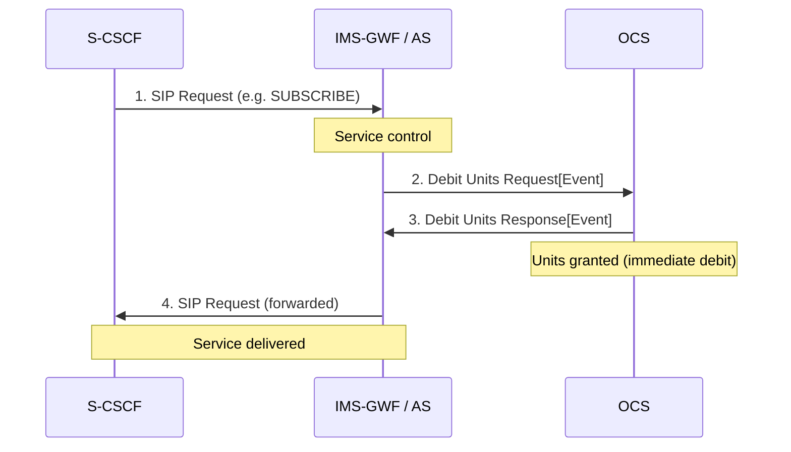
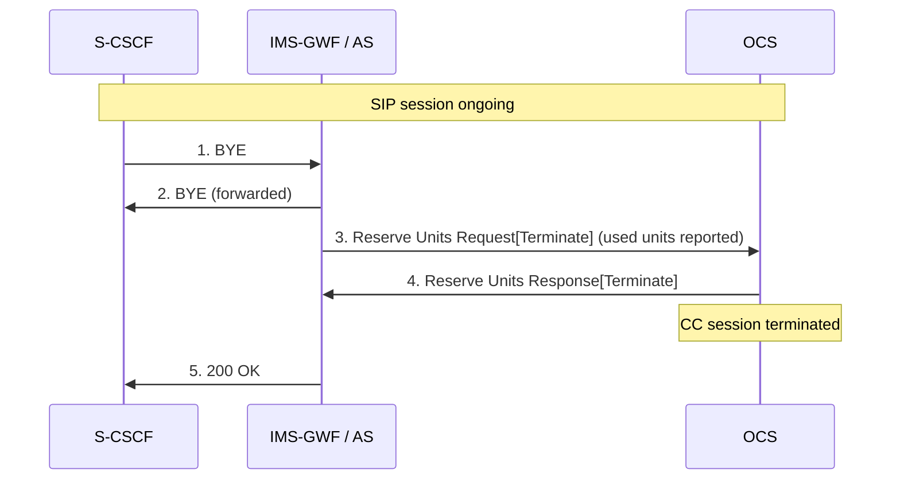
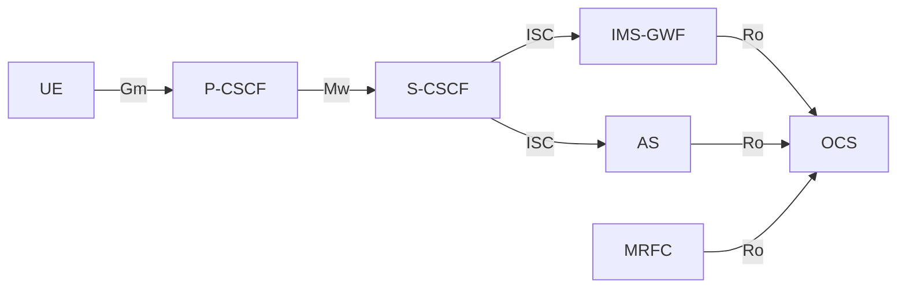
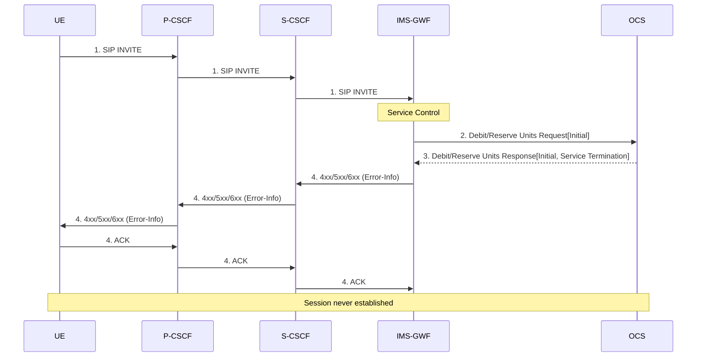
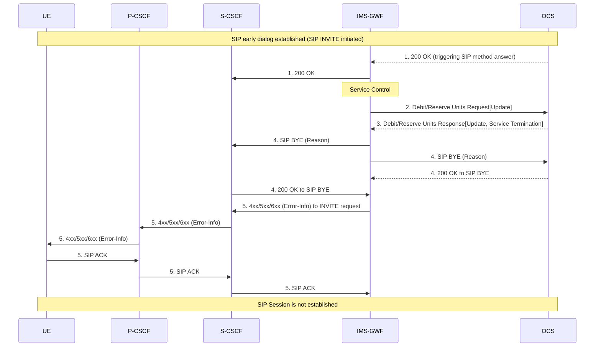
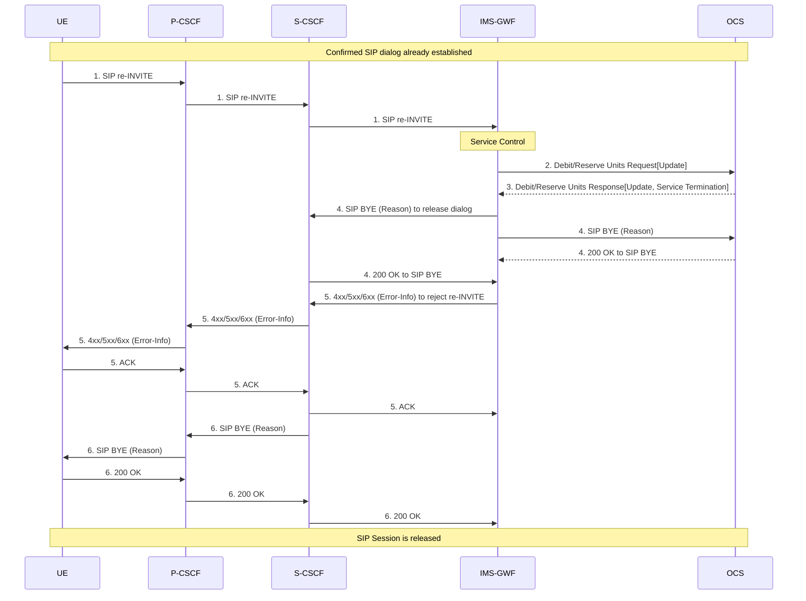
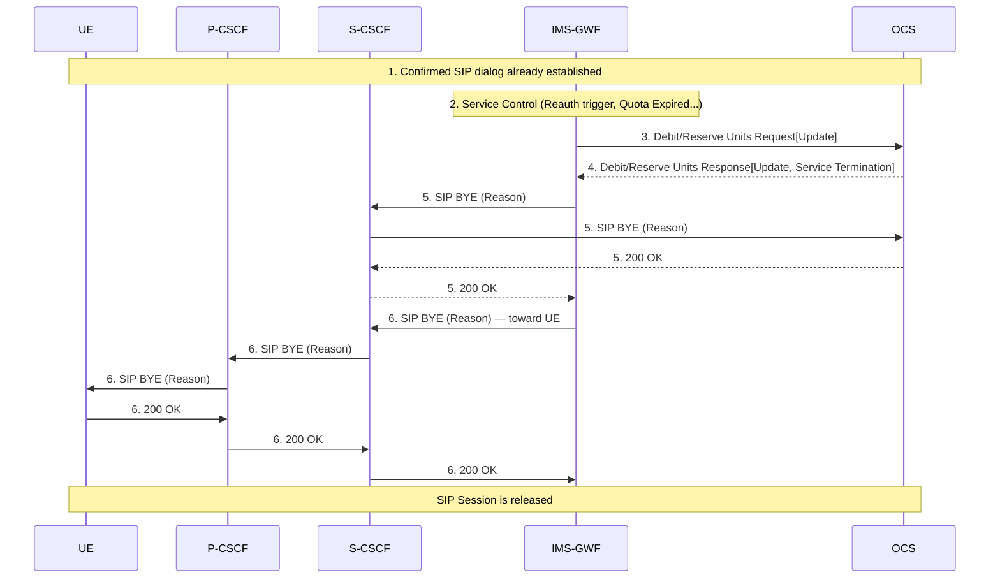
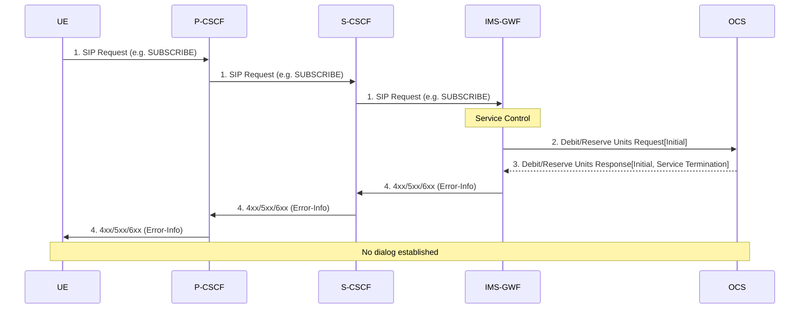
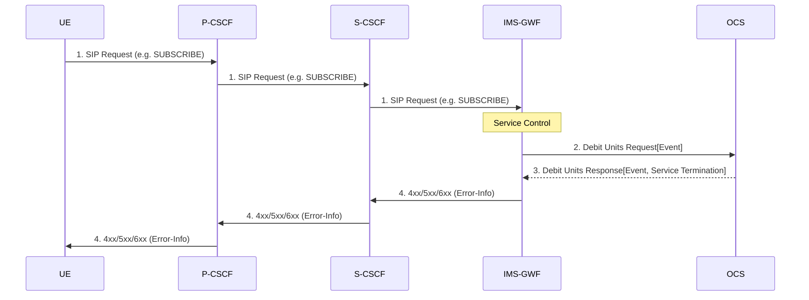

# IMS Online Charging Flows

IMS online charging uses the **Ro** Diameter interface (Reserve/Debit Units Request/Response) from IMS network elements to the **OCS**. This page documents §5.3 of TS 32.260.

See [IMS charging architecture](../concepts/IMS-charging-architecture.md) for architecture overview and [Ro online charging protocol](../protocols/Ro-online-charging.md) for CCR/CCA message formats.

---

## §5.3.1 Basic Principles

### Three Online Charging Cases

| Method | Full Name | Mechanism | When Used |
|---|---|---|---|
| **IEC** | Immediate Event Charging | Debit Units Request[Event] — immediate debit, no reservation | Short events (NOTIFY, SUBSCRIBE, REGISTER) |
| **ECUR** | Event Charging with Unit Reservation | Reserve Units[Initial] then Debit/Reserve[Terminate] — atomic reserve+debit for events | Non-session events where quota must be reserved before delivery |
| **SCUR** | Session Charging with Unit Reservation | Reserve Units[Initial/Update/Terminate] — ongoing quota management | SIP sessions (INVITE-based) |

Both stage 2 and stage 3 mechanisms are specified in TS 32.299. The choice between IEC, ECUR, and SCUR is operator/service configurable per SIP method.

### IMS Nodes That Perform Online Charging

- **IMS-GWF** (IMS Gateway Function, within S-CSCF): Ro to OCS — handles online credit control on behalf of the S-CSCF
- **SIP AS** (Application Server): Direct Ro to OCS — for AS-provided services
- **MRFC**: Direct Ro to OCS — for conference resources (scenarios for MRFC are FFS in the spec)

### Triggering SIP Methods

**Table 5.3.1.1 — Debit/Reserve Units Request triggers for IMS-GWF or AS:**

| Message | Triggering SIP Method |
|---|---|
| **Reserve Units Request[Initial]** | SIP INVITE (SCUR) |
| | SIP NOTIFY, MESSAGE, REGISTER (ECUR) |
| | SIP SUBSCRIBE, REFER, PUBLISH (ECUR) |
| **Reserve Units Request[Update]** | SIP RE-INVITE or SIP UPDATE acknowledging media change (SCUR) |
| | SIP 2xx acknowledging SIP INVITE/RE-INVITE/UPDATE (SCUR) |
| | SIP 1xx provisional, mid-dialog, SIP INFO with RTTI XML (SCUR) |
| | SIP 4xx/5xx/6xx on unsuccessful RE-INVITE or UPDATE (SCUR) |
| | Any SIP message allowing session to continue (SCUR) |
| **Reserve Units Request[Terminate]** | SIP BYE (SCUR/ECUR) |
| | SIP 2xx acknowledging BYE (SCUR — for user location, when operator requires) |
| | SIP Final/Redirection Response 3xx (SCUR/ECUR) |
| | SIP Final Response 4xx/5xx/6xx (unsuccessful session setup) (SCUR/ECUR) |
| | Deregistration (SCUR/ECUR) |
| | SIP CANCEL (SCUR/ECUR) |
| **Debit Units Request[Event]** | SIP NOTIFY, MESSAGE, REGISTER, SUBSCRIBE, REFER, PUBLISH (IEC) |
| | SIP Final Response 4xx/5xx/6xx (unsuccessful session-unrelated procedure) (IEC) |

**Table 5.3.1.2 — MRFC triggers:**

| Message | Triggering SIP Method |
|---|---|
| Reserve Units Request[Initial] | SIP INVITE (SCUR — conference session initiation) |
| Reserve Units Request[Update] | SIP RE-INVITE/UPDATE (media change) (SCUR) |
| | SIP BYE (participant leaving, not terminating conference) (SCUR) |
| | Expiry of quota/holding time (SCUR) |
| Reserve Units Request[Terminate] | SIP BYE (conference termination) (SCUR) |
| | SIP Final Response 4xx/5xx/6xx (SCUR) |
| | SIP CANCEL (SCUR) |

---

## §5.3.2 Message Flows

### §5.3.2.1 Immediate Event Charging (IEC)

#### §5.3.2.1.1 Successful Session-Unrelated Case

IEC is used for stateless events where the debit occurs before service delivery:



- Debit operation is carried out **prior to or concurrently with** service delivery
- If debit fails, service may be withheld (operator policy)

#### §5.3.2.1.2 Error Cases for IEC

| Error Scenario | Handling |
|---|---|
| SIP error response (4xx/5xx/6xx) during delivery | IMS NE determines units consumed; may debit fewer/no units |
| No response from OCS (Tx timer expires per RFC 4006) | Locally configured failure handling |
| Erroneous response received | Failure complies with RFC 4006 Direct Debiting procedure |
| Duplicate detection | Session-Id + CC-Request-Number checked within time window |

---

### §5.3.2.2 ECUR and SCUR Flows

#### §5.3.2.2.1.1 SCUR: Successful Session Establishment (Scenario 1)

Standard session with SDP answer in SIP 200 OK:

```mermaid
sequenceDiagram
    participant S-CSCF
    participant AS as IMS-GWF / AS
    participant OCS

    S-CSCF->>AS: 1. INVITE
    Note over AS: Service control
    AS->>OCS: 2. Reserve Units Request[Initial]
    OCS->>AS: 3. Reserve Units Response[Initial] (units granted)
    AS->>S-CSCF: 4. INVITE (forwarded)
    Note over S-CSCF,AS: More SIP signalling
    OCS->>AS: 5. 200 OK (SDP answer)
    AS->>OCS: 6. Reserve Units Request[Update] (trigger: 200 OK)
    OCS->>AS: 7. Reserve Units Response[Update] (new units granted; used units reported)
    AS->>S-CSCF: 8. 200 OK
```

- Reserve Units[Initial] sent at SIP INVITE (Credit-Control session starts)
- Reserve Units[Update] sent at SIP 200 OK (to report confirmed media/used units so far)

#### §5.3.2.2.1.2 SCUR: Session Establishment with Early Media (Scenario 2)

SDP negotiation completed before final 200 OK (e.g., via a reliable provisional response):
- Reserve Units[Initial] at SIP INVITE
- Reserve Units[Update] at **non-final SIP response** containing SDP answer (e.g., 183 Session Progress)
- Additional unit requests before INVITE final response as needed

#### §5.3.2.2.1.3 SCUR: Mid-Session Procedures (Scenario 3)

```mermaid
sequenceDiagram
    participant S-CSCF
    participant AS as IMS-GWF / AS
    participant OCS

    Note over S-CSCF,OCS: SIP session ongoing (CC session active)
    S-CSCF->>AS: 1. RE-INVITE
    Note over AS: Service control
    AS->>OCS: 2. Reserve Units Request[Update] (media change; used units reported)
    OCS->>AS: 3. Reserve Units Response[Update] (new units granted)
    AS->>S-CSCF: 4. RE-INVITE (forwarded)
    Note over S-CSCF,AS: More SIP signalling
    AS->>S-CSCF: 5. 200 OK (RE-INVITE)
    AS->>OCS: 6. Reserve Units Request[Update] (trigger: 200 OK)
    OCS->>AS: 7. Reserve Units Response[Update]
    S-CSCF->>AS: 8. 200 OK (forwarded)
```

- **Two** Reserve Units[Update] per RE-INVITE: one at the RE-INVITE, one at the 200 OK

#### §5.3.2.2.1.4 SCUR: Session Release (Scenario 4 — BYE or 200 OK trigger)

**Variant A: SIP BYE triggers Credit-Control termination**



**Variant B: SIP 200 OK (acknowledging BYE) triggers termination** — if IMS-GWF is configured to wait for 200 OK before reporting final used units (e.g., to capture user location):
- BYE received → IMS-GWF stops counting used units (counter frozen)
- 200 OK received → Reserve Units[Terminate] sent with charging info from 200 OK

#### §5.3.2.2.1.5 SCUR: Session Establishment with RTTI (Scenario 5)

When OCS needs real-time tariff information:
- Reserve Units[Initial] at SIP INVITE
- 200 OK received containing RTTI XML body → IMS-GWF sends Reserve Units[Update] with **Tariff Information** mapped from RTTI XML (per TS 32.280)
- OCS adjusts quota grant based on the new tariff

#### §5.3.2.2.2 ECUR: Session-Unrelated Procedures

```mermaid
sequenceDiagram
    participant S-CSCF
    participant AS as IMS-GWF / AS
    participant OCS

    S-CSCF->>AS: 1. SIP Request (e.g. SUBSCRIBE)
    Note over AS: Service control
    AS->>OCS: 2. Reserve Units Request[Initial]
    OCS->>AS: 3. Reserve Units Response[Initial] (units reserved)
    AS->>S-CSCF: 4. SIP Request (forwarded)
    Note over S-CSCF,AS: More SIP signalling
    AS->>S-CSCF: 5. SIP Response
    AS->>OCS: 6. Reserve Units Request[Terminate] (Debit Units[Terminate])
    OCS->>AS: 7. Reserve Units Response[Terminate]
    Note over OCS: CC session terminated; units debited
    AS->>S-CSCF: 8. SIP Response
```

- ECUR differs from IEC: units are **reserved** first then debited on completion, rather than immediately debited

---

### §5.3.2.2.2 Error Cases for ECUR/SCUR

| Error Scenario | Handling |
|---|---|
| SIP error (4xx/5xx/6xx) during delivery | IMS NE determines extent of service delivery; adjusts units accordingly |
| Debit/Reserve operation failure | Per TS 32.299 §6.3.6.2 |
| Duplicate detection | Only for IEC events (ECUR/SCUR retransmission not allowed) |
| Aborted session setup (CANCEL) | IMS NE closes CC session with appropriate cause code |

---

### §5.3.2.3 IMS Service Termination by OCS

When the OCS determines that the subscriber account is exhausted or the session must be terminated, the IMS service is shut down:

#### §5.3.2.3.1 Triggers for OCS-Initiated Termination

The following Ro interface outcomes trigger IMS service termination:

1. **Unsuccessful Operation Result** (≠ DIAMETER_CREDIT_CONTROL_NOT_APPLICABLE) in Debit/Reserve Units Response
2. **Unsuccessful Result Code** (≠ DIAMETER_CREDIT_CONTROL_NOT_APPLICABLE) in the multiple-units operation field of the Debit/Reserve Units Response
3. **Execution of the termination action** when only one Multiple Unit Operation field is used (FUI=TERMINATE)
4. **Failure handling = Terminate or Retry & Terminate** per TS 32.299
5. **Abort-Session-Request (ASR)** from OCS received at IMS-GWF

**Consequence:** On any of the above triggers, for SCUR/ECUR, the IMS-GWF closes the CC session by sending Debit/Reserve Units Request of type **Terminate**.

#### §5.3.2.3.2 Indication to UE of IMS Service Release

After OCS-triggered termination, the network must inform the UE. Two scenarios:

**Scenario A — Rejection via SIP error response:**
- IMS-GWF causes a SIP error response to be sent to the UE indicating the service was refused
- The SIP response may contain a **Contact URI** pointing to a top-up portal (SIP redirect)
- The UE may re-INVITE to the SIP URI received in the Contact header (top-up flow)
- Whether to include the error URI is operator-configurable

**Scenario B — Session release via SIP BYE/CANCEL:**
- IMS-GWF generates a SIP BYE or CANCEL to release an established session
- The BYE may include a **Reason** header describing the service termination cause
- The specific content of the Reason field is operator-configurable
- The content may depend on: (a) which SIP method triggered Ro, (b) which Diameter result was received

Both the error content and the per-method/per-Originating/Terminating direction behavior are operator-configurable.

---

## §5.3.1 Principles: IMS-GWF Architecture Note

The S-CSCF communicates with the IMS-GWF via the ISC interface. The IMS-GWF then contacts the OCS on Ro. This means the S-CSCF is not a direct Ro CTF — it uses the IMS-GWF as an intermediary. SIP ASes and the MRFC do contact the OCS directly on Ro.



---

## Online vs. Offline Charging Comparison

| Aspect | Offline (Rf) | Online (Ro) |
|---|---|---|
| Interface | Rf to CDF | Ro to OCS |
| Direction | Fire-and-forget CDR | Request-response with quota grant |
| Session control | No (CDF is passive) | Yes (OCS can terminate service) |
| Trigger nodes | All IMS NEs | IMS-GWF, SIP AS, MRFC |
| Multi-node per call | Yes (each node sends ACR) | Yes (each online-capable node opens CC session) |
| ICID role | Correlate CDRs post-hoc | Not directly used in Ro messages |

---

## Annex B — OCS-Initiated Service Termination Flows (Informative)

This annex supplements §5.3.2.3 with full sequence diagrams for all 5 OCS-triggered service termination scenarios. All scenarios involve the **IMS-GWF** (embedded in [S-CSCF](../entities/S-CSCF.md)). Triggers are defined per Table 5.3.1.1.

> These flows are informative; actual behavior depends on operator-configured CCR trigger settings.

### B.1 — SCUR: Service Termination on Initial SIP INVITE

The OCS rejects the service immediately when the first SIP INVITE arrives:



**Outcome:** CC session terminates with the Response[Initial]. No SIP dialog is established. UE receives an error response that may optionally contain a Contact URI for top-up.

---

### B.2 — SCUR: Termination During an Early SIP Dialog

An early SIP dialog is established (SIP INVITE in progress but not yet confirmed). Three sub-scenarios:

#### B.2 Sub-scenario 1: OCS terminates on reception of SIP 200 OK to INVITE



#### B.2 Sub-scenario 2: OCS terminates on reception of SIP UPDATE (within early dialog)

- Early dialog already in progress; UE sends SIP UPDATE
- UPDATE triggers Debit/Reserve Units Request[Update]
- OCS returns Service Termination → IMS-GWF sends SIP CANCEL to INVITE transaction + 4xx/5xx/6xx to reject UPDATE
- Early dialog released; session not established

#### B.2 Sub-scenario 3: OCS terminates on 200 OK to SIP UPDATE (within early dialog)

- SIP UPDATE + 200 OK to UPDATE triggers another Update CCR
- OCS terminates on 200 OK → IMS-GWF sends SIP CANCEL + 4xx/5xx/6xx
- Session not established

---

### B.3 — SCUR: Termination in a Confirmed SIP Dialog

A SIP dialog is confirmed (INVITE completed with 200 OK + ACK). The OCS terminates during an in-session procedure. Three sub-scenarios:

#### B.3 Sub-scenario 1: Termination on SIP re-INVITE



#### B.3 Sub-scenario 2: Termination on 200 OK to SIP re-INVITE

- 200 OK to re-INVITE triggers Update CCR → OCS terminates → BYE sent in both directions + 4xx/5xx/6xx to reject re-INVITE
- Both the re-INVITE rejection and session release are signalled

#### B.3 Sub-scenario 3: Termination via Charging Application Procedures (no SIP trigger)

The OCS initiates service termination autonomously via a charging event (quota expiry, re-authorization, ASR):



**Key difference vs B.3.1:** There is no rejected SIP request. The IMS-GWF autonomously generates the Update CCR (e.g., on quota timer expiry) and the OCS returns termination, triggering a clean BYE release to both legs.

---

### B.4 — ECUR: Termination on Initial Non-INVITE SIP Request

Applied to session-unrelated SIP requests (e.g., SUBSCRIBE, NOTIFY, MESSAGE) using ECUR:



**ECUR characteristic:** The Initial CCR is a Reserve Units[Initial] — the OCS blocks the service before delivery by returning Service Termination in the Initial response, before any units are debited.

---

### B.5 — IEC: Termination on Initial Non-INVITE SIP Request

Applied to session-unrelated SIP requests using IEC (Immediate Event Charging):



**IEC vs ECUR difference:** IEC uses Debit Units Request[**Event**] (not [Initial]) — there is no reservation phase. The OCS debits immediately and can block by returning Service Termination in the Event response. Simpler 4-step flow; no dialog state to unwind.

---

### Annex B Summary Table

| Scenario | Charging Method | SIP State | OCS Response Type | Session Outcome |
|---|---|---|---|---|
| B.1 | SCUR | No dialog | Response[Initial, Termination] | Never established |
| B.2.1 | SCUR | Early dialog | Response[Update, Termination] on 200 OK | Not established |
| B.2.2 | SCUR | Early dialog | Response[Update, Termination] on SIP UPDATE | Not established |
| B.2.3 | SCUR | Early dialog | Response[Update, Termination] on 200 OK to UPDATE | Not established |
| B.3.1 | SCUR | Confirmed | Response[Update, Termination] on re-INVITE | Released |
| B.3.2 | SCUR | Confirmed | Response[Update, Termination] on 200 OK to re-INVITE | Released |
| B.3.3 | SCUR | Confirmed | Response[Update, Termination] via quota/reauth event | Released cleanly |
| B.4 | ECUR | No dialog | Response[Initial, Termination] | Never established |
| B.5 | IEC | No dialog | Response[Event, Termination] | Never established |

---

## Cross-References

- [IMS charging architecture](../concepts/IMS-charging-architecture.md) — ICID, IOI, method selection, SDP handling
- [IMS charging information](../concepts/IMS-charging-information.md) — IMS Information parameter reference (§6.3), per-node matrices
- [Ro online charging protocol](../protocols/Ro-online-charging.md) — CCR/CCA message formats, MSCC, FUI, quota management; IMS-specific Ro message content (§6.2)
- [IMS offline charging flows](IMS-offline-charging-flows.md) — Rf/ACR flows for CDR generation
- [charging AVPs](../protocols/charging-AVPs.md) — Diameter AVP reference (TS 32.299 §7)
- [S-CSCF](../entities/S-CSCF.md) — IMS-GWF role in online charging
- [TAS](../entities/TAS.md) — SIP AS online charging participation
