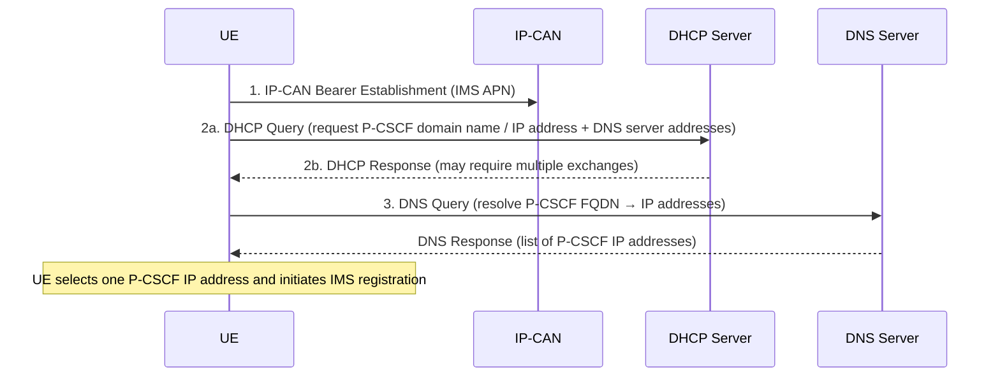
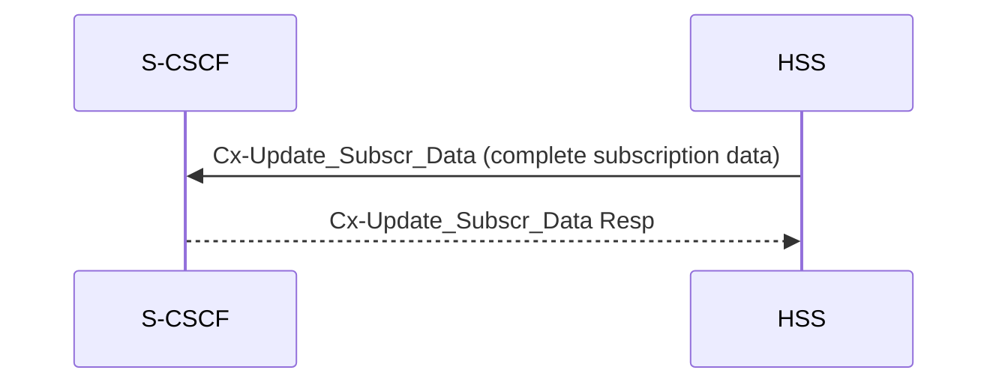
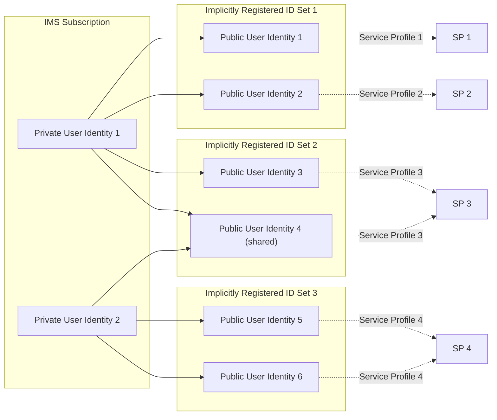
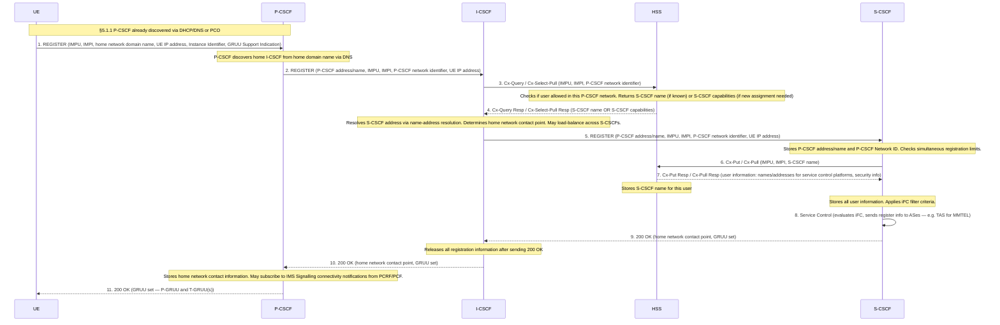
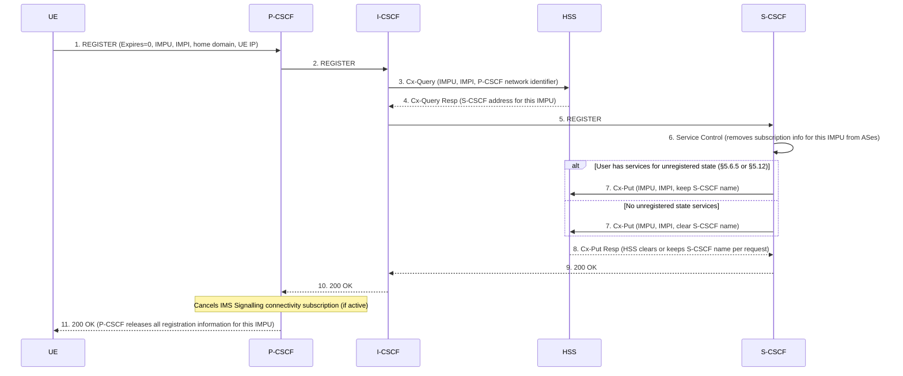
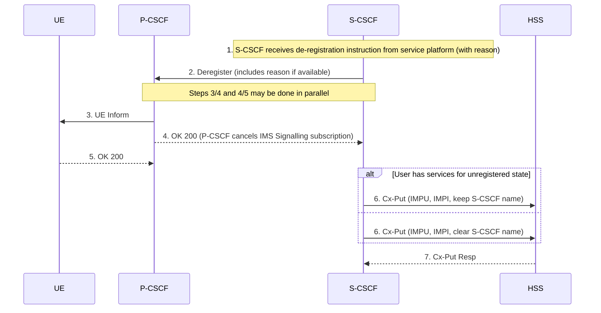
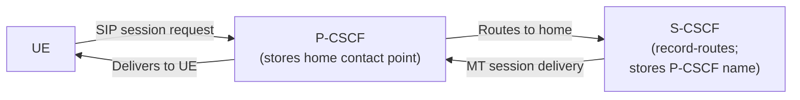

# IMS Registration and De-registration Procedures

Normative source: 3GPP TS 23.228 §5.1–5.3 (Release 16).
Related: [P-CSCF](../entities/P-CSCF.md) | [I-CSCF](../entities/I-CSCF.md) | [S-CSCF](../entities/S-CSCF.md) | [HSS](../entities/HSS.md) | [IMS identity model](../concepts/IMS-identity-model.md)

---

## 5.1.1 P-CSCF Discovery

Before initiating IMS registration the UE must discover a [P-CSCF](../entities/P-CSCF.md). An IP-CAN bearer (the IMS PDN connection established during EPS attach) must be active first.

Two discovery methods are specified:

### DHCP + DNS discovery (Figure 5.0a)



> After receiving the P-CSCF domain name and IP address the UE may initiate communication with the IMS subsystem.

### PCO-based discovery
The P-CSCF address may also be provided in the Protocol Configuration Options (PCO) during EPS bearer setup (EPS Attach or PDN Connectivity). This avoids additional DHCP/DNS signalling.

---

## 5.1.2 S-CSCF Assignment

The assignment of a [S-CSCF](../entities/S-CSCF.md) is performed by the [I-CSCF](../entities/I-CSCF.md). The I-CSCF uses the following inputs for selection:

| Input | Source |
|---|---|
| Required capabilities for user services | HSS (via Cx) |
| Operator preference on a per-user basis | HSS (via Cx) |
| Capabilities of individual S-CSCFs in the home network | Internal — operator network management (not standardised in this release) |
| Topological location of the P-CSCF (which P-CSCF network the UE is in) | Internal — P-CSCF name received in REGISTER; topology obtained by I-CSCF via non-standardised methods |
| Topological location of available S-CSCFs | Internal — operator network management |
| Availability of S-CSCFs | Internal — operator network management |

### Information flowing over Cx (HSS ↔ CSCF)

| Cx transfer | Direction | Description |
|---|---|---|
| UE security parameters | HSS → CSCF | Pre-calculated challenge-response pairs or AKA keys enabling trusted UE–CSCF communication |
| Service parameters | HSS → CSCF | AS addresses, iFC triggers, subscribed media profile identifiers; allowed media parameters configured in S-CSCF |
| S-CSCF capability information | HSS → CSCF | Supported service set, protocol version numbers, etc. |
| Session signalling transport parameters | CSCF → HSS | IP address, port, transport protocol of the CSCF; stored by HSS to route MT sessions to the serving S-CSCF |

### Cancelling the S-CSCF assignment (§5.1.2.2)

S-CSCF assignment is cancelled when:
- S-CSCF registration timer expires (network-initiated).
- UE performs explicit de-registration (REGISTER with Expires=0).
- HSS requests cancellation over Cx (e.g., subscription change requiring a different S-CSCF).

### Subscription data updating (§5.1.5)

When subscription data used by the S-CSCF changes, the HSS pushes the **complete** subscription data set to the S-CSCF using the **Push model**:



---

## 5.1.3 I-CSCF Selection

The architecture supports **multiple I-CSCFs** per operator. A DNS-based mechanism selects which I-CSCF receives a given request, based on the location or identity of the forwarding node (e.g., the P-CSCF network identifier carried in the REGISTER).

---

## 5.1.4 P-CSCF Routing Rules

- The routing of SIP **REGISTER** shall **not** take into account previous registrations (i.e., no cached I-CSCF address from prior registration). Fresh DNS lookup for each REGISTER.
- The routing of SIP session messages (e.g., INVITE) **shall** take into account the information received during the registration process (i.e., the home network contact point stored at step 11).

---

## 5.2 IMS Registration Requirements

Key requirements (§5.2.1):

1. **Multiple IMPUs** via single REGISTER procedure (see Implicit Registration, §5.2.1a).
2. A **shared IMPU** can be registered simultaneously from multiple contact addresses (same or separate UEs); each registration relates to a specific contact address + IMPI.
3. The UE can indicate whether a new REGISTER **adds a new contact** to an existing registration from the same UE.
4. **Registration of one IMPU shall not affect** other already-registered IMPUs, unless due to Implicit Registration Set rules.
5. **GRUU support**: if the UE supports GRUU, it indicates this and obtains a P-GRUU and one or more T-GRUUs per registered IMPU during registration (RFC 5627).
6. **P-CSCF subscribes** to IMS Signalling connectivity notifications after initial registration (TS 23.203, TS 23.503).
7. **P-CSCF includes access network type** information in the REGISTER forwarded to the S-CSCF.
8. UE may register for IMS PS voice/video services when radio conditions are suitable (normal coverage or CE mode A per Annex E.1.2).

---

## 5.2.1a Implicit Registration

When a set of IMPUs are defined as an **Implicit Registration Set** in the HSS, registering any one IMPU in the set simultaneously registers **all** IMPUs in the set.



### Implicit Registration rules

| Rule | Description |
|---|---|
| Atomic registration | When one IMPU in the IRS is registered, ALL others are registered simultaneously |
| Atomic de-registration | When one IMPU in the IRS is de-registered, all **implicitly registered** ones are de-registered simultaneously |
| Contact scoping | Registration/de-registration always relates to a specific contact address + IMPI |
| Multiple service profiles | IMPUs in an IRS may point to different service profiles, or some may share the same profile |
| No individual control | A IMPU in an IRS cannot be individually registered/de-registered without removing it from the IRS |
| Timer scoping | All IMS registration timers apply to the set as a whole |
| Entity notification | S-CSCF, P-CSCF, and UE must all be notified of the complete set of IMPUs in the IRS |
| Session setup blocking | Session setup NOT allowed for implicitly registered IMPUs until entities are updated, EXCEPT for the explicitly registered IMPU |
| S-CSCF storage | S-CSCF stores all service profiles for all IMPUs in the IRS during registration |
| Barred IMPU | Only HSS and S-CSCF have access to barred IMPUs |

### UEs without ISIM (§5.2.1a.1)
UEs without an ISIM (or without IMC for non-3GPP access) use a **Temporary Public User Identity** for initial registration. The HSS must indicate whether implicit registration is activated for that user — if not, the UE shall not be allowed to use the Temporary PUPI.

---

## 5.2.2 IMS Registration Flow — User Not Registered

Assumes: IP-CAN bearer established; I-CSCF uses DNS to determine S-CSCF address. For purposes of these flows, the user is always considered to be "roaming" (home network plays both visited and home roles for non-roaming UEs).



### S-CSCF rejection conditions
- Number of registered contact addresses from the **same UE** for this IMPU exceeds S-CSCF simultaneous registration limit.
- Total simultaneous registrations for this IMPU across **separate UEs** exceeds limit (S-CSCF config or per HSS-provided subscribed value).

### State stored after registration (Table 5.1)

| Node | After Registration |
|---|---|
| UE | Credentials, Home Domain, Proxy Name/Address, **UE P-GRUU**, **at least one T-GRUU** |
| P-CSCF | Final Network Entry point (home network contact), UE Address, Public and Private User IDs, Access Network Type |
| I-CSCF | **No State Information** (all registration state released after 200 OK forwarded) |
| HSS | **S-CSCF address/name** |
| S-CSCF | HSS Address/name, User profile, Proxy address/name, P-CSCF Network ID, IMPU, IMPI, UE IP Address, UE P-GRUU, UE T-GRUU; may have session state |

> **Key design point:** The I-CSCF holds no state after registration. It is a pure routing function that is traversed at REGISTER time but not for mid-registration session signalling.

---

## 5.2.2.4 Re-Registration Flow — User Currently Registered

Re-registration is initiated by the UE periodically (to refresh the registration timer) or when:
- UE capabilities change.
- IP-CAN type changes (e.g., 3GPP access ↔ WLAN).

The flow is identical to §5.2.2.3 with one difference at step 4:

```mermaid
sequenceDiagram
    participant UE as UE
    participant PCSCF as P-CSCF
    participant ICSCF as I-CSCF
    participant HSS as HSS
    participant SCSCF as S-CSCF

    UE->>PCSCF: 1. REGISTER (IMPU, IMPI, home domain, UE IP, Instance ID, GRUU Support)
    Note over PCSCF: Does NOT use entry point cached from prior registration. Fresh DNS lookup.
    PCSCF->>ICSCF: 2. REGISTER
    ICSCF->>HSS: 3. Cx-Query (IMPU, IMPI, P-CSCF network identifier)
    HSS-->>ICSCF: 4. Cx-Query Resp — S-CSCF already assigned; returns S-CSCF name
    ICSCF->>SCSCF: 5. REGISTER
    Note over SCSCF: Optionally omits Cx-Put/Cx-Pull (optimisation for re-registration)
    SCSCF->>HSS: 6. Cx-Put / Cx-Pull (optional on re-registration)
    HSS-->>SCSCF: 7. Cx-Put Resp / Cx-Pull Resp
    SCSCF->>SCSCF: 8. Service Control (service control environment notified of current IP-CAN type)
    SCSCF-->>ICSCF: 9. 200 OK
    ICSCF-->>PCSCF: 10. 200 OK (I-CSCF releases all registration state)
    PCSCF-->>UE: 11. 200 OK
```

> P-CSCF may force UE to attempt initial registration at a **different P-CSCF** (step 2 note), enabling P-CSCF migration without service interruption.

---

## 5.3 De-Registration Procedures

### 5.3.1 Mobile-Initiated De-Registration

The UE de-registers by sending a **REGISTER with Expires=0**. The flow follows the same path as §5.2.2.3 ("user not registered" path through I-CSCF).



**Key rule:** If the HSS keeps the S-CSCF name, the HSS shall still be able to clear it at any time. The "keep S-CSCF name" option preserves the ability to route MT calls to this IMPU even when the UE is not registered.

---

### 5.3.2 Network-Initiated De-Registration

The IM CN subsystem initiates de-registration for:
- **Network Maintenance**: data inconsistency, node failure, UICC lost — forcing re-registration.
- **Network/Traffic determined**: user roamed to another network without de-registering (duplicate registration), roaming agreement change.
- **Application Layer determined**: service platform wants to remove specific terminals or all registrations.
- **Subscription Management**: new services requiring S-CSCF capabilities not supported by current S-CSCF — active S-CSCF change via network-initiated de-registration + re-registration cycle.

#### 5.3.2.1 Registration Timeout (Figure 5.4)

P-CSCF and S-CSCF registration timers expire independently:

```mermaid
sequenceDiagram
    participant UE as UE
    participant PCSCF as P-CSCF
    participant SCSCF as S-CSCF
    participant HSS as HSS

    Note over PCSCF,SCSCF: Registration timers expire in P-CSCF and S-CSCF (assumed close enough — no external synchronisation required)
    PCSCF->>PCSCF: 1a. Timer Expires — removes IMPU from registered state; cancels IMS Signalling connectivity subscription
    SCSCF->>SCSCF: 1b. Timer Expires
    SCSCF->>SCSCF: 2. Service Control (removes subscription info for this IMPU from ASes)
    alt User has services for unregistered state
        SCSCF->>HSS: 3. Cx-Put (IMPU, IMPI, keep S-CSCF name)
    else
        SCSCF->>HSS: 3. Cx-Put (IMPU, IMPI, clear S-CSCF name)
    end
    HSS-->>SCSCF: 4. Cx-Put Resp
```

> The UE is **not notified** in the timeout case — its registration simply expires. Any subsequent request from the UE will trigger a fresh registration.

#### 5.3.2.2.1 Network-Initiated De-Registration by HSS, Administrative (Figure 5.5)

Triggered by: subscription termination, lost terminal, fraud detection, contract expiry, service profile change requiring S-CSCF change.

```mermaid
sequenceDiagram
    participant UE as UE
    participant PCSCF as P-CSCF
    participant SCSCF as S-CSCF
    participant HSS as HSS

    HSS->>SCSCF: 1. Cx-Deregister (user identity, reason)
    SCSCF->>SCSCF: 2. Service Control (removes subscription info from ASes)
    SCSCF->>PCSCF: 3. Deregister (includes reason from HSS if available)
    Note over PCSCF,SCSCF: Steps 4 and 5 may be done in parallel
    PCSCF->>UE: 4. UE Inform (forwards reason for de-registration)
    PCSCF-->>SCSCF: 5. OK 200 (P-CSCF cancels IMS Signalling connectivity subscription)
    UE-->>PCSCF: 6. OK 200 (if reachable; P-CSCF de-registers after timer expiry if UE unreachable)
    Note over UE: If UE does not perform automatic re-registration, it shall be informed of the de-registration reason
    SCSCF-->>HSS: 7. Cx-Deregister Resp
```

#### 5.3.2.2.2 Network-Initiated De-Registration by Service Platform (Figure 5.5a)



---

## Cross-Procedure Comparison

| Aspect | Initial Registration | Re-Registration | Mobile De-Reg | Network De-Reg (HSS) | Network De-Reg (Timeout) |
|---|---|---|---|---|---|
| Trigger | UE REGISTER | UE REGISTER (periodic / capability change) | UE REGISTER (Expires=0) | HSS Cx-Deregister | Timer expiry at P-CSCF + S-CSCF |
| I-CSCF role | Select new S-CSCF (Cx-Select-Pull) | Route to existing S-CSCF (Cx-Query) | Route to existing S-CSCF (Cx-Query) | Not involved | Not involved |
| HSS Cx command | Cx-Select-Pull → Cx-Put/Cx-Pull | Cx-Query → Cx-Put/Cx-Pull (optional) | Cx-Query → Cx-Put | Cx-Deregister (initiates) → Cx-Deregister Resp | Cx-Put (S-CSCF initiated) |
| UE notified | Yes (200 OK with GRUUs) | Yes (200 OK with GRUUs) | Yes (200 OK) | Yes (Deregister→UE Inform) | No |
| P-CSCF state | Store home network contact point | Update home network contact point | Release all state | Release all state | Release all state |
| S-CSCF name in HSS | Written (Cx-Put) | Written (Cx-Put, optional) | Cleared or kept | HSS holds; S-CSCF sends Cx-Deregister Resp | Cleared or kept by S-CSCF |

---

## Session Path After Registration

After successful registration:
- [P-CSCF](../entities/P-CSCF.md) stores the **home network contact point** (S-CSCF name / I-CSCF if THIG). All subsequent SIP sessions from UE are routed through P-CSCF to this contact.
- [S-CSCF](../entities/S-CSCF.md) stores the **P-CSCF address/name** as supplied by the visited network. All network-initiated (terminating) sessions toward the UE are forwarded by the S-CSCF to the P-CSCF, which delivers them to the UE.
- The S-CSCF uses **Record-Route** (RFC 3261) to remain in the signalling path for mid-dialog requests. This is operator-configurable on a per-service basis.


