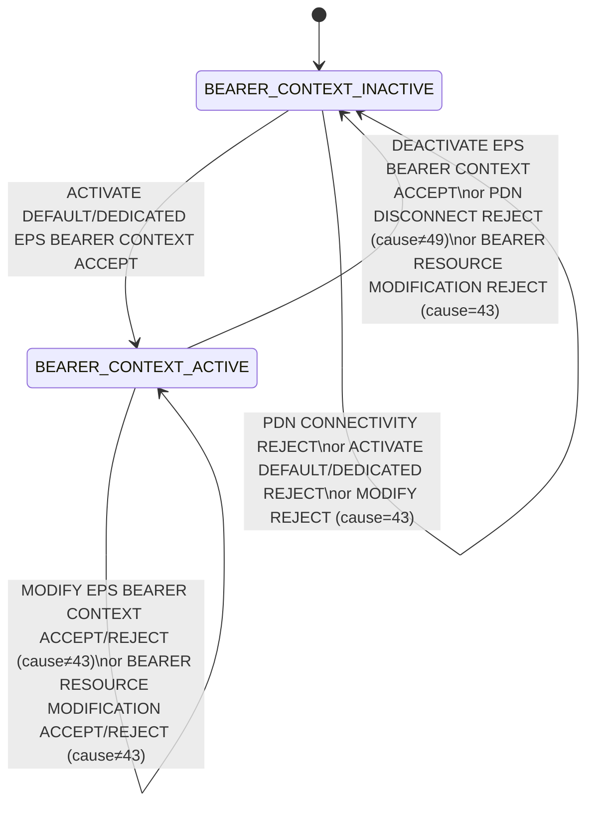
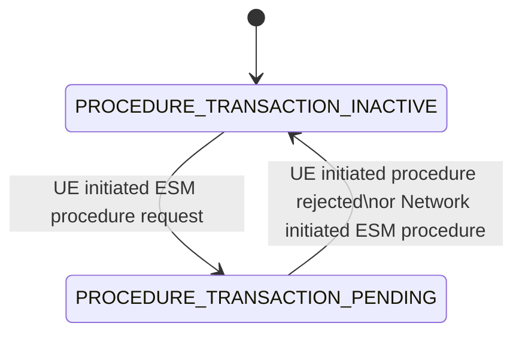
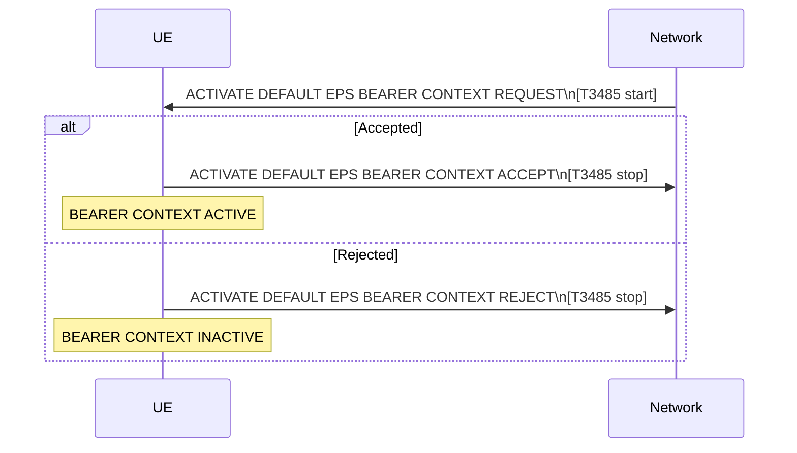
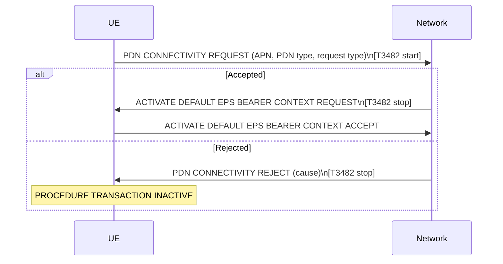
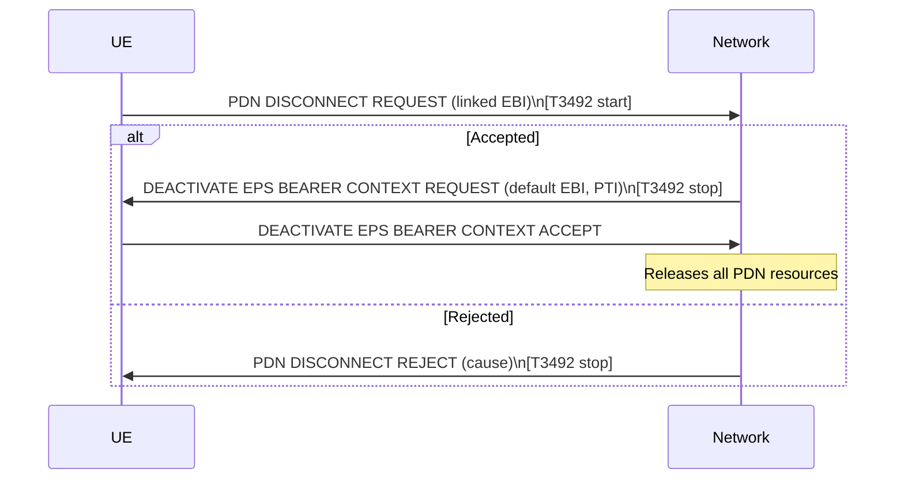
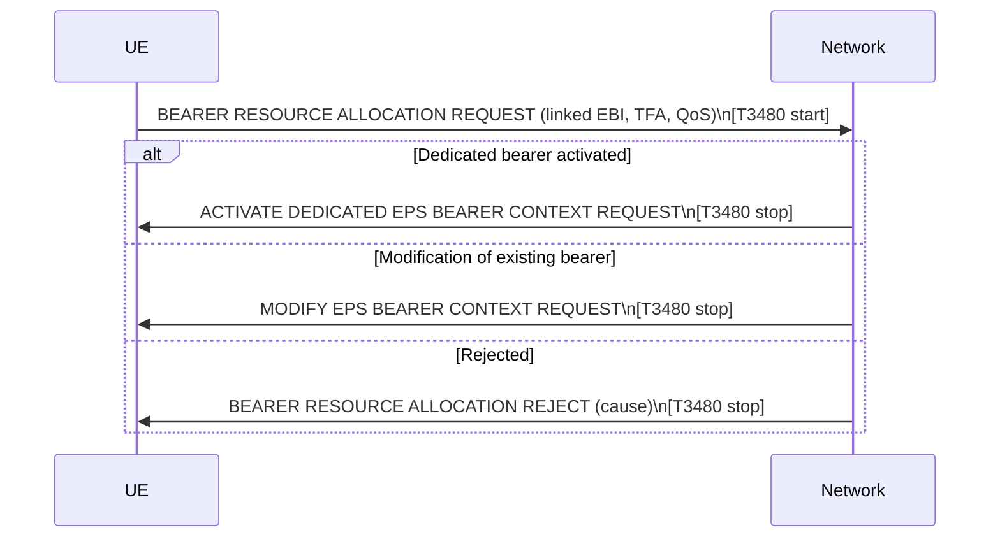
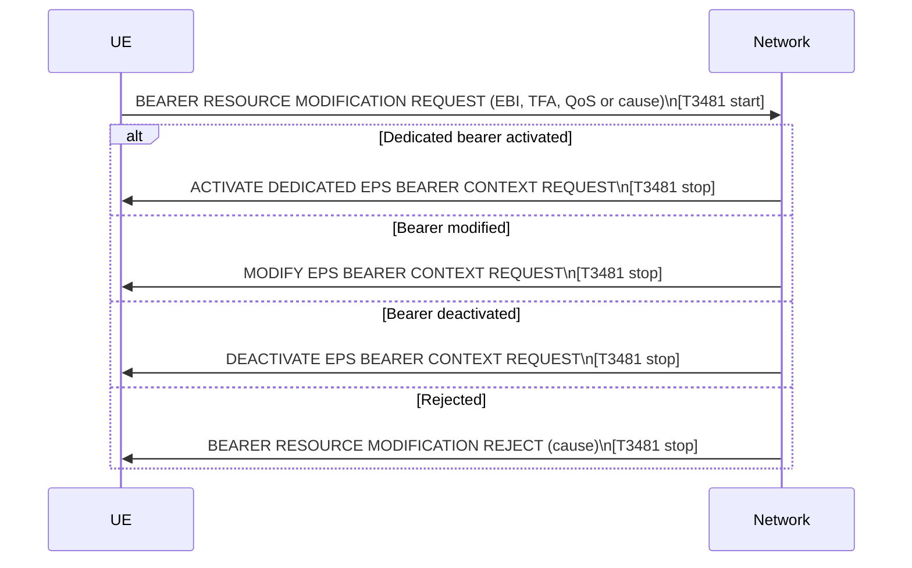
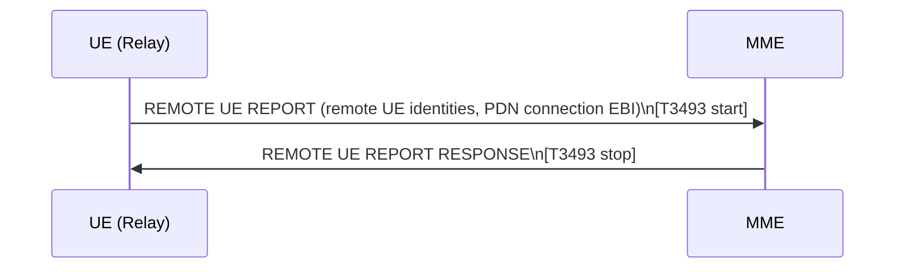
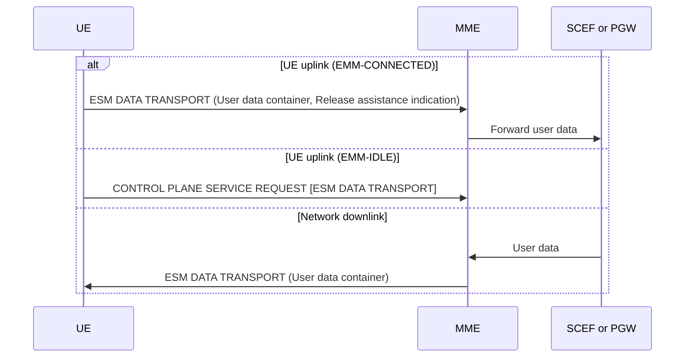

# NAS ESM Procedures (Stage 3)

Stage-3 specification of EPS Session Management (ESM) procedures between UE and MME/PGW. Covers §6.1–§6.6 of 3GPP TS 24.301 v17.6.0.

See also: [procedures/dedicated-bearer.md](dedicated-bearer.md) | [procedures/PDN-connectivity.md](PDN-connectivity.md) | [concepts/EPS-bearer.md](../concepts/EPS-bearer.md)

---

## 6.1 Overview

### 6.1.1 ESM Procedure Categories

**1. EPS bearer context related procedures** (network-initiated):
- Activate Default EPS Bearer Context
- Activate Dedicated EPS Bearer Context
- Modify EPS Bearer Context
- Deactivate EPS Bearer Context
- Transport of user data via control plane

**2. Transaction related procedures** (UE-initiated):
- PDN connectivity (→ triggers default bearer activation)
- PDN disconnect
- Bearer resource allocation (→ triggers dedicated bearer activation/modification)
- Bearer resource modification (→ triggers dedicated/modify/deactivate bearer)
- ESM information request (network sub-procedure during attach)
- Remote UE report (ProSe relay)
- ESM dummy message (when attach without PDN connection supported)

**Key rule:** During EPS bearer context procedures, the UE and MME shall not initiate transport of user data via the control plane until the ongoing procedure completes.

### 6.1.2 IP Address Allocation

IP address/prefix allocation methods for a PDN connection:

| Method | Stack | Reference |
|--------|-------|-----------|
| IPv6 stateless address autoconfiguration (/64 prefix) | IPv6 | RFC 4862 |
| DHCPv4 | IPv4 | TS 29.061 |
| Stateless DHCPv6 (parameters only) | IPv6 | RFC 3736 |

The UE requests the PDN type in PDN CONNECTIVITY REQUEST. Network may override to a single address type if policy restricts dual-stack. ESM causes #50/#51 ("PDN type IPv4/IPv6 only allowed") signal the override.

### 6.1.3 ESM Sublayer States

#### UE-side ESM states (per EPS bearer context)



#### UE-side procedure transaction states



#### MME-side ESM states (per EPS bearer context)

| State | Meaning |
|-------|---------|
| BEARER CONTEXT INACTIVE | No bearer context exists |
| BEARER CONTEXT ACTIVE PENDING | MME sent ACTIVATE request, waiting for UE response |
| BEARER CONTEXT ACTIVE | Bearer is active |
| BEARER CONTEXT INACTIVE PENDING | MME sent DEACTIVATE request, waiting for UE response |
| BEARER CONTEXT MODIFY PENDING | MME sent MODIFY request, waiting for UE response |

### 6.1.4 Coordination between ESM and SM (inter-system)

At S1 → A/Gb or Iu mode change:
- EPS bearer identity → NSAPI
- Linked EPS bearer identity → linked TI
- PDN address/APN → PDP address/APN
- TFT of default bearer → TFT of default PDP context
- TFTs of dedicated bearers → TFTs of secondary PDP contexts

MME derives APN-AMBR from PDP MBR; UE maps MBR of default PDP context to APN-AMBR.

At A/Gb/Iu → S1 mode change: reverse mappings apply.

### 6.1.5 Coordination between ESM and EMM for ISR

When ISR is activated and TIN = "RAT-related TMSI", the UE shall set TIN to "GUTI" (locally deactivating ISR) when:
- Any active EPS bearer context is modified (after ISR was activated)
- UE changes from S1 to A/Gb or Iu mode (not due to PS HO)
- Last non-emergency EPS bearer context is deactivated

---

## 6.2 IP Address Allocation

### §6.2.2 IP address allocation via NAS signalling

UE PDN type selection rules in PDN CONNECTIVITY REQUEST:

| Condition | PDN Type IE |
|-----------|-------------|
| Dual-stack capable, no prior IP for this APN | IPv4v6 |
| Dual-stack, already has IPv4 for APN, got cause #52 | IPv6 |
| Dual-stack, already has IPv6 for APN, got cause #52 | IPv4 |
| IPv4-only capable | IPv4 |
| IPv6-only capable | IPv6 |
| MT/TE separated, IP version unknown | IPv4v6 |

Network includes PDN address in ACTIVATE DEFAULT EPS BEARER CONTEXT REQUEST:
- IPv4: includes the IPv4 address (or 0.0.0.0 if via DHCPv4)
- IPv6: includes interface identifier for link-local address
- ESM cause #50/#51 signals that dual-stack was overridden to single type; UE must not retry the same type until PLMN change or USIM removal.

### §6.2A IP Header Compression

For control plane CIoT EPS optimisation on IP PDN connections, the UE and MME may use the ROHC framework (RFC 5795). ROHC profiles are negotiated during:
- Attach procedure
- TAU procedure
- Bearer resource modification procedure (§6.5.4)
- EPS bearer context modification (§6.4.3)

---

## 6.3 General on Elementary ESM Procedures

### §6.3.2 PTI and EBI addressing

| Procedure type | PTI | EBI |
|----------------|-----|-----|
| Transaction related (UE-initiated) | Valid PTI set by UE | "no EPS bearer identity assigned" |
| Transaction related (network-initiated) | Valid PTI set by network | "no EPS bearer identity assigned" |
| EPS bearer context related (network-initiated internally) | "no PTI assigned" | Valid EBI |
| EPS bearer context related (triggered by UE transaction) | PTI from UE's request | Valid EBI |
| EPS bearer context related (triggered by CP data transport) | "no PTI assigned" | Valid EBI |

### §6.3.5 APN-based Congestion Control (T3396)

- Network starts T3396 per APN per UE on congestion detection
- While T3396 is running for an APN, UE shall not send further PDN CONNECTIVITY REQUEST, BEARER RESOURCE ALLOCATION REQUEST, or BEARER RESOURCE MODIFICATION REQUEST for that APN
- Timer survives PLMN change and inter-system change
- UE may still request emergency PDN connectivity regardless of T3396
- UE configured for AC11–15 may still initiate PDN connectivity for that APN

### §6.3.6 Back-off timer (non-APN congestion)

If the back-off timer IE is in a reject message (cause ≠ #26), the UE starts the back-off timer for that PLMN/APN and shall not retry until expiry, switch-off, or USIM removal.

The **Re-attempt indicator IE** may allow retry in A/Gb/Iu mode or N1 mode (5GS).

### §6.3.8 Serving PLMN Rate Control

The serving PLMN may restrict the rate of uplink User Data container IEs in ESM DATA TRANSPORT messages. Applicable to control plane CIoT EPS optimisation only.

### §6.3.9 APN Rate Control

APN rate control limits uplink user data messages per time interval for the APN. Also applies to exception data (separate additional APN rate control parameters). Status stored on inter-system change to N1 mode.

### §6.3.10 3GPP PS Data Off

When 3GPP PS data off UE status is "activated":
- UE shall not send uplink IP packets except for exempt services listed in two per-PLMN lists (HPLMN/EHPLMN list and VPLMN list)
- Traffic from procedures per TS 24.229 and TS 24.623 is also exempt
- UE indicates status change via BEARER RESOURCE MODIFICATION REQUEST or at attach/TAU

### §6.3.13 UAS (Drone) Identification and Authorization

**§6.3.13.1–6.3.13.2**: UE with UAS capability must have CAA-level UAV ID before accessing EPS for UAS services. UE provides USS address and UUAA payload (service-level-AA container) in PDN CONNECTIVITY REQUEST. Network performs **UUAA-SM** procedure.

**§6.3.13.3**: C2 (command and control) communication: pairing of UAV and UAV-C must be authorized by USS before user plane for C2 is enabled. Uses UUAA-SM during PDN connectivity or bearer resource modification.

**§6.3.13.4**: Network may authorize UAV flight separately via USS during PDN connectivity or bearer resource modification.

---

## 6.4 Network Initiated ESM Procedures

### §6.4.1 Default EPS Bearer Context Activation

**Purpose:** Establish default EPS bearer between UE and EPC, in response to PDN CONNECTIVITY REQUEST or as part of Attach.



**Key message content (REQUEST):**
- EPS bearer identity (EBI assigned by MME per §9.3.2)
- Access Point Name
- PDN address (IPv4 / IPv6 / IPv4v6 / non-IP / Ethernet)
- EPS QoS (QCI, ARP, GBR/MBR if applicable)
- Session-AMBR (APN-AMBR for this PDN connection)
- WLAN offload indication (E-UTRAN and WLAN offload acceptability)
- APN rate control parameters / exception data parameters
- Serving PLMN rate control (CIoT)
- Header compression configuration (CIoT)
- Extended PCO / PCO
- Connectivity type (for LIPA PDN connections)

**UE actions on ACCEPT:**
- Set BEARER CONTEXT ACTIVE
- Store APN rate control, Serving PLMN rate control, small data rate control
- If sent with ATTACH COMPLETE: include ATTACH COMPLETE message
- If standalone: send ACTIVATE DEFAULT EPS BEARER CONTEXT ACCEPT alone

**REJECT causes:**
- #26: insufficient resources
- #31: request rejected, unspecified
- #95–111: protocol errors

**Timer T3485 abnormal cases:**
- Retransmit on expiry; up to 4 retransmissions (5th expiry → abort, release resources)
- If HeNB rejects for LIPA/SIPTO (TS 36.413): MME aborts with cause #34

---

### §6.4.2 Dedicated EPS Bearer Context Activation

**Purpose:** Establish dedicated (QoS-specific, TFT-filtered) EPS bearer.

```mermaid
sequenceDiagram
    participant UE
    participant Network
    Network->>UE: ACTIVATE DEDICATED EPS BEARER CONTEXT REQUEST\n[T3485 start]
    alt Accepted
        UE->>Network: ACTIVATE DEDICATED EPS BEARER CONTEXT ACCEPT
    else Rejected
        UE->>Network: ACTIVATE DEDICATED EPS BEARER CONTEXT REJECT (cause)
        Note over Network: BEARER CONTEXT INACTIVE; T3485 stop
    end
```

**Key message content (REQUEST):**
- EBI (from MME, not already used)
- Linked EBI (identifies the associated default bearer)
- EPS QoS (QCI + GBR/MBR if GBR bearer)
- TFT (operation = "Create a new TFT"; must contain ≥1 UL packet filter)
- PTI (if triggered by UE's BEARER RESOURCE ALLOCATION REQUEST)

**REJECT causes and TFT error checking:**

| Cause | Reason |
|-------|--------|
| #26 | insufficient resources |
| #31 | request rejected, unspecified |
| #41 | semantic error in TFT operation (operation ≠ "Create new TFT") |
| #42 | syntactical error in TFT (empty packet filter list) |
| #43 | invalid EPS bearer identity (linked EBI not matching any active default bearer) |
| #44 | semantic errors in packet filters (conflicting filters; no UL filter) |
| #45 | syntactical errors in packet filters (duplicate IDs, duplicate precedence) |
| #95–111 | protocol errors |

**Abnormal cases:**
- T3485: 4 retransmissions; 5th expiry → abort, BEARER CONTEXT INACTIVE
- Duplicate EBI: locally deactivate existing same-EBI bearer and proceed with new activation
- "Linked EBI not active": reject with #43

---

### §6.4.3 EPS Bearer Context Modification

**Purpose:** Modify QoS/TFT of an existing bearer. Network may also update APN-AMBR, WLAN offload indication, Measurement Assistance Information, ROHC header compression config, UUAA-SM result, inter-system params.

```mermaid
sequenceDiagram
    participant UE
    participant Network
    Network->>UE: MODIFY EPS BEARER CONTEXT REQUEST\n[T3486 start]
    alt Accepted
        UE->>Network: MODIFY EPS BEARER CONTEXT ACCEPT
        Note over Network: T3486 stop; BEARER CONTEXT ACTIVE
    else Rejected
        UE->>Network: MODIFY EPS BEARER CONTEXT REJECT (cause)
        Note over Network: T3486 stop; BEARER CONTEXT ACTIVE
    end
```

**REJECT causes:**
- #26: insufficient resources
- #41/#42: TFT semantic/syntactical error
- #43: invalid EBI (→ MME locally deactivates the bearer context, no peer ESM signalling)
- #44/#45: packet filter errors
- #95–111: protocol errors

TFT operations for modification differ from activation — "Create a new TFT" is **not** the expected operation; the operation describes what change to make (Add / Replace / Delete packet filters from existing TFT / Delete existing TFT).

**Note:** If the modification is of a GBR bearer and the MODIFY REQUEST does not include GBR/MBR values, the UE continues using the previously received GBR/MBR.

**Abnormal cases:**
- T3486: 4 retransmissions; 5th expiry → abort, remain BEARER CONTEXT ACTIVE
- Collision with UE bearer resource modification procedure: if PTI in MODIFY REQUEST = "No PTI assigned" and the EBI is the one the UE had requested to modify, abort UE procedure and proceed with network modification

---

### §6.4.4 EPS Bearer Context Deactivation

**Purpose:** Deactivate one or all EPS bearers of a PDN connection.

```mermaid
sequenceDiagram
    participant UE
    participant Network
    Network->>UE: DEACTIVATE EPS BEARER CONTEXT REQUEST (EBI, cause)\n[T3495 start]
    UE->>Network: DEACTIVATE EPS BEARER CONTEXT ACCEPT
    Note over Network: T3495 stop; BEARER CONTEXT INACTIVE
```

**ESM causes in DEACTIVATE REQUEST:**

| Cause | Meaning |
|-------|---------|
| #8 | operator determined barring |
| #26 | insufficient resources |
| #29 | user authentication or authorization failed |
| #36 | regular deactivation |
| #38 | network failure |
| #39 | reactivation requested |
| #112 | APN restriction value incompatible |
| #113 | multiple accesses to a PDN not allowed |

**Deactivating the default bearer:** when EBI in the DEACTIVATE REQUEST is the default bearer of a PDN, the UE deactivates **all** EPS bearer contexts of that PDN connection.

**Cause #39 "reactivation requested":**
- If it is a default bearer context and T3396 is not running for the APN, the UE shall re-initiate UE requested PDN connectivity for the same APN
- T3396 (reactivation): complex 3-case timer-value logic (neither zero nor deactivated → restart T3396 with Back-off; timer deactivated → no immediate retry; timer = 0 → immediate retry allowed)

**§6.4.4.6 Local deactivation without NAS signalling** (5 cases):
1. During Service Request: E-UTRAN establishes radio bearers for some but not all EPS bearers
2. During NAS signalling resume: some radio bearers restored, some not
3. During TAU: network established radio bearers for EPS bearers indicated active in network but not all EPS bearer contexts indicated active in both UE and network
4. During handover: target E-UTRAN does not establish all radio bearers for UE
5. E-UTRAN releases some radio bearers due to E-UTRAN-specific reasons; or NBIFOM multi-access PDN connection

**Abnormal cases:**
- T3495: 4 retransmissions; 5th expiry → abort, locally deactivate bearer (no peer-to-peer ESM signalling)

---

## 6.5 UE Requested ESM Procedures

### §6.5.0 Maximum EPS bearer contexts

- Maximum 15 active EPS bearer contexts per PLMN in S1 mode
- UE indicates support for 15 bearers via "15 bearers" bit in UE Network Capability IE
- Network indicates support via EPS network feature support IE
- EBI values 0–15 (extended range); EBI values 1–4 reserved if 15-bearer feature not used
- NB-S1 mode: maximum 2 active user plane radio bearers (1 for single-DRB mode)

---

### §6.5.1 UE Requested PDN Connectivity Procedure

**Purpose:** UE requests a default EPS bearer and PDN connection.



**Request types:**

| Value | When |
|-------|------|
| `initial request` | New PDN connection in attach or standalone |
| `emergency` | Emergency bearer services |
| `handover` | Transfer from non-3GPP access network |
| `handover of emergency bearer services` | Handover of emergency PDN from non-3GPP |
| `RLOS` | Restricted Local Operator Services |

**APN selection:**
- If UE includes APN → network uses it (if subscribed)
- If UE omits APN → MME uses default APN (or APN configured for emergency/RLOS)

**PDN CONNECTIVITY REJECT causes:**

| Cause | Trigger |
|-------|---------|
| #8 | operator determined barring |
| #26 | insufficient resources → T3396 back-off |
| #27 | missing or unknown APN |
| #28 | unknown PDN type |
| #29 | user auth/authorization failed |
| #30 | request rejected by S-GW or P-GW |
| #31 | request rejected, unspecified |
| #32 | service option not supported |
| #33 | service option not subscribed |
| #34 | service option temporarily out of order |
| #35 | PTI already in use |
| #38 | network failure |
| #50 | PDN type IPv4 only allowed (UE requested dual-stack or IPv6) |
| #51 | PDN type IPv6 only allowed |
| #53 | ESM information not received |
| #54 | PDN connection does not exist (for handover request type) |
| #55 | multiple PDN connections for a given APN not allowed |
| #57 | PDN type IPv4v6 only allowed |
| #58 | PDN type non-IP only allowed |
| #61 | PDN type Ethernet only allowed |
| #65 | maximum number of EPS bearers reached |
| #66 | requested APN not supported in current RAT and PLMN combination |
| #112 | APN restriction value incompatible |
| #113 | multiple accesses to PDN not allowed |
| #95–111 | protocol errors |

**ESM information request sub-procedure:**
If the ESM information transfer flag is set in PDN CONNECTIVITY REQUEST, the MME waits until security context is established, then sends ESM INFORMATION REQUEST (T3489). The UE responds with ESM INFORMATION RESPONSE containing PCO/APN. T3489: 2 retransmissions; 3rd expiry → reject with cause #53.

**T3482 abnormal:**
- Emergency/handover of emergency: on 1st expiry → inform upper layers, detach and re-attach for emergency; otherwise resend up to 4 times (5th expiry → abort, PROCEDURE TRANSACTION INACTIVE)

**§6.5.1.7 Dual priority handling (for PDN connectivity):**
If existing PDN was established with "low priority" indicator and UE wants same APN without low priority: UE may either send PDN CONNECTIVITY REQUEST for same APN (may get cause #55 if multi-PDN not allowed) or first deactivate existing low-priority PDN.

---

### §6.5.2 UE Requested PDN Disconnection Procedure

**Purpose:** UE requests disconnection from one PDN (releases default bearer and all associated dedicated bearers).



**REJECT causes:**
- #35: PTI already in use
- #43: invalid EPS bearer identity
- #49: last PDN disconnection not allowed (only one PDN remaining and EMM-REGISTERED without PDN connection not supported)
- #95–111: protocol errors

Note: EMM-REGISTERED without PDN connection: if supported by both UE and MME, UE can disconnect from the last PDN.

**T3492 abnormal:** 4 retransmissions; 5th expiry → locally deactivate all EPS bearer contexts for the PDN without peer-to-peer ESM signalling; enter PROCEDURE TRANSACTION INACTIVE; send TAU REQUEST with EPS bearer context status IE.

---

### §6.5.3 UE Requested Bearer Resource Allocation Procedure

**Purpose:** UE requests allocation of bearer resources (QCI + optional GBR) for a new traffic flow aggregate → triggers dedicated bearer activation or bearer modification.



**REJECT causes:** #26, #30, #31, #32, #33, #34, #35, #37, #41, #42, #43, #44, #45, #56, #59, #60, #65, #95–111.

**T3480 abnormal:** 4 retransmissions; 5th expiry → abort, release traffic flow aggregate description, PROCEDURE TRANSACTION INACTIVE. If cause #43 received → locally deactivate default EPS bearer context, stop T3480.

---

### §6.5.4 UE Requested Bearer Resource Modification Procedure

**Purpose:** UE requests modification of bearer resources for an existing traffic flow aggregate (one of 6 purposes):

| Purpose | Action |
|---------|--------|
| a | Modify GBR for existing TFA |
| b | Release bearer resources for TFA |
| c | Modify TFA (replace/add/delete packet filters) |
| d | Re-negotiate ROHC header compression config for an EPS bearer context |
| e | Indicate change of 3GPP PS data off UE status for a PDN connection |
| f | Transmit C2 authorization information for UAS services |



**REJECT causes:** #26, #30, #31, #32, #33, #34, #35, #37, #41, #42, #43, #44, #45, #56, #59, #60, #95–111.

**T3481 abnormal:** 4 retransmissions; 5th expiry → abort, release traffic flow aggregate description, PROCEDURE TRANSACTION INACTIVE. If cause #43: locally deactivate EPS bearer context, stop T3481.

---

### §6.5.5 Session Management for Dual Priority UE

When T3396 is running for an APN (due to "low priority" rejection with cause #26), the UE may re-attempt by sending PDN CONNECTIVITY REQUEST or BEARER RESOURCE ALLOCATION/MODIFICATION REQUEST for the same APN with the **low priority indicator = "MS is not configured for NAS signalling low priority"**.

---

## 6.6 Miscellaneous ESM Procedures

### §6.6.1 Protocol Configuration Options (PCO) Exchange

Protocol configuration options are carried in:
- PDN CONNECTIVITY REQUEST / ESM INFORMATION RESPONSE (UE → MME → PGW)
- ACTIVATE DEFAULT / DEDICATED EPS BEARER CONTEXT REQUEST (PGW → MME → UE)
- MODIFY EPS BEARER CONTEXT REQUEST
- And all reject messages

**Extended PCO (ePCO)** is used when:
- UE is in NB-S1 mode
- APN is for UAS services
- PDN type is non-IP or Ethernet
- Network and UE negotiated ePCO use via ATTACH/TAU

#### §6.6.1.2 ESM Information Request Procedure

```mermaid
sequenceDiagram
    participant UE
    participant Network
    Note over Network: ESM information transfer flag set in PDN CONNECTIVITY REQUEST
    Network->>UE: ESM INFORMATION REQUEST\n[T3489 start]
    UE->>Network: ESM INFORMATION RESPONSE (PCO / APN)
    Note over Network: T3489 stop; continue PDN connectivity
```

Used to retrieve security-sensitive information (APN, protocol configuration) after NAS security is established. T3489: 2 retransmissions; 3rd expiry → abort PDN connectivity with cause #53 "ESM information not received".

---

### §6.6.2 Notification Procedure

Network → UE: **NOTIFICATION** message (no UE response required).

Notification indicator values:

| Value | Meaning |
|-------|---------|
| #1 | SRVCC handover cancelled, IMS session re-establishment required |

---

### §6.6.3 Remote UE Report Procedure (ProSe Relay)

Used by a UE acting as a **ProSe UE-to-network relay** to notify the MME that a remote UE has connected or disconnected.



T3493: 2 retransmissions; 3rd expiry → abort.

---

### §6.6.4 Transport of User Data via Control Plane

**Purpose:** Transfer user data (IP, non-IP, Ethernet) via NAS signalling (CIoT control plane optimisation).



**Release assistance indication** (optional, UE → MME): tells network when NAS signalling connection can be released:
- "no further UL or DL data" → release immediately after UL transmission
- "single DL data" → release after one subsequent DL transmission

**Link MTU:** recommended maximum = 1358 octets for fragmentation prevention in backbone (setting to ≤ 1358 advised; larger values may cause inefficiency).

---

## Timer Summary (§6)

| Timer | Value | ESM Usage |
|-------|-------|-----------|
| T3480 | 8 s | Bearer resource allocation supervision |
| T3481 | 8 s | Bearer resource modification supervision |
| T3482 | 8 s | PDN connectivity supervision |
| T3485 | 8 s | EPS bearer context activation supervision (network-initiated) |
| T3486 | 8 s | EPS bearer context modification supervision |
| T3489 | 4 s | ESM information request supervision |
| T3492 | 6 s | PDN disconnect supervision |
| T3493 | 4 s | Remote UE report supervision |
| T3495 | 8 s | EPS bearer context deactivation supervision |
| T3396 | Network-provided | APN congestion back-off timer |

_All timers have 4 retransmissions (5th expiry = abort) except T3489 (2 retransmissions) and T3493 (2 retransmissions)._
