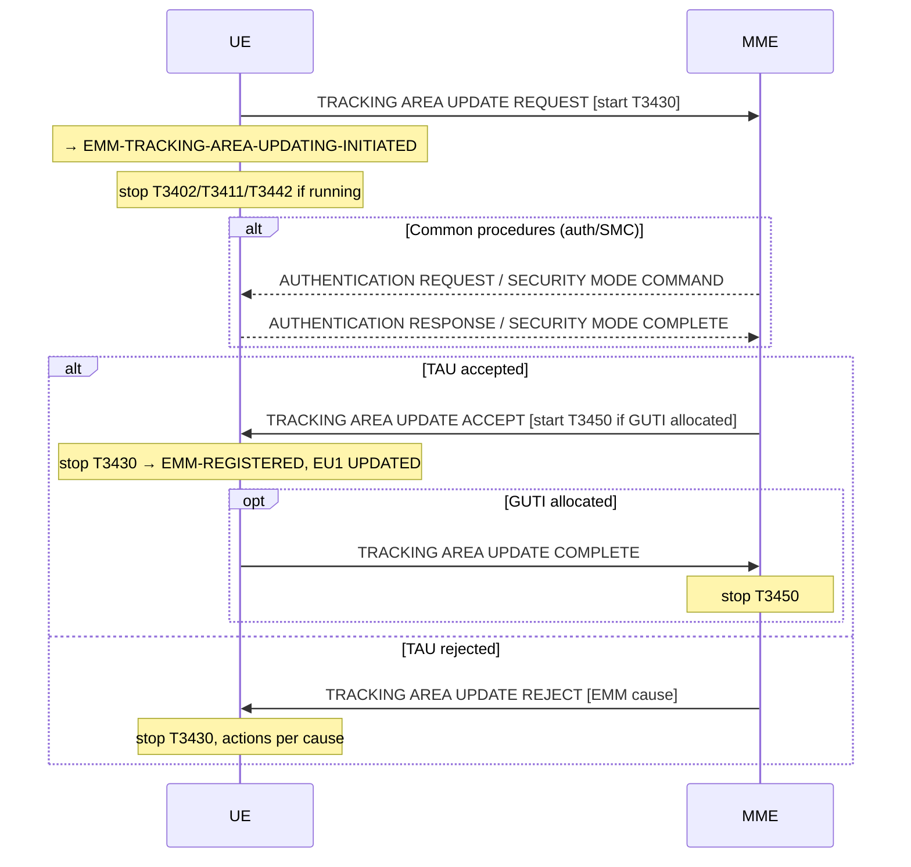

# NAS Tracking Area Update Procedure (Stage 3)

**Spec reference:** 3GPP TS 24.301 §5.5.3  
**Stage-2 counterpart:** [TAU procedure](TAU.md) (TS 23.401 §5.3.3)

---

## 1. Purpose (§5.5.3.1)

TAU is always UE-initiated and is used for:

| Purpose | EPS update type IE |
|---|---|
| Normal TA update (cell left stored TAI list) | "TA updating" |
| Periodic TAU (T3412 expiry) | "periodic updating" |
| Combined TA/LA update (CS/PS mode) | "combined TA/LA updating" |
| IMSI attach for non-EPS (already EPS-attached) | "combined TA/LA updating with IMSI attach" |
| Inter-system change (Iu/A-Gb → S1, N1 → S1, S101 → S1) | "TA updating" or "combined TA/LA updating with IMSI attach" |
| MME load balancing | "TA updating" |
| Capability/configuration change (DRX, PSM, eDRX, CIoT, UE network capability) | "TA updating" |
| Recovery from error / RRC connection failure | "TA updating" |
| CS fallback indication | "TA updating" (active flag = 1) |
| Bearer context status update | "TA updating" (with EPS bearer context status IE) |

The TAU attempt counter limits subsequent failed TAU attempts. Reset conditions mirror the attach attempt counter (new PLMN, T3402/T3346 expiry, successfully completed TAU or combined attach, rejected with cause #11/#12/#13/#14/#15/#25/#35).

---

## 2. TAU Initiation (§5.5.3.2.2)

The UE in EMM-REGISTERED initiates TAU by sending TRACKING AREA UPDATE REQUEST to the MME.

**Key triggers (selected from the 33-case list a–zg):**

| Case | Trigger |
|---|---|
| a | Current cell's TA not in stored TAI list (unless AttachWithIMSI configured) |
| b | T3412 (periodic TAU timer) expires |
| c | UE enters EMM-REGISTERED.NORMAL-SERVICE with TIN = "P-TMSI" |
| d | Inter-system change from S101 mode to S1 mode, no user data pending |
| e | Lower layers indicate "load balancing TAU required" |
| f | UE deactivated EPS bearers locally; returns to NORMAL-SERVICE with no pending NAS messages |
| g | UE network capability information or N1 UE capability changed |
| h | UE-specific DRX parameter changed (WB-S1 or NB-S1) |
| t | UE needs to request or stop use of PSM |
| u/v | UE needs to request/stop eDRX, or eDRX conditions changed |
| z | Inter-system change from N1→S1 in EMM-IDLE (single-registration mode) |
| zb | Inter-system change from N1→S1 in EMM-IDLE (single-registration mode) |
| zd | Inter-system change from N1→S1 in EMM-CONNECTED mode |

**UE actions on sending TAU REQUEST:**
- Start T3430
- Stop T3402 if running; stop T3411 if running; stop T3442 if running
- → EMM-TRACKING-AREA-UPDATING-INITIATED

**Security:** Integrity-protect TAU REQUEST with current EPS security context (unless inter-system from N1 mode where no EPS context available, or inter-system from A/Gb mode to S1). TAU REQUEST is **always unciphered**.

**Old GUTI IE:** 
- If UE supports neither A/Gb nor Iu mode: include valid GUTI (native) in Old GUTI IE
- If P-TMSI + RAI available and TIN = "P-TMSI": map P-TMSI+RAI → Old GUTI IE (type = "mapped GUTI")

**EPS bearer context status IE** — included for cases f, s, z, and when UE has locally deactivated dedicated bearers during inter-system mobility.

---

## 3. TAU Accepted (§5.5.3.2.4)

**MME actions:**
- Sends TRACKING AREA UPDATE ACCEPT
- If new GUTI allocated: include GUTI, start T3450, enter EMM-COMMON-PROCEDURE-INITIATED
- Includes: TAI list, EPS network feature support, optionally T3412 extended value, T3324 (PSM), T3448 (CP data backoff), extended DRX params, T3447 (Service Gap Control), EPS bearer context status IE (if MME deactivated any bearers locally), EPS update result IE (ISR indication)
- If EPS bearer context status IE included: MME deactivates locally those EPS bearers that are active in UE but marked as inactive in the network

**UE actions on TRACKING AREA UPDATE ACCEPT:**
- Stop T3430
- Reset service request attempt counter and TAU attempt counter
- → EMM-REGISTERED, EU1 UPDATED
- If GUTI received: store GUTI; delete old GUTI → send TRACKING AREA UPDATE COMPLETE
- If bearer context status IE included: deactivate indicated locally inactive bearers locally
- If T3412 extended value received: use it as periodic TAU timer (else use T3412 value IE)
- If T3324 received: use included value for PSM active timer
- If no GUTI in message: treat old GUTI as valid

**MME on TRACKING AREA UPDATE COMPLETE:** Stop T3450, → EMM-REGISTERED; consider GUTI (and Negotiated IMSI offset if present) as valid.

**ISR activation:** Network may indicate ISR active in EPS update result IE if:
- EPS update type = "periodic updating" AND UE was previously successfully attached for EPS + non-EPS services
- Network sets: "combined TA/LA updated" or "combined TA/LA updated and ISR activated"

---

## 4. TAU Rejected (§5.5.3.2.5)

On TRACKING AREA UPDATE REJECT: if IP-protected or cause ≠ #25, stop T3430. Cause #25 without IP → discard message.

| EMM Cause | UE Action |
|---|---|
| #3 Illegal UE / #6 Illegal ME | EU3, delete GUTI/TAI/eKSI → EMM-DEREGISTERED.NO-IMSI |
| #7 EPS services not allowed | EU3 → EMM-DEREGISTERED |
| #8 EPS+non-EPS not allowed | EU3 → EMM-DEREGISTERED.NO-IMSI |
| #9 UE identity cannot be derived | EU2 NOT UPDATED, delete GUTI/TAI → EMM-DEREGISTERED.NORMAL-SERVICE; automatically initiate attach |
| #10 Implicitly detached | → EMM-DEREGISTERED.NORMAL-SERVICE, delete mapped EPS context, perform new attach |
| #11 PLMN not allowed / #35 Service not authorized | EU3, add to forbidden PLMN list, reset counter → EMM-DEREGISTERED.PLMN-SEARCH |
| #12 Tracking area not allowed | EU3, add TA to "forbidden for regional provision" → EMM-DEREGISTERED.LIMITED-SERVICE |
| #13 Roaming not allowed in TA | EU3, add TA to "forbidden TAs for roaming" → EMM-REGISTERED.PLMN-SEARCH |
| #14 EPS services not allowed in PLMN | EU3, add to "forbidden PLMNs for GPRS service" → EMM-DEREGISTERED.PLMN-SEARCH |
| #15 No suitable cells in TA | EU3, add TA to "forbidden TAs for roaming" → EMM-REGISTERED.LIMITED-SERVICE |
| #22 Congestion | EU2, start T3346 (IP: timer value; else random) → EMM-REGISTERED.ATTEMPTING-TO-UPDATE; T3346 expiry → retry TAU |
| #25 Not authorized for CSG | EU3, remove CSG from Allowed list → EMM-REGISTERED.LIMITED-SERVICE |
| #31 Redirection to 5GCN | EU3, enable N1 mode, disable E-UTRA → EMM-REGISTERED.LIMITED-SERVICE |
| #40 No EPS bearer context activated | Deactivate all bearers → EMM-DEREGISTERED.NORMAL-SERVICE; perform new attach |
| #42 Severe network failure | EU2 NOT UPDATED, delete GUTI/TAI/eKSI, counter → 5, start 2×T timer → EMM-DEREGISTERED.PLMN-SEARCH |
| #78 PLMN not allowed at UE location | EU3 → EMM-DEREGISTERED.PLMN-SEARCH |

---

## 5. Abnormal Cases in the UE (§5.5.3.2.6)

| Case | UE Action |
|---|---|
| (a) Access barred | Do not start TAU; wait for access |
| (b) Lower layer failure / NAS connection release | Abort TAU; see counter rules |
| (c) T3430 timeout | Abort TAU, release NAS connection locally |
| (d) TAU REJECT with other causes | Counter < 5: start T3411 → ATTEMPTING-TO-UPDATE; Counter = 5: T3402 → optionally PLMN-SEARCH |
| (e) Cell changes to new TA | Abort, re-initiate immediately; EU2 NOT UPDATED |
| (f) TAU and detach collision | Detach "re-attach required" or "not required": abort TAU, progress detach; IMSI detach: ignore DETACH REQUEST, continue TAU |
| (g) TAU and GUTI reallocation collision | Ignore GUTI REALLOCATION COMMAND, continue TAU |
| (h) TX failure of TAU REQUEST | Abort, re-initiate immediately; EU2 NOT UPDATED |
| (i) TX failure of TAU COMPLETE (TAI changed) | Abort, re-initiate; EU2 NOT UPDATED |
| (k) "Extended wait time" | Start T3346 → EMM-REGISTERED.ATTEMPTING-TO-UPDATE |
| (l) T3346 running | Cannot start TAU unless: EMM-CONNECTED, received paging, AC11–15, emergency PDN, CS fallback emergency, exception data, low-priority exemptions |

**Counter = 5 rule:** Start T3402, delete list of equivalent PLMNs → EMM-REGISTERED.ATTEMPTING-TO-UPDATE (optionally PLMN-SEARCH); attempt GERAN/UTRAN/NG-RAN; may disable E-UTRA capability.

---

## 6. Combined Tracking Area Updating Procedure (§5.5.3.3)

Used by CS/PS mode UEs to update both EPS and CS domain registration.

**Initiation triggers (§5.5.3.3.2)** — key cases:
- UE attached for EPS + non-EPS, moves to TA not registered in MME
- UE wants to attach for non-EPS services while already EPS-attached
- Inter-system from A/Gb or Iu mode to S1 mode
- TIN = "P-TMSI" and enters NORMAL-SERVICE

**TAU REQUEST:** EPS update type = "combined TA/LA updating" or "combined TA/LA updating with IMSI attach"  
Include: TMSI status IE (if no valid TMSI), Old location area identification IE (if stored LAI available), TMSI-based NRI container (if valid TMSI).

**Combined TAU accepted (§5.5.3.3.4):**
- EPS update result: "combined TA/LA updated" (both) or "TA updated" (EPS only, non-EPS failed)
- TMSI + LAI included when non-EPS location update successful
- T3450 supervision for TMSI reallocation; MME → EMM-COMMON-PROCEDURE-INITIATED
- UE: store TMSI + LAI; reset location update attempt counter; EU1 UPDATED; send TRACKING AREA UPDATE COMPLETE (if TMSI/GUTI received)

**Combined TAU rejected (§5.5.3.3.5):** Same cause handling as §5.5.3.2.5 with combined GMM parameter cleanup.

---

## 7. Timers

| Timer | Started by | Stopped by | Purpose |
|---|---|---|---|
| T3412 | MME (value sent in ATTACH ACCEPT / TAU ACCEPT) | EMM-CONNECTED entry; TAU procedure start | Periodic TAU interval |
| T3430 | UE, on TAU REQUEST | TAU ACCEPT / TAU REJECT / T3430 timeout | Supervise TAU at UE |
| T3450 | MME, on TAU ACCEPT (if GUTI allocated) | TAU COMPLETE | Supervise GUTI delivery |
| T3402 | UE, when attempt counter = 5 | Re-initiation of TAU | Backoff after max TAU failures |
| T3411 | UE, when attempt counter < 5 | Retry TAU | Short retry interval |
| T3346 | UE, on congestion rejection | Expiry or restart | MM congestion backoff |

---

## Related Pages

- [TAU procedure (stage-2)](TAU.md) — TS 23.401 §5.3.3 signalling flow  
- [NAS Attach](NAS-attach.md) — Stage-3 EPS attach
- [NAS Detach](NAS-detach.md) — Stage-3 detach (triggered after implicit detach cause)
- [NAS EMM Protocol](../protocols/NAS-EMM-protocol.md) — EMM state machine, NAS security, substates
- [EMM/ECM States](../concepts/EMM-ECM-states.md)
- [MME](../entities/MME.md)
