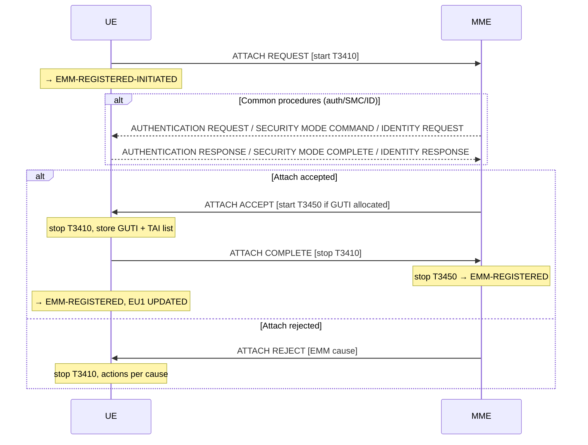

# NAS Attach Procedure (Stage 3)

**Spec reference:** 3GPP TS 24.301 §5.5.1  
**Stage-2 counterpart:** [EPS Attach](EPS-attach.md) (TS 23.401 §5.3.2)

---

## 1. Purpose (§5.5.1.1)

The attach procedure is used by a UE to:

| Use case | Attach type IE |
|---|---|
| EPS services only (PS mode) | "EPS attach" |
| EPS + non-EPS services (CS/PS mode 1 or 2) | "combined EPS/IMSI attach" |
| NB-S1 SMS-only | "EPS attach" (SMS only in Additional update type) |
| Emergency bearer services | "EPS emergency attach" |
| Access to RLOS | "EPS RLOS attach" |

With a successful attach a default EPS bearer context is established between UE and PGW (unless EMM-REGISTERED without PDN connection is supported and negotiated). In NB-S1 mode the network shall not initiate dedicated bearer activation as part of the attach procedure.

---

## 2. Attach Attempt Counter

- **Incremented:** Each time attach fails abnormally (§5.5.1.2.6) and after specific ATTACH REJECT causes
- **Reset conditions:** UE powered on; USIM inserted; attach/combined-attach completed successfully; GPRS attach success; combined attach success for EPS only with cause #2/#16/#17/#18/#22; reject with cause #11/#12/#13/#14/#15/#25/#35; network-initiated detach with those same causes; new PLMN selected; additionally when in ATTEMPTING-TO-ATTACH: new TA entered, T3402 expires, or T3346 starts

---

## 3. Attach Initiation (§5.5.1.2.2)

**UE actions on initiating:**
- State: EMM-DEREGISTERED → send ATTACH REQUEST → start T3410 → EMM-REGISTERED-INITIATED
- Stop T3402 and T3411 if running

**Identity selection in ATTACH REQUEST:**

| Condition | Identity |
|---|---|
| Configured for AttachWithIMSI, or NB-S1 mode | IMSI |
| Valid native GUTI available | GUTI (native) |
| No GUTI but valid P-TMSI + RAI | Mapped GUTI (from P-TMSI+RAI); Old GUTI IE type = "mapped GUTI" |
| Inter-system from N1 mode, 5GMM-REGISTERED with GUTI | 5G-GUTI mapped to EPS GUTI; UE status IE = 5GMM-REGISTERED |
| Emergency, no GUTI/P-TMSI/IMSI | IMEI |
| Otherwise | IMSI |

**ESM container:**
- Normal: PDN CONNECTIVITY REQUEST (if PDN connection needed) or ESM DUMMY MESSAGE (if EMM-REG without PDN supported and not needed)
- Emergency: PDN CONNECTIVITY REQUEST with request type = "emergency"

**NAS security:** ATTACH REQUEST is always **unciphered** (§4.4). If a prior EPS security context exists, UE integrity-protects the ATTACH REQUEST combined with the ESM container. Without a security context, the message is not integrity-protected.

**Key capability bits in UE network capability IE:**  
eDRX, PSM (T3324 value), CP/UP CIoT optimization, SRVCC, ProSe, V2X, NR dual connectivity, service gap control, WUS assistance, multi-bearer signalling (15 EPS bearer contexts), paging indication for voice, reject paging request, paging restriction, paging timing collision control.

---

## 4. EMM Common Procedures During Attach (§5.5.1.2.3)

The network may initiate EMM common procedures based on information in ATTACH REQUEST:
- **Identification** (§5.4.4): if GUTI cannot be resolved or IMEI needed
- **Authentication** (§5.4.2): if no valid EPS security context or GUTI from another MME
- **Security mode control** (§5.4.3): after authentication to establish new EPS security context

For emergency attach: MME may skip authentication and go directly to SMC.

---

## 5. Attach Accepted (§5.5.1.2.4)

**MME actions:**
- Sends ATTACH ACCEPT
- If new GUTI allocated: includes GUTI in message, starts T3450, enters EMM-COMMON-PROCEDURE-INITIATED (GUTI reallocation)
- Includes: TAI list, EPS network feature support (IMS voice PS session indicator, emergency bearer services indicator, CIoT optimization support), T3412 value, T3324 (PSM if requested), T3448 (CP data backoff if applicable), extended DRX params (if requested + accepted), T3447 (Service Gap Control if applicable)

**UE actions on ATTACH ACCEPT:**
- Stop T3410
- Store received GUTI (delete old GUTI); if no GUTI in ACCEPT, keep old one
- Store TAI list
- Forward ACTIVATE DEFAULT EPS BEARER CONTEXT REQUEST (from ESM container) to ESM sublayer
- After ESM sublayer confirms default bearer context activated: send ATTACH COMPLETE (with ACTIVATE DEFAULT EPS BEARER CONTEXT ACCEPT in ESM container)
- → EMM-REGISTERED, EU1 UPDATED, reset attach attempt counter

**MME actions on ATTACH COMPLETE:**
- Stop T3450, → EMM-REGISTERED, consider new GUTI valid

**IMS indicator:** If ATTACH ACCEPT contains EPS network feature support IE with IMS voice over PS session indicator, the UE shall pass this to upper layers for access domain selection.

---

## 6. Attach Rejected (§5.5.1.2.5)

UE must first check if ATTACH REJECT is integrity-protected. If cause ≠ #25, stop T3410.

| EMM Cause | UE Action |
|---|---|
| #3 Illegal UE / #6 Illegal ME | EU3, delete GUTI/TAI/eKSI, USIM invalid → EMM-DEREGISTERED.NO-IMSI |
| #7 EPS services not allowed | EU3 → EMM-DEREGISTERED |
| #8 EPS+non-EPS services not allowed | EU3, USIM invalid → EMM-DEREGISTERED.NO-IMSI |
| #11 PLMN not allowed / #35 Service not authorized | EU3, add PLMN to forbidden list, reset counter → EMM-DEREGISTERED.PLMN-SEARCH |
| #12 Tracking area not allowed | EU3, add TA to "forbidden for regional provision" → EMM-DEREGISTERED.LIMITED-SERVICE |
| #13 Roaming not allowed in this TA | EU3, add TA to "forbidden TAs for roaming" → LIMITED-SERVICE or PLMN-SEARCH |
| #14 EPS services not allowed in this PLMN | EU3, add to "forbidden PLMNs for GPRS service" → EMM-DEREGISTERED.PLMN-SEARCH |
| #15 No suitable cells in tracking area | EU3, add TA to "forbidden TAs for roaming" → LIMITED-SERVICE |
| #19 ESM failure | Re-try ATTACH REQUEST with different APN (if ESM cause ≠ #54) |
| #22 Congestion | EU2 NOT UPDATED, start T3346 (IP-protected: timer value; else random) → DEREGISTERED.ATTEMPTING-TO-ATTACH |
| #25 Not authorized for this CSG | EU3, remove CSG from Allowed CSG list → LIMITED-SERVICE |
| #31 Redirection to 5GCN required | EU3, enable N1 mode (if was disabled) → EMM-DEREGISTERED.NO-CELL-AVAILABLE |
| #42 Severe network failure | EU2 NOT UPDATED, delete GUTI/TAI/eKSI, counter → 5 → start implementation timer (2×T) → EMM-DEREGISTERED.PLMN-SEARCH |
| #78 PLMN not allowed at present UE location | EU3 → EMM-DEREGISTERED.PLMN-SEARCH |

---

## 7. Abnormal Cases in the UE (§5.5.1.2.6)

| Case | UE Action |
|---|---|
| (a) Access barred (EAB/ACB/NAS connection rejected) | Do not start attach; wait for access grant |
| (b) Lower layer failure / NAS connection release | Abort attach, see counter rules |
| (c) T3410 timeout | Abort attach, release NAS connection locally |
| (d) ATTACH REJECT with other EMM cause values | Counter < 5: start T3411 → ATTEMPTING-TO-ATTACH (retry when T3411 expires); Counter = 5: delete GUTI/TAI/KSI, EU2 NOT UPDATED, start T3402 → optionally PLMN-SEARCH |
| (e) Cell changes to new TA during attach | Abort, re-initiate immediately |
| (f) MO detach required | Abort, initiate detach |
| (g) DETACH REQUEST collision | Depends on detach type in DETACH REQUEST |
| (h) TX failure of ATTACH REQUEST | Restart immediately |
| (i) TX failure of ATTACH COMPLETE (TAI not in TAI list) | Restart attach |
| (l) "Extended wait time" from lower layers | Start T3346, reset counter → DEREGISTERED.ATTEMPTING-TO-ATTACH |
| (m) T3346 running | Cannot start attach (exceptions: AC11–15, emergency, exception data, no-low-priority message) |
| (o) T3447 running | Cannot start attach (exceptions: AC11–15, emergency, no-PDN-request) |

**Counter = 5 rule (shared for cases b, c, d, la, m):**
- Delete GUTI, TAI list, eKSI, list of equivalent PLMNs, set EU2 NOT UPDATED
- Start T3402 → EMM-DEREGISTERED.ATTEMPTING-TO-ATTACH (optionally PLMN-SEARCH)
- Attempt to select GERAN/UTRAN/NG-RAN; may disable E-UTRA capability (§4.5)

---

## 8. Combined Attach (§5.5.1.3)

Used by UEs in CS/PS mode 1 or CS/PS mode 2 to register for both EPS and non-EPS services.

**Initiation (§5.5.1.3.2):**
- UE sends ATTACH REQUEST with EPS attach type = "combined EPS/IMSI attach"
- Include TMSI status IE if no valid TMSI; optionally include Old location area identification IE + TMSI-based NRI

**Accepted (§5.5.1.3.4):**
- EPS update result IE in ATTACH ACCEPT indicates:
  - "combined EPS/IMSI attach": both EPS and non-EPS registration successful
  - "EPS only": EPS registration successful, non-EPS failed
- If TMSI allocated: include TMSI + LAI in ATTACH ACCEPT; T3450 supervision for TMSI reallocation; MME → EMM-COMMON-PROCEDURE-INITIATED
- UE: store TMSI + LAI (delete old TMSI if new one received); set MM state MM-IDLE, EU1 UPDATED; send ATTACH COMPLETE with ACTIVATE DEFAULT EPS BEARER CONTEXT ACCEPT
- If result = "SMS only" or "CS Fallback not preferred": UE may attempt GERAN/UTRAN selection or set TIN appropriately

**Rejected (§5.5.1.3.5):** Same cause handling as §5.5.1.2.5 with combined GMM parameter cleanup.

---

## 9. Timers

| Timer | Started by | Stopped by | Purpose |
|---|---|---|---|
| T3410 | UE, on ATTACH REQUEST | ATTACH ACCEPT / ATTACH REJECT | Supervise attach at UE |
| T3450 | MME, on ATTACH ACCEPT (if GUTI allocated) | ATTACH COMPLETE | Supervise GUTI delivery |
| T3402 | UE, when counter = 5 | Re-initiation of attach | Backoff after max attach failures |
| T3411 | UE, when counter < 5 | Retry attach | Short retry interval |
| T3346 | UE, on congestion rejection or extended wait time | Expiry / restart | MM congestion backoff |

---

## Related Pages

- [EPS Attach (stage-2)](EPS-attach.md) — 26-step TS 23.401 procedure flow
- [NAS EMM Protocol](../protocols/NAS-EMM-protocol.md) — EMM state machine, NAS security, UE modes
- [NAS Detach](NAS-detach.md) — Stage-3 detach procedure
- [NAS TAU](NAS-TAU.md) — Stage-3 TAU procedure
- [EMM/ECM States](../concepts/EMM-ECM-states.md) — State overview
- [MME](../entities/MME.md) — NAS peer at the network side
