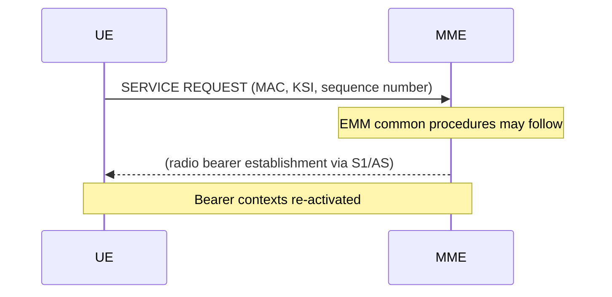

# NAS Service Request Procedure (Stage 3)

Stage-3 specification of the EMM connection management procedures for S1 mode: Service Request, Paging, NAS message transport, and Generic NAS transport. Source: 3GPP TS 24.301 v17.6.0 §5.6.

See also: [procedures/service-request.md](service-request.md) (stage-2 architecture) | [protocols/NAS-EMM-protocol.md](../protocols/NAS-EMM-protocol.md)

---

## 5.6.1 Service Request Procedure

### §5.6.1.1 Trigger conditions (17 cases a–q)

The UE initiates Service Request in the following situations:

| Case | Trigger |
|------|---------|
| a | UE has signalling to send |
| b | UE has uplink user data to send |
| c | UE received paging for CS fallback (CSFB) |
| d | GPRS attach or RA update while EMM-REGISTERED/IDLE |
| e | Non-3GPP access handover completed |
| f | UE needs to re-establish radio bearers for downlink data (from paging) |
| g | UE received paging with IMSI → implicit detach occurred → need re-attach |
| h | UE received paging and needs to re-establish bearers (general) |
| i | UE has emergency signalling/data to send |
| j | UE has control plane user data (CIoT UP optimisation not supported) |
| k | NB-S1: UE has DRBs to re-establish |
| l | NB-S1: upper layers request connectivity |
| m | UE received paging → needs to re-establish radio bearers (CSFB/CSNA) |
| n | UE has uplink Small Data Transmission (CIoT) |
| o | UE in MUSIM mode needs to service another USIM |
| p | UE configured for RLOS (Restricted Local Operator Services) |
| q | UE acting as ProSe UE-to-network relay |

### §5.6.1.2 Initiation by the UE

For **WB-S1** mode the UE sends a **SERVICE REQUEST** message and starts timer **T3417** (default 5 s). The SERVICE REQUEST carries a short MAC computed from the NAS COUNT to provide integrity protection without full NAS security context activation.

For **NB-S1** (CIoT) mode the UE sends a **CONTROL PLANE SERVICE REQUEST** message. This message may piggyback a PDN CONNECTIVITY REQUEST (for new PDN) or ESM DATA TRANSPORT (for uplink data). Timer **T3417ext** is used (default 1.5 s; configured via NAS over-the-air or per TS 24.368).

For **CSFB** or **CSNA**, the UE sends an **EXTENDED SERVICE REQUEST** with service type:
- `MO CS fallback or 1xCS fallback`
- `MT CS fallback or 1xCS fallback`
- `MO CSFB via emergency call`
- `Packet services via S1`

### §5.6.1.3 EMM common procedures

After receiving a valid SERVICE REQUEST, the MME may initiate:
- Authentication (EPS AKA) if KASME is not valid/available
- Security Mode Control (SMC) to establish new NAS security context
- Identification if UE identity not known

### §5.6.1.4 Service Request accepted

When accepted:
- MME initiates S1-AP context setup to (re-)establish radio bearers
- **Partial bearer establishment**: if E-UTRAN does not establish user plane radio bearers for all EPS bearer contexts (e.g. due to radio access control), the UE/MME locally deactivate bearer contexts for which no radio bearers are set up
- EPS bearer context status synchronisation: misalignments detected later are corrected via the EPS bearer context status IE in a TRACKING AREA UPDATE REQUEST
- For **NB-S1**: if S1-AP context setup fails, the MME shall not resend the ESM message from the piggybacked PDN connectivity procedure

### §5.6.1.5 Service Request not accepted

The MME rejects with SERVICE REJECT. Per-cause UE actions:

| EMM Cause | UE Action |
|-----------|-----------|
| #3 (illegal UE) | Delete all bearers, USIM invalid, enter EMM-DEREGISTERED; no retry |
| #6 (illegal ME) | As #3 |
| #7 (EPS services not allowed) | Enter EMM-DEREGISTERED.EPS-NOT-ALLOWED; no retry for EPS |
| #8 (EPS & non-EPS not allowed) | Enter EMM-DEREGISTERED; no retry for EPS or CS |
| #9 (UE identity not derived) | Delete GUTI and re-attach |
| #10 (implicitly detached) | Delete GUTI, re-attach |
| #11 (PLMN not allowed) | Add PLMN to forbidden PLMN list; USIM invalid for EPS |
| #12 (TA not allowed) | Add TA to forbidden TA list (roaming); select new cell |
| #13 (roaming not allowed in TA) | Add TA to forbidden list (regional provision) |
| #15 (no suitable cells) | Add TA to forbidden list; select new cell outside TA |
| #18 (CS domain not available) | No further CS fallback in PLMN for 12 min (T3440) |
| #22 (congestion, T3346 included) | Start T3346; no retry until T3346 expires |
| #25 (not authorised in CSG) | No further service request for this CSG |
| #31 (unspecified) | No further retry in this PLMN; perform new cell selection |
| #39 (RLOS not allowed) | No further RLOS attempt; clear RLOS configuration |
| #40 (no EPS bearer established) | Initiate attach procedure |

### §5.6.1.5A Emergency service request not accepted

If an emergency service request (service type = "MO CS fallback via emergency call") is rejected:
- **Cause #7**: UE may attempt CS emergency call (CSFB) or EPS emergency bearer services
- **Cause #11**: UE shall attempt local CS emergency call or EPS emergency bearer services

### §5.6.1.5B RLOS service request not accepted

- **Cause #39**: UE shall not attempt another RLOS service request in this PLMN and clear RLOS indication
- **Cause #78** (RLOS not available): return to "RLOS initial state" (re-attempt after re-registration)

### §5.6.1.6 Abnormal cases in the UE

| Case | Action |
|------|--------|
| T3417/T3417ext expiry | Resend SERVICE REQUEST; reset and restart timer. After 5th expiry: abort, release resources |
| Lower layer failure | Abort service request; upper layers informed |
| CS call released before service request completes | Local abort of extended service request |

### §5.6.1.7 Abnormal cases on the network side

| Case | MME Action |
|------|-----------|
| Multiple SERVICE REQUEST messages from same UE | Process latest, discard earlier |
| Collision with TAU REQUEST | Abort service request; process TAU |
| S1 connection fails during response | Abort; UE will re-initiate |

---

## 5.6.2 Paging Procedure

The MME sends a **PAGING** message to the eNodeB(s) in all TAs of the UE's TA list. The eNodeB pages in cells within the UE's paging occasion.

The UE responds:
- **User data paging** → UE sends SERVICE REQUEST
- **CS fallback paging** → UE sends EXTENDED SERVICE REQUEST with service type = "MT CSFB"
- **Emergency paging** (ETWS/CMAS) → no NAS response required; UE processes warning notification

Key parameters in the PAGING message:
- UE Identity (S-TMSI or IMSI)
- CN Domain (PS or CS)
- Paging DRX
- TAI list
- ETWS indication / Emergency Area ID list (for warning area)

---

## 5.6.3 Transport of NAS Messages Procedure

Used to transfer NAS messages (e.g. SMS, LCS, CSNA) directly between UE and core network nodes via the MME, without triggering a specific EMM procedure.

| Message | Direction | Purpose |
|---------|-----------|---------|
| DOWNLINK NAS TRANSPORT | MME → UE | Delivers NAS message from CN to UE |
| UPLINK NAS TRANSPORT | UE → MME | Delivers NAS message from UE to CN |

**Message container types:**
- SMS — transferred to SGSN/MSC-Server via Sv/SGs
- Location Services (LCS) — transferred to GMLC
- SS (Supplementary Services) — CS-NAS via SGs
- Generic NAS (used when no better container type applies)

The NAS message is encapsulated in the NAS Message Container IE. The procedure does not require NAS security by itself — the outer EMM layer provides integrity/ciphering.

---

## 5.6.4 Generic Transport of NAS Messages Procedure

Extends the basic transport for structured container types that are not SMS/LCS/CSNA:

| Message | Direction |
|---------|-----------|
| DOWNLINK GENERIC NAS TRANSPORT | MME → UE |
| UPLINK GENERIC NAS TRANSPORT | UE → MME |

The **Generic message container type IE** identifies the content. The **Additional information IE** may carry supplementary parameters. Used e.g. for LPP positioning protocol messages delivered via NAS.

---

## 5.6.7 Reception of EMM STATUS

Upon receiving an **EMM STATUS** message (either side), the receiving entity performs local error handling. The EMM cause value in the message indicates the semantic/syntactical error detected by the sender. The response is implementation-specific (the procedure that caused the STATUS is typically aborted).

---

## Timer Summary (§5.6)

| Timer | Value | Usage |
|-------|-------|-------|
| T3417 | 5 s | WB-S1 service request supervision |
| T3417ext | 1.5 s (default) | NB-S1 control plane service request supervision |
| T3440 | 12 s | CS fallback not allowed (after cause #18 reject) |
