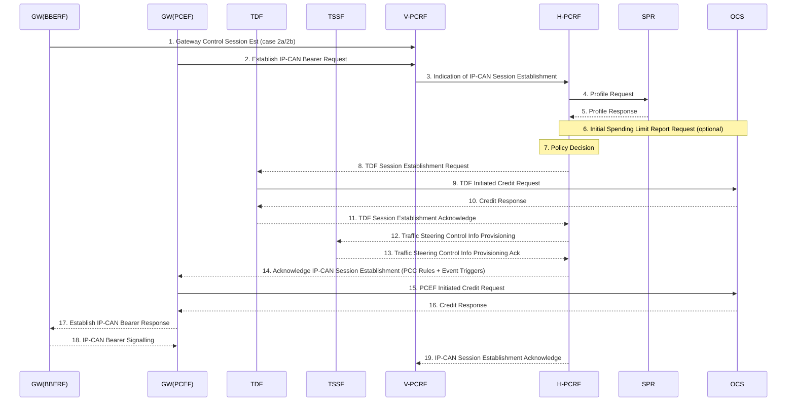
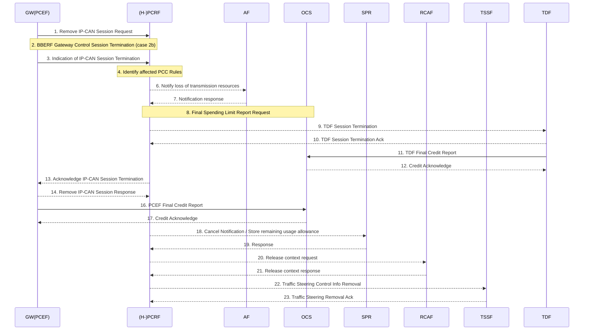
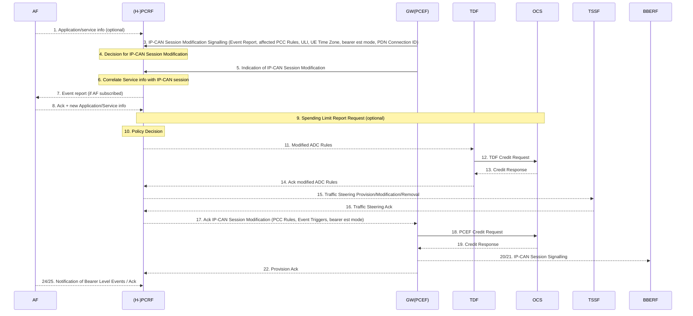
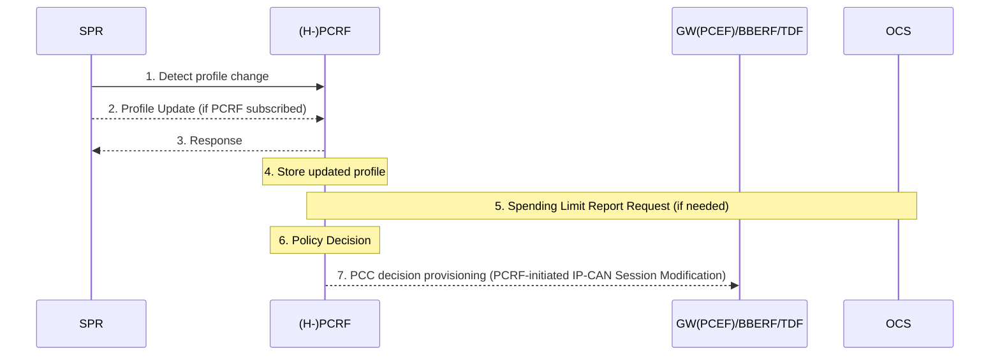
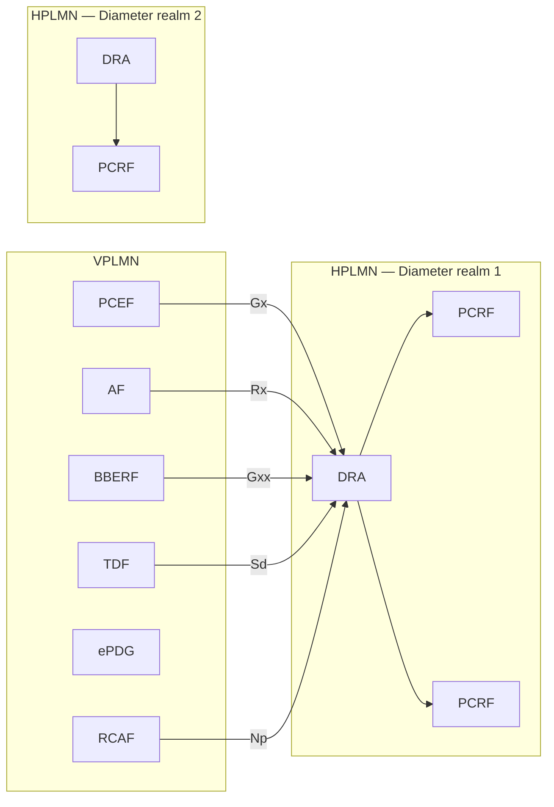
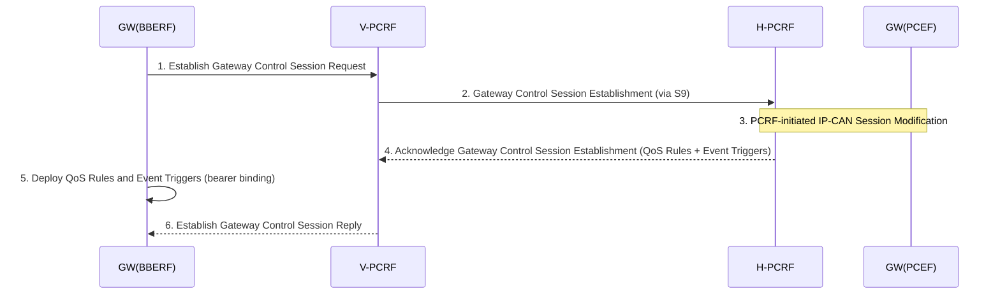
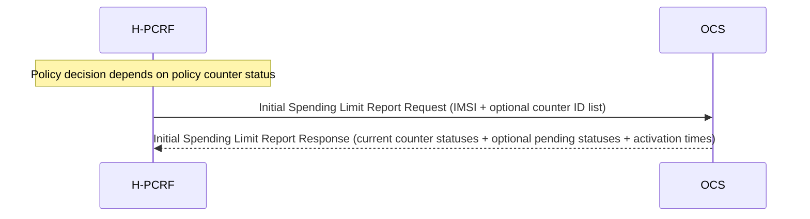
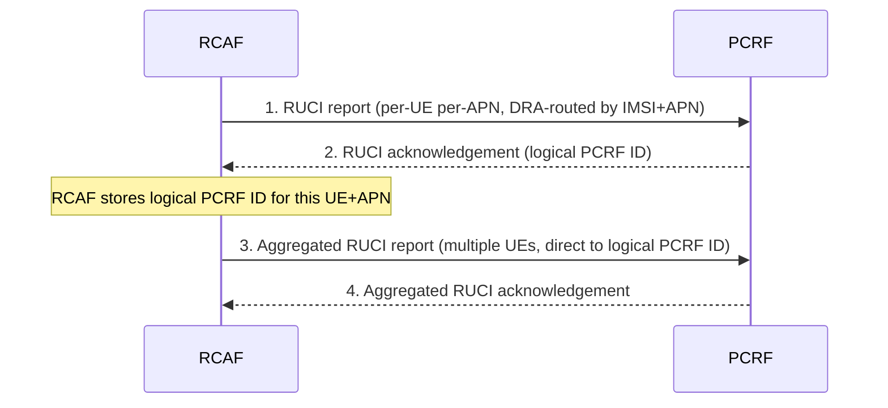

# PCC Session Procedures

Defined in 3GPP TS 23.203 §7. Covers IP-CAN session lifecycle, PCRF discovery, Gateway Control session (BBERF-PCRF), Spending Limit reporting (Sy), RAN congestion reporting (Np), background data transfer negotiation (Nt), and PFD management (Gw/Gwn).

---

## Background: IP-CAN Session Network Scenarios (§7.1)

Three cases determine whether a Gateway Control Session (Gxx) is required:

| Case | Condition | Gateway Control Session? |
|---|---|---|
| **Case 1** | GTP-based S5/S8 (3GPP access) or non-3GPP with GTP-based S2a/S2b | No — no BBERF; PCEF only |
| **Case 2a** | A Gateway Control Session exists; UE uses a CoA (S2c/DSMIPv6 scenario) | Yes — single Gxx session serves all IP-CAN sessions from that CoA |
| **Case 2b** | A Gateway Control Session exists; BBERF provides APN info | Yes — one Gxx session per IP-CAN session |

The PCRF determines which case applies based on whether a matching Gateway Control Session exists at the time Gx is established.

---

## 1. IP-CAN Session Establishment (§7.2)



**Key steps:**
1. BBERF establishes Gateway Control Session (case 2a/2b only); PCEF sends IP-CAN Bearer Establishment Request
2. PCEF includes: UE Identity (IMSI/MSISDN), IMEI(SV), UE IPv4/IPv6 address, IP-CAN type, RAT type, PDN Connection ID, APN, default bearer QoS, APN-AMBR, bearer establishment modes supported, charging characteristics
3. PCRF queries SPR for subscription profile
4. PCRF optionally sends Initial Spending Limit Report Request to OCS (if policy counter status is needed)
5. PCRF makes policy decision: generates PCC rules, event triggers, APN-AMBR
6. If TDF deployed (Sd applies): PCRF establishes TDF session, provisions ADC rules
7. If traffic steering over St applies: PCRF provisions traffic steering info to TSSF
8. PCRF sends PCC rules + event triggers + IP-CAN bearer establishment mode to PCEF
9. PCEF activates online charging session with OCS (if applicable)
10. If ≥1 PCC rule activated and credit not denied: PCEF acknowledges IP-CAN session
11. PCEF may initiate additional IP-CAN bearer establishment (Annex A/D details)

**Roaming note:** In home-routed roaming with a Gateway Control Session, the V-PCRF proxies Gateway Control Session establishment between BBERF (VPLMN) and H-PCRF over S9.

---

## 2. IP-CAN Session Termination (§7.3)

### 2.1 UE-Initiated (§7.3.1)



**Key actions at termination:**
- PCEF removes all PCC rules associated with the IP-CAN session
- PCRF notifies AF of loss of transmission resources (if AF subscribed to bearer events)
- PCRF sends Final Spending Limit Report Request to OCS (if this is the last IP-CAN session for this subscriber requiring counter status reporting)
- PCRF terminates TDF Sd session (if active)
- PCEF and TDF return remaining online charging credits to OCS
- PCRF stores remaining usage allowance in SPR (if all IP-CAN sessions to the same APN are terminated)
- PCRF sends Release context to RCAF (removes RUCI context for this UE+APN)
- PCRF removes traffic steering info from TSSF

### 2.2 GW (PCEF)-Initiated (§7.3.2)

Identical teardown sequence but initiated by the GW (PCEF) detecting the need to terminate (e.g. admin detach). Same 23-step cleanup with BBERF, TDF, OCS, SPR, RCAF, TSSF involvement.

---

## 3. IP-CAN Session Modification (§7.4)

### 3.1 GW (PCEF)-Initiated (§7.4.1)

Triggered by: bearer establishment/termination/modification event at PCEF, or start/stop of application traffic detection by ADC-enabled PCEF.



**Key notes:**
- PCEF includes updated IP-CAN bearer establishment mode if changed
- If flow mobility: PCEF includes updated IP flow mobility routing information and indication if default route changed
- IP-CAN bearer establishment accepted if ≥1 PCC rule active; online credit not denied
- IP-CAN bearer modification accepted only if PCRF accepts the traffic mapping information

### 3.2 PCRF-Initiated (§7.4.2)

Triggered by: new AF session (Rx AAR), TDF application detection report (unsolicited ADC), OCS Spending Limit Report, RCAF congestion report, or internal PCRF policy change.

Same participants; PCRF drives the procedure instead of PCEF.

---

## 4. Subscription Update at PCRF (§7.5)



PCRF applies updated subscription info via the PCRF-initiated IP-CAN session modification procedure (§7.4.2) to push new PCC decisions to PCEF and BBERF, and new ADC decisions to TDF.

---

## 5. PCRF Discovery and Selection (§7.6)

### 5.1 General Principles

- A single logical PCRF entity may consist of multiple separately addressable PCRFs
- PCRF must correlate sessions from all reference points (Gx, Rx, S9, Gxa/Gxc, Sd, Np) for the same IP-CAN session
- IP-CAN session uniquely identified in PCRF by: (UE ID, PDN ID)-tuple, or (UE IP address(es), PDN ID)-tuple
- APN-based PCRF deployment is supported (PCC enabled on per-APN basis)

### 5.2 Diameter Routing Agent (DRA) (§7.6.2)

When multiple PCRFs are deployed in a Diameter realm, a **DRA (Diameter Routing Agent)** ensures all Diameter sessions for a given IP-CAN session reach the same PCRF:



**DRA roles:**
- Selected at first interaction for a given GW and IP-CAN session; stores assigned PCRF address
- On subsequent interactions (Rx, Gxx, Sd, Np), DRA routes to the same PCRF using stored assignment
- DRA removes IP-CAN session info when session terminates
- In roaming: V-PCRF selected by VPLMN DRA; H-PCRF selected by HPLMN DRA
- DRA must be transparent to Diameter applications (Gx, Gxa/Gxc, Rx, S9, Sd, Np)
- Single logical DRA per Diameter realm assumed

---

## 6. Gateway Control Session Procedures (§7.7)

Gateway Control Sessions run over Gxx between the BBERF (SGW in PMIP mode) and the PCRF. They are used in case 2a and case 2b (see §7.1).

### 6.1 Establishment during Attach (§7.7.1.1)



BBERF sends: IP-CAN Type, UE Identity, PDN Identifier (if known), IP addresses, indication if leg linking shall be deferred (case 2b), PDN Connection Identifier, supported IP-CAN bearer establishment modes, Default Bearer QoS, APN-AMBR (case 2b).

### 6.2 Establishment during BBERF Relocation (§7.7.1.2)

12-step procedure: Target BBERF establishes new Gateway Control Session; PCRF provides QoS rules; source BBERF Gateway Control Session terminated; PCRF updates PCEF via IP-CAN session modification.

**BBF failure handling:** If primary BBERF fails to install a QoS rule, PCRF removes same QoS rule from non-primary BBERFs and removes corresponding PCC rule from PCEF. If non-primary BBERF fails, PCRF only updates its tracking record — no further action.

### 6.3 Gateway Control Session Termination

**GW (BBERF)-Initiated (§7.7.2.1):** BBERF sends Remove Gateway Control Session → PCRF acks → BBERF removes all QoS rules and event triggers.

**PCRF-Initiated (§7.7.2.2):** PCRF sends termination to BBERF → BBERF removes QoS rules → BBERF initiates IP-CAN bearer removal (if bearers still established) → BBERF acks.

### 6.4 Gateway Control and QoS Rules Request (§7.7.3)

Two cases:
- **Case A**: BBERF reports an event; PCRF may acknowledge immediately; PCRF may later trigger PCRF-initiated IP-CAN session modification with new PCC rules
- **Case B**: BBERF requests QoS rules (e.g. after IP-CAN bearer establishment); PCRF sends Gateway Control and QoS Rules Reply with QoS rules + event triggers; BBERF deploys rules and performs bearer binding

Non-primary BBERF requests: PCRF only returns QoS rules corresponding to **already activated** PCC rules. A non-primary BBERF request that results in a new QoS rule authorization is rejected by PCRF.

**Visited network event forwarding (§7.7.3.2):** When Gxx is locally terminated at V-PCRF, V-PCRF forwards event reports from BBERF to PCEF via a Gateway Control and QoS Rules Request → PCEF initiates IP-CAN session modification → H-PCRF is updated.

### 6.5 Gateway Control and QoS Rules Provision (§7.7.4)

PCRF-initiated update of QoS rules and event triggers at BBERF:
1. PCRF sends Gateway Control and QoS Rules Provision to BBERF (includes QoS rules, event triggers; in case 2a: mobility tunnelling encapsulation header may be included)
2. BBERF deploys QoS rules → bearer binding → may trigger IP-CAN bearer signalling
3. BBERF sends Provision Ack to PCRF (Result: success/failure per QoS rule)

---

## 7. MPS Priority Service Change (§7.8)

When PCRF receives notification of MPS EPS Priority, MPS Priority Level, or IMS Signalling Priority change from SPR:
1. PCRF makes policy decisions (ARP change and/or QCI change on relevant bearers)
2. PCRF initiates PCRF-initiated IP-CAN session modification procedure (§7.4.2) to apply changes

---

## 8. Spending Limit Procedures over Sy (§7.9)

### 8.1 Initial Spending Limit Report Request (§7.9.1)



- Sent when it is the **first time** policy counter status is needed for this subscriber and PDN connection
- If PCRF provides counter IDs: OCS returns status for those counters only
- If no counter IDs: OCS returns all counters available for this subscriber
- OCS stores H-PCRF's subscription to spending limit reports for the returned counters

### 8.2 Intermediate Spending Limit Report Request (§7.9.2)

Used to add, update, or remove policy counter subscriptions (e.g. subscription change mid-session):
- PCRF sends updated list of counter IDs → OCS adjusts subscriptions accordingly
- Response includes current + pending statuses per counter

### 8.3 Final Spending Limit Report Request (§7.9.3)

Sent when PCRF no longer needs spending limit reporting for a subscriber:
- Triggered at last IP-CAN session termination for this subscriber
- OCS removes H-PCRF's subscription and acknowledges

### 8.4 Spending Limit Report (§7.9.4)

OCS-initiated notification to PCRF:
1. OCS detects policy counter status change (threshold reached) or pre-schedules a pending status
2. OCS sends Spending Limit Report to H-PCRF with new counter status + optional pending statuses + activation times
3. H-PCRF uses counter status as input to policy decision (may trigger IP-CAN session modification)

### 8.5 Sy Session Termination (§7.9.5)

Optional procedure: OCS terminates the Sy session for a subscriber (e.g. subscriber removed from OCS system). PCRF removes the Sy session context; remaining Gx/Rx sessions are not affected unless PCRF policy decision causes their termination.

---

## 9. RAN Congestion Procedures over Np (§7.10)

### 9.1 RUCI Reporting (§7.10.1)



Two report types:
- **Non-aggregated**: per-UE per-APN; DRA routes to correct PCRF using IMSI + APN
- **Aggregated**: RCAF batches congestion info for multiple UEs into a single message; uses logical PCRF ID allocated by PCRF in the first acknowledgement; can contain different congestion levels per eNB ID / ECGI / SAI

PCRF stores RCAF identity for the given UE when RUCI indicates congestion.

### 9.2 PCRF Reporting Restrictions (§7.10.2)

PCRF may add, update, or remove reporting restrictions for a given UE+APN:
1. PCRF sends Modify UE context request to RCAF (with new reporting restrictions or removal)
2. RCAF updates restrictions and acknowledges
3. If restrictions change from disabled to enabled, RCAF may immediately send a RUCI report

### 9.3 UE Mobility Between RCAFs (§7.10.3)

When UE moves from RCAF1 to RCAF2 (both indicate congestion):
1. RCAF2 reports RUCI → PCRF stores identity of current RCAF2
2. PCRF sends Release context request to old RCAF1 (using previously stored identity)
3. RCAF1 releases its context for that UE+APN (including reporting restrictions)

---

## 10. Background Data Transfer over Nt (§7.11.1)

```mermaid
sequenceDiagram
    participant SCEF
    participant HPCRF as H-PCRF
    participant SPR

    SCEF->>HPCRF: 1. Background data transfer request (ASP ID, volume/UE, expected UE count, desired time window, optional network area)
    HPCRF->>SPR: 2. Request existing transfer policies
    SPR-->>HPCRF: 3. Report existing transfer policies
    Note over HPCRF: 4. Policy decision (derive transfer policy)
    HPCRF-->>SCEF: 5. Background data transfer response (transfer policies + Reference ID)
    SCEF-->>HPCRF: 6-7. Optional: AF selects policy; SCEF confirms selection
    HPCRF->>SPR: 8. Store new transfer policy (Reference ID + network area)
    SPR-->>HPCRF: 9. ACK
```

**Transfer policy** = recommended time window + charging rate reference + optional max aggregated bitrate. The max aggregated bitrate is not enforced in the network.

**Reference ID usage:** SCEF forwards Reference ID to the AF. When AF initiates the actual data session, it provides the Reference ID in the Rx AAR. The PCRF retrieves the negotiated transfer policy from SPR and applies it to the IP-CAN session.

---

## 11. PFD Management (§7.12)

Packet Flow Descriptions (PFDs) are application detection filters managed by the PFDF and distributed to PCEF/TDF for use with Application Identifier-based PCC/ADC rules.

### 11.1 PFD Pull Mode (§7.12.1)

PCEF/TDF-initiated retrieval:
1. Triggered when: a PCC/ADC rule with Application Identifier is activated and PFDs for that Application ID are not available; or caching timer for an Application ID elapses and an active PCC/ADC rule uses it
2. PCEF/TDF sends Fetch PFD Request (may include multiple Application IDs)
3. PFDF responds with all PFDs for each requested Application ID

### 11.2 PFD Push Mode (§7.12.2)

PFDF-initiated distribution:
1. PFDF provisions, updates, or removes PFDs for one or more Application IDs at PCEF/TDF via Gw/Gwn
2. PCEF/TDF binds (or unbinds) PFDs to the Application Identifier
3. Each PFD has a PFD ID for granular update/removal (when full set management is used, PFD IDs are not required)
4. PFDF may delay distribution using an Allowed Delay value (PFDF must distribute within that time interval)
5. PCEF/TDF acknowledges

---

## Procedure Summary

| Procedure | Section | Participants | Interface |
|---|---|---|---|
| IP-CAN Session Establishment | §7.2 | PCEF, PCRF, BBERF, TDF, TSSF, SPR, OCS | Gx, Gxx, Sd, St, Sp, Sy |
| IP-CAN Session Termination (UE) | §7.3.1 | PCEF, PCRF, TDF, AF, OCS, SPR, RCAF, TSSF | Gx, Rx, Sd, Sy, Np, St |
| IP-CAN Session Termination (PCEF) | §7.3.2 | Same | Same |
| IP-CAN Session Modification (PCEF) | §7.4.1 | PCEF, PCRF, TDF, TSSF, AF, OCS | Gx, Sd, St, Rx, Gy |
| IP-CAN Session Modification (PCRF) | §7.4.2 | Same | Same |
| Subscription Update | §7.5 | PCRF, SPR, PCEF/BBERF/TDF | Sp, Gx, Gxx, Sd |
| PCRF Discovery (DRA) | §7.6 | All PCC entities, DRA | Gx, Gxx, Rx, S9, Sd, Np |
| GW Control Session Establishment | §7.7.1 | BBERF, PCRF | Gxx (Gxc) |
| GW Control Session Termination | §7.7.2 | BBERF, PCRF | Gxx |
| GW Control and QoS Rules Request | §7.7.3 | BBERF, PCRF | Gxx |
| GW Control and QoS Rules Provision | §7.7.4 | BBERF, PCRF | Gxx |
| MPS Priority Change | §7.8 | PCRF, SPR, PCEF/BBERF | Sp, Gx, Gxx |
| Initial Spending Limit Report Request | §7.9.1 | H-PCRF, OCS | Sy |
| Intermediate Spending Limit Report Request | §7.9.2 | H-PCRF, OCS | Sy |
| Final Spending Limit Report Request | §7.9.3 | H-PCRF, OCS | Sy |
| Spending Limit Report | §7.9.4 | OCS, H-PCRF | Sy |
| Sy Session Termination | §7.9.5 | OCS, H-PCRF | Sy |
| RUCI Reporting | §7.10.1 | RCAF, PCRF | Np |
| PCRF Reporting Restrictions | §7.10.2 | PCRF, RCAF | Np |
| UE Mobility between RCAFs | §7.10.3 | PCRF, RCAF1, RCAF2 | Np |
| Background Data Transfer Negotiation | §7.11.1 | SCEF, H-PCRF, SPR | Nt, Sp |
| PFD Pull | §7.12.1 | PCEF/TDF, PFDF | Gw/Gwn |
| PFD Push | §7.12.2 | PFDF, PCEF/TDF | Gw/Gwn |

---

## Related Pages

- [PCC Architecture](../concepts/PCC-architecture.md) — entities and reference points
- [PCC Rules Reference](../concepts/PCC-rules-reference.md) — PCC/QoS/ADC rule schemas
- [PCRF](../entities/PCRF.md) — policy decision point
- [PCEF](../entities/PCEF.md) — enforcement at PGW
- [QCI Characteristics](../concepts/QCI-characteristics.md) — QCI/ARP
- [EPS Attach](EPS-attach.md) — triggers IP-CAN session establishment
- [Dedicated Bearer](dedicated-bearer.md) — IP-CAN bearer management
- [PMIP S5/S8 Procedures](PMIP-S5S8-procedures.md) — BBERF/Gxx context
