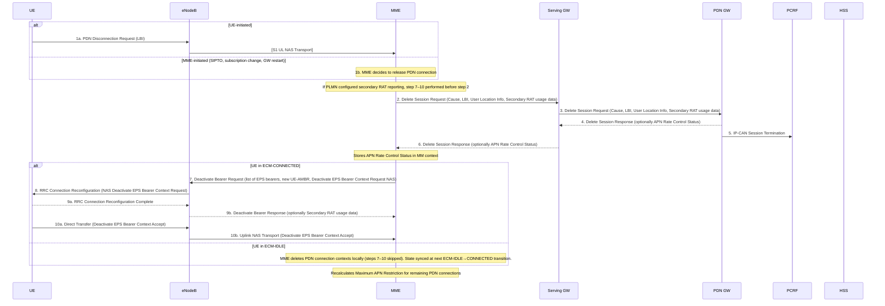
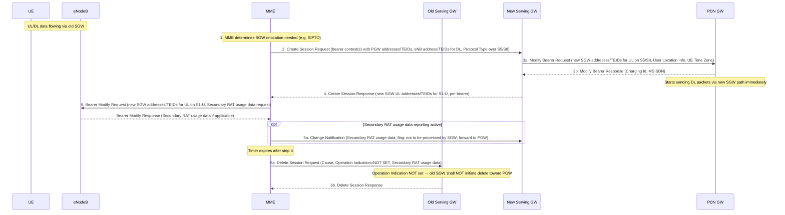
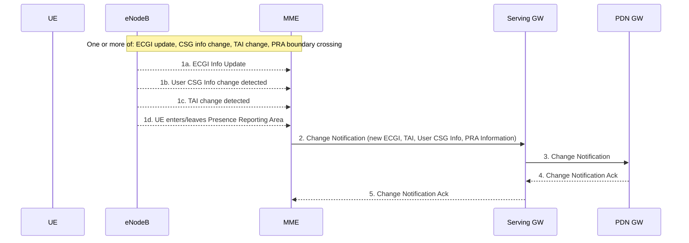

# PDN Connectivity Procedures

Normative source: 3GPP TS 23.401 §5.10 (Release 15).
Related: [EPS Attach](EPS-attach.md) | [EPS bearer model](../concepts/EPS-bearer.md) | [Information Storage](../concepts/information-storage.md) | [MME](../entities/MME.md) | [SGW](../entities/SGW.md) | [PGW](../entities/PGW.md)

---

## 5.10.1 General — Multiple PDN Support

The EPS supports simultaneous exchange of traffic to **multiple PDNs** through:
- Separate PGWs per PDN, or
- A single PGW serving multiple APNs.

Key rules:
- All simultaneously active PDN connections for a UE **associated with the same APN shall use the same PGW** (§5.10.1).
- UE support for multiple PDN connections is **optional**.
- Non-IP PDN type connections may be served by an SCEF (TS 23.682) instead of a PGW — the [MME](../entities/MME.md) decides based on APN configuration.
- "Attach without PDN Connectivity" allows a UE to remain attached without a Default PDN connection and request PDN connectivity at any later time.
- A UE supporting 15 EPS bearers (§4.12) shall not initiate this procedure if it already has 8 EPS bearers established and has not received "support for 15 EPS bearers" indication or has received cause #65.

---

## 5.10.2 UE Requested PDN Connectivity

Allows a UE with active PDN connections to request connectivity to an **additional PDN**. Also used when the UE sets "Attach without PDN Connectivity" at attach time and later wants a PDN connection, and for re-establishment of PDN connectivity after handover from non-3GPP access.

> **If the UE was in ECM-IDLE**: the NAS message is preceded by the Service Request procedure (if any existing PDN connection uses the User Plane without CIoT EPS Optimisation), or a Connection Resume procedure.

```mermaid
sequenceDiagram
    participant UE as UE
    participant eNB as eNodeB
    participant MME as MME
    participant SGW as Serving GW
    participant PGW as PDN GW
    participant PCRF as PCRF
    participant HSS as HSS

    UE->>eNB: 1. PDN Connectivity Request (APN, PDN Type, PCO, Request Type, Header Compression Config)
    eNB->>MME: 2. Create Session Request [via S1-MME]
    Note over MME: Validates APN, selects SGW/PGW, checks APN Restriction, Service Gap timer
    MME->>SGW: 2. Create Session Request (IMSI, APN, EPS Bearer QoS, PDN GW address, RAT type, LTE-M flag, Selection Mode, Charging Characteristics, Maximum APN Restriction, Dual Address Bearer Flag)
    SGW->>PGW: 3. Create Session Request (same + Serving GW addresses/TEIDs)
    Note over SGW: Begins buffering DL packets from PGW
    PGW->>PCRF: 4. IP-CAN Session Establishment/Modification (if dynamic PCC deployed, Handover Indication not present)
    PCRF-->>PGW: PCC rules, APN-AMBR, default bearer QoS
    PGW-->>SGW: 5. Create Session Response (PDN Type, PDN Address, EPS Bearer Id, EPS Bearer QoS, PCO, Charging Id, Prohibit Payload Compression, APN Restriction, Cause, MS Info/CSG/PRA Reporting Actions, APN-AMBR, DTC)
    SGW-->>MME: 6. Create Session Response
    MME->>eNB: 7. Bearer Setup Request or DL NAS Transport with PDN Connectivity Accept (EPS Bearer QoS, UE-AMBR, PDN Connectivity Accept, S1-TEID)
    eNB->>UE: 8. RRC Connection Reconfiguration (includes PDN Connectivity Accept)
    UE-->>eNB: 9. RRC Connection Reconfiguration Complete
    eNB-->>MME: 10. Bearer Setup Response (eNB TEID for S1-U, eNB address)
    UE->>eNB: 11. Direct Transfer (PDN Connectivity Complete)
    eNB->>MME: 12. Uplink NAS Transport (PDN Connectivity Complete)
    MME->>SGW: 13. Modify Bearer Request (Bearer Identity, eNodeB address, eNodeB TEID, Handover Indication, PRA information)
    Note over SGW,PGW: Steps 13a/13b only if Handover Indication set, or Presence Reporting Area information received
    SGW->>PGW: 13a. Modify Bearer Request (Handover Indication) — SGW routes packets from non-3GPP to 3GPP
    PGW-->>SGW: 13b. Modify Bearer Response
    SGW-->>MME: 14. Modify Bearer Response
    Note over SGW: Releases buffered DL packets toward eNB
    MME-->>HSS: 15. Notify Request (PDN GW address, APN, PLMN) — only for non-handover first PDN with newly selected PGW
    HSS-->>MME: 16. Notify Response
```

### Step-by-step details

**Step 1 — PDN Connectivity Request (UE → MME via eNB):**
- Parameters: APN, PDN Type (IPv4/IPv6/IPv4v6/Non-IP), Protocol Configuration Options (PCO), Request Type, Header Compression Configuration (CIoT), 3GPP PS Data Off UE Status.
- Request Type values: `initial request` (new additional PDN), `handover` (re-establishment from non-3GPP), `Emergency`.
- PCO carries: Address Allocation Preference (DHCPv4 after default bearer), NRSU (network requested bearer control for UTRAN/GERAN), ETFTU (extended TFT format support), 3GPP PS Data Off UE Status.

**Step 2 — MME processing and Create Session Request (MME → SGW):**
- MME validates APN against subscription; may reject, replace with network-supported APN, or use default APN.
- **Service Gap timer check**: if timer running and not waiting for MT paging response → reject with appropriate cause.
- **Emergency**: uses MME Emergency Configuration Data, bypasses subscription, PGW selected from visited PLMN only.
- **Handover**: uses stored PGW from subscription data (from Update Location at attach).
- Create Session Request carries: IMSI, MSISDN, RAT type (enables NB-IoT/LTE-M/WB-E-UTRAN PCC differentiation), LTE-M RAT type reporting flag, APN, Default EPS Bearer QoS, PDN Type, PDN Address, subscribed APN-AMBR, Handover Indication, Selection Mode, Charging Characteristics, Maximum APN Restriction, Dual Address Bearer Flag, User Location Information (ECGI), UE Time Zone, PCO, Trace IEs, MS Info Change Reporting support indication.
- For Non-IP PDN type with SCEF: allocates Bearer Id, establishes SCEF connection per TS 23.682; steps 3–6 not executed.

**Step 3 — Create Session Request (SGW → PGW):**
- SGW adds: Serving GW address and TEID for user plane, Serving GW TEID for control plane, APN-AMBR, Bearer Id, PDN Charging Pause Support indication.
- SGW begins **buffering all downlink packets** from PGW until Modify Bearer Response in step 14.

**Step 4 — PGW/PCRF interaction:**
- If dynamic PCC deployed and Handover Indication not present → IP-CAN Session Establishment (TS 23.203).
- PCRF may modify APN-AMBR and QoS (QCI + ARP) associated with the default bearer.
- If Handover Indication present → PCEF-Initiated IP-CAN Session Modification instead.
- If dynamic PCC not deployed → PGW applies local QoS policy.
- Emergency APN: PCRF sets ARP to emergency-reserved value; if no dynamic PCC → PGW configures emergency ARP locally.

**Step 5 — Create Session Response (PGW → SGW):**
- PDN GW selects PDN Type using received type + Dual Address Bearer Flag + operator policy.
- IPv4v6 requested but Dual Address Bearer Flag not set → PGW selects single IP version.
- PDN Address: IPv4 address and/or IPv6 prefix. If DHCPv4 → PDN Address = 0.0.0.0.
- If Handover Indication → PGW does **not** yet send downlink packets (path to be switched at step 13a).
- L-GW (local GW for LIPA): does not forward DL packets; forwarded to HeNB at step 10 via direct user plane path.
- Response includes: MS Info Change Reporting Action (Start), CSG Information Reporting Action (Start), Presence Reporting Area Action (with PRA identifiers and element lists), PDN Charging Pause Enabled indication, DTC (Delay Tolerant Connection), 3GPP PS Data Off Support Indication.

**Step 6 — Create Session Response (SGW → MME):**
- S1-U separation: if S11-U separation from S1-U is required for CIoT, SGW includes both S1-U and S11-U addresses/TEIDs.
- If Handover Indication included → message also serves as indication that S5/S8 bearer setup succeeded.

**Step 7 — Bearer Setup / PDN Connectivity Accept (MME → eNB → UE):**
- Bearer Setup Request (S1-AP Initial Context Setup Request) contains: EPS Bearer QoS, UE-AMBR, PDN Connectivity Accept, S1-TEID at SGW, SGW address for user plane.
- For Non-IP PDN type: eNB disables header compression.
- For LIPA: includes LIPA Correlation ID for direct user plane path HeNB↔L-GW.
- For SIPTO at local network: includes SIPTO Correlation ID.
- PDN Connectivity Accept (NAS): APN, PDN Type, PDN Address, EPS Bearer Id, PCO, Header Compression Configuration (CIoT), Control Plane Only Indicator.
- MME recalculates UE-AMBR (§4.7.3) accounting for new APN-AMBR.

**Step 13 — Modify Bearer Request (MME → SGW):**
- Switches the S-GW's path from the buffering state to the eNB TEIDs.
- Contains: EPS Bearer Identity, eNodeB address and TEID (for S1-U), Handover Indication, PRA information (with active/inactive status per PRA).
- **Step 13a** (Handover case): SGW → PGW with Handover Indication to prompt PGW to start routing packets from non-3GPP path to 3GPP. SGW immediately starts routing to new S5/S8 path.

**Step 14 — Modify Bearer Response (SGW → MME):**
- SGW **releases its buffered downlink packets** and begins forwarding to eNB.

**Step 15 — Notify Request (MME → HSS):**
Conditions for sending:
1. Request Type does not indicate "handover".
2. An EPS bearer was established.
3. Subscription data allows handover to non-3GPP access.
4. This is the first PDN connection associated with this APN, AND the MME selected a different PGW from the one indicated in the HSS PDN subscription context.
- Not sent for unauthenticated or roaming UE with Request Type "Emergency".
- May optionally be sent for non-roaming authenticated UE with "Emergency" to register emergency PGW.

### Maximum APN Restriction enforcement

- MME tracks the aggregate Maximum APN Restriction across all active bearer contexts.
- At step 2 (Create Session Request), MME sends the current Maximum APN Restriction to PGW.
- PGW checks the received value against the APN Restriction for this bearer context; conflict → reject.
- PGW ignores Maximum APN Restriction for Emergency APN.
- No existing active bearer contexts → Maximum APN Restriction = least restrictive type (see TS 23.060 §15.4).

---

## 5.10.3 UE or MME Requested PDN Disconnection

Allows UE or MME to release **one PDN connection** while keeping others active.

> **Does not apply to the last PDN connection** unless "Attach without PDN Connectivity" is supported. The last PDN disconnection uses [UE-initiated Detach](detach.md) (§5.3.8.2) or MME-initiated Detach (§5.3.8.3).

Triggers:
- **1a (UE-initiated)**: UE sends PDN Disconnection Request (LBI = EPS Bearer Id of the default bearer of the PDN connection to disconnect).
- **1b (MME-initiated)**: Subscription change, lack of resources, SIPTO GW relocation, PDN GW Restart Notification (TS 23.007).

### MME-initiated with reactivation requested (SIPTO GW relocation)

When the MME releases the PDN connection due to SIPTO and wishes the UE to reconnect:
- The NAS Deactivate EPS Bearer Context Request includes **reactivation requested** cause.
- The UE immediately re-initiates the UE Requested PDN Connectivity procedure (§5.10.2) using the same APN.
- SIPTO-triggered GW relocation is only possible when UE is in ECM-IDLE or during a TAU procedure without established RABs.

---

## 5.10.4 MME-Triggered Serving GW Relocation

An **out-of-mobility** SGW relocation triggered by the MME, used when:
- SIPTO at local network PDN connection requires a new SGW.
- Stand-alone RAN PDN connection is being established.
- Any other scenario outside the normal mobility events described in §5.3.3.1 and §5.5.1.

**Key points:**
- New SGW immediately becomes the DL path; PGW starts sending DL to new SGW after step 3b.
- **Operation Indication NOT set** in Delete Session Request to old SGW → old SGW must not trigger PGW teardown (path already switched at step 3).
- If relocation to new SGW fails → MME falls back to old SGW and disconnects the affected PDN connections (e.g. those requiring SIPTO at local network) that are no longer allowed.
- MME recalculates UE-AMBR after SGW relocation if needed.

---

## Related: Location Change Reporting (§5.9.2)

The [PGW](../entities/PGW.md) can request the [MME](../entities/MME.md) to report changes in:
1. **ECGI / eNodeB ID / TAI** (via MS Info Change Reporting Action)
2. **User CSG Information** (via CSG Information Reporting Action)
3. **UE presence in a Presence Reporting Area** (via Presence Reporting Area Action)

These actions are conveyed via the Create Session Response and Modify Bearer Response messages and stored per-PDN-connection in the MME context (see [Information Storage](../concepts/information-storage.md)).

When a change is detected (ECGI update, TAI change, CSG membership change, or UE entering/leaving a PRA), the MME sends a **Change Notification** to the SGW, which forwards it to the PGW. The PGW then informs the PCRF (for dynamic PCC) or the OCS.

Presence Reporting Areas (PRA):
- **UE-dedicated PRA**: defined in subscriber profile; composed of a short list of TAs/RAs, eNBs, or cells/SAs.
- **CN-predefined PRA**: pre-configured in MME/SGSN for a short list of TAs/RAs, eNBs, or cells.
- PRA identifiers and status (active/inactive) are transferred to the target serving node during mobility.
- MME may set reporting for one or more received PRAs to **inactive** to prevent overload; inactive PRAs are still reported to PGW.

---

## Summary of PDN Connectivity Message Flows

| Step | Message | Direction | Key Parameters |
|---|---|---|---|
| UE request | PDN Connectivity Request | UE → MME | APN, PDN Type, PCO, Request Type |
| Bearer setup | Create Session Request | MME → SGW → PGW | IMSI, APN, EPS Bearer QoS, RAT type, Maximum APN Restriction |
| PCC interaction | IP-CAN Session Establishment | PGW → PCRF | RAT type, ETFTU, 3GPP PS Data Off |
| Bearer response | Create Session Response | PGW → SGW → MME | PDN Address, Charging Id, APN-AMBR, Reporting Actions |
| Radio setup | S1 Initial Context Setup / Bearer Setup | MME → eNB | EPS Bearer QoS, UE-AMBR, SGW TEID |
| Path switch | Modify Bearer Request | MME → SGW → PGW | eNB TEID, Handover Indication, PRA info |
| HSS registration | Notify Request | MME → HSS | PGW address, APN, PLMN |
| Disconnection | Delete Session Request | MME → SGW → PGW | Cause, LBI, ECGI, Secondary RAT usage |
| Bearer teardown | Deactivate Bearer Request | MME → eNB | List of EPS bearers, UE-AMBR |
| SGW relocation | Create Session Request | MME → New SGW | Existing bearer contexts |
| Old SGW cleanup | Delete Session Request (Op.Ind.=0) | MME → Old SGW | Operation Indication NOT set |
