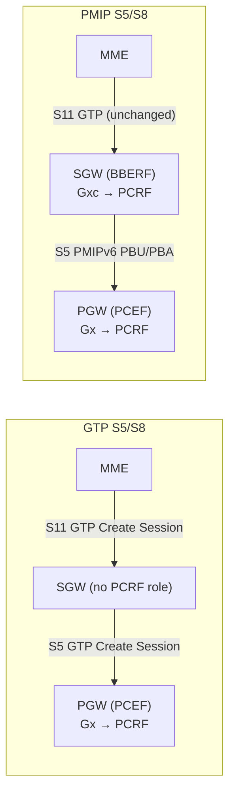
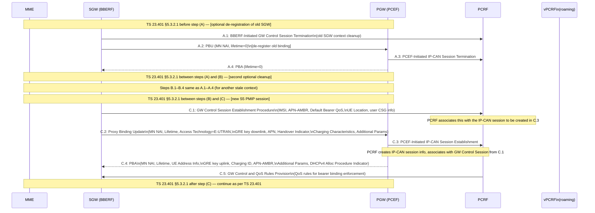
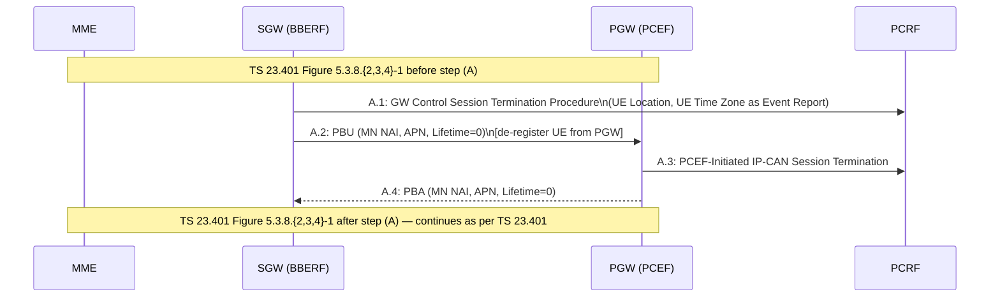
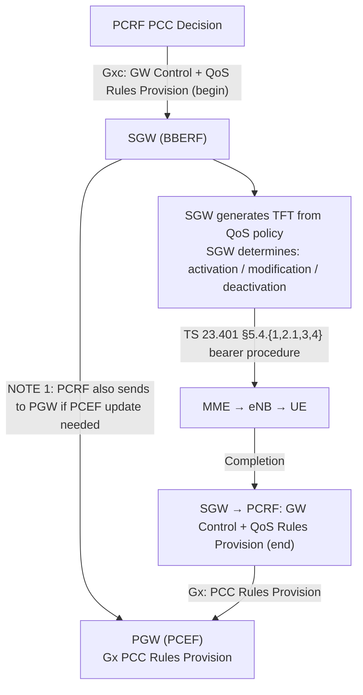
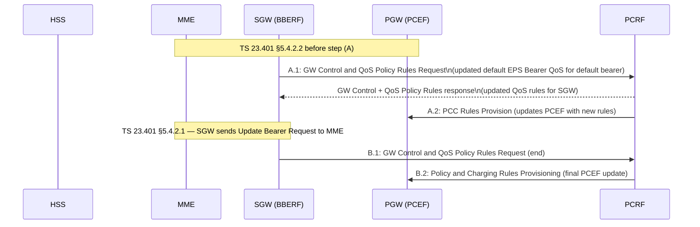
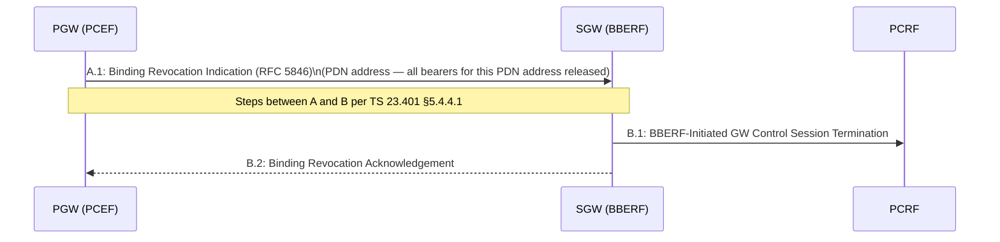
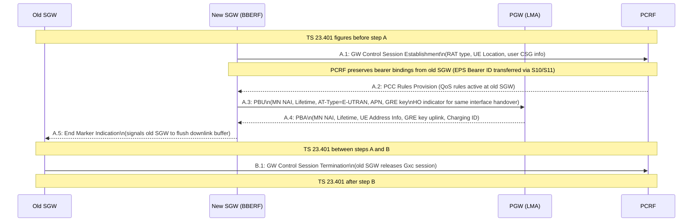

# 3GPP Access Procedures with PMIP-based S5/S8

**Spec reference:** 3GPP TS 23.402 §5 (v15.3.0)

Related pages: [SGW](../entities/SGW.md) · [PGW](../entities/PGW.md) · [MME](../entities/MME.md) ·
[PCRF](../entities/PCRF.md) · [EPS Attach](EPS-attach.md) · [Dedicated Bearer](dedicated-bearer.md) ·
[X2 Handover](X2-handover.md) · [S1 Handover](S1-handover.md) · [TAU](TAU.md)

---

## Overview

TS 23.401 defines EPC procedures assuming **GTP-based S5/S8**. When an operator deploys
**PMIPv6-based S5/S8** instead, the procedures are modified as defined in TS 23.402 §5.
This section specifies only the steps that **differ** from the GTP-based equivalents.

### Fundamental Architecture Difference

**Key difference:** With PMIP S5/S8, the **SGW becomes a BBERF** (Bearer Binding and Event
Reporting Function) and interacts with the **PCRF via Gxc**. The SGW now participates in
PCC decisions. With GTP S5/S8, the SGW is transparent to PCRF; only the PGW interacts with PCRF.

---

## Protocol Stack (§5.1)

- **S5/S8 Control Plane:** PMIPv6 (RFC 5213) over IPv4/IPv6 between SGW and PGW
- **S5/S8 User Plane:** GRE encapsulation (same tunnelling layer as S2a/S2b)
- **S11 (MME↔SGW):** Unchanged — GTP-based S11 is used regardless of S5/S8 protocol choice

User plane stacks for different RATs:
- **E-UTRAN:** eNB → SGW: GTP-U on S1-U; SGW → PGW: GRE on S5/S8
- **UTRAN (S4):** SGSN → SGW: GTP-U on S4; SGW → PGW: GRE on S5/S8
- **GERAN (S4):** SGSN → SGW: GTP-U on S4; SGW → PGW: GRE on S5/S8
- **UTRAN (S12 direct):** SGSN controls user plane; RNC → SGW direct on S12

---

## Initial E-UTRAN Attach with PMIP-based S5 or S8 (§5.2)

The attach follows TS 23.401 §5.3.2.1 with PMIP-specific steps replacing or augmenting key
points A, B, C of the standard GTP attach flow.

### Step Mapping

### PMIP Attach Step Details

**C.1 — GW Control Session Establishment:**
- SGW (as BBERF) opens Gxc session with PCRF before sending PBU
- Conveys: IMSI, APN-AMBR, Default Bearer QoS from MME, UE Location, user CSG info
- PCRF uses this to correctly associate the Gateway Control Session with the upcoming IP-CAN
  session established in C.3 by the PGW

**C.2 — Proxy Binding Update:**
- SGW sends PBU to PGW: MN NAI (identifies UE), APN, Access Technology Type = E-UTRAN
- Handover Indicator: "attachment over new interface" for fresh attach
- For Emergency Attach: if IMSI is unauthenticated, SGW marks IMSI as such to PCRF/PGW

**C.4 — Proxy Binding Ack:**
- PGW allocates UE IP address (IPv4, IPv6 prefix, or dual)
- If `DHCPv4 Address Allocation Procedure Indication` set: UE IP address not provided here;
  delivered later via DHCPv4 relay at SGW (§4.7.1 procedure)
- Charging ID assigned for PDN connection charging correlation

**C.5 — QoS Rules Provision:**
- PCRF pushes QoS rules to SGW (BBERF) on Gxc — these govern bearer binding at SGW
- This is the key PMIP difference: SGW receives QoS decisions from PCRF, not just PGW

---

## E-UTRAN Detach with PMIP-based S5/S8 (§5.3)

Replaces the S5 GTP Delete Session exchange in TS 23.401 §5.3.8:

> For multiple PDN connections: steps A.1–A.4 repeat per PDN.

---

## Dedicated Bearer Procedures for E-UTRAN with PMIP S5/S8 (§5.4)

### Critical PMIP Difference: BBERF-Based Bearer Decisions

With GTP S5/S8:
- PCRF sends PCC policy → PGW (PCEF) → PGW creates TFT → PGW sends Create Bearer to SGW → SGW → MME

With PMIP S5/S8:
- PCRF sends PCC policy → **SGW (BBERF)** → SGW generates TFT from QoS policy → SGW sends Create Bearer to MME
- PGW only receives PCEF-level policy provisioning

### Dedicated Bearer Activation (§5.4.2)

When PCRF QoS rules result in a new dedicated bearer:
1. PCRF → SGW: GW Control and QoS Rules Provision — A.1 (Figure 5.4.1-1 box A)
2. SGW determines a new bearer is needed; uses PCRF QoS policy to assign EPS Bearer QoS
3. SGW follows TS 23.401 §5.4.1 by sending **Create Bearer Request (EPS Bearer QoS, TFT, S1 TEID)** to MME
4. Steps between A.1 and B.1 per TS 23.401 §5.4.{1,3}-1
5. SGW → PCRF: GW Control Session Modification (B.1) — indicates success/failure
6. PCRF → PGW: PCC Rules Provision (B.2) — updates PCEF with final PCC rules

> **NOTE 1:** Before step 3 (bearer activation), PCRF sends the PCC decision to the SGW
> (BBERF), NOT to the PGW. The SGW generates the TFT. This is the critical PMIP departure
> from GTP where PGW generates TFT and drives Create Bearer toward SGW.

### HSS-Initiated Subscribed QoS Modification (§5.4.3.2)

### Bearer Deactivation (§5.4.5)

**PCC-Initiated (§5.4.5.1):** Follows Figure 5.4.1-1. SGW receives QoS rules from PCRF
indicating a bearer should be deactivated → SGW sends Delete Bearer Request to MME per TS 23.401 §5.4.4.

**MME-Initiated (§5.4.5.3):**
1. SGW → PCRF: A.1 GW Control and QoS Rules Request (SGW reports deleted QoS rules)
2. PCRF → PGW: A.2 PCC Rules Provision (update PCEF)
3. SGW follows TS 23.401 §5.4.4.2 — SGW does not need to wait for A.1 completion

---

## UE-Initiated Resource Request/Release (§5.5)

The UE sends a Traffic Aggregate Description (TAD) request via NAS to SGW. The SGW reports
this to PCRF as an Event Report via GW Control and QoS Rules Request (Gxc). PCRF makes a
PCC decision and provides QoS rules to SGW. SGW determines bearer action per TS 23.401.

---

## Multiple PDN Support with PMIP-based S5/S8 (§5.6)

### UE-Requested PDN Connectivity (§5.6.1)

Additional PDN over E-UTRAN uses the initial attach steps C.1–C.5 structure, but triggered
by UE PDN connectivity request. Two alternatives:

**Alt A** (standard; IP address known after C.1):
- C.1: GW Control Session Establishment → C.2: PBU → C.3a: IP-CAN Session Establishment
- C.3b: PCEF-Initiated IP-CAN Session Modification → C.4: PBA (includes UE address)
- Steps A-B from TS 23.401 §5.10.2-1 remain unchanged (outside PMIP steps)

**Alt B** (lower jitter for handover re-establishment):
- B.1: PBU → B.2: PCEF-Initiated IP-CAN Session Modification → B.3: PBA
- Used when UE IP address is already known (e.g. re-establishing after non-3GPP handover)
- Charging ID reuse: for re-establishment after non-3GPP handover, PGW reuses the
  Charging ID from the non-3GPP access session (PMIP source) or from the Default Bearer
  (GTP source) to preserve charging correlation

### PDN Disconnection (§5.6.2)

**UE/MME/S-GW-initiated (§5.6.2.1):**
- GW Control Session Termination + PBU(lifetime=0) + PCEF IP-CAN Termination + PBA
- Same A.1–A.4 pattern as detach (§5.3), scoped to one PDN

**PDN GW-Initiated (§5.6.2.2):**

---

## Handover and TAU Procedures for PMIP-based S5/S8 (§5.7)

### Intra-LTE TAU / Inter-eNodeB HO without SGW Relocation (§5.7.0)

When RAT type changes (e.g. inter-eNodeB HO without SGW move):
1. SGW → PCRF: A.1 GW Control and QoS Rules Request (RAT type change + UE Location)
2. PCRF → PGW: A.2 PCC Rules Provision (updated policy for new RAT type)

No PBU/PBA exchange occurs — PMIP binding remains unchanged; only PCRF is notified.

### Intra-LTE TAU / Inter-eNodeB HO with SGW Relocation (§5.7.1)

**EPS Bearer ID transfer:** The EPS Bearer ID established by the old SGW must be
transferred to the new SGW before step A (via S10 in Forward Relocation Request and S11
in Create Session Request). The new SGW preserves these bindings with PCRF (NOTE 1 §5.7.1).

**End Marker:** PGW sends End Marker Indication to old SGW (A.5) to flush downlink GRE
tunnel buffer. Old SGW sends one or more "end marker" packets to source eNodeB. This
assists target eNodeB reordering.

### Inter-RAT TAU/RAU or HO between UTRAN/GERAN and E-UTRAN (§5.7.2)

Without SGW relocation (Figure 5.7.2-1):
- SGW → PCRF: A.1 GW Control and QoS Rules Request (new RAT type + UE Location)
- PCRF → PGW: A.2 PCC Rules Provision

With SGW relocation (Figure 5.7.2-2):
- Same as §5.7.1 pattern (new SGW GW Control Session + PBU/PBA + old SGW session termination)
- PMIP tunnel re-established to new SGW; end marker sent; old SGW Gxc session terminated

---

## GERAN/UTRAN over S4 (§5.10 Summary)

§5.10 defines PMIP S5/S8 variants for GPRS procedures in TS 23.060 (SGSN-based).
Key mapping: wherever TS 23.060 uses a GTP box (B) in procedures, the PMIP equivalent
uses the **GW Control and QoS Rules Request/Response** pattern (steps A.1–A.2 from §5.7.2).

Covered procedures:
- PDP Context Activation (S4): §5.6.1 Alt A steps replace TS 23.060 §9.2.2.1A box A
- Secondary PDP Context: §5.5 UE-initiated resource request
- Network-Initiated PDP Context Activation: §5.4.1 steps replace TS 23.060 §9.2.2.3A box A
- MS/SGSN-Initiated PDP Deactivation: §5.6.2.1 steps replace TS 23.060 §9.2.4.1A boxes A
- PDN GW-Initiated PDP Deactivation: §5.6.2.2 steps replace TS 23.060 §9.2.4.3A boxes
- RAU/SRNS Relocation: §5.7.2 steps replace location-change boxes
- Intra-/Inter-SGSN Change: GW Control and QoS Rules Request used instead of Modify Bearer

---

## PDN GW-Initiated IPv4 Address Delete (§5.11)

When a UE's IPv4 lease expires (DHCPv4 lease timeout):

1. PCEF-Initiated IP-CAN Session Modification Procedure (PGW → PCRF)
2. If QoS rules changed: PCRF → SGW: GW Control + QoS Rules Provision
3. SGW follows TS 23.401 §5.4.3 (bearer modification without QoS update) steps A–B
4. SGW → PCRF: GW Control + QoS Rules Provision end
5. PGW → SGW: **Binding Revocation Indication** (PDN address only — signal to delete IPv4 only,
   not the entire PDN binding)
6. SGW → PGW: Binding Revocation Acknowledgement

> The Binding Revocation Indication in §5.11 is scoped to the IPv4 address only (not full
> PDN disconnection). The IPv6 prefix binding and GRE tunnel remain active.

---

## Location Change Reporting for PMIP S5/S8 (§5.12)

When MME reports a UE location change event (ECGI/TAI), SGW forwards this to PCRF:
1. SGW → PCRF: A.1 GW Control and QoS Rules Request (new UE Location + user CSG info)
2. PCRF → PGW: A.2 PCC Rules Provision (PGW receives location for PCEF enforcement)

---

## Summary: GTP vs PMIP S5/S8 Key Differences

| Procedure | GTP S5/S8 | PMIP S5/S8 |
|---|---|---|
| Session establishment | Create Session Request/Response | PBU/PBA + GW Control Session |
| Session teardown | Delete Session Request/Response | PBU(lifetime=0) + GW Control Termination |
| PCC policy delivery | PCRF → PGW (Gx) | PCRF → SGW (BBERF, Gxc) + PCRF → PGW (Gx) |
| Bearer decisions | PGW generates TFT, drives Create Bearer | SGW (BBERF) generates TFT, drives Create Bearer |
| Resource deactivation by PGW | PGW → SGW: Delete Bearer Request | PGW → SGW: Binding Revocation Indication |
| RAT change notification | PGW notified via SGW Modify Bearer | SGW notifies PCRF; PCRF notifies PGW |
| SGW SGW relocation | SGW: Modify Bearer; old SGW session ends | New SGW: PBU; old SGW: Gxc termination |
