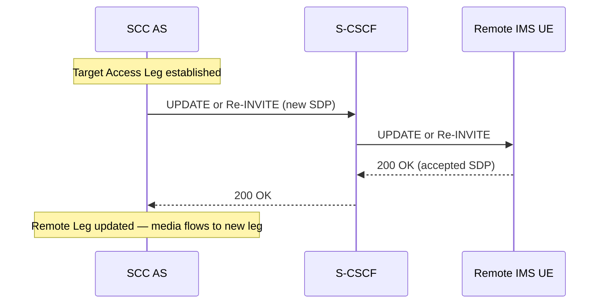
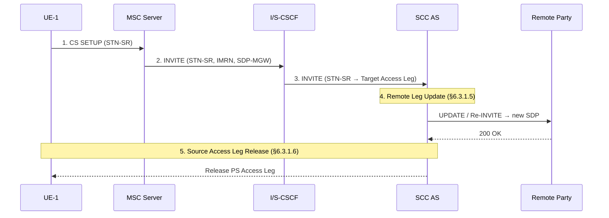
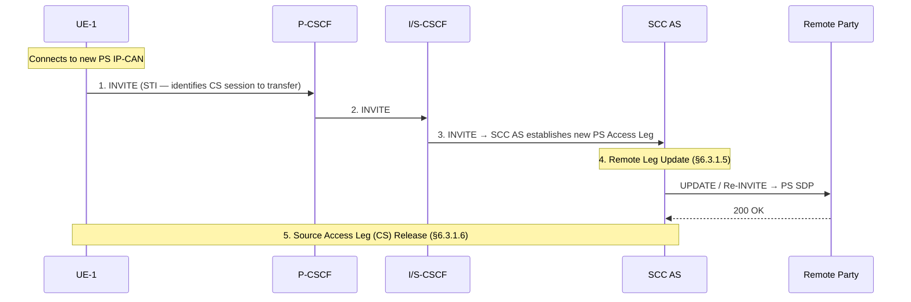
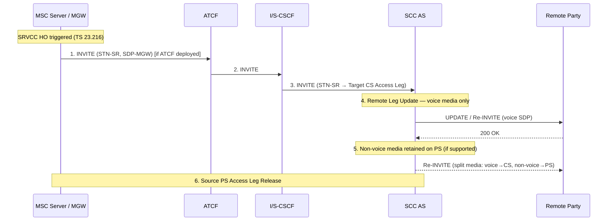
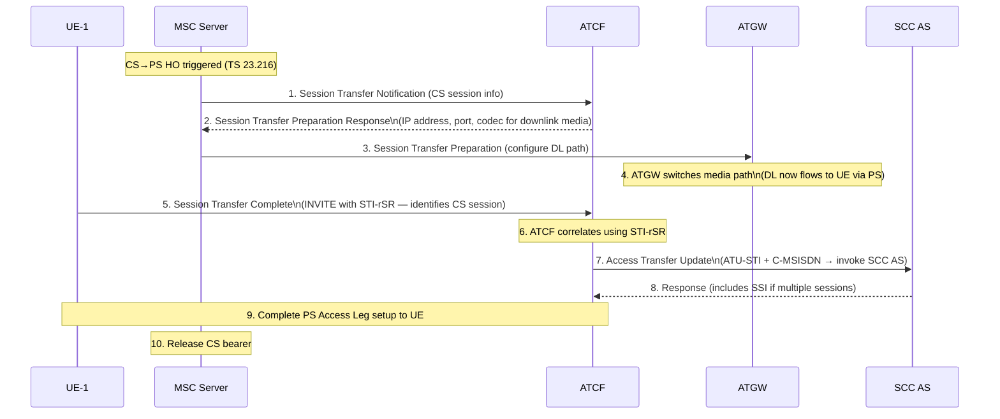
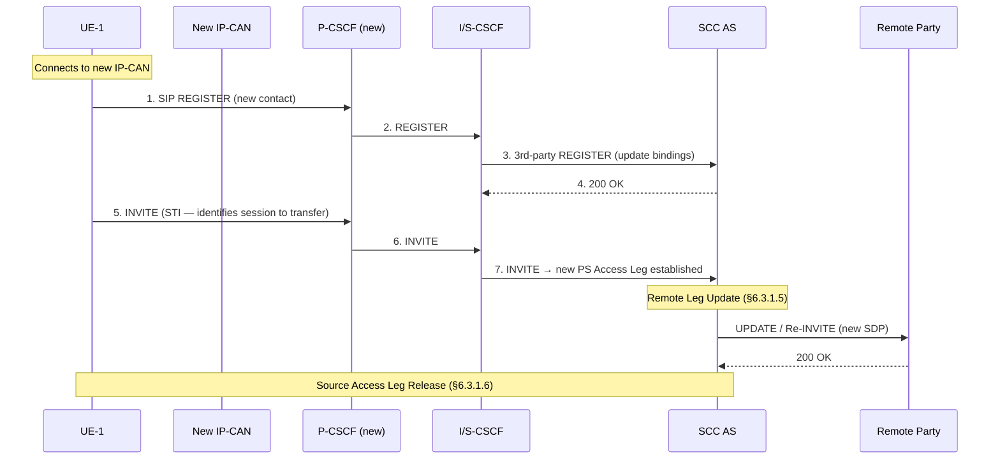
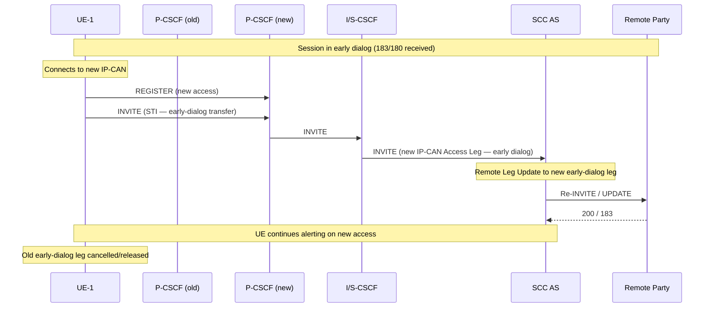
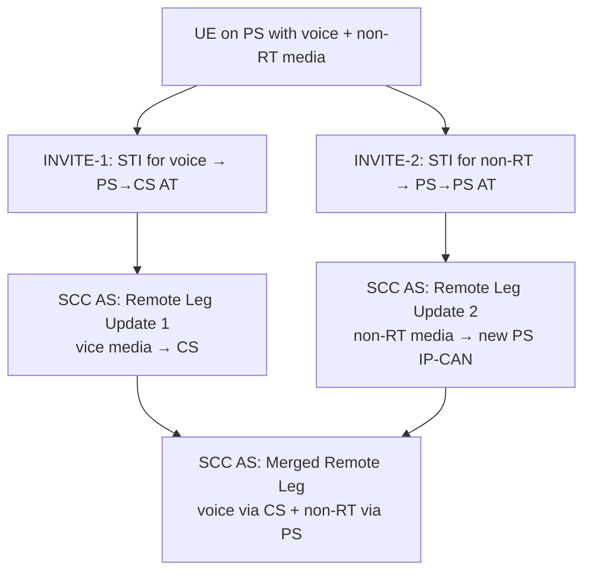
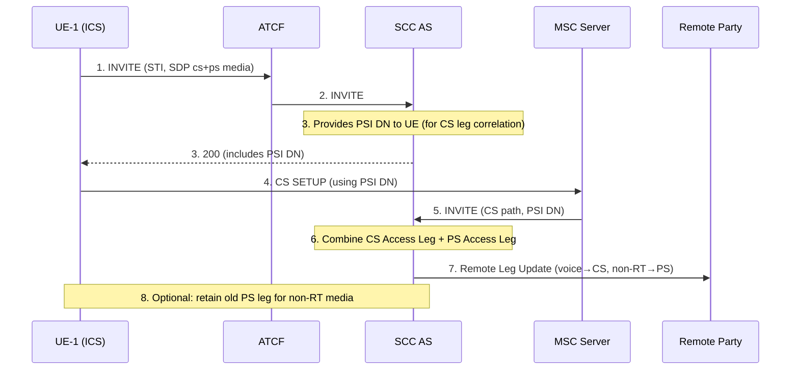
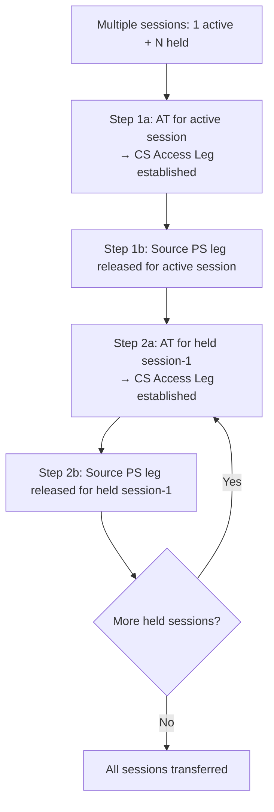

# IMS Service Continuity — Access Transfer Procedures

Access Transfer (AT) moves one or more media flows from one Access Leg to another without disrupting the session from the remote party's perspective. The [SCC AS](../entities/SCC-AS.md) anchors both Access Leg and Remote Leg via 3pcc; the [ATCF](../entities/ATCF.md) (when deployed) executes AT locally in the serving network.

Reference: **3GPP TS 23.237 §6.3**

---

## §6.3.1 Core AT Sub-Procedures

These sub-procedures are invoked as building blocks inside the full transfer flows below.

### §6.3.1.5 Remote Leg Update

After the Target Access Leg is established, the SCC AS updates the Remote Leg so the far end switches media to the new leg. Two variants:

**Variant A — IMS UE remote party**

**Variant B — MGCF / PSTN remote party**

- SCC AS sends UPDATE or Re-INVITE toward the [MGCF](../entities/MGCF.md)
- MGCF translates SIP→ISUP/bearer and updates the CS trunk
- Same outcome: Remote Leg now points to Target Access Leg

> The remote party is unaware an access transfer occurred — the dialog is continuous.

---

### §6.3.1.6 Source Access Leg Release

After AT completes:

- **Non-emergency, non-SRVCC**: Both UE and SCC AS initiate session release of the Source Access Leg per TS 23.228
- **SRVCC / vSRVCC**: Source Access Leg (PS leg) is released **only if** Gm reference point is retained. If Gm is not retained, the source leg was already cleared by the radio procedure.

---

### §6.3.1.7 Access Transfer Info for ATCF

After IMS registration (§6.1), the SCC AS provides the ATCF with:

| Item | Purpose |
|---|---|
| **ATU-STI** | Access Transfer Update STI — ATCF uses this to invoke SCC AS after AT completes |
| **C-MSISDN** | Sent by ATCF to SCC AS in Access Transfer Update; SCC AS uses it to correlate Access Legs |

This is a prerequisite for any AT flow that involves the ATCF acting autonomously.

---

## §6.3.2.1 PS–CS Access Transfer

### §6.3.2.1.1 PS→CS Dual Radio

UE is on PS and CS simultaneously (Dual Radio). UE initiates CS call to STN-SR, which routes the INVITE to SCC AS.

Key identifiers:
- **STN-SR**: dialled by UE; routes INVITE to SCC AS (via ATCF if deployed)
- **IMRN**: IMS Routing Number; MSC Server allocates and includes in INVITE for CS-leg correlation
- **SDP-MGW**: SDP containing MGW IP/port for uplink CS media

---

### §6.3.2.1.1a PS→CS Dual Radio with Session State Information (SSI)

Extends the basic Dual Radio flow for cases where the UE has **multiple concurrent IMS sessions** (e.g., one active + one held).

Additional steps after step 3 above:
- SCC AS sends **Session State Information (SSI)** to MSC Server containing:
  - STN-SR for each additional transferable session
  - Session state (active / held) for each
- MSC Server may initiate **additional CS calls** (one per additional session) toward SCC AS using the corresponding STN-SR

> This is the mechanism for the "mid-call feature" — held sessions can be transferred to CS in sequence.

**Session selection algorithm when multiple sessions exist:**

| Session | Action |
|---|---|
| Most recently active | Transferred to Target Access Leg (primary AT) |
| Second-most recently active | Put on hold (SSI included; MSC Server may transfer) |
| All other active sessions | Released |

---

### §6.3.2.1.2 CS→PS Dual Radio

UE connects to PS access while already in a CS call. UE identifies the session via STI and initiates transfer.

---

### §6.3.2.1.4 PS→CS Single Radio (SRVCC)

Radio-layer handover is handled by TS 23.216. The IMS layer receives an INVITE at the STN-SR from the MSC Server.

Key differences from Dual Radio:
- MSC Server sends INVITE to STN-SR without UE initiating — radio triggers it
- ATCF is in the signalling path (if deployed); executes AT locally using STN-SR
- Non-voice media (e.g., video, text) may be **retained on PS** via a separate Re-INVITE if UE supports it
- Source Access Leg Release conditioned on Gm retention

---

### §6.3.2.1.10 CS→PS Single Radio with ATCF

This is the reverse SRVCC path. The ATCF orchestrates the transfer locally using the STI-rSR received at registration.

Key points:
- **STI-rSR**: Provided by ATCF to UE at registration (§6.1.3); UE sends it in step 5 to identify the CS session being transferred
- **ATU-STI + C-MSISDN**: ATCF sends to SCC AS (step 7) to trigger Remote Leg Update at home network
- **SSI in response** (step 8): If UE has additional held sessions, SCC AS includes SSI so ATCF (and MSC Server) can transfer those too
- ATCF executes the entire local transfer (steps 1–6) before contacting home SCC AS — minimises home round-trip latency

---

## §6.3.2.2 PS–PS Access Transfer

### §6.3.2.2.1 Full Media Transfer

UE moves from one IP-CAN to another. All media moves to the new access.

---

### §6.3.2.2.2 Partial Media Transfer

Same flow as §6.3.2.2.1, except:
- The INVITE(STI) indicates which **subset of media flows** to transfer to the new IP-CAN
- UE sends a **session modification** over the old IP-CAN to remove those media flows from the old Access Leg
- Both Access Legs coexist for the remaining and transferred media respectively

---

### §6.3.2.2.3 / §6.3.2.2.4 Early Dialog Transfer (Incoming / Outgoing)

Used when a PS-PS transfer occurs while the session is in the **alerting or ringing phase** (not yet established).

**Outgoing early dialog (§6.3.2.2.3):**

**Key rule:** SCC AS updates the Remote Leg even during early dialog — the remote end continues ringing/alerting, unaware of the access change.

---

## §6.3.2.3 PS–PS in Conjunction with PS–CS

For sessions carrying **mixed media** (e.g., voice/video on CS + non-real-time data on PS), AT may split across domains.

### §6.3.2.3.1 Non-ICS UE (PS→CS + PS→PS simultaneous)

Two separate AT flows triggered by UE:

- SCC AS correlates both INVITEs via STIs and performs two separate Remote Leg Updates
- Result: remote party's session has media split across CS and PS simultaneously

---

### §6.3.2.3.2 Non-ICS UE (CS→PS + IMS→PS)

UE has a CS call and a separate IMS session, both to be transferred to PS:

- UE sends a **single INVITE** containing:
  - **STI-1**: identifies the CS call (to be PS-transferred)
  - **STI-2**: identifies the IMS session (to be PS-transferred)
- SCC AS decodes both STIs, performs Remote Leg Updates for both sessions, and completes both transfers via the new PS Access Leg

---

### §6.3.2.3.3 ICS UE with Gm (PS→CS-via-IMS + PS→PS)

For ICS UEs, CS origination still goes through IMS (Gm interface). The AT flow:

- **PSI DN**: Public Service Identity DN — SCC AS assigns it so the CS-path INVITE can be correlated to the original session
- **Gm retention option**: Old PS leg may be retained for non-real-time media; not released

---

### §6.3.2.3.5 Active and Held Sessions

When UE has both active and held IMS sessions during a PS-CS AT:

Key rule: **CS media is not pre-established for held sessions** — only the signalling path is prepared. CS media setup for held sessions occurs when they are resumed.

---

## Access Transfer Summary

| Scenario | Trigger | Key Identifier | ATCF Role | Home Round-trip? |
|---|---|---|---|---|
| PS→CS Dual Radio | UE dials STN-SR | STN-SR, IMRN | Optional (in INVITE path) | Yes (INVITE to SCC AS) |
| PS→CS Dual Radio + SSI | Same + multiple sessions | STN-SR + SSI per session | Same | Yes |
| CS→PS Dual Radio | UE sends INVITE(STI) over PS | STI | Optional | Yes |
| PS→CS Single Radio (SRVCC) | TS 23.216 radio HO | STN-SR | If deployed: in INVITE path | Yes |
| CS→PS Single Radio | TS 23.216 radio HO | STI-rSR, ATU-STI | Central — executes locally | Deferred (ATCF first) |
| PS-PS Full | UE registers + INVITE(STI) on new IP-CAN | STI | Not involved | Yes |
| PS-PS Partial | Same + partial SDP | STI | Not involved | Yes |
| PS-PS Early Dialog | UE on new IP-CAN mid-alerting | STI | Not involved | Yes |
| PS-PS + PS-CS (non-ICS) | Two INVITEs (STI-1, STI-2) | Two STIs | Not involved | Yes (×2) |
| PS-PS + PS-CS (ICS/Gm) | INVITE(STI) + CS SETUP(PSI DN) | STI + PSI DN | If deployed | Yes |

---

## Cross-references

- [entities/SCC-AS.md](../entities/SCC-AS.md) — 3pcc anchor, Remote Leg Update, SSI, T-ADS
- [entities/ATCF.md](../entities/ATCF.md) — STN-SR, STI-rSR, ATU-STI, local AT execution
- [entities/ATGW.md](../entities/ATGW.md) — media path switching during CS→PS AT
- [concepts/IMS-service-continuity.md](../concepts/IMS-service-continuity.md) — full SC concept, identifier table
- [procedures/IMS-SC-registration.md](IMS-SC-registration.md) — STN-SR and STI-rSR provisioned at registration
- [procedures/IMS-SC-origination-termination.md](IMS-SC-origination-termination.md) — session anchoring prerequisite
