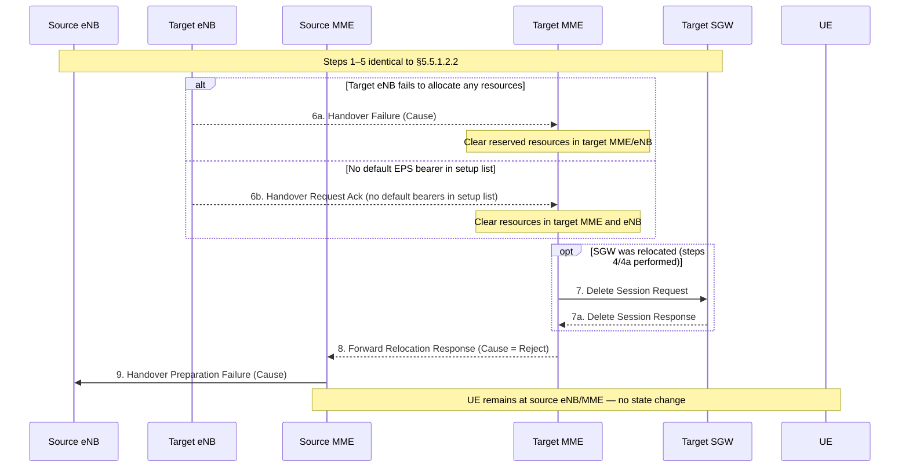
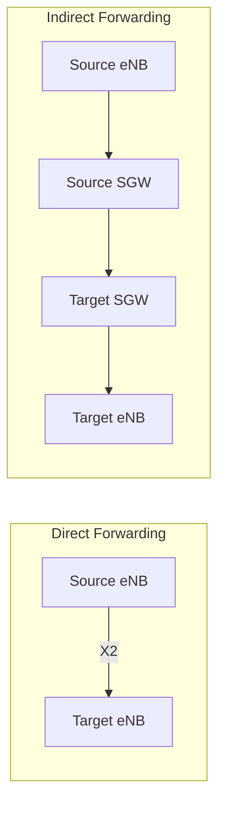

# S1-Based Intra-E-UTRAN Handover

TS 23.401 §5.5.1.2. The S1-based handover is used when X2-based handover **cannot** be used: no X2 connectivity to the target eNB, an X2 HO attempt failed, or dynamic information requires S1 HO. The source eNB initiates via the S1-MME reference point with a **Handover Required** message.

Unlike X2 handover, S1 HO may relocate both the **MME** and the **Serving GW**.

---

## When S1 HO Is Used

| Condition | Notes |
|---|---|
| No X2 connectivity | Most common; source eNB cannot reach target directly |
| X2 HO failed / error from target | Error indication causes fallback to S1 |
| Dynamic information requires it | Operator policy or CSG/PLMN constraints |

---

## Relocation Decision Rules

| Node | Relocation rule |
|---|---|
| **MME** | Should **not** be relocated for intra-eNB or inter-eNB HO within MME Pool Area. Relocated only when UE leaves the MME Pool Area. Source MME selects target MME per §4.3.8.3 |
| **Serving GW** | Target MME (or source MME if same MME) decides based on target cell location. Selected per §4.3.8.2 |

---

## §5.5.1.2.2 — S1-Based Handover, Normal (21 steps)

```mermaid
sequenceDiagram
    participant UE
    participant SRCE as Source eNB
    participant TGTE as Target eNB
    participant SRCM as Source MME
    participant TGTM as Target MME
    participant SRCS as Source SGW
    participant TGTS as Target SGW
    participant PGW as PDN GW
    participant HSS

    Note over SRCE,TGTE: User plane data flowing via source path

    SRCE->>SRCM: 2. Handover Required (Direct Forwarding Path Availability,\nSource-to-Target container, CSG ID, target TAI, S1AP Cause)
    Note over SRCM: Select target MME (§4.3.8.3). If MME unchanged, acts as both.

    SRCM->>TGTM: 3. Forward Relocation Request (MM UE context, EPS Bearer Contexts,\nRAN Cause, target eNB Id, CSG info, UE TZ,\nDirect Forwarding Flag, Serving Network, LTE-M UE Indication)
    Note over TGTM: If SGW relocated: select new SGW (§4.3.8.2)
    TGTM->>TGTS: 4. Create Session Request (bearer contexts,\nPGW addr+TEIDs for UL, eNB addr+TEIDs for DL,\nServing Network, UE TZ, SecRAT usage) per PDN
    TGTS-->>TGTM: 4a. Create Session Response (target SGW addr+UL TEID(s))

    TGTM->>TGTE: 5. Handover Request (EPS Bearers to Setup, AMBR, S1AP Cause,\nSource-to-Target container, CSG ID, HO Restriction List)
    TGTE-->>TGTM: 5a. Handover Request Ack (EPS Bearer Setup list, failed list,\nTarget-to-Source container, DL TEIDs for forwarding)
    Note over TGTM: Release non-accepted dedicated bearers (§5.4.4.2)

    opt Indirect forwarding + SGW relocated
        TGTM->>TGTS: 6. Create Indirect Data Forwarding Tunnel Request
        TGTS-->>TGTM: 6a. Create Indirect Data Forwarding Tunnel Response
    end

    TGTM-->>SRCM: 7. Forward Relocation Response (Cause, Target-to-Source container,\nEPS Bearer Setup List, forwarding SGW addr+TEIDs,\nServing GW change indication)

    opt Indirect forwarding
        SRCM->>SRCS: 8. Create Indirect Data Forwarding Tunnel Request
        SRCS-->>SRCM: 8a. Create Indirect Data Forwarding Tunnel Response
    end

    SRCM->>SRCE: 9. Handover Command (Bearers to forward, Bearers to Release,\nTarget-to-Source container)
    SRCE->>UE: 9a. Handover Command (transparent container)
    SRCE-->>SRCM: 9b. RAN Usage Data Report (SecRAT usage, HO flag) [optional]

    SRCE->>TGTE: 10. eNB Status Transfer (PDCP/HFN status via MME)
    Note over SRCM,TGTM: 10a/10b: Forward Access Context Notification/Ack (MME-to-MME)
    Note over TGTM,TGTE: 10c: MME Status Transfer (target MME → target eNB)

    alt Direct forwarding
        SRCE-)TGTE: 11a. DL data forwarding (source eNB → target eNB)
    else Indirect forwarding
        SRCE-)SRCS: 11b. DL data forwarding (source eNB → source SGW → target SGW → target eNB)
    end

    UE->>TGTE: 12. Handover Confirm (UE synchronized to target cell)
    Note over TGTE,PGW: DL data now flows via target path

    TGTE->>TGTM: 13. Handover Notify (TAI+ECGI)
    TGTM-->>SRCM: 14. Forward Relocation Complete Notification
    SRCM-->>TGTM: 14b. Forward Relocation Complete Acknowledge
    Note over SRCM: Start timer for source resource cleanup (step 19)

    TGTM->>TGTS: 15. Modify Bearer Request (target eNB addr+TEID, ISR Activated,\nSecRAT usage, per PDN connection)
    Note over TGTS: If SGW relocated → forward to PGW (step 16)
    TGTS->>PGW: 16. Modify Bearer Request (target SGW addr+TEID, ULI, Serving Network,\nSecRAT usage, PDN Charging Pause Support)
    PGW-->>TGTS: 16a. Modify Bearer Response (PGW starts DL via target path;\nsends end marker on old path to source SGW)
    TGTS-->>TGTM: 17. Modify Bearer Response

    Note over UE,TGTM: 18. TAU procedure (subset; context transfer skipped since MME has context from HO)

    Note over SRCM: Timer from step 14 expires →
    SRCM->>SRCE: 19a. UE Context Release Command
    SRCE-->>SRCM: 19b. UE Context Release Complete

    opt SGW was relocated
        SRCM->>SRCS: 19c. Delete Session Request (Cause, LBI,\nOperation Indication = NOT set, SecRAT usage)
        Note over SRCS: Do NOT forward delete to PGW — path already at target SGW
        SRCS-->>SRCM: 19d. Delete Session Response
    end

    opt Indirect forwarding was used
        SRCM->>SRCS: 20a. Delete Indirect Data Forwarding Tunnel Request
        SRCS-->>SRCM: 20b. Delete Indirect Data Forwarding Tunnel Response
        TGTM->>TGTS: 21a. Delete Indirect Data Forwarding Tunnel Request
        TGTS-->>TGTM: 21b. Delete Indirect Data Forwarding Tunnel Response
    end
```

---

## Step-by-Step Annotations

### Steps 2–3: Handover Required → Forward Relocation Request

The **Forward Relocation Request** carries the complete UE context transferred to the target MME:

| Content | Details |
|---|---|
| MM UE context | IMSI, ME Identity, UE security context, UE Network Capability, AMBR, Selected CN operator ID, APN restriction, SGW addr+TEID |
| EPS Bearer Contexts | PDN GW addr+TEIDs (S5/S8), APN, SGW addr+TEIDs (S1-U), per PDN connection |
| RAN Cause | S1AP Cause from source eNB |
| Direct Forwarding Flag | Indicates if direct or indirect forwarding applies |
| LTE-M UE Indication | Provided if source MME knows UE is LTE-M |

> **CIoT EPS**: Source MME only includes EPS Bearer Contexts the target MME's CIoT capabilities can support. Non-IP or SCEF connections cannot be transferred — they are released on successful HO completion.

### Step 5: Handover Request to Target eNB

Target MME sends the UE context to target eNB including:
- Bearers to Setup: per-bearer SGW DL address+TEID, EPS Bearer QoS
- AMBR, S1AP Cause
- Handover Restriction List (§4.3.5.7 mobility restrictions)
- If direct forwarding unavailable: "Data forwarding not possible" indication per bearer

### Steps 6/8: Indirect Data Forwarding Tunnels

Used when direct X2 forwarding between source and target eNB is not available. Temporary GTP-U tunnels are set up:
```
Source eNB → Source SGW → Target SGW → Target eNB
```
These tunnels are explicitly cleaned up via Delete Indirect Data Forwarding Tunnel at steps 20/21 (triggered by timer expiry at source MME step 14).

### Steps 9b / 3 (SecRAT usage)
Secondary RAT usage data from source eNB is buffered at source MME (handover flag set) and included in step 19c Delete Session Request to source SGW, which forwards to PGW if PGW secondary RAT reporting is active.

### Step 15: Modify Bearer Request — Path Switch
The target MME sends Modify Bearer Request to the target SGW with the **target eNB's DL address and TEID**. Key flags:
- **ISR Activated**: indicates whether ISR should be maintained (if ISR was active before HO)
- When Modify Bearer Request does NOT carry ISR Activated: SGW deletes ISR resources on other old CN node

### Step 16: End Marker
If SGW was relocated, after the PGW switches its DL path to the target SGW, it sends **end marker packets** on the old path (old SGW address). The source SGW forwards these to the source eNB, assisting the target eNB's PDCP reordering.

If SGW was NOT relocated, the SGW itself sends end markers on the old path immediately after switching the DL TEID to the target eNB.

### Steps 19c–19d: Source SGW Cleanup (Operation Indication)
The Delete Session Request to the source SGW carries **Operation Indication = NOT set**, meaning:
> The source SGW shall **not** initiate a Delete Session Request toward the PDN GW.

The PGW path is already switched to the target SGW. This is the same pattern as X2-HO-with-SGW-relocation step 7.

---

## Bearer Failure Handling

| Condition | Action |
|---|---|
| Dedicated bearer not accepted by target eNB | Target MME releases via §5.4.4.2 |
| Default bearer of one PDN not accepted (multiple PDNs active) | Target MME releases entire PDN connection via §5.10.3 |
| ALL default EPS bearers rejected by target eNB | Target MME rejects handover (§5.5.1.2.3) |
| LIPA PDN connection not released | Target MME rejects handover |

---

## §5.5.1.2.3 — S1-Based Handover, Reject



---

## §5.5.1.2.4 — S1-Based Handover, Cancel

The source eNB can cancel the handover at any time **up to the point** when the Handover Command (step 9) is sent to the UE. The MME cancels handover resources as defined in §5.5.2.5.1.

---

## TAU After S1 Handover

Step 18 triggers a Tracking Area Update. Key characteristics:

- UE is in **ECM-CONNECTED** state — S1 connection already established at target
- Target MME knows this is a post-HO TAU (it received UE context via HO messages)
- Therefore the TAU **excludes** the normal context-transfer procedures between old/new MME
- Target MME sets Header Compression Context Status in TAU Accept based on information from step 3
- CIoT UEs: EPS bearer status included in TAU Request; MME indicates EPS bearer status in TAU Accept; UE locally releases any non-transferred bearers

---

## Data Forwarding Paths



**Direct forwarding**: Source eNB sends buffered DL data directly to target eNB via X2 (even during S1 HO, if X2 is partially available for data forwarding). Faster; preferred.

**Indirect forwarding**: Data routed via Serving GWs using temporary GTP-U tunnels (steps 6/8). Used when no direct path exists. Tunnels cleaned up at steps 20/21 (triggered by timer at source MME).

---

## Key Design Insights

1. **Operation Indication flag** is the safety interlock preventing double-teardown: source SGW cleans up locally but does not touch PGW after SGW relocation.
2. **Source MME timer** (started at step 14 Forward Relocation Complete Acknowledge) controls when source resources are released. Timer ensures forwarded data drains before teardown.
3. **MME pool area** determines MME relocation: intra-pool HOs never relocate the MME, minimizing signalling.
4. **End-marker mechanism** is critical for PDCP in-order delivery at target eNB — without it, reordering buffers may have holes.
5. **Emergency bearers** are always handed over regardless of Handover Restriction List or CSG subscription.
6. **PDN GW bearer requests are frozen** during S1 HO (rejected with "temporarily rejected due to HO in progress"); PGW retries using guard timer after HO completion/failure detection.

---

## Related Pages

- [X2-handover](X2-handover.md) — X2-based variant; no MME relocation
- [MME](../entities/MME.md) — Forward Relocation signalling, MME selection
- [SGW](../entities/SGW.md) — Create/Delete Session for SGW relocation, end-marker
- [PGW](../entities/PGW.md) — path switching via Modify Bearer Request (step 16)
- [TAU](TAU.md) — post-handover TAU (subset procedure)
- [dedicated-bearer](dedicated-bearer.md) — §5.4.4.2 for non-accepted bearer release
