# Untrusted Non-3GPP Attach and Detach via ePDG (S2b)

**Spec reference:** 3GPP TS 23.402 §7 (v15.3.0)

Related pages: [ePDG](../entities/ePDG.md) · [PGW](../entities/PGW.md) · [SGW](../entities/SGW.md) ·
[Non-3GPP Access Architecture](../concepts/non-3GPP-access-architecture.md) ·
[EPC Reference Points](../interfaces/reference-points.md)

---

## Overview

When a UE accesses EPC via an **untrusted non-3GPP IP access** (e.g. public WLAN), it must:

1. Authenticate and obtain access from the untrusted access network (local IP from that network)
2. Establish an **IKEv2/IPsec tunnel** to the ePDG on SWu
3. ePDG establishes an **S2b bearer** to the PGW (via PMIPv6 or GTP)
4. PGW allocates a **PDN IP address** and delivers it to UE via IKEv2 Config Payload

The IPsec tunnel between UE and ePDG provides security over the untrusted access.
The S2b tunnel between ePDG and PGW provides EPC backhaul.

Two S2b protocol variants exist, both reaching the same end result:

| Variant | S2b Control Plane | S2b User Plane |
|---|---|---|
| **PMIPv6** | Proxy Binding Update/Ack (RFC 5213) | GRE encapsulation |
| **GTP** | GTPv2-C Create/Delete Session | GTP-U tunnels |

---

## Protocol Stack (§7.1)

### PMIPv6 Variant (Figure 7.1.1-1)

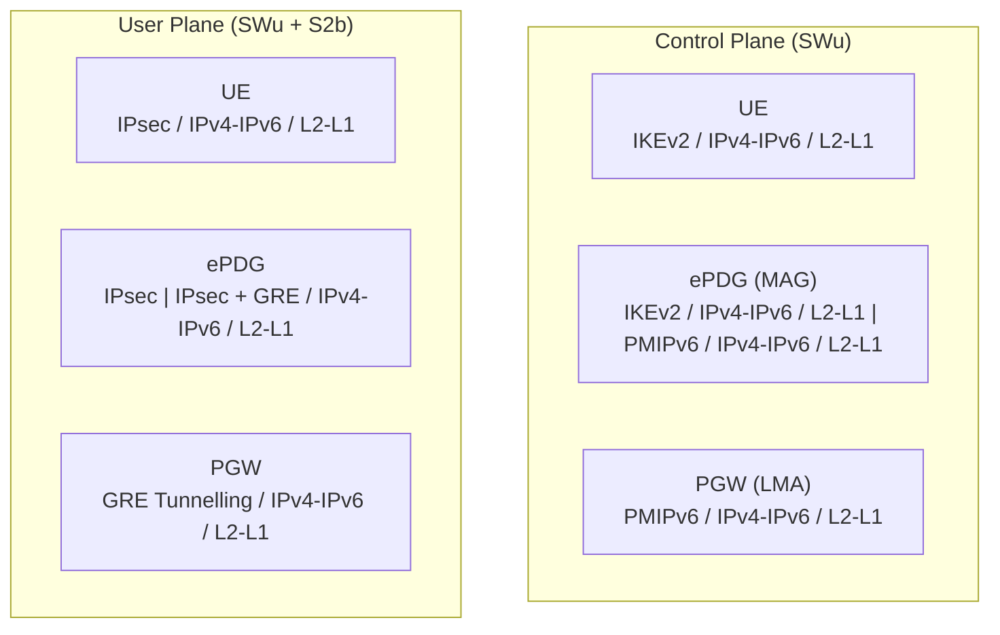

- **SWu (UE↔ePDG)**: IKEv2 for tunnel control + IPsec ESP for user data
- **S2b (ePDG↔PGW)**: PMIPv6 PBU/PBA for mobility signaling; GRE for user plane
- UE packets are IPsec-encapsulated to ePDG, then GRE-tunneled to PGW

### GTP Variant (Figure 7.1.1-2)

- **SWu (UE↔ePDG)**: IKEv2 + IPsec (same as PMIPv6 variant)
- **S2b (ePDG↔PGW)**: GTPv2-C (Create/Delete Session) + GTP-U for user plane
- ePDG relays UE data: IPsec → GTP-U tunneling

---

## Initial Attach on S2b — PMIPv6 Variant (§7.2.1)

### Preconditions
- UE has a local IP address from the untrusted non-3GPP access network
- This local IP is used as the outer header of all IKEv2/IPsec messages to ePDG

### 9-Step Attach Flow

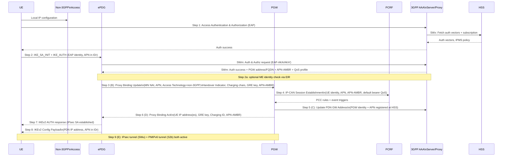

### Key Step Details

**Step 1 — Access Authentication:**
- UE authenticates to EPC via 3GPP AAA Server using EAP-AKA/AKA'
- AAA fetches authentication vectors from HSS (SWx)
- Subscription data and IPMS policy provided to untrusted access network

**Step 2 — IKEv2 Tunnel Establishment:**
- UE indicates supported mobility protocols; MOBIKE may be included
- ePDG discovered via DNS (see [ePDG selection](../entities/ePDG.md))
- If UE provides APN in IDr payload, ePDG uses it; otherwise uses default
- ME identity check (EIR) at step 2a is optional (home/visited network triggered)

**Step 3 (B) — Proxy Binding Update:**
- ePDG (as MAG) sends PBU to PGW (as LMA)
- Carries: MN NAI (identifies UE), APN, Access Technology Type, Handover Indicator
- Handover Indicator set to "attachment over new interface" (no HO) or "handover" if re-attach
- APN-AMBR from AAA included; ePDG may include User Location Information (WLAN location)

**Step 4 — PGW establishes IP-CAN session:**
- PGW → PCRF: IP-CAN Session Establishment (TS 23.203)
- PCRF provides APN-AMBR and Default Bearer QoS back to PGW
- Optional if dynamic PCC not deployed (static policy used instead)

**Step 6 (D) — Proxy Binding Ack:**
- PGW allocates UE IP address(es) (IPv4/IPv6 or dual based on PDN type)
- Returns: UE Address Info, GRE key for downlink, Charging ID
- ePDG learns whether PGW supports multiple PDN connections to same APN

**Step 8 — IP Address Delivery to UE:**
- ePDG sends PDN IP address to UE via IKEv2 Configuration Payload
- APN identity included in IDr payload

---

## Initial Attach on S2b — GTP Variant (§7.2.4)

The GTP variant follows the same high-level flow as §7.2.1, with these differences:

| PMIPv6 Variant | GTP Variant |
|---|---|
| Step B: Proxy Binding Update (PBU) | Step B.1: Create Session Request\n(IMSI, APN, RAT type, ePDG TEID for C-plane, PDN type, APN-AMBR, EPS Bearer ID, UE local IP, IMEI(SV)) |
| Step D: Proxy Binding Ack | Step D.1: Create Session Response\n(PGW TEID for C/U plane, PDN address, EPS Bearer QoS, APN-AMBR, Charging ID) |
| Step E: IPsec + PMIPv6 tunnels | Step E.1: IPsec + GTP tunnel(s) |

**GTP-specific notes:**
- RAT Type = non-3GPP IP access (encodes WLAN)
- ePDG TEID enables PGW to route downlink to ePDG
- PGW may create dedicated bearers on GTP S2b just as it can on S5/S8
- User Location Information (UE local IP, optional WLAN location) forwarded by ePDG to PGW

---

## Initial Attach for Emergency Session (§7.2.5)

Used when UE needs to establish an **IMS emergency PDN connection** over untrusted WLAN.

**Key differences from normal attach:**
- UE releases any existing untrusted access connectivity (§7.4.3) then re-attaches
- UE selects an **emergency-capable ePDG** per §4.5.4a (Emergency ePDG Selection)
- Uses **Emergency Configuration Data** at ePDG instead of subscriber profile
- IMEI used as identity if no IMSI available or unauthenticated
- No external AAA server involved (§9 of RFC 4739 not expected)

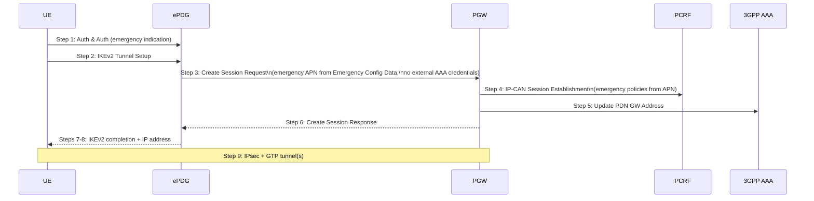

---

## Initial Attach via S2c / DSMIPv6 (§7.3)

For **host-based mobility** via untrusted access, UE uses DSMIPv6 directly to PGW:

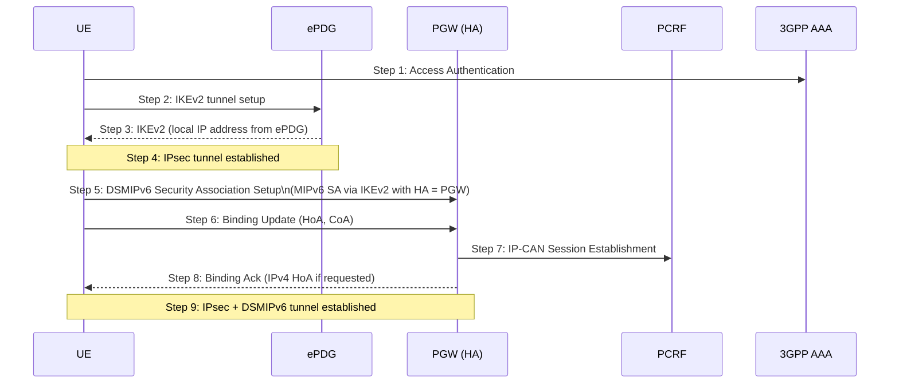

- UE acts as MN (Mobile Node); PGW acts as HA (Home Agent)
- ePDG provides an IP address for UE to use as CoA
- Binding Update carries HoA (IPv6) and CoA (IP from ePDG)
- IPsec tunnels protect both DSMIPv6 signaling and data

---

## Detach and PDN Disconnection — S2b (§7.4)

Four detach variants depending on initiator and S2b protocol:

### UE/ePDG-Initiated Detach — PMIPv6 (§7.4.1.1)

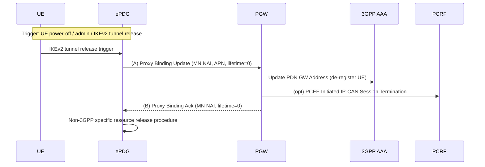

**Step details:**
1. IKEv2 tunnel release triggers PMIPv6 de-registration
2. ePDG sends PBU(lifetime=0) to PGW — de-registers UE from PGW
3. PGW notifies AAA; if no more contexts at AAA, AAA notifies HSS
4. Optional: PCEF-Initiated IP-CAN Session Termination to PCRF
5. PGW sends PBA(lifetime=0) — binding cache cleared

### UE/ePDG-Initiated Detach — GTP (§7.4.3.1)

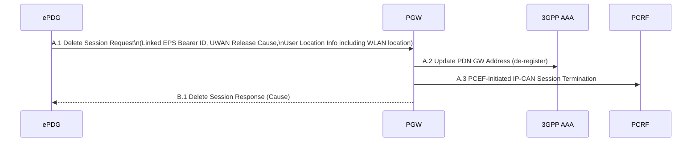

### HSS/AAA-Initiated Detach — PMIPv6 (§7.4.2.1)

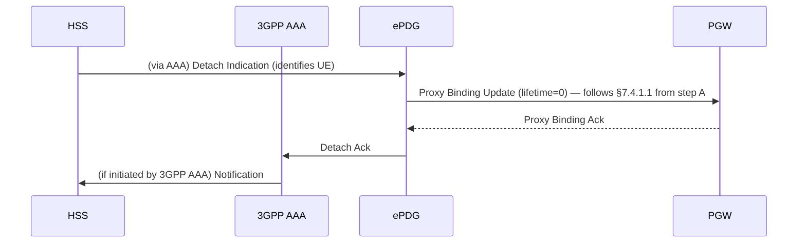

---

## Detach and PDN Disconnection — S2c (§7.5)

### UE-Initiated (§7.5.2)

1. UE sends **Binding Update (Lifetime=0, HoA, CoA)** to PGW — de-registers home address
2. PGW notifies AAA Server
3. Optional: PCEF-Initiated IP-CAN Session Termination (PCRF)
4. PGW sends **Binding Acknowledgement** to UE
5. UE terminates IKEv2 SA for this PDN (RFC 5996)
6. If no other PDN sessions: UE terminates IPsec tunnel to ePDG
7. Non-3GPP specific resource release

### HSS/AAA-Initiated (§7.5.3)

1. HSS/AAA → PGW: Session Termination request
2. PGW → UE: Detach Request
3. UE → PGW: Detach Ack
4. PGW: PCEF-Initiated IP-CAN Session Termination → PCRF
5. PGW → AAA: Session Termination Ack
6. PGW/UE: IKEv2 SA termination (RFC 5996)
7. If no other PDN sessions: IPsec tunnel terminated

### PDN GW-Initiated (§7.5.4)

1. PGW → UE: Detach Request (explicit PDN disconnection trigger)
2. UE → PGW: Detach Ack
3. PGW → AAA: Update PDN GW Address (de-register)
4. PCEF-Initiated IP-CAN Session Termination
5. IKEv2 SA termination (RFC 5996)
6. Non-3GPP resource release

> **Note (§7.5.4):** If triggered by UE binding lifetime expiration (implicit disconnect),
> steps 1–2 may be omitted — the PGW cleans up without explicit signaling to UE.

---

## Multiple PDN Connections via ePDG (§4.12)

- A UE may establish **multiple PDN connections** through the same ePDG (one per APN)
- Each PDN connection gets its own:
  - IPsec Child SA (either per-PDN or per-bearer mode — see §4.10.5)
  - S2b PMIPv6 binding or GTP session at PGW
  - PDN IP address
- **Constraint**: only one ePDG per UE — all PDN connections use the same ePDG
- **Constraint**: all PDN connections to the same APN must use the same PGW (IP continuity)

---

## QoS Model for S2b (§4.10.5)

### Single IPsec SA per PDN Connection (§4.10.5.1)

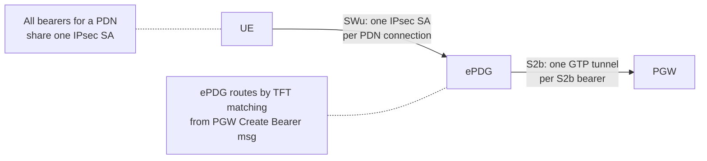

- One IPsec SA per PDN connection regardless of how many S2b bearers exist
- Default bearer always present; dedicated bearers possible (PCC-triggered)
- ePDG stores uplink TFT from PGW for per-bearer routing
- PGW routes downlink by DL packet filter → S2b TEID → ePDG → IPsec SA

### Single IPsec SA per S2b Bearer (§4.10.5.2)

- Separate IPsec Child SA per EPS bearer — enables per-bearer QoS marking (DSCP)
- ePDG maintains 1:1 mapping between IPsec SA and S2b bearer
- QoS info (QCI, GBR, MBR) conveyed from PGW to ePDG in IKEv2 signaling
- **IKEv2 Traffic Selectors (TSi/TSr) shall NOT be used for routing** — TFTs from PGW used instead

---

## Additional PDN Connectivity via Same ePDG (§7.6)

A UE that already has an active PDN connection via ePDG can establish **additional PDN
connections** through the same ePDG using a separate IKEv2 Child SA exchange.

The procedure for each additional PDN connection is identical to the initial attach (§7.2.1
for PMIPv6, §7.2.4 for GTP) with these constraints:

- The same ePDG instance is used (single ePDG per UE rule — §4.5.4)
- A different APN must be specified in the IDr payload of IKEv2
- IPMS applies independently for each PDN connection — the mobility protocol (PMIPv6/GTP)
  for the additional PDN connection is decided fresh
- The same PGW must be used if the APN was already connected via 3GPP access (§4.12)
- Each additional PDN connection creates:
  - A new IPsec Child SA on SWu
  - A new PMIPv6 binding or GTP session on S2b
  - A new IP address from PGW

**S2c variant (§7.6.3):** UE establishes an additional DSMIPv6 binding to the PGW for a
new PDN. Each additional PDN requires a new IKEv2 SA + IPsec tunnel to ePDG followed by a
new MIPv6 Binding Update to the relevant PGW (HA).

---

## PGW-Initiated Resource Deactivation (§7.9)

The PGW can initiate teardown of a PDN connection on S2b — triggered by network events such
as PCRF-initiated bearer deactivation, subscription change, or handover (see
[Non-3GPP Handover](non3GPP-handover.md)).

### PMIPv6 Variant (§7.9.1)

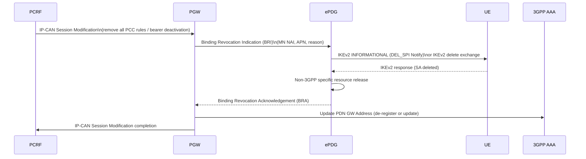

**BRI (Binding Revocation Indication):** PMIP RFC 5846 mechanism — PGW (LMA) signals ePDG
(MAG) to revoke the binding. Carries MN NAI, HoA, reason code (e.g. insufficient resources,
subscription revocation).

### GTP Variant (§7.9.2)

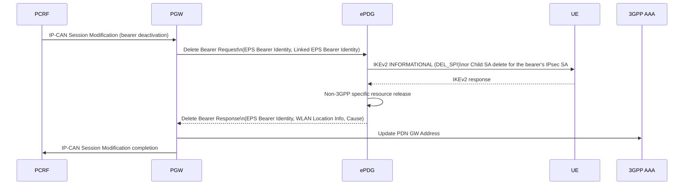

> **Note:** If the bearer being deleted is the **default bearer** (Linked EPS Bearer ID =
> own ID), this constitutes full PDN connection deactivation. All associated dedicated
> bearers are also deleted.

---

## Dedicated S2b Bearer Activation (§7.10)

GTP S2b supports **dedicated bearer creation** by PGW — analogous to the dedicated bearer
activation procedure on S5/S8 (TS 23.401 §5.4.1). This allows PCC-triggered QoS
differentiation within a PDN connection.

### 6-Step Flow

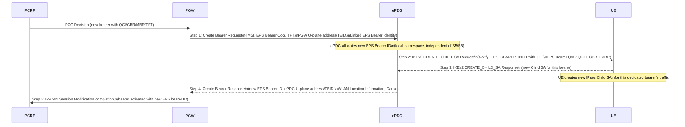

**Key points:**
- `EPS Bearer QoS` in IKEv2 Notify carries QCI, GBR, MBR — UE learns bearer QoS via IKEv2
  (no S1-AP/NAS involved)
- `TFT` in IKEv2 Notify tells UE which traffic uses this new bearer's IPsec SA
- In **single-IPsec-SA-per-PDN** mode (§4.10.5.1): no new IPsec Child SA is created — only
  the TFT mapping is updated; the Create Bearer Response still returns a new EPS Bearer ID
- `Linked EPS Bearer Identity` associates this dedicated bearer with the default bearer

---

## S2b Bearer Modification (§7.11)

Existing S2b bearers can be modified to change QoS parameters or traffic filters.

### PGW-Initiated Modification (§7.11.1)

Triggered by PCRF PCC rule update (e.g. QoS modification for an active media session):

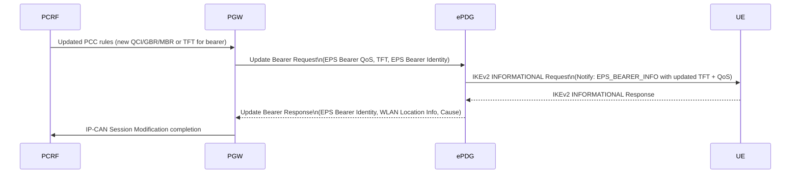

### HSS-Initiated Subscribed QoS Modification (§7.11.2)

Triggered by HSS updating the subscriber's QoS profile (subscribed QoS change):

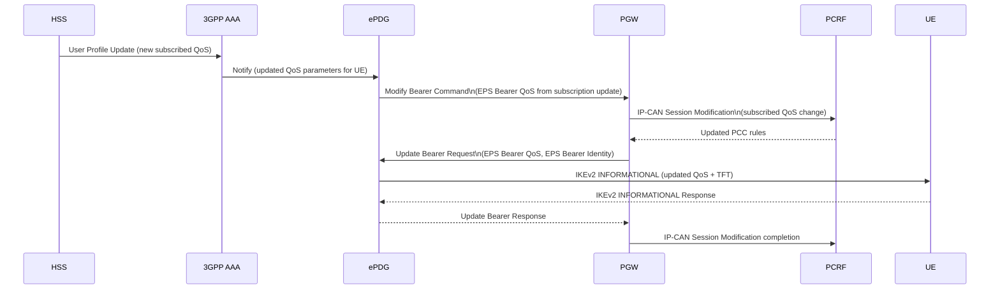

> **Pattern:** HSS-initiated QoS change follows the `AAA → ePDG → PGW → PCRF → PGW → ePDG`
> round-trip. The ePDG is the gateway that translates the AAA notification into GTPv2-C
> Modify Bearer Command toward the PGW.
