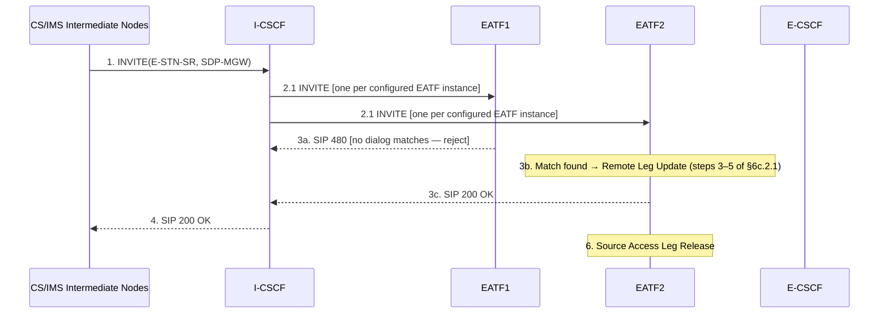
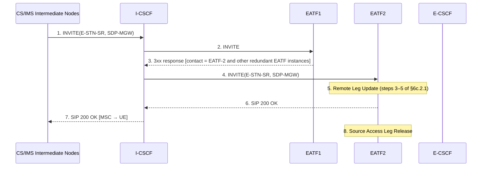
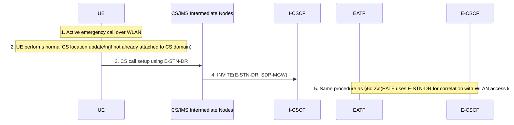

# SRVCC Emergency Session Procedures

This page covers procedures for transferring IMS emergency sessions via SRVCC (§6c) and DRVCC for WLAN (§6d).

Reference: **3GPP TS 23.237 §6c–§6d**

---

## Key Identifiers

| Identifier | Full Name | Allocated by | Purpose |
|---|---|---|---|
| **E-STN-SR** | Emergency Session Transfer Number for SRVCC | EATF (at origination) | Routes SRVCC request for emergency session to correct EATF |
| **E-STN-DR** | Emergency Session Transfer Number for DRVCC | EATF (at origination for WLAN) | Routes DRVCC request for WLAN emergency session |

---

## §6c SRVCC Emergency Session

### §6c.1 IMS Emergency Origination (PS to CS SRVCC supported)

```mermaid
sequenceDiagram
    participant UE
    participant PCSCF as P-CSCF
    participant ECSCF as E-CSCF
    participant EATF
    participant LRF as LRF/GMLC
    participant PSAP

    UE->>PCSCF: 1. INVITE(sos-um-SR, location reference)
    Note right of UE: UE includes SRVCC early-dialog indicator\nif it supports emergency SRVCC early-dialog transfer
    PCSCF->>ECSCF: 2. INVITE(...)
    ECSCF->>EATF: 3. INVITE(...)
    Note over EATF: 4. Anchor Emergency Session\n(EATF inserts itself as routing B2BUA;\ninvokes 3pcc per §6.3.1.3;\nallocates E-STN-SR)
    EATF->>ECSCF: 5. New INVITE(...)
    Note over ECSCF,LRF: 6. Optional: location/routing info retrieval (TS 23.167)
    ECSCF->>PSAP: 7. INVITE directly to PSAP or via MGCF
    PSAP-->>ECSCF: 8. Response to INVITE
    ECSCF-->>EATF: 9. Response to INVITE
    EATF-->>ECSCF: 10. Response to INVITE
    Note right of EATF: If network supports SRVCC early-dialog transfer\nand UE indicated support (step 1),\nEATF includes early-dialog SRVCC support indicator
    ECSCF-->>PCSCF: 11. Response to INVITE
    PCSCF-->>UE: 12. Response to INVITE
```

**Key point:** The **EATF** (Emergency Access Transfer Function) anchors the emergency session exactly as the ATCF anchors normal sessions (§6.3.1.3). The E-STN-SR is returned to the UE in the response message, enabling future SRVCC.

---

### §6c.2.1 SRVCC of Active Emergency Session — Single EATF Instance (6 steps)

```mermaid
sequenceDiagram
    participant MSC as CS/IMS Intermediate Nodes
    participant ICSCF as I-CSCF
    participant EATF
    participant ECSCF as E-CSCF
    participant PSAP

    MSC->>ICSCF: 1. INVITE(E-STN-SR, SDP-MGW)\nequipment identifier included
    ICSCF->>EATF: 2. INVITE(E-STN-SR, SDP-MGW)\n[routed via I5 interface — PSI-based AS termination per TS 23.228]
    Note over EATF: 3. Determine AT is requested;\nRemote Leg Update (§6.3.1.5)
    EATF->>ECSCF: 4. Re-INVITE(...)
    ECSCF->>PSAP: 5. Re-INVITE directly to PSAP or via MGCF\n[switches u-plane between UE and PSAP]
    Note over EATF: 6. Source Access Leg Release (§6.3.1.6)
```

> NOTE: For eCall over IMS sessions, EATF SHALL include indication in the Re-INVITE that it shall exclude INFO requests for Info Packages related to eCall over IMS (RFC 6086 §5.2.2), to prevent PSAP from requesting MSD via INFO after the transfer.

> NOTE: If non-voice media was part of the original emergency call session, the non-voice media will be released.

---

### §6c.2.2 SRVCC of Emergency Session in Early Dialog Phase — Single EATF Instance (9 steps)

Applies when the IMS emergency session is in pre-alerting or alerting state at time of SRVCC.

```mermaid
sequenceDiagram
    participant UE
    participant MSC as MSC Server
    participant ICSCF as I-CSCF
    participant EATF
    participant ECSCF as E-CSCF
    participant PSAP

    MSC->>ICSCF: 1. INVITE(E-STN-SR, SDP-MGW)
    ICSCF->>EATF: 2. INVITE(E-STN-SR, SDP-MGW)
    EATF->>ECSCF: 3. UPDATE(...) [not Re-INVITE — session is in early dialog]
    ECSCF->>PSAP: 4. UPDATE directly to PSAP or via MGCF
    EATF->>MSC: 5. Session State Information (UE alerting or pre-alerting state)
    MSC->>ICSCF: 6. Forward SSI to MSC Server
    MSC->>MSC: 7. Move to Call Delivered or Mobile Originating Call Proceeding state (TS 24.008)
    UE->>UE: 8. Move to 2G/3G CS; continue in Ringing or MO Call Proceeding state\n[UE ensures ring-back tone played if applicable]
    Note over EATF: 9. Source Access Leg Release (§6.3.1.6)
```

Key: UPDATE (not Re-INVITE) is used because the dialog is in early state. Session State Information is sent to MSC Server so it can align call state with the pre-SRVCC IMS state.

---

### §6c.2.3 Multiple EATF Instances — Active Session

Two alternative procedures when multiple EATF instances may have anchored the emergency session:

#### Alternative 1: Forking (§6c.2.3.1)



#### Alternative 2: Redirection (§6c.2.3.2)



> NOTE: Timeouts in the I-CSCF must be configured to ensure SRVCC can successfully conclude even if an EATF instance fails completely.

---

### §6c.2.4 Multiple EATF Instances — Early Dialog Phase

Same two alternatives (forking and redirection) as §6c.2.3, but with UPDATE instead of Re-INVITE and Session State Information sent to MSC Server (as in §6c.2.2 steps 5–8).

---

### §6c.3 SRVCC Support for UEs in Normal Mode

The EATF correlates the CS call leg with the IMS emergency session using the UE's **equipment identifier** (IMEI). Conveyance mechanism depends on MSC Server capabilities:

| MSC Server Type | Equipment ID Conveyance |
|---|---|
| MSC with SIP interface | TS 24.229 SIP mechanism to carry equipment identifier to EATF |
| MSC without SIP interface (no ICS) | IAM message to MGCF; MGCF uses TS 24.229 mechanism to convey to EATF |

> NOTE: The method for correlation at the EATF when SIP or ISUP does not carry this information is implementation/configuration dependent.

If the MSC Server is enhanced for ICS (TS 23.292), it performs IMS registration after the session transfer completes.

---

### §6c.4 SRVCC Support for UEs in Limited Service Mode

Same conveyance mechanism as §6c.3 (SIP or IAM). The MSC sets up the call leg to the EATF including the equipment identifier, enabling EATF correlation.

---

## §6d DRVCC Emergency Session for WLAN

DRVCC (Dual Radio VCC) applies when UE uses **WLAN access to EPC** (via S2a or S2b, see TS 23.167). The procedure is structurally identical to SRVCC but uses **E-STN-DR** instead of E-STN-SR.

### §6d.1 IMS Emergency Origination over WLAN

```mermaid
sequenceDiagram
    participant UE
    participant PCSCF as P-CSCF
    participant ECSCF as E-CSCF
    participant EATF
    participant LRF as LRF/GMLC
    participant PSAP

    UE->>PCSCF: 1. INVITE(sos-urn-SR, location reference)\n[over WLAN access]
    PCSCF->>ECSCF: 2. INVITE(...)
    ECSCF->>EATF: 3. INVITE(...)
    Note over EATF: 4. Anchor Emergency Session as routing B2BUA;\nallocates E-STN-DR (WLAN-specific);\nINVITE contains PANI header indicating WLAN access\n→ triggers E-STN-DR allocation
    EATF->>ECSCF: 5. New INVITE(...)
    Note over ECSCF,LRF: 6. Optional: location/routing info retrieval (TS 23.167)
    ECSCF->>PSAP: 7. INVITE directly to PSAP or via MGCF
```

E-STN-DR is returned to the UE in the EATF's response to step 3.

---

### §6d.2 DRVCC Session Transfer (PS/WLAN to CS)



**Key differences vs SRVCC:**
- DRVCC is a **"make before break"** procedure: the WLAN emergency call remains active while CS leg is being set up, so the emergency call is maintained throughout the handover
- The CS call setup uses **normal CS call** procedures (not CS emergency setup), which means it does NOT get higher RRC priority — this is a known limitation
- The MSC Server is configured to recognize the E-STN-DR number range as dual-radio emergency session continuity, enabling priority call handling if needed
- The EATF uses E-STN-DR to identify the source WLAN access leg and performs Access Transfer following §6c.2

> NOTE: It is for further study whether CS Setup procedure handling in the MSC can be optimized for this case.

---

## Cross-references

- [entities/ATCF.md](../entities/ATCF.md) — EATF is the emergency equivalent of ATCF; same anchoring architecture
- [entities/ATGW.md](../entities/ATGW.md) — media gateway controlled by EATF
- [procedures/PS-CS-access-transfer.md](PS-CS-access-transfer.md) — normal SRVCC AT procedures (§6.3)
- [concepts/IMS-service-continuity.md](../concepts/IMS-service-continuity.md) — SC architecture, EATF concept
