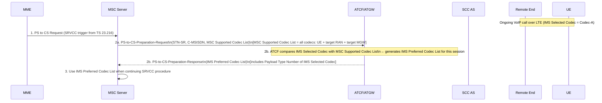

# SRVCC Enhancements — Codec Optimization and Call State Compatibility

This page covers Annex B (Normative) of TS 23.237: optional MSC Server enhancements to minimize transcoding during SRVCC and to avoid SRVCC in incompatible call states.

Reference: **3GPP TS 23.237 Annex B**

---

## B.1 Overview

Annex B describes three optional enhancements deployable at the MSC Server to improve SRVCC quality and efficiency:

| Sub-clause | Enhancement | When triggered |
|---|---|---|
| B.2.1 | Codec re-negotiation | After SRVCC completes |
| B.2.2 | Codec inquiry | Before SRVCC (during preparation) |
| B.3 | Reject SRVCC on call state incompatibility | Before SRVCC is initiated |

For the transcoding-minimization feature (B.2.1 + B.2.2): if enabled, at least one of B.2.1 or B.2.2 SHALL be supported and deployed by both MSC Server and IMS within one network.

---

## B.2.1 Codec Re-negotiation After SRVCC

### Purpose

After a successful SRVCC (PS→CS), there may be a transcoding point in the media path because the IMS Selected Codec (used on the PS leg with the remote end) may differ from the codec the CS-MGW uses with the UE (determined by target RAN capabilities).

This procedure allows the MSC Server to renegotiate the remote-end codec to match the CS codec, removing the transcoding point.

### Flow

```mermaid
sequenceDiagram
    participant UE
    participant MSC as MSC/MGW
    participant ATCF as ATCF/ATGW
    participant SCC as SCC AS
    participant Remote as Remote End

    Note over UE,Remote: 1. SRVCC performed:\nUE↔CS-MGW uses Codec-B;\nATGW↔Remote uses Codec-A\n(transcoding at ATGW)
    MSC->>ATCF: 2. Re-INVITE(codec-B) [list: codec-B is preferred]
    ATCF->>SCC: 3. Re-INVITE(codec-B) [passed through]
    SCC->>Remote: 4. Re-INVITE(codec-B)
    Remote-->>SCC: 5. Answer [remote selects codec-B — best match]
    SCC-->>ATCF: 6. Answer
    ATCF-->>MSC: 7. Answer
    Note over UE,Remote: Codec-B now used end-to-end; ATGW transcoding eliminated
```

**Precondition check:** If the IMS Selected Codec (used pre-SRVCC) is already in the MSC's codec list, the ATCF may have already selected it — in that case the ATGW has no transcoding and this step is unnecessary. The flow applies when the IMS codec is NOT in the MSC's list (requiring transcoding at ATGW post-SRVCC).

> NOTE: If a codec mode change (bitrate, audio bandwidth, e.g. EVS Primary vs AMR-WB IO mode) rather than a full codec switch is required, the ATCF may initiate codec mode signalling separately (SIP invite or RTCP-APP/CMR). This is codec-specific and independent of the re-negotiation procedure.

---

## B.2.2 Codec Inquiry Prior to SRVCC

### Purpose

During SRVCC preparation (before radio reservation), the MSC Server queries the ATCF for the optimal codec to use on the CS access leg. This enables the MSC to select the best codec before committing to the radio procedure, potentially avoiding transcoding altogether.

### Procedure (§B.2.2.1)



**During Session Transfer:** The ATCF uses the MSC Preferred Codec List (from the INVITE at Session Transfer initiation per TS 23.216) to determine the optimal codec for the MSC-IMS interface. The ATCF includes the chosen codec in the Initiation of Session Transfer response back to MSC Server.

> NOTE 1: If the CS Codec from target RAN is still incompatible with the IMS Selected Codec after codec inquiry, transcoding is required. The ATCF initiates a Re-INVITE to the remote end to modify the IMS Selected Codec — this is independent of the SRVCC procedure and may occur any time after SRVCC.

> NOTE 2: If only a codec mode change (not codec switch) is needed, signalling is via SIP invite or RTCP-APP/CMR — may be started as soon as ATCF receives the MSC Supported Codec List.

---

## B.3 Reject SRVCC Due to UE Call State Incompatibility

### Purpose

In some call states (e.g. pre-alerting, alerting), SRVCC may not be possible (network configuration-dependent). This enhancement allows the MSC Server to learn the actual call state from IMS and decide whether to proceed with SRVCC before committing radio resources.

### Mechanism

1. IMS indicates to the MSC Server:
   - Whether it supports SRVCC in pre-alerting state
   - Whether it supports SRVCC in alerting state
   - The actual current call state

2. If SRVCC is NOT possible at this call state (e.g. session is in pre-alerting but early-dialog SRVCC not supported):
   - MSC Server SHALL NOT proceed with SRVCC
   - MSC Server may retry once call reaches a compatible state

> NOTE: Stage 3 may specify different solutions: one integrated with the codec inquiry procedure (B.2.2), another as a standalone procedure.

---

## Cross-references

- [entities/ATCF.md](../entities/ATCF.md) — ATCF role in codec inquiry and re-negotiation
- [procedures/PS-CS-access-transfer.md](PS-CS-access-transfer.md) — SRVCC PS→CS AT procedure (§6.3.2)
- [concepts/IMS-service-continuity.md](../concepts/IMS-service-continuity.md) — SRVCC concept and triggers
