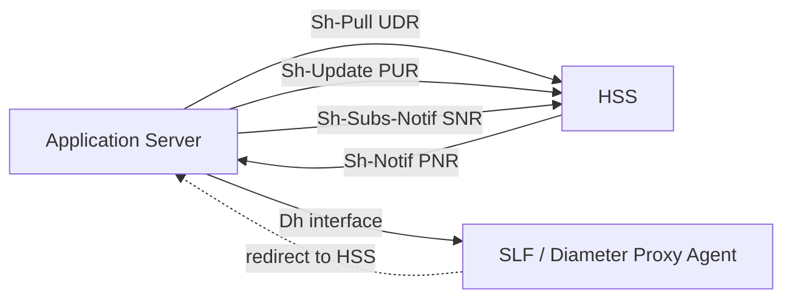
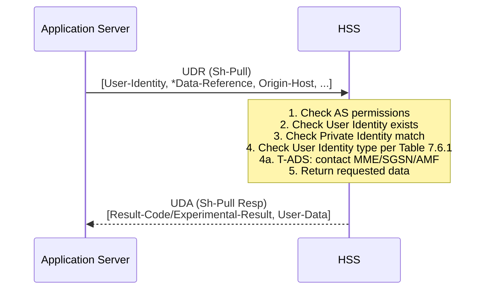
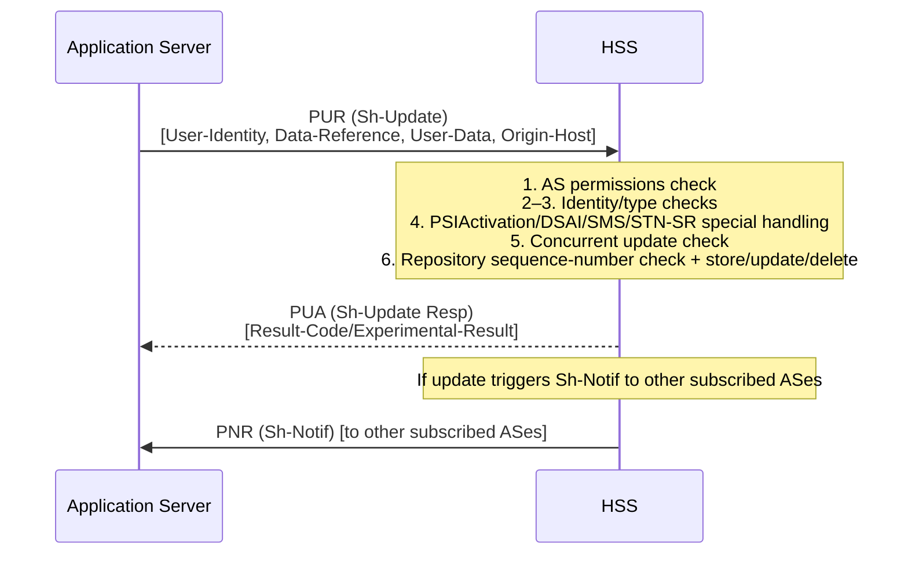
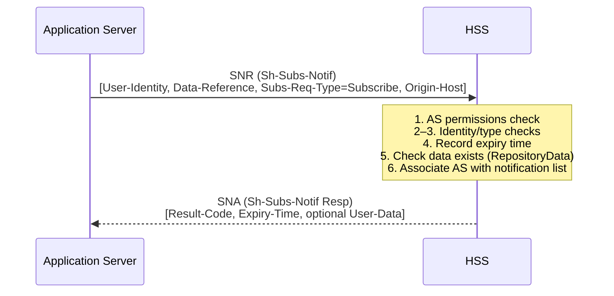
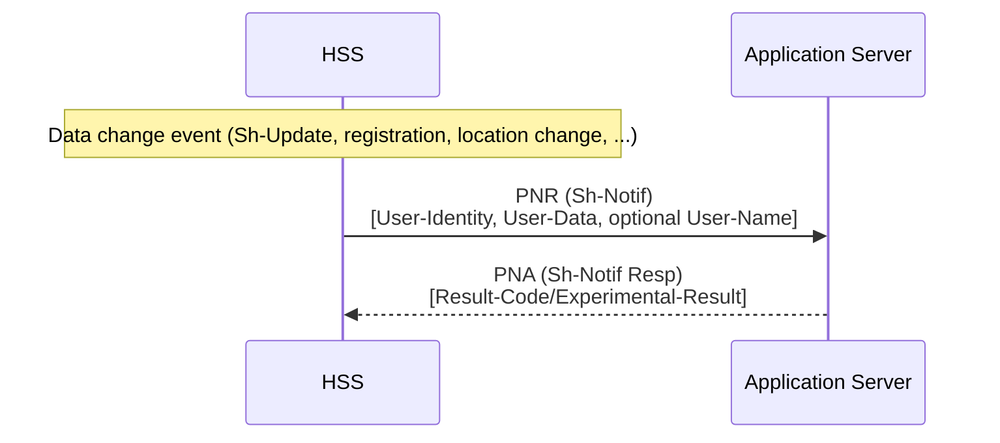
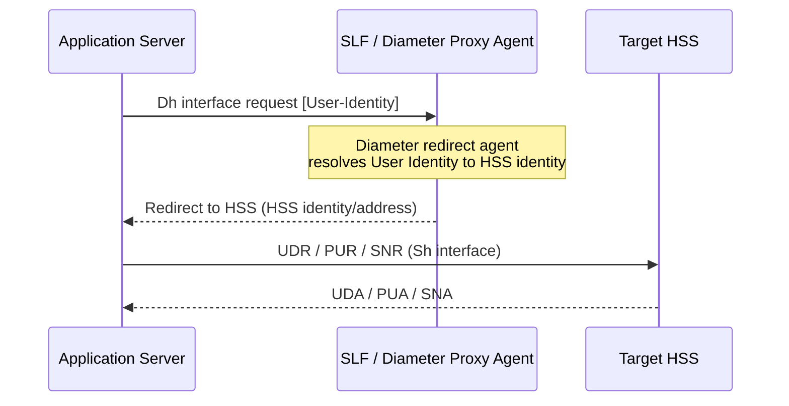

# Sh Interface — Signalling Flows and Procedure Descriptions

Companion to [protocols/Sh-Diameter.md](../protocols/Sh-Diameter.md) which covers the Diameter wire encoding. This page captures the **procedure semantics**, **IE tables**, and **HSS processing logic** as defined in 3GPP TS 29.328 v16.1.0.

---

## Architecture and Functional Classification (§4–§5)

The Sh interface connects an **Application Server (AS)** or **OSA Service Capability Server (SCS)** to the **[HSS](../entities/HSS.md)**. The Ph interface (HSS ↔ Presence Network Agent) has identical functionality to Sh — all Sh rules apply equally to Ph.

### Definitions

| Term | Meaning |
|---|---|
| **Transparent data** | Data understood syntactically but _not_ semantically by the HSS; opaque blobs stored on behalf of an AS (e.g. service logic state, feature flags) |
| **Non-transparent data** | Data understood both syntactically and semantically by the HSS (e.g. iFC, IMPU, IMS User State) |
| **AS** | SIP Application Server or OSA Service Capability Server |

### Functional Classification of Sh Procedures (§5.2)

Sh procedures are grouped into two families:

1. **Data handling procedures**
   - **Sh-Pull** — AS downloads transparent and/or non-transparent data from HSS
   - **Sh-Update** — AS updates data in HSS (transparent repository data, PSI activation state, DSAI, SMSRegistrationInfo, STN-SR)

2. **Subscription/notification procedures**
   - **Sh-Subs-Notif** — AS subscribes to receive HSS notifications when specific data changes
   - **Sh-Notif** — HSS notifies AS of data changes for which AS previously subscribed

### IE Category Rules (§6 preamble)

| Category | Behaviour if absent |
|---|---|
| **M** — Mandatory | Application error; receiver returns answer with DIAMETER_MISSING_AVP and Failed-AVP |
| **C** — Conditional | If condition met and absent: application error with DIAMETER_MISSING_AVP; if condition not met and present: may be ignored or DIAMETER_AVP_NOT_ALLOWED |
| **O** — Optional | Absence or presence does not cause error |

**Public Identity canonicalization:** Before identity lookup, HSS/SLF converts SIP URIs to canonical form per RFC 3261 §10.3, and removes visual separators + URI parameters from Tel URIs in E.164 format.

**Unknown error code handling:** Unknown permanent failure codes → treat as DIAMETER_UNABLE_TO_COMPLY; unknown transient codes → may retry or treat as DIAMETER_UNABLE_TO_COMPLY.

---

## 6.1.1 Sh-Pull (Data Read)

**Purpose:** AS reads transparent and/or non-transparent data for a specified user from the HSS.

**Diameter mapping:** UDR / UDA (Command-Code 306); see [protocols/Sh-Diameter.md](../protocols/Sh-Diameter.md).

### Table 6.1.1.1 — Sh-Pull Request IEs

| IE | Diameter AVP | Cat. | Description |
|---|---|---|---|
| User Identity (§7.1) | User-Identity | M | IMPU / PSI / MSISDN / External Identifier of user for whom data is required |
| Wildcarded PSI (§7.1A) | Wildcarded-Public-Identity | O | If request refers to a Wildcarded PSI; mutually exclusive with Wildcarded IMPU |
| Wildcarded IMPU (§7.1B) | Wildcarded-IMPU | O | If request refers to a Wildcarded Public User Identity; mutually exclusive with Wildcarded PSI |
| Requested data (§7.3) | Data-Reference | M | Reference to the requested data (values in Table 7.6.1) |
| Requested Identity set (§7.11) | Identity-Set | O | If Data-Reference = IMSPublicIdentity: specifies which set to download |
| Requested domain (§7.2) | Requested-Domain | C | CS-Domain or PS-Domain; applicability per Table 7.6.1 |
| Requested nodes (§7.2A) | Requested-Nodes | O | Node types (MME/SGSN/3GPP-AAA-Server/AMF bitmask) |
| Current Location (§7.8) | Current-Location | C | Present if Location Information requested; value 1 (InitiateActiveLocationRetrieval) → HSS signals MSC/VLR/SGSN/MME for active location retrieval |
| Service Indication (§7.4) | Service-Indication | C | Identifies (with User-Identity + Data-Reference) the set of transparent data; applicability per Table 7.6.1 |
| Application Server Identity (§7.9) | Origin-Host | M | Identifies AS originator; used to check AS Permissions List |
| Application Server Name (§7.10) | Server-Name | C | Used with User-Identity + Data-Reference as key to identify filter criteria; check Table 7.6.1 |
| DSAI Tag (§7.14) | DSAI-Tag | C | Identifies the DSAI instance for which DSAI information is requested |
| Session Priority (§7.15) | Session-Priority | O | Session priority indication to HSS |
| Private Identity (§7.19) | User-Name | C | Private Identity of user; check Table 7.6.1 |
| Serving Node Indication (§7.2B) | Serving-Node-Indication | O | Only serving node address/identity associated with location data required |
| Pre-paging Supported (§7.18) | Pre-paging-Supported | O | Whether AS supports pre-paging; absence means not supported |
| Local Time Zone Indication (§7.19) | Local-Time-Zone-Indication | O | Whether only Local Time Zone, or Local Time Zone with location info, is required |
| UDR Flags (§7.20) | UDR-Flags | O | Bitmask (bit0=Location-Information-EPS-Supported, bit1=RAT-Type-Requested) |
| Call-Reference-Info (§7.21) | Call-Reference-Info | O | Call Reference Number + AS-Number for MTRR; present when Data-Reference is CSRN |

### Table 6.1.1.2 — Sh-Pull Response IEs

| IE | Diameter AVP | Cat. | Description |
|---|---|---|---|
| Result (§7.5) | Result-Code / Experimental-Result | M | Standard Result-Code for IETF Diameter errors; Experimental-Result (grouped: Vendor-ID + Experimental-Result-Code) for Sh-specific errors |
| Wildcarded PSI (§7.1A) | Wildcarded-Public-Identity | O | If request matched a Wildcarded PSI not included in User-Data AVP; AS may use to identify the Wildcarded PSI |
| Wildcarded IMPU (§7.1B) | Wildcarded-IMPU | O | If request matched a Wildcarded IMPU not included in User-Data AVP |
| Data (§7.6) | User-Data | C | Requested data; present if data exists in HSS and AS has read permissions |

### §6.1.1.1 HSS Detailed Behaviour (Sh-Pull)

HSS processes Sh-Pull in the following order, stopping and returning the listed error on any failure:

1. **AS permissions check (§6.2):** Check that the combination of AS Identity (Origin-Host) + Data-Reference is allowed to be read. If not → `DIAMETER_ERROR_USER_DATA_CANNOT_BE_READ`.
2. **User Identity exists:** Verify User Identity exists in HSS. If not → `DIAMETER_ERROR_USER_UNKNOWN`.
2a. **Private Identity correspondence:** If Private Identity received, verify it corresponds to the IMPU/MSISDN/External Identifier in User-Identity. If not → `DIAMETER_ERROR_IDENTITIES_DONT_MATCH`.
3. **User Identity type applicability:** Check User Identity type applies to the Data-Reference per Table 7.6.1 (Notif-Eff in use). If not → `DIAMETER_ERROR_OPERATION_NOT_ALLOWED`.
3a. **Shared IMPU restriction:** If Data-Reference = IPAddressSecureBindingInformation(22) and IMPU is shared between multiple Private User Identities → `DIAMETER_ERROR_OPERATION_NOT_ALLOWED`.
4. **Concurrent update conflict:** If data being updated by another entity, HSS may delay response until update completes. If cannot delay → `DIAMETER_ERROR_USER_DATA_NOT_AVAILABLE`.
4a. **T-ADS information retrieval:** If T-ADS Information (Data-Reference=26) requested:
   - HSS/UDM contacts MME, SGSN, and/or AMF (based on registered serving nodes) to retrieve IMS Voice over PS Sessions support indication, Access Type, and RAT Type
   - If a serving node does not support T-ADS Data Retrieval or does not successfully answer → HSS indicates IMS Voice over PS Sessions support as **unknown**
   - Exception: if UE is registered to a Gn/Gp-SGSN → HSS shall not contact the MME for T-ADS; reports most recent support indication from Gn/Gp-SGSN (or AMF if AMF needs to be contacted)
   - HSS provides most recent IMS VoPS support indication; may also provide last UE activity time with timezone
4b. **CSRN/MTRR handling:** If CSRN requested and roaming number retrieval from MSC/VLR fails → include empty CSRN element in XML. If MTRR applicable → set MTRR-Indication in XML document per TS 23.292.
5. **Return data in User-Data AVP:**
   - If **Notif-Eff not supported** by both AS and HSS: HSS shall not include User-Data AVP if data not available to HSS; otherwise include all requested data even if some elements are unavailable (indicated by empty elements)
   - If **Notif-Eff supported**: include data for all requested Data References, Service Indications, and Identity Sets; unavailability indicated as follows:

| Unavailable data | Indication in XML |
|---|---|
| Repository data (no Service Data) | RepositoryData element with Service-Indication + Sequence-Number but no ServiceData child |
| IMS Public Identifiers | Empty PublicIdentifiers element |
| Location (CS/PS/EPS) | Empty CSLocationInformation / PSLocationInformation / EPSLocationInformation element |
| CS-UserState | Missing CSUserState element |
| PS-UserState | Missing PSUserState element |
| EPS-UserState | Missing EPSUserState element |
| S-CSCF name | Empty SCSCFName element |
| IP Address Secure Binding Info | Empty IPv4address or IPv6prefix element |
| iFCs for AS | Empty IFCs element |
| UE SRVCC capability | Missing UE-SRVCC-Capability element |
| UE 5G SRVCC capability | Missing UE-5G-SRVCC-Capability element |
| STN-SR | Empty STN-SR element |
| CSRN | Empty CSRN element |
| IMSI | Empty IMSI element |

---

## 6.1.2 Sh-Update (Data Update)

**Purpose:** AS updates data in the HSS. Covers:
- Transparent (repository) data stored at HSS per IMPU (or Wildcarded IMPU/PSI) or PSI
- PSI Activation State of a distinct Public Service Identity
- DSAI (Dynamic Service Activation Information) stored at HSS
- SMSRegistrationInfo (IP-SM-GW number and Diameter identity)
- STN-SR (Session Transfer Number for SRVCC) at HSS and/or UDM

**Diameter mapping:** PUR / PUA (Command-Code 307).

### Table 6.1.2.1 — Sh-Update Request IEs

| IE | Diameter AVP | Cat. | Description |
|---|---|---|---|
| User Identity | User-Identity | M | IMPU / PSI / MSISDN / External Identifier for which data is being updated |
| Wildcarded PSI | Wildcarded-Public-Identity | O | If request refers to a Wildcarded PSI |
| Wildcarded IMPU | Wildcarded-IMPU | O | If request refers to a Wildcarded IMPU |
| Requested data (§7.3) | Data-Reference | M | Reference to the data on which update is required (values in Table 7.6.1) |
| Data (§7.6) | User-Data | M | Updated data content |
| Application Server Identity (§7.9) | Origin-Host | M | AS originator; used to check AS Permissions List |
| Private identity | User-Name | C | Private Identity of user for whom data is required; check Table 7.6.1 |

### Table 6.1.2.2 — Sh-Update Response IEs

| IE | Diameter AVP | Cat. | Description |
|---|---|---|---|
| Result | Result-Code / Experimental-Result | M | Result of the update in HSS |
| Wildcarded PSI | Wildcarded-Public-Identity | O | If request matched a Wildcarded PSI |
| Wildcarded IMPU | Wildcarded-IMPU | O | If request matched a Wildcarded IMPU |
| Repository Data ID (§7.17) | Repository-Data-ID | O | Present if Update-Eff feature supported and multi-repo-data-instance update fails: contains service indication + sequence number of the failing data instance |
| Requested data (§7.3) | Data-Reference | O | Present if Update-Eff-Enhance feature supported and multi-data-reference update fails: contains Data-Reference of failing instance |

### §6.1.2.1 HSS Detailed Behaviour (Sh-Update)

**Sequence Number semantics:**
- Sequence Number = 0 → newly added transparent data (reserved exclusively for new creation)
- Modification or deletion → Sequence Number = n+1 where n is the original; wraps 65535 → 1

HSS processes Sh-Update in the following order:

1. **AS permissions check (§6.2):** DIAMETER_ERROR_USER_DATA_CANNOT_BE_MODIFIED if update not allowed.
2. **User Identity exists:** DIAMETER_ERROR_USER_UNKNOWN.
2a. **Private Identity correspondence:** DIAMETER_ERROR_IDENTITIES_DONT_MATCH.
3. **User Identity type applicability:** DIAMETER_ERROR_OPERATION_NOT_ALLOWED (if Notif-Eff in use).
4. **PSIActivation (18):** Check User Identity is a distinct (non-Wildcarded) PSI; update PSI Activation State → DIAMETER_SUCCESS. PSI change ACTIVE→INACTIVE triggers **network-initiated deregistration** of the PSI in the HSS.
4a. **DSAI (19):** Check if a DSAI instance matching the DSAI-Tag exists for the Public Identity. Update DSAI value → DIAMETER_SUCCESS; if not found → DIAMETER_ERROR_DSAI_NOT_AVAILABLE. DSAI value change triggers iFC mask/unmask procedures — HSS behaves as if initial filter criteria were administratively changed (may send Sh-Notif or Cx-Update_Subscr_Data).
4b. **SMSRegistrationInfo (24):**
   - If IP-SM-GW Diameter Identity field in User-Data is empty → delete stored IP-SM-GW number and IP-SM-GW Diameter Identity → DIAMETER_SUCCESS
   - If not empty → store/update IP-SM-GW number; if S6c supported → store registered IP-SM-GW Diameter Identity from Origin-Host + Origin-Realm
   - Pre-configured IP-SM-GW number and pre-configured IP-SM-GW Diameter Identity shall NOT be overwritten
   - NOTE: Service Centre Address in HSS is NOT updated by this operation (only applicable to Sh-Pull)
4c. **Update-Eff-Enhance atomicity:** If multiple repository data instances in request, validate all before changing any; if any instance fails during Steps 5–6, restore all to pre-update state. Return Repository-Data-ID (Update-Eff) or Data-Reference (Update-Eff-Enhance) of failing instance.
4d. **STN-SR (27):** If STN-SR value different from previously stored → overwrite. If HSS supports UDM interworking (TS 23.632): if STN-SR different from UDM stored value → overwrite in UDM. If no stored STN-SR in both HSS and UDM → DIAMETER_ERROR_OPERATION_NOT_ALLOWED.
5. **Concurrent update check:** DIAMETER_PRIOR_UPDATE_IN_PROGRESS if data update is already in progress for same user/data.
6. **Repository data write logic:**

**If repository data for the Service-Indication already exists:**
- Check: (Sequence_Number_in_Sh_Update ≠ 0) AND ((Sequence_Number_in_Sh_Update – 1) = (Sequence_Number_in_HSS mod 65535))
- If either check fails → DIAMETER_ERROR_TRANSPARENT_DATA_OUT_OF_SYNC
- If both true and Service Data present:
  - If data size > HSS maximum → DIAMETER_ERROR_TOO_MUCH_DATA
  - Otherwise: update repository data, update sequence number → trigger Sh-Notif to all subscribed ASes
- If Service Data absent → remove the repository data entry; trigger Sh-Notif (with absent Service Data) to all subscribed ASes; then remove all subscriptions for that repository data

**If repository data for the Service-Indication does NOT exist (new creation):**
- If Sequence Number ≠ 0 → DIAMETER_ERROR_TRANSPARENT_DATA_OUT_OF_SYNC
- If Sequence Number = 0 and Service Data absent → DIAMETER_ERROR_OPERATION_NOT_ALLOWED
- If Sequence Number = 0 and Service Data present:
  - If data size > HSS maximum → DIAMETER_ERROR_TOO_MUCH_DATA
  - Otherwise → store new data in repository

**Update-Eff atomicity:** If both AS and HSS support Update-Eff, update is successful only if ALL repository data instances succeed; otherwise restore all to pre-update state.

> **NOTE (TRANSPARENT_DATA_OUT_OF_SYNC recovery):** AS may resolve the inconsistency by executing a Sh-Pull to retrieve the current version, or by waiting for a subsequent Sh-Notif carrying the current data.

---

## 6.1.3 Sh-Subs-Notif (Subscription to Notifications)

**Purpose:** AS subscribes to receive notifications from HSS when particular transparent and/or non-transparent data for a specified IMPU or PSI is updated. Optionally request current data in the same operation.

**Diameter mapping:** SNR / SNA (Command-Code 308).

### Table 6.1.3.1 — Sh-Subs-Notif Request IEs

| IE | Diameter AVP | Cat. | Description |
|---|---|---|---|
| User Identity (§7.1) | User-Identity | M | IMPU / PSI / MSISDN / External Identifier for which change notifications are requested |
| Wildcarded PSI (§7.1A) | Wildcarded-Public-Identity | O | If request refers to a Wildcarded PSI |
| Wildcarded IMPU (§7.1B) | Wildcarded-IMPU | O | If request refers to a Wildcarded IMPU |
| Requested Data (§7.3) | Data-Reference | M | Data on which notifications of change are required (valid values defined in §7.6) |
| Subscription request type (§7.7) | Subs-Req-Type | M | Subscribe(0) or Unsubscribe(1) |
| Send Data Indication (§7.13) | Send-Data-Indication | O | Request current data in response; not applicable to one-time UE reachability for IP subscriptions |
| Service Indication (§7.4) | Service-Indication | C | Identifies (with User-Identity + Data-Reference) the transparent data to be notified; check Table 7.6.1 |
| Application Server Identity (§7.9) | Origin-Host | M | AS originator; used for AS permissions check |
| Application Server Name (§7.10) | Server-Name | C | Used with User-Identity + Data-Reference to identify iFC filter criteria |
| Expiry Time (§7.12) | Expiry-Time | O | Absolute time at which subscription expires; absence = unlimited subscription |
| DSAI Tag (§7.14) | DSAI-Tag | C | Identifies the DSAI instance for which change notifications are requested |
| Requested Identity set (§7.11) | Identity-Set | C | If Data-Reference = IMSPublicIdentity: specifies information to subscribe to (and optionally download) |
| One time notification (§7.16) | One-Time-Notification | C | Subscription ends after first notification; **shall be present** for UE reachability for IP |
| Private identity | User-Name | O | Private Identity; check Table 7.6.1 |

### Table 6.1.3.2 — Sh-Subs-Notif Response IEs

| IE | Diameter AVP | Cat. | Description |
|---|---|---|---|
| Expiry Time (§7.12) | Expiry-Time | O | Acknowledges the absolute time at which the subscription expires (may be earlier than requested) |
| Data (§7.6) | User-Data | O | Current values of subscribed data; present if Send-Data-Indication = USER_DATA_REQUESTED |
| Wildcarded PSI (§7.1A) | Wildcarded-Public-Identity | O | If request matched Wildcarded PSI not in User-Data AVP |
| Wildcarded IMPU (§7.1B) | Wildcarded-IMPU | O | If request matched Wildcarded IMPU not in User-Data AVP |
| Result (§7.5) | Result-Code / Experimental-Result | M | Result of the subscription request |

### §6.1.3.1 HSS Detailed Behaviour (Sh-Subs-Notif)

1. **AS permissions check (§6.2):** Check AS has Sh-Subs-Notif permission for the Data-Reference. If not → DIAMETER_ERROR_USER_DATA_CANNOT_BE_NOTIFIED.
2. **User Identity exists:** DIAMETER_ERROR_USER_UNKNOWN.
2a. **Private Identity correspondence:** DIAMETER_ERROR_IDENTITIES_DONT_MATCH.
3. **User Identity type applicability:** DIAMETER_ERROR_OPERATION_NOT_ALLOWED (Notif-Eff in use; per Table 7.6.1 for all Data-References).
3a. **DSAI check:** If Data-Reference = DSAI(19): verify DSAI-Tag matches an existing DSAI instance for the Public Identity. If not → DIAMETER_ERROR_DSAI_NOT_AVAILABLE.
4. **Expiry Time handling:**
   - If Expiry-Time in request: HSS records subscription expiry (may set a time earlier than requested); includes Expiry-Time in SNA response
   - After expiry time passes: no further notifications sent
   - If no Expiry-Time IE → unlimited subscription
   - Subsequent request with different Expiry-Time → HSS updates stored expiry time
5. **Repository data existence:** If subscribe request and Data-Reference = RepositoryData(0) and transparent data with Service-Indication does not exist → DIAMETER_ERROR_SUBS_DATA_ABSENT.
6. **Subscribe/Unsubscribe:**
   - Subscribe: HSS associates AS Identity with the notification list; sets Result-Code = DIAMETER_SUCCESS in SNA
   - Unsubscribe: HSS removes AS Identity from the notification list; if AS not in list → still DIAMETER_SUCCESS
7. **Notif-Eff + multiple Data-Reference AVPs:** Each Data-Reference treated as a separate notification request (atomically). All succeed → DIAMETER_SUCCESS; if one fails → return relevant Diameter error and revert to pre-request subscription state.
8. **Notif-Eff + multiple Service-Indication AVPs:** Same atomicity — each Service-Indication is a separate notification request per Data-Reference.
8a. **Notif-Eff + different Identity-Set AVPs:** Each Identity-Set treated as a separate notification request; same atomicity.
9. **Send Data Indication + concurrent update:** If Send-Data-Indication present and data currently being updated, HSS may delay response until update completes; ensures returned data is not corrupted.
10. **Send Data Indication + Notif-Eff:** HSS includes data for all requested Data References in User-Data AVP, with empty-element unavailability indicators.

---

## 6.1.4 Sh-Notif (Notifications)

**Purpose:** HSS pushes data-change notifications to AS for data items for which the AS previously subscribed (via Sh-Subs-Notif).

**Diameter mapping:** PNR / PNA (Command-Code 309). The **HSS is the Diameter client** (sends PNR); the **AS is the Diameter server** (returns PNA).

### Table 6.1.4.1 — Sh-Notif Request IEs

| IE | Diameter AVP | Cat. | Description |
|---|---|---|---|
| User Identity (§7.1) | User-Identity | M | IMPU / PSI / MSISDN / External Identifier for which data has changed; if Wildcarded PSI matches, HSS may include any Wildcarded PSI matching |
| Wildcarded PSI (§7.1A) | Wildcarded-Public-Identity | O | Present if the request refers to a Wildcarded PSI; AS uses this (not User-Identity) to identify affected identity |
| Wildcarded IMPU (§7.1B) | Wildcarded-IMPU | O | Present if the request refers to a Wildcarded IMPU |
| Data (§7.6) | User-Data | M | The changed data |
| Private Identity | User-Name | C | Present only if the associated Sh-Subs-Notif subscription included a Private Identity |

### Table 6.1.4.2 — Sh-Notif Response IEs

| IE | Diameter AVP | Cat. | Description |
|---|---|---|---|
| Result (§7.5) | Result-Code / Experimental-Result | M | Result-Code for IETF Diameter errors; Experimental-Result (grouped: 3GPP Vendor-ID + Experimental-Result-Code) for Sh errors |

### Sh-Notif Response Codes (returned by AS in PNA)

| Result-Code AVP value | Condition |
|---|---|
| DIAMETER_SUCCESS | Request succeeded |
| DIAMETER_ERROR_USER_DATA_NOT_RECOGNIZED | AS received user information it does not recognize or support |
| DIAMETER_ERROR_USER_UNKNOWN | Public Identity or MSISDN not found in AS |
| DIAMETER_ERROR_TOO_MUCH_DATA | AS informs HSS it tried to push too much data |
| DIAMETER_ERROR_NO_SUBSCRIPTION_TO_DATA | Notification refers to data the AS is not subscribed to |
| DIAMETER_UNABLE_TO_COMPLY | Request failed (generic) |

> **DIAMETER_ERROR_USER_UNKNOWN in PNA:** If HSS receives this from the AS, the HSS shall **remove ALL subscription-to-notification information** subscribed by that AS for that User Identity.

### §6.1.4.1 HSS Detailed Behaviour (Sh-Notif)

- **Data keys:** User-Data AVP carries the changed data; for repository data changes, Service-Indication and Sequence-Number are also included.
- **Authentication pending state:** State transitions to/from authentication pending state shall NOT trigger Sh-Notif (transient state, normally very brief).
- **Notif-Eff batching:** If both AS and HSS support Notif-Eff and multiple subscriptions are associated with a Public User Identity → HSS may combine notifications for multiple Data References and Service Indications into a **single PNR message**.
- **Update-Eff + Notif-Eff batching:** HSS may generate only one notification grouping all changes from a single Sh-Update with multiple repository data instances.

**Removed data encoding in User-Data XML:**

| Removed element | XML encoding |
|---|---|
| Repository data | RepositoryData element without ServiceData child element |
| S-CSCF name | Empty SCSCFName element |
| IP Address Secure Binding Info | Empty IPv4Address or IPv6Prefix element |
| Initial Filter Criteria | Empty IFCs element |

- **Removed Public Identity with active subscriptions:** Indicated by DeletedIdentities element.
- **One-Time-Notification:** If the Sh-Subs-Notif included One-Time-Notification AVP: HSS **removes the subscription** after sending the first Sh-Notif.
- **Private Identity scoping:** Notifications include data for the received IMPU/MSISDN/External Identifier and Private Identity (if present); data referred to by a Private Identity (e.g. location info) includes only data specific to that Private Identity, regardless of IMPU type used in subscription.

---

## 6.2 AS Permissions List

The HSS maintains an **AS Permissions List** — a system-wide (not per-user) table controlling which AS is allowed to perform which operations on which Data References:

| Aspect | Detail |
|---|---|
| AS identification | AS Identity = Origin-Host AVP value |
| Key | AS Identity + Data-Reference |
| Operations | Sh-Pull, Sh-Update, Sh-Subs-Notif, or any combination |
| Scope | Applies to **all users** served by the HSS; permissions are not user-specific |
| Enforcement | HSS checks permissions on every UDR, PUR, SNR; returns DIAMETER_ERROR_USER_DATA_CANNOT_BE_{READ|MODIFIED|NOTIFIED} if not authorized |
| Permission removal consequence | If an AS loses a required permission: HSS removes **all active subscriptions** (Sh-Subs-Notif) for that AS where permission was revoked |

The per-Data-Reference permission matrix is defined in Table 7.6.1 of TS 29.328.

---

## 6.3–6.4 Void

Sections 6.3 and 6.4 are reserved (Void) in TS 29.328 v16.1.0.

---

## 6.5 User Identity to HSS Resolution (Dh Interface)

In networks with **multiple separately addressable HSSs**, an AS needs to determine which HSS holds subscriber data for a given IMPU or PSI before invoking Sh procedures.

| Aspect | Detail |
|---|---|
| When needed | Multiple separately addressable HSSs deployed by operator |
| Not required when | Single HSS in network, or AS pre-configured with HSS identity |
| Resolution function | **Subscription Locator Function (SLF)** or **Diameter Proxy Agent** |
| Interface | **Dh** (AS ↔ SLF) — always used in conjunction with Sh |
| Protocol | Diameter base protocol per IETF RFC 6733 |
| SLF routing mechanism | Enhanced Diameter redirect agent (returns redirect to correct HSS) |
| Output | HSS identity → AS then routes Sh request directly to target HSS |

> **Dh vs Sh:** The Dh interface is exclusively for HSS identity resolution; the actual subscriber data operations are performed on the Sh interface after resolution. Per TS 23.228, SLF replaces the need for the AS to know which HSS hosts a subscriber.

---

## Cross-References

- [protocols/Sh-Diameter.md](../protocols/Sh-Diameter.md) — Diameter wire encoding (command codes, AVP formats, result codes) from TS 29.329
- [entities/HSS.md](../entities/HSS.md) — HSS as Sh/Dh server and Sh-Notif client
- [entities/TAS.md](../entities/TAS.md) — TAS as the primary AS consumer of Sh (reads iFC, DSAI, MSISDN; stores Repository Data)
- [entities/S-CSCF.md](../entities/S-CSCF.md) — S-CSCF triggers Cx procedures; iFCs read by TAS via Sh
- [concepts/IMS-identity-model.md](../concepts/IMS-identity-model.md) — IMPU, IMPI, PSI, Wildcarded PSI/IMPU identity model
- [concepts/AS-interaction-modes.md](../concepts/AS-interaction-modes.md) — AS interaction patterns that use Sh (transparent data, DSAI, MMTEL state)
- [concepts/SRVCC.md](../concepts/SRVCC.md) — STN-SR (Data-Reference 27) written via Sh-Update; SRVCC capability (Data-Reference 28) read via Sh-Pull
