# Sx Session Management Procedures

**Source:** 3GPP TS 23.214 v16.1.0 §6.2–§6.4

The Sx session management procedures are used by a **CP function to control the corresponding UP function**. They cover creation, update, and removal of the Sx session context — the set of parameters the UP function holds for a PDN connection, IP-CAN session, TDF session, or TDF in unsolicited reporting mode.

All three procedures are **initiated by the CP function**. The UP function never initiates Sx session management (though it does send Sx reports and reporting acks as part of the operational flow).

**Session ID:** assigned by the CP function at establishment and used by both CP and UP to identify the session context throughout its lifetime.

---

## 1. Core Sx Session Procedures (§6.2)

### 1.1 Sx Session Establishment (§6.2.2)

Used to create the **initial Sx session context** at the UP function.

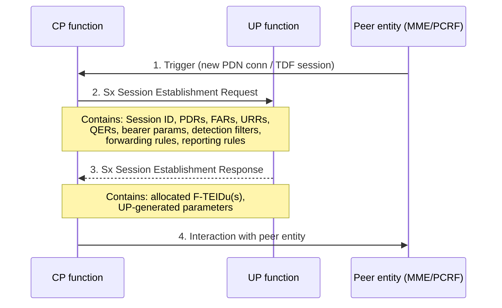

**When executed:**

| Trigger | CP↔UP pair(s) |
|---|---|
| PDN connection establishment (initial attach, UE-requested PDN connectivity) | SGW-C↔SGW-U AND PGW-C↔PGW-U |
| SGW-U relocation (handover with SGW change) | New SGW-C ↔ New SGW-U |
| TDF session establishment (solicited application reporting) | TDF-C ↔ TDF-U |
| TDF in unsolicited application reporting mode | TDF-C ↔ selected TDF-U (triggered by TDF configuration; steps 1 and 4 do not apply) |

**Sx session context content at PGW-U:** default bearer parameters + all dedicated bearer parameters + IP-CAN session related parameters.
**Sx session context content at SGW-U:** default bearer parameters + all dedicated bearer parameters.
**Sx session context content at TDF-U (solicited):** TDF session related parameters.
**Sx session context content at TDF-U (unsolicited):** instructions for application detection and reporting.

### 1.2 Sx Session Modification (§6.2.3)

Used to **update** parameters of an existing Sx session context at the UP function.

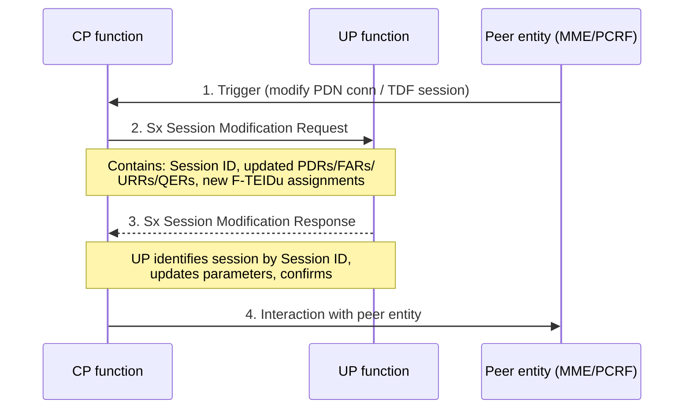

**When executed:**
- SGW-C↔SGW-U: any PDN connection parameter change (eNB F-TEIDu update, buffering state change, bearer modification)
- PGW-C↔PGW-U: any PDN connection or IP-CAN session parameter change (SGW-U F-TEIDu update, bearer add/remove, PCC rule update)
- TDF-C↔TDF-U: any TDF session parameter change or app detection/reporting instruction update

NOTE: For TDF in unsolicited reporting mode, triggered by TDF configuration (steps 1 and 4 do not apply).

### 1.3 Sx Session Termination (§6.2.4)

Used to **remove** the Sx session context at the UP function. The UP function releases all associated resources including all F-TEIDu(s) allocated for the session.

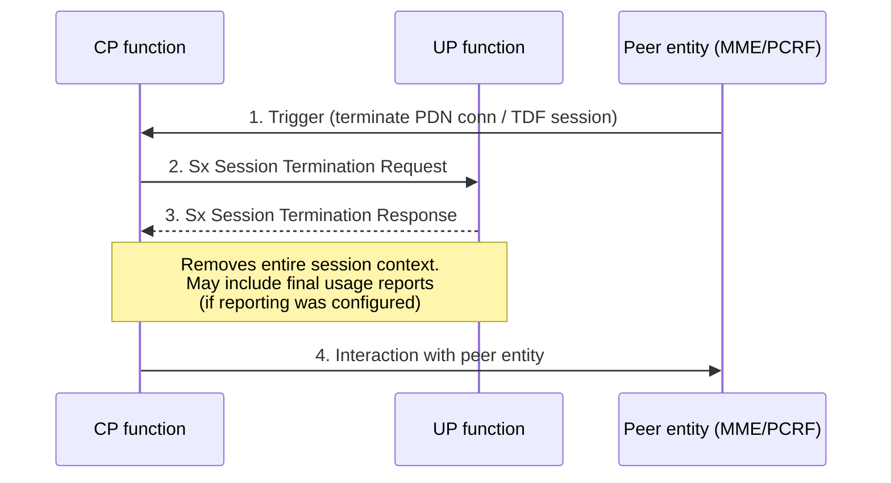

NOTE: For TDF in unsolicited reporting mode, triggered by TDF configuration (steps 1 and 4 do not apply).

---

## 2. Sx Interactions During TS 23.401 Procedures (§6.3.1)

### 2.1 PDN Connection Establishment (§6.3.1.1)

Applies to: E-UTRAN initial attach (TS 23.401 §5.3.2.1), UE-requested PDN connectivity (§5.10.2).

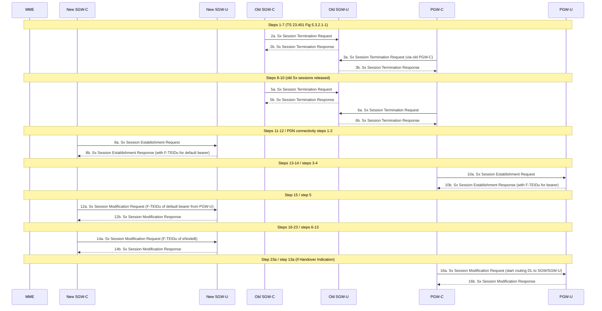

**Key Sx actions:**
1. Old SGW-C releases Sx session at old SGW-U (steps 2a/2b, 5a/5b)
2. Old PGW-C releases Sx session at old PGW-U if applicable (steps 3a/3b, 6a/6b)
3. New SGW-C establishes Sx session at new SGW-U → gets F-TEIDu for default bearer (steps 8a/8b)
4. PGW-C establishes Sx session at PGW-U → gets F-TEIDu for bearer (steps 10a/10b)
5. SGW-C modifies SGW-U with PGW-U F-TEIDu (step 12a/12b)
6. SGW-C modifies SGW-U with eNodeB F-TEIDu (step 14a/14b)
7. If Handover Indication: PGW-C modifies PGW-U to start routing DL to new SGW-U (step 16a/16b)

### 2.2 Procedures with SGW Change (§6.3.1.2)

Two types of SGW change procedure depending on what MME/SGSN sends:

**Type 1** — Create Session Request only (TAU with SGW change, RAU with SGW change, X2 HO with SGW relocation, MME-triggered SGW relocation):

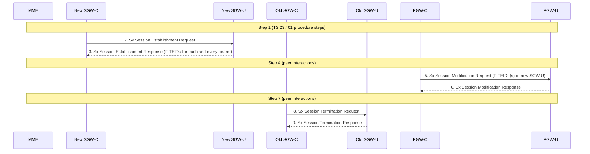

**Type 2** — Create Session Request + Modify Bearer Request (S1-based HO, E-UTRAN↔UTRAN Iu, E-UTRAN↔GERAN A/Gb inter-RAT HOs):

Steps 2/3 same as Type 1. Additionally:
- Step 5: SGW-C modifies Sx at SGW-U to include F-TEIDu of eNB
- Step 8: PGW-C modifies PGW-U with F-TEIDu(s) of new SGW-U
- Step 11/12: Old SGW-C terminates Sx at old SGW-U

NOTE: Usage Monitoring Rules may be included in the Sx Session Establishment Request (step 2) when home-routed roaming or inter-operator charging is required.

> _(Editor's Note in spec)_ Support for indirect data forwarding tunnels in CP/UP split architecture is FFS (for future study). This means handovers requiring indirect forwarding may not be fully specified for CUPS.

### 2.3 Procedures with eNB F-TEIDu Update (§6.3.1.3)

Applies to: UE-triggered Service Request, Connection Resume, E-UTRAN E-RAB modification, X2 HO without SGW relocation, S1 HO without SGW change.

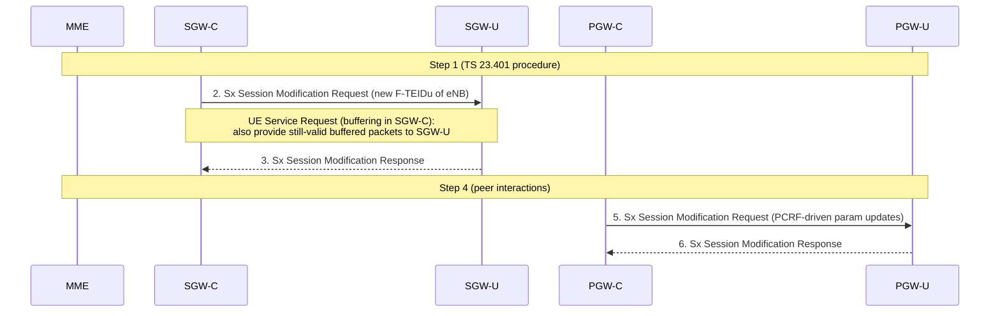

Special case — **UE triggered Service Request with buffering in SGW-C:** If buffering was in the SGW-C and packets are still valid (buffering duration not expired), SGW-C also provides those buffered packets to SGW-U in step 2 so they can be forwarded to the eNB.

### 2.4 Release of eNB F-TEIDu (§6.3.1.4)

Applies to: Connection Suspend (TS 23.401 §5.3.4A), S1 Release (§5.3.5).

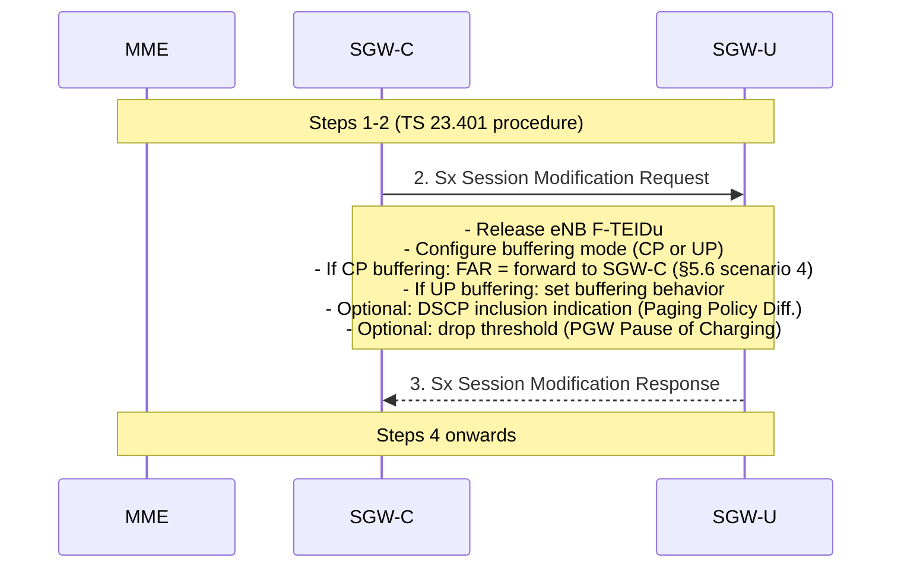

**Buffering decision propagation:**
- **CP buffering:** SGW-C configures SGW-U FAR to forward all DL packets for UE's bearers to SGW-C (Sx-u tunnel)
- **UP buffering:** SGW-C configures SGW-U to buffer; additionally:
  - If **Paging Policy Differentiation** is active: SGW-C includes indication for SGW-U to include DSCP from TOS(IPv4)/TC(IPv6) of first DL packet of each bearer
  - If **PGW Pause of Charging** is active: SGW-C may provide number/fraction of packets/bytes drop threshold; when reached SGW-U sends Sx report to SGW-C

### 2.5 DL Data Buffered in UP Function (§6.3.1.5)

Applies to: Network Triggered Service Request (§5.3.4.3), PGW Pause of Charging (§5.3.6A).

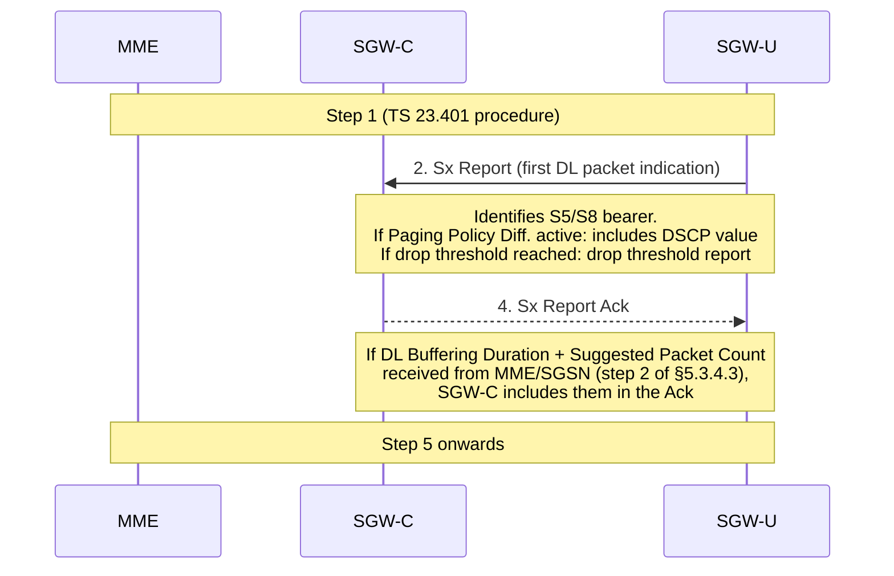

**SGW-U report triggers:**
- **First DL packet arrival on any bearer** → SGW-U sends Sx Report (first packet indication) to SGW-C
- **Drop threshold reached** (if SGW-C configured one in §6.3.1.4) → SGW-U sends Sx Report (drop threshold indication)

### 2.6 PDN Connection Release (§6.3.1.6)

Applies to: UE-initiated Detach (E-UTRAN and GERAN/UTRAN with ISR), MME-initiated Detach, SGSN-initiated Detach with ISR, HSS-initiated Detach, UE/MME-requested PDN disconnection.

```mermaid
sequenceDiagram
    participant MME
    participant SGWC as SGW-C
    participant SGWU as SGW-U
    participant PGWC as PGW-C
    participant PGWU as PGW-U

    Note over MME,PGWU: Steps 1-5 (TS 23.401 procedure)
    SGWC->>SGWU: 2. Sx Session Modification Request
    Note over SGWC,SGWU: Stop counting on affected bearers;<br/>discard DL packets from eNodeB;<br/>discard UL packets from eNodeB
    SGWU-->>SGWC: 3. Sx Session Modification Response

    Note over MME,PGWU: Step 4
    PGWC->>PGWU: 5. Sx Session Termination Request
    PGWU-->>PGWC: 6. Sx Session Termination Response
    Note over PGWU,PGWC: Includes usage reports if reporting configured (§5.3.2)

    Note over MME,PGWU: Step 7
    SGWC->>SGWU: 8. Sx Session Termination Request
    SGWU-->>SGWC: 9. Sx Session Termination Response
    Note over SGWU,SGWC: Includes usage reports if reporting configured (§5.3.2)
```

**Key ordering:** SGW-C first modifies SGW-U to stop processing, then PGW-C terminates Sx at PGW-U (with final usage report), then SGW-C terminates Sx at SGW-U (with final usage report).

### 2.7 Bearer Modification (§6.3.1.7)

Applies to: Dedicated bearer activation, PGW GW initiated bearer modification (with/without QoS update), PGW GW initiated bearer deactivation, HSS Initiated Subscribed QoS Modification, MME Initiated Dedicated Bearer Deactivation.

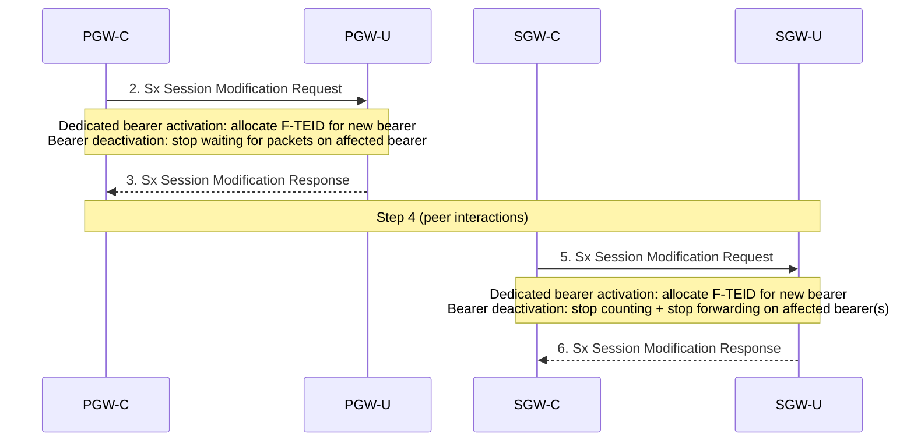

For bearer deactivation: PGW-C/SGW-C may use Sx Session Termination rather than Modification if the last bearer of a PDN connection is released.

---

## 3. Sx Association Management Procedures (§6.5)

Sx association procedures manage the **control-channel relationship** between a CP function and a UP function, independent of any individual Sx session. An association must exist before Sx sessions can be established. Terminology and wire-level procedures from TS 29.244.

### 4.1 Sx Association Setup (§6.5.3)

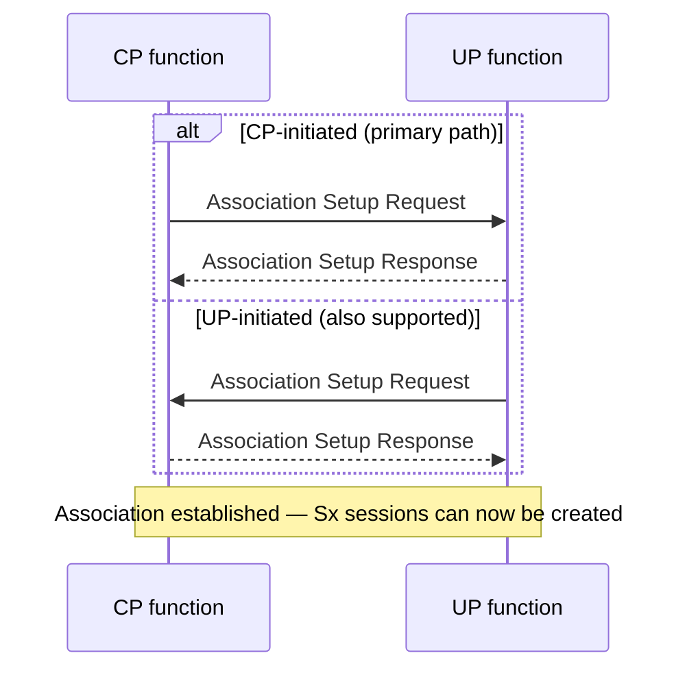

**Rules:**
- Either CP or UP may initiate (TS 29.244 §6.2.6)
- CP **shall** support UP-initiated association setup; CP **may** optionally support it beyond the mandatory case
- CP **should only** establish an association with a UP function that supports **F-TEID allocation at UP** (the mandatory CUPS requirement)

### 4.2 Sx Association Update (§6.5.4)

Used to modify an existing association between CP and UP (e.g. update load/overload information, capability changes). May be initiated by either CP or UP (TS 29.244 §6.2.7).

### 4.3 Sx Association Release (§6.5.5)

Used to terminate the association. **CP-initiated only** (TS 29.244 §6.2.8). Typically triggered by OAM (Operations and Maintenance) reasons such as node decommission or reconfiguration.

---

## 4. Sx Interactions During TS 23.203 Procedures (§6.3.2)

These interactions arise when the [PCRF](../entities/PCRF.md) installs, modifies, or removes PCC/ADC rules in response to IP-CAN session events.

### 4.1 IP-CAN Session Establishment — TDF Solicited Mode (§6.3.2.1)

When PCRF requests solicited application reporting for a new IP-CAN session:

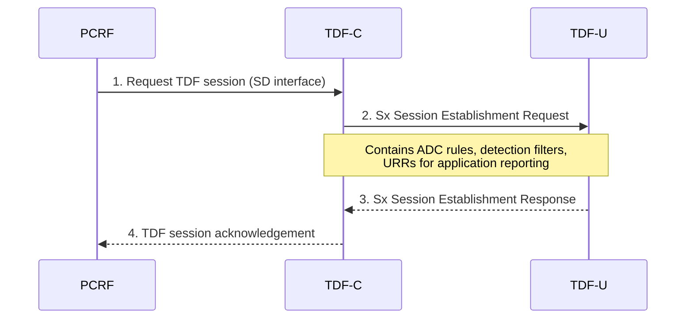

### 4.2 IP-CAN Session Termination (§6.3.2.2)

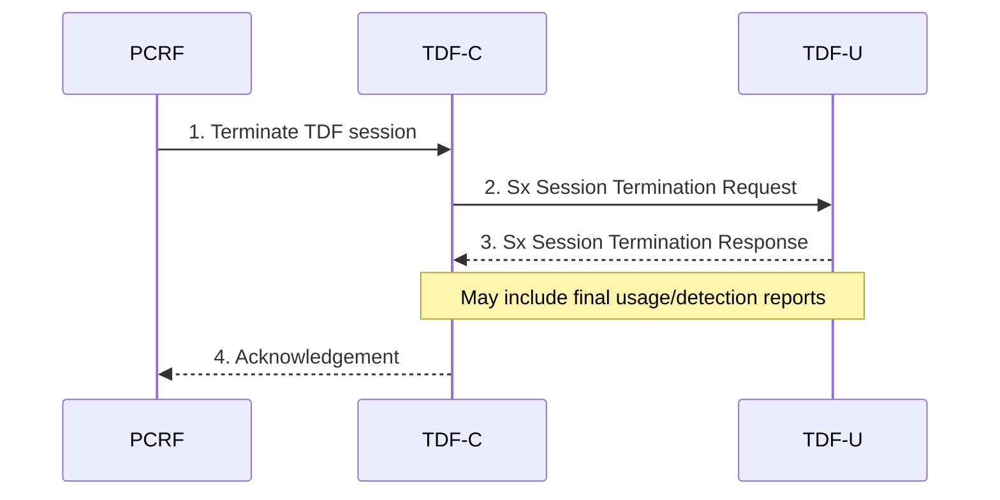

### 4.3 IP-CAN Session Modification — PCC/ADC Rule Update (§6.3.2.3)

When PCRF installs or updates PCC rules (e.g. new charging key, QoS change, new application detection filter):

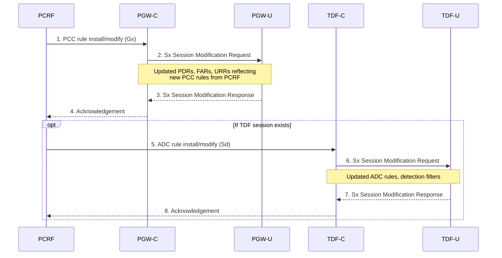

### 4.4 PFD Management (§6.3.2.4)

When PGW-C or TDF-C receives updated PFDs (Packet Flow Descriptions) for application detection from the PFDF or SCEF, it pushes them to PGW-U / TDF-U. This is a **node-level procedure** — independent of any Sx session (see also §6.5.2 below).

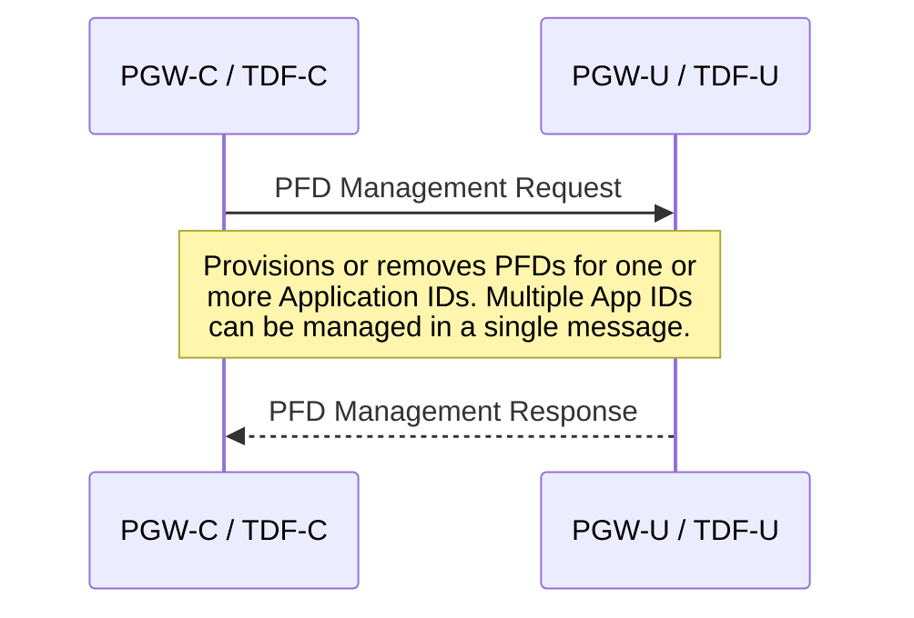

---

## 5. Sx Interactions During TS 23.402 Procedures (§6.3.3)

These interactions arise when non-3GPP access (WLAN/HRPD via ePDG/trusted AN) uses the PGW via S2b (untrusted) or S2a (trusted) interfaces.

### 5.1 GTP-based S2b/S2a PDN Connection Establishment

PGW-C selects a PGW-U and creates an Sx session for the user-plane tunnel to the ePDG (S2b) or trusted non-3GPP AN (S2a):

```mermaid
sequenceDiagram
    participant ePDG as ePDG / Trusted AN
    participant PGWC as PGW-C
    participant PGWU as PGW-U

    ePDG->>PGWC: 1. Create Session Request (GTP S2b/S2a)
    PGWC->>PGWU: 2. Sx Session Establishment Request
    Note over PGWC,PGWU: PDRs/FARs for S2b/S2a tunnel;<br/>F-TEIDu allocation at PGW-U
    PGWU-->>PGWC: 3. Sx Session Establishment Response (F-TEIDu)
    PGWC-->>ePDG: 4. Create Session Response (PGW-U F-TEIDu)
```

### 5.2 S2b/S2a PDN Connection Release

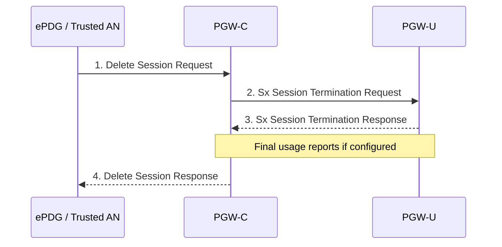

### 5.3 Dedicated Bearer Activation / Deactivation / Modification (non-3GPP)

Same pattern as TS 23.401 bearer modification (§2.7 above): PGW-C→PGW-U Sx Session Modification Request with updated PDRs/FARs for the affected bearer.

### 5.4 Handover from Non-3GPP to 3GPP Access

When UE moves from WLAN (S2b/S2a) to E-UTRAN: SGW-C establishes a new Sx session at SGW-U; PGW-C modifies the existing Sx session at PGW-U to reroute user-plane from the ePDG/trusted AN path to the new SGW-U path.

### 5.5 Handover from 3GPP to Non-3GPP Access

When UE moves from E-UTRAN to WLAN (S2b/S2a): PGW-C establishes a new Sx session for the non-3GPP bearer; old SGW-C terminates the old Sx session at SGW-U.

---

## 6. Sx Interactions During TS 23.060 Procedures (§6.3.4)

These interactions arise from GPRS/UMTS access via SGSN, covering both S4-SGSN (GTP via SGW) and Gn/Gp-SGSN (SGSN connects directly to PGW-C / GGSN) paths.

### 6.1 PDN Connection Deactivation — SGSN (§6.3.4.1)

**S4 SGSN path** (SGW involved):

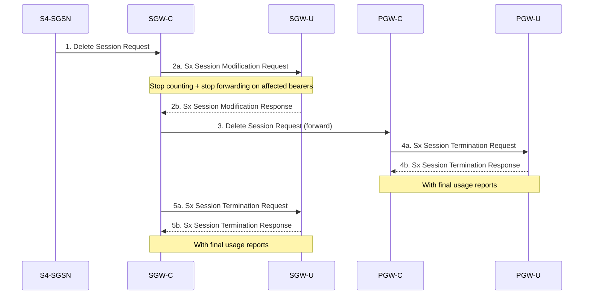

**Gn/Gp SGSN path** (SGSN→PGW-C directly, no SGW):
- Only PGW-C→PGW-U Sx Session Termination. No SGW-C/SGW-U interactions.

### 6.2 PDN Connection Modification — S4 SGSN (§6.3.4.2.1)

Three groups of procedures:

**Group 1 — Location Management / Handover / Service Request / Inter-System Change:**

(Inter-SGSN RAU, SRNS Relocation, Handover, MS-/Network-Initiated Service Request, mode changes, GPRS Paging)

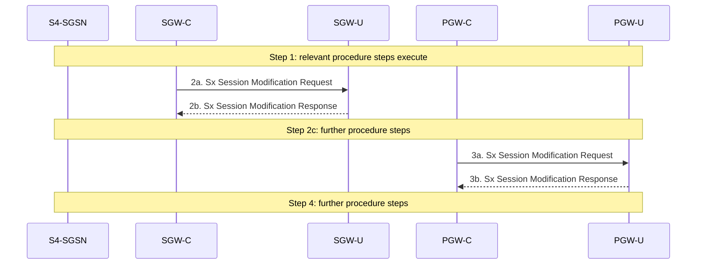

NOTE: Step 2a/2b happens when SGW-C receives request from S4 SGSN; step 3a/3b happens when PGW-C receives request from SGW-C.

**Group 2 — UE/SGSN Initiated PDN Connection Modification:**

(Secondary PDP Context Activation, SGSN-/MS-Initiated PDP Context Modification, PDP Context Deactivation)

- Steps 2a/2b: PGW-C→PGW-U Sx Modification before PGW-C→SGW-C interaction (F-TEID alloc for dedicated bearer, or stop counting/forwarding for deactivation)
- Steps 4a/4b: SGW-C→SGW-U Sx Modification after PGW-C request (F-TEID alloc or stop PDR)
- Steps 6a/6b: SGW-C→SGW-U Sx Modification after SGSN response (includes F-TEIDu of activated bearer)
- Steps 8a/8b: PGW-C→PGW-U Sx Modification after SGW response (includes F-TEIDu of activated bearer from SGW)

**Group 3 — PGW-Initiated PDN Connection Modification:**

(Network Requested Secondary PDP Context Activation, GGSN-Initiated PDP Context Modification/Deactivation)

- Steps 2a/2b: PGW-C→PGW-U Sx Modification before interaction with SGW-C (F-TEID alloc or stop for deactivation)
- Steps 3a/3b: SGW-C→SGW-U Sx Modification after PGW-C request
- Steps 5a/5b: SGW-C→SGW-U Sx Modification after SGSN response (F-TEIDu of activated bearer)
- Steps 7a/7b: PGW-C→PGW-U Sx Modification after SGW response (F-TEIDu of activated bearer from SGW)

### 6.3 PDN Connection Modification — Gn/Gp SGSN (§6.3.4.2.2)

All three groups have the same Sx interaction pattern: **PGW-C→PGW-U Sx Session Modification only** (no SGW-C/SGW-U involvement because Gn/Gp SGSN connects directly to PGW-C).

| Group | Scope | Sx interaction |
|---|---|---|
| Group 1 | Location Mgmt / HO / Service Request / Inter-System Change | PGW-C→PGW-U Sx Modification (steps 2a/2b) |
| Group 2 | UE/SGSN-initiated modification (Secondary PDP activation, QoS update, deactivation) | PGW-C→PGW-U Sx Modification (steps 2a/2b) AND (steps 4a/4b) |
| Group 3 | PGW-initiated (GGSN-Initiated Modification/Deactivation, Network Requested Secondary PDP activation) | PGW-C→PGW-U Sx Modification (steps 2a/2b) AND (steps 4a/4b) |

NOTE: For Group 2 and 3, step 2a/2b happens before PGW-C sends request to GnSGSN; step 4a/4b happens when PGW-C receives response from GnSGSN.

### 6.4 PDN Connection Establishment — SGSN (§6.3.4.3)

Covers: IPv6 Stateless Address Autoconfiguration, PDP Context Activation for A/Gb mode and Iu mode.

```mermaid
sequenceDiagram
    participant SGSN as SGSN
    participant SGWC as SGW-C
    participant SGWU as SGW-U
    participant PGWC as PGW-C
    participant PGWU as PGW-U

    Note over SGSN,PGWU: Step 1: TS 23.060 procedure steps 1-4
    SGWC->>SGWU: 2a. Sx Session Establishment Request
    Note over SGWC,SGWU: S4 SGSN only; skipped for Gn/Gp
    SGWU-->>SGWC: 2b. Sx Session Establishment Response
    PGWC->>PGWU: 3a. Sx Session Establishment Request
    PGWU-->>PGWC: 3b. Sx Session Establishment Response (F-TEIDu)
    Note over SGSN,PGWU: Step 4: procedure steps continue
    SGWC->>SGWU: 5a. Sx Session Modification Request
    Note over SGWC,SGWU: S4: SGW-C provides updated params;<br/>skipped for Gn/Gp
    SGWU-->>SGWC: 5b. Sx Session Modification Response
    PGWC->>PGWU: 6a. Sx Session Modification Request
    Note over PGWC,PGWU: Provides F-TEIDu of activated bearer from SGW
    PGWU-->>PGWC: 6b. Sx Session Modification Response
    Note over SGSN,PGWU: Step 7: procedure completion
```

**Notes:**
- For **S4 SGSN**: both SGW-C↔SGW-U and PGW-C↔PGW-U Sx sessions are established
- For **Gn/Gp SGSN**: SGW steps (2a/2b, 5a/5b) are skipped; only PGW-C↔PGW-U Sx Establishment (3a/3b) and Modification (6a/6b)
- Step 3a/3b or 6a/6b happens when PGW-C receives request/response from SGSN (S4) or GnSGSN (Gn/Gp)

---

## 7. Sx Reporting Procedures (§6.4)

### 7.1 Overview (§6.4.1)

Two types of Sx reporting procedure exist:
- **Sx session level reporting** — events related to an individual PDN connection / IP-CAN session / TDF session
- **Sx node level reporting** — events at the UP function level (not yet elaborated in stage 2 spec; terminology from TS 29.244)

Both are **initiated by the CP function** — the CP configures reporting triggers on the UP function during Sx session management. The UP function then autonomously fires reports when those triggers are met.

### 7.2 Sx Session Level Reporting (§6.4.2)

```mermaid
sequenceDiagram
    participant UP as UP function (SGW-U / PGW-U / TDF-U)
    participant CP as CP function (SGW-C / PGW-C / TDF-C)

    Note over UP: 1. Trigger condition detected
    UP->>CP: 2. Sx Report
    Note over UP,CP: Contains: Session ID,<br/>list of [Reporting Trigger, Measurement Information]
    CP-->>UP: 3. Sx Report ACK
    Note over CP,UP: CP identifies session by Session ID,<br/>applies reported information to the<br/>PDN conn / IP-CAN session / TDF session
```

**Reporting trigger cases:**

| # | Trigger | Reporter | Content |
|---|---|---|---|
| 1 | Usage report | SGW-U, PGW-U, TDF-U | Measurement information per URR (volume, time, events); keyed to charging/monitoring key (§5.3, §7.4) |
| 2 | Start of traffic detection | PGW-U, TDF-U | PDR rule ID of the flow that matched; reported when PGW-C/TDF-C requests traffic detection and traffic begins |
| 3 | Stop of traffic detection | PGW-U, TDF-U | PDR rule ID of the flow that ended; reported when traffic for a PDR ceases |
| 4 | First DL data for Idle-Mode UE | SGW-U | First downlink packet arrival with no S1-bearer; triggers paging; includes DSCP value if Paging Policy Differentiation is enabled at SGW-C (TS 23.401 §5.3.4.3) |

**Key rules:**
- The Reporting Trigger parameter names the event; Measurement Information contains the actual data.
- The CP ACK may carry extended buffering parameters (DL Buffering Duration + Suggested Packet Count from MME) if the report is a first DL packet indication and the MME/SGSN has provided those (§6.3.1.5).

---

## 8. Summary: When Each Sx Procedure Is Triggered

### TS 23.401 (E-UTRAN) Events

| EPS Event | SGW-C→SGW-U | PGW-C→PGW-U |
|---|---|---|
| PDN connection establishment | Establish new session | Establish new session |
| SGW change (any HO type) | Establish at new SGW-U; Terminate at old SGW-U | Modify: update F-TEIDu of new SGW-U |
| eNB F-TEIDu update (Service Request, HO no SGW change) | Modify: new eNB F-TEIDu | Modify: PCRF-driven updates (if any) |
| eNB F-TEIDu release (S1 Release, Suspend) | Modify: release eNB F-TEIDu + configure buffering | — |
| DL data arrives during UP buffering | Receive Sx Report (first DL data) | — |
| PDN connection release (Detach, PDN disconnect) | Modify (stop processing) then Terminate | Terminate (with final usage report) |
| Bearer modification/activation/deactivation | Modify: F-TEID alloc or bearer stop | Modify: F-TEID alloc or bearer stop |

### TS 23.203 (PCC) Events

| PCC Event | TDF-C→TDF-U | PGW-C→PGW-U |
|---|---|---|
| IP-CAN session establishment (solicited TDF) | Establish new TDF session | — |
| IP-CAN session termination | Terminate TDF session | — |
| PCC rule install/modify (PCRF Gx) | Modify: updated ADC rules (if TDF) | Modify: updated PDRs/FARs/URRs |
| PFD provisioning | PFD Management Request (node-level) | PFD Management Request (node-level) |

### TS 23.402 (Non-3GPP Access) Events

| Event | PGW-C→PGW-U |
|---|---|
| S2b/S2a PDN connection establishment | Establish new session |
| S2b/S2a PDN connection release | Terminate session |
| Dedicated bearer activation/deactivation/modification | Modify session |
| Handover non-3GPP→3GPP | Modify: reroute to new SGW-U |
| Handover 3GPP→non-3GPP | Establish new session (for S2b/S2a path) |

### TS 23.060 (GPRS/SGSN) Events

| GPRS Event | SGW-C→SGW-U (S4 only) | PGW-C→PGW-U |
|---|---|---|
| PDP context activation | Establish new session | Establish new session |
| PDP context deactivation (S4) | Modify (stop) then Terminate | Terminate |
| PDP context deactivation (Gn/Gp) | — | Terminate |
| PDP context modification — all triggers | Modify | Modify |

---

## Cross-References

- [CUPS Architecture](../concepts/CUPS-architecture.md) — architectural context for Sx, PDR/FAR/URR model
- [EPS Attach](EPS-attach.md) — base TS 23.401 attach procedure
- [TAU](TAU.md) — base TAU procedure (SGW change type 1)
- [Dedicated Bearer](dedicated-bearer.md) — base bearer management procedures
- [Sx interface wire protocol](../interfaces/Sx.md) — PFCP (TS 29.244)
- [PCRF](../entities/PCRF.md) — PCC rule source for PGW-C Sx modifications
