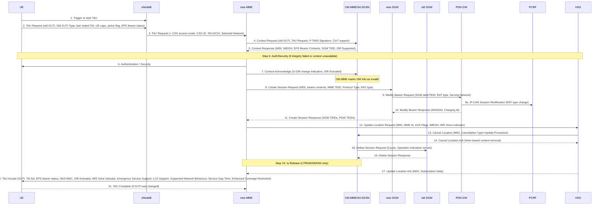
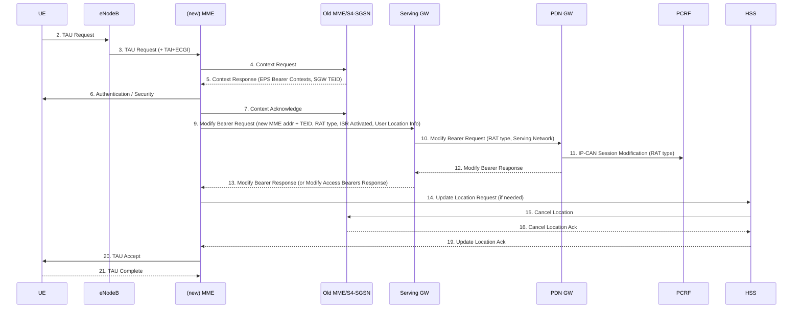

# Tracking Area Update (TAU) Procedure

**Spec:** 3GPP TS 23.401 §5.3.3  
**Purpose:** Updates the UE's registered Tracking Area in the EPC without full detach/re-attach. Handles MME change, SGW relocation, HSS location update, ISR activation, and bearer context transfer.

---

## TAU Triggers (§5.3.3.0)

A TAU is initiated when a UE in either ECM-IDLE or ECM-CONNECTED state experiences:

| Trigger | Notes |
|---|---|
| UE enters TA not in its TAI list | Primary mobility trigger |
| Periodic TA update timer expires | Keepalive when UE stays in same TA |
| UE reselects E-UTRAN from UTRAN PMM_CONNECTED (URA_PCH) | Inter-RAT mobility |
| UE was in GPRS READY state and reselects E-UTRAN | Inter-RAT mobility |
| TIN = "P-TMSI" on E-UTRAN reselection | Forces re-registration |
| RRC released with cause "load re-balancing TAU required" | MME pool rebalancing |
| RRC connection failure (E-UTRAN or UTRAN) | Reconnection |
| Change in UE/MS Network Capability, UE-specific DRX, TS 24.008 radio access capability | Capability advertisement |
| Change in extended idle mode DRX parameters | Power saving |
| CS fallback or IMS voice UE: change in usage setting or voice domain preference | IMS voice registration |
| SR-VCC capable UE: change in MS Classmark 2/3 | SR-VCC capability update |
| UE manually selects CSG cell absent from both Allowed and Operator CSG list | CSG registration |
| UE receives paging while MM back-off timer running and TIN = "P-TMSI" | Emergency paging recovery |
| Change in Preferred Network Behaviour incompatible with Supported Network Behaviour of serving MME | CIoT optimisation mismatch |

> The decision to perform S-GW change during TAU is made by the MME independently of the trigger.

---

## Procedure Variants

| Variant | Spec | S-GW change | MME change | Key difference |
|---|---|---|---|---|
| TAU with S-GW change | §5.3.3.1 | Yes | Optional | Create Session Request to new SGW |
| TAU with S-GW change + data forwarding | §5.3.3.1A | Yes | Optional | Buffered DL data forwarded via indirect tunnel |
| E-UTRAN TAU without S-GW change | §5.3.3.2 | No | Optional | Only Modify Bearer Request to existing SGW |
| RAU with MME interaction, no S-GW change | §5.3.3.3 | No | Yes (SGSN←→MME) | UE moves to UTRAN/GERAN |
| RAU with MME interaction, S-GW change | §5.3.3.6 | Yes | Yes (SGSN←→MME) | UE moves to UTRAN/GERAN with new SGW |

---

## TAU with S-GW Change (§5.3.3.1)

### Message Flow

### Step-by-Step Detail

**Steps 1–3 — TAU Request**

UE sends **TAU Request** containing:
- Old GUTI + Old GUTI Type (native vs P-TMSI mapped)
- Last visited TAI (helps MME build new TAI list)
- UE Core Network Capability, MS Network Capability, Preferred Network Behaviour
- Active flag (request to activate S1 bearers; omitted if ECM-CONNECTED)
- Signalling active flag (CIoT: maintain NAS signalling after TAU)
- EPS bearer status (each active bearer in UE)
- P-TMSI signature (if GUTI mapped from P-TMSI+RAI)
- Extended idle mode DRX parameters

eNodeB adds CSG access mode, CSG ID, TAI+ECGI, Selected Network before forwarding to MME.

**Steps 4–5 — Context Transfer from Old MME/SGSN**

New MME sends **Context Request** (old GUTI, complete TAU Request, P-TMSI Signature, UE Validated, CIoT EPS Optimisation support) to old MME/S4-SGSN.

Context Response contains:
- IMSI, IMEISV, unused EPS Authentication Vectors
- EPS Bearer Context(s) + Serving GW signalling address and TEID(s)
- ISR Supported (if old S4-SGSN + SGW support ISR)
- MS Info Change Reporting Action, CSG Information Reporting Action
- UE Time Zone, UE Core Network Capability, UE Specific DRX Parameters
- Change to Report flag (if deferred RAT/Serving Network/Time Zone reporting pending)
- Remaining Running Service Gap timer, LTE-M UE Indication

> If DL Data Buffer Expiration Time has not expired, old MME/SGSN indicates "Buffered DL Data Waiting" → triggers user plane setup in conjunction with TAU (see §5.3.3.1A).

**Step 6 — Authentication/Security**

Mandatory if integrity check of TAU Request failed. Optional otherwise.

> PLMN-ID mismatch check: if UE already in ECM-CONNECTED and PLMN-ID of TAI from eNodeB differs from GUTI's, MME delays authentication until step 21 (TAU Complete) to ensure consistent PLMN-ID for Kasme derivation.

**Step 7 — Context Acknowledge**

New MME → old MME/SGSN: **Context Acknowledge** (S-GW change indication, ISR Activated).
- Old MME marks its context that GW info is invalid → ensures old MME updates GWs if UE initiates another TAU before this one completes.
- If ISR Activated → old S4-SGSN maintains UE context, stops timer, may re-start Implicit Detach timer.
- If ISR not indicated → old SGSN deletes all bearer resources when timer expires.

**Step 8 — Create Session Request (new SGW)**

New MME selects a new SGW and sends **Create Session Request** per PDN connection:
- IMSI, bearer contexts from step 5, MME TEID, Protocol Type over S5/S8, RAT type, LTE-M RAT type reporting flag
- If SGSN→MME mobility with location information change reporting: includes User Location Information
- If PDN GW requested User CSG Information: includes User CSG Information IE

**Steps 9–10 — Modify Bearer at PGW**

New SGW → PGW: **Modify Bearer Request** (SGW Address + TEID, RAT type, Serving Network, User Location Info, UE Time Zone).
- If dynamic PCC deployed and RAT type information needs conveying: PGW → PCRF: IP-CAN Session Modification (box A).
- PGW → SGW: **Modify Bearer Response** (MSISDN, Charging Id, PDN Charging Pause Enabled).
- After S-GW relocation, PGW sends "end marker" packets on old path for correct reordering at eNodeB.

**Step 11 — Create Session Response**

New SGW → new MME: **Create Session Response** (SGW TEID, PGW TEIDs for GTP-based S5/S8 or GRE keys for PMIP-based).

**Steps 12–19 — HSS Update and Old SGW Cleanup**

- **Step 12:** MME → HSS: **Update Location Request** if no subscription data or PLMN-ID mismatch. ULR-Flags indicates update from MME (not "Initial-Attach-Indicator"). HSS does NOT cancel any SGSN registration.
- **Step 13:** HSS → old MME: **Cancel Location** (Cancellation Type = Update Procedure).
- **Step 14:** Old MME removes MM context (after timer). If MME changed → MME acknowledges with Cancel Location Ack.
- **Steps 15–16:** If old node is SGSN with UE in Iu Connected → Iu Release Command/Complete (UTRAN).
- **Step 17:** HSS → new MME: **Update Location Ack** (IMSI, Subscription Data including Service Gap Time, Enhanced Coverage Restricted).
- **Step 18:** When timer from step 4 expires, old MME/SGSN deletes bearer resources → **Delete Session Request** (Cause, Operation Indication not set) to old SGW. Old SGW discards buffered packets.
- **Step 19:** Old SGW → **Delete Session Response**.

> ISR never indicated from new to old MME. Old MME always deletes bearer resources (independent of Cancel Location).

**Steps 20–21 — TAU Accept / Complete**

MME → UE: **TAU Accept** containing:
- GUTI (if new GUTI allocated)
- TAI list, EPS bearer status
- NAS sequence number, NAS-MAC, ISR Activated
- IMS Voice over PS session supported Indication
- Emergency Service Support indicator, LCS Support Indication
- Supported Network Behaviour (CIoT capabilities)
- Service Gap Time (if UE indicated Service Gap Control Capability)
- Enhanced Coverage Restricted
- Indication for support of 15 EPS bearers per UE

User plane setup (radio bearers, Modify Bearer) may be activated in conjunction with TAU Accept if:
- Active flag was set in TAU Request, OR
- DL Data Buffer Expiration Time in old MME context has not expired (TAU with data forwarding variant), OR
- New MME receives Downlink Data Notification while UE still connected.

> ISR not activated for S-GW change (requires RAU with same S-GW first). ISR not activated for MME change (avoids context transfer with two old CN nodes).

**UE responds with TAU Complete** only if GUTI was changed.

When "Active flag" not set and TAU was not initiated in ECM-CONNECTED → MME releases the NAS signalling connection after TAU, per §5.3.5 (S1 release).

---

## TAU without S-GW Change (§5.3.3.2)

### Message Flow

**Key differences from S-GW change variant:**

| Aspect | With S-GW change | Without S-GW change |
|---|---|---|
| Step 8 | Create Session Request → new SGW | N/A — existing SGW reused |
| Step 9 | New SGW → PGW: Modify Bearer Request | MME → same SGW: Modify Bearer Request |
| ISR | Never indicated | Can be maintained (if was activated) |

> If no MME change: steps 4, 5, 7, 9–19 are skipped (no Context Request/Response, no Update Location unless PLMN-ID changed). TAU without MME change defers UE Time Zone / Serving Network change notification until next Service Request.

**Modify Bearer Request** from MME to SGW carries:
- New MME address + TEID (control plane) per PDN connection
- ISR Activated (if activating ISR)
- RAT type, LTE-M RAT type reporting to PGW flag
- User Location Information (if SGSN→MME mobility with location change reporting support)
- User CSG Information, UE Time Zone, Serving Network (if changed/deferred per Change to Report flag)

**ISR with TAU without MME change:** If ISR was activated before and ISR Activated is indicated in step 9, the S-GW only updates the MME Control Plane Address and keeps the SGSN-related information unchanged.

---

## Key Design Points

### S-GW Relocation Decision
MME relocates the SGW when:
- Old SGW cannot continue to serve the UE (e.g. location change), OR
- New SGW co-located with PGW provides more optimal path, OR
- New SGW with more optimal UE-to-PGW path available.

Selection per §4.3.8.2.

### ISR (Idle mode Signalling Reduction)
ISR allows a UE to be simultaneously registered with both an MME and an S4-SGSN, avoiding TAU/RAU on inter-system reselection (E-UTRAN ↔ UTRAN/GERAN).

| ISR condition | Result |
|---|---|
| S-GW change | ISR never activated (needs RAU with same S-GW first) |
| MME change | ISR never activated (avoids two-old-CN-node context transfers) |
| ISR Activated in TAU without MME change | ISR maintained if was previously active |
| Emergency attached UE | ISR not activated |

### Bearer Context Priority
If new MME cannot maintain the same number of active bearer contexts as old MME/SGSN:
1. Update all contexts in one or more PGWs
2. Deactivate contexts that cannot be maintained (MME Initiated Dedicated Bearer Deactivation)
3. TAU is NOT rejected due to bearer deactivation failure

Emergency-ARP EPS bearers are never deactivated.

### RAT Change Handling
If RAT type changes (e.g. UTRAN → E-UTRAN), MME checks per APN:
- Maintain PDN connection, OR
- Disconnect with reactivation request (#39 "reactivation requested"), OR
- Disconnect without reactivation (#66 "Requested APN not supported in current RAT and PLMN combination"; #37 for dedicated bearer "EPS QoS not accepted")

If all PDN connections disconnected and UE doesn't support "attach without PDN connectivity" → MME requests detach + re-attach.

---

## Cross-References

- [MME](../entities/MME.md) — controls TAU; manages Context Request/Response, Update Location, bearer priority
- [SGW](../entities/SGW.md) — mobility anchor; either reused (no S-GW change) or newly selected (S-GW change)
- [PGW](../entities/PGW.md) — receives Modify Bearer Request to update RAT type; notifies PCRF
- [PCRF](../entities/PCRF.md) — IP-CAN Session Modification for RAT change (box A)
- [HSS](../entities/HSS.md) — Update Location (step 12), Cancel Location at old node (step 13)
- [EMM/ECM states](../concepts/EMM-ECM-states.md) — TAU does not change EMM state; may trigger ECM-CONNECTED→ECM-IDLE via S1 Release
- [EPS bearer model](../concepts/EPS-bearer.md) — EPS bearer status IE reconciles UE and network bearer state
- [EPS Attach procedure](EPS-attach.md) — full procedure that TAU extends/replaces
- [Service Request](service-request.md) — may follow TAU Accept if active flag was set
