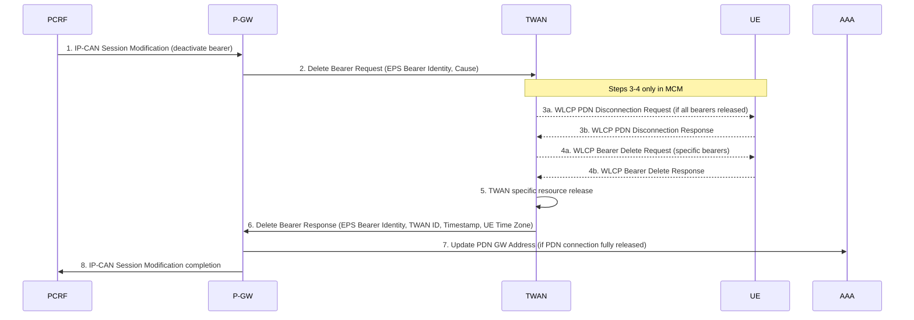
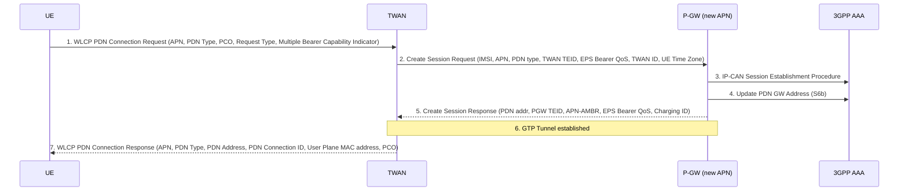
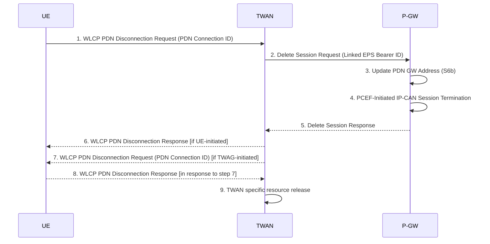
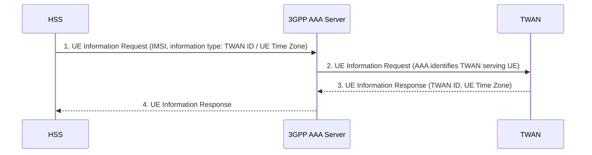

# TWAN S2a Procedures (GTP and PMIPv6)

**Spec reference:** 3GPP TS 23.402 v15.3.0 §16

Related pages:
[Non-3GPP Access Architecture](../concepts/non-3GPP-access-architecture.md) ·
[Trusted non-3GPP Attach (§6)](trusted-non3GPP-attach.md) ·
[Non-3GPP Handover (§8)](non3GPP-handover.md) ·
[PGW](../entities/PGW.md) ·
[PCRF](../entities/PCRF.md)

---

## Overview

Section 16 defines **GTP and PMIPv6 based S2a over Trusted WLAN Access (TWAN)** — the
procedures for attaching, managing bearers, and handing over PDN connections via an
operator-trusted WLAN. This builds on the general trusted access framework in §6 by
adding:

- Three distinct **connection modes** negotiated during EAP-AKA' authentication
- The **WLCP (WLAN Control Protocol)** for per-PDN connection management in multi-connection mode
- **GTP-based S2a** (in addition to PMIPv6-based S2a from §6)
- **Handover** procedures between 3GPP and TWAN

> **§6 vs §16 relationship:** §6 defines PMIPv6/S2a for trusted non-3GPP access in a generic way. §16 is the TWAN-specific variant covering both GTP S2a and PMIPv6 S2a, and adds multi-connection capabilities. Procedures in §16 reference or reuse §6 flows for the PMIPv6 variant.

---

## TWAN Architecture (§16.1)

### Functional Components (§16.1.2)

The Trusted WLAN Access Network (TWAN) is not a single node — it contains three logical functions:

```mermaid
graph LR
    UE["UE\n(IEEE 802.11)"]
    WLAN_AN["WLAN Access Network\n(WLAN AN)\nIEEE 802.11 APs"]
    TWAG["Trusted WLAN Access Gateway\n(TWAG)\nTerminates S2a"]
    TWAP["Trusted WLAN AAA Proxy\n(TWAP)\nTerminates STa"]

    UE --- |SWw| WLAN_AN
    WLAN_AN --- TWAG
    WLAN_AN --- TWAP
    TWAG --- |S2a GTP or PMIPv6| PGW[P-GW]
    TWAP --- |STa| AAA[3GPP AAA Server]
    UE -. |WLCP/DTLS/UDP\n(MCM only)| TWAG
```

| Function | Role |
|---|---|
| **WLAN AN** | Physical 802.11 access points; provides UE-TWAG point-to-point link |
| **TWAG** | S2a termination; GTP or PMIPv6 toward PGW; WLCP PDN session control in MCM; TFT-based UL routing |
| **TWAP** | STa relay to 3GPP AAA Server; binds IMSI ↔ UE MAC address; triggers TWAG on L2 detach |

The UE is identified at the TWAN by its **MAC address**. The TWAG uses the UE MAC address
for point-to-point link association and for encapsulating user plane packets.

### Connection Modes (§16.1.2 + §16.1.4A)

Three modes are defined; the mode is **negotiated during EAP-AKA' authentication**:

| Mode | Abbreviation | Key Property | WLCP? | PDN connections |
|---|---|---|---|---|
| **Transparent Single-Connection mode** | TSCM | Default; no APN/handover-indicator from UE; UE sees shared medium | No | 1 (default APN) or NSWO |
| **Single-Connection mode** | SCM | One PDN connection or NSWO; UE requests via EAP-AKA' | No | 1 |
| **Multi-Connection mode** | MCM | Multiple PDN connections + NSWO simultaneously; UE uses WLCP | Yes | Multiple |

**Mode negotiation via EAP-AKA' (§16.1.4A.1–A.2):**

- UE→Network in EAP-AKA': requested connection mode; NSWO flag; APN; PDN type; PCO; handover indicator; IMEI(SV)
- Network→UE in EAP-AKA': supported modes; emergency support flag; TWAG WLCP IP address(es); PDN address (SCM); SM back-off timer; NSWO authorization

> If the 3GPP AAA server provides no connection mode indication, **TSCM is assumed**.

### WLCP — WLAN Control Protocol (§16.1.4A.3)

WLCP is a 3GPP-defined signalling protocol used **only in Multi-Connection mode** to
establish and release individual PDN connections over a Trusted WLAN. Key properties:

- **Transport:** WLCP/DTLS/UDP/IP over the SWw link (between UE and TWAG)
- **PDN parameters carried:** APN, PDN type, UE IP address/prefix, PCO, Request Type (initial/handover), SM back-off timer, PDN Connection ID (TWAG-allocated)
- **Bearer parameters:** TFTs (Traffic Filter Templates), Bearer QoS (QCI, GBR, MBR)
- **Multiplexing:** TWAG MAC address identifies each point-to-point link per PDN/bearer
- **PDN Connection ID:** TWAG-allocated unique identifier stored at both UE and TWAG to identify each established PDN connection in subsequent procedures

### Protocol Stacks (§16.1.4)

**Control plane (GTP-C on S2a):**

| Mode | UE→TWAG (SWw) | TWAG→PGW (S2a) |
|---|---|---|
| TSCM | 802.11 + optional DHCPv4 (L3 trigger) | GTP-C/UDP/IP |
| SCM | 802.11 + L2 trigger | GTP-C/UDP/IP |
| MCM | WLCP/DTLS/UDP/IP/802.11 | GTP-C/UDP/IP |

**User plane:** All modes: IPv4/IPv6 → GTP-U/UDP/IP/L2/L1 on S2a

**PMIPv6 variant:** Reuses §6.1.1 PMIPv6 stacks; TWAG acts as MAG with PBU/PBA toward PGW-LMA.

### Reference Points (§16.1.3)

| Reference Point | Key TWAN-specific function |
|---|---|
| **STa** (TWAP ↔ 3GPP AAA) | Carries connection mode negotiation; PDN addresses; TWAG WLCP address; SSID; SM back-off timer; emergency support indication |
| **SWw** (UE ↔ WLAN AN) | IEEE 802.11; EAP/EAP-AKA'; WLCP in MCM; multiple TWAG MAC addresses for bearer multiplexing |
| **S2a** (TWAG ↔ PGW) | GTP or PMIPv6; both IPv4 and IPv6 supported |

### IP Address Allocation (§16.1.5)

- **TSCM**: TWAG acts as DHCPv4/v6 server (TWAG delivers address to UE)
- **SCM**: UE requests PDN type via EAP-AKA'; IPv4 addr from PGW in Create Session Response (GTP) or PBA (PMIPv6); IPv6 via Router Advertisement from PGW (GTP) or TWAG (PMIPv6)
- **MCM**: TWAG selects PDN type from subscription (same as MME in §5.3.1.1 of TS 23.401); address delivered to UE via WLCP PDN Connection Response
- **Deferred IPv4**: not supported in this Release for TWAN (§16.1.5.1)
- **Static IP**: TWAG may receive static IP from HSS/AAA; passes to PGW in Create Session Request / PBU

### Bearer Model (§16.1.6)

**GTP S2a — single point-to-point UE-TWAN (TSCM/SCM):**
- TWAN routes UL packets by uplink packet filter in TFTs (same as ePDG does for S2b)
- One point-to-point link transports all bearers for a PDN connection

**GTP S2a — multiple point-to-point per PDN (MCM):**
- One WLCP bearer per S2a bearer (1:1 mapping)
- Default S2a bearer always present; dedicated bearers added/removed via WLCP + GTP Create/Delete Bearer
- TWAG MAC address per WLCP bearer identifies which bearer user plane packets belong to
- TWAN relays TFT and QoS (QCI, GBR, MBR) to UE in WLCP Bearer Creation/Update messages

---

## Initial Attach in WLAN on GTP S2a (§16.2.1)

**Pre-conditions:** UE discovers TWAN; TWAN provides S2a with GTP protocol.

The procedure handles non-roaming, home-routed roaming, and LBO in the same figure
(Figure 16.2.1-1). Two scenarios:

- **Scenario (A)**: TWAP sends L2 attach trigger to TWAG → TWAG pulls subscription from TWAP at tunnel setup (recommended for IPv4, IPv6, IPv4v6)
- **Scenario (B)**: TWAG uses L3 DHCPv4 request from UE as attach trigger → TWAG obtains IMSI from TWAP by MAC lookup (TSCM IPv4 only)

**15-step flow (Scenario A):**

```mermaid
sequenceDiagram
    participant UE
    participant TWAN
    participant PGW as P-GW
    participant vPCRF
    participant AAA as 3GPP AAA
    participant HSS

    UE->>TWAN: 1. Non-3GPP (WLAN) L2 procedures
    UE->>TWAN: 2. EAP Authentication (EAP-AKA')
    TWAN->>AAA: 2. Authentication & Authorization (mode, APN, IMEI(SV), subscription)
    AAA->>HSS: 2a. ME Identity Check via EIR (IMEI)
    AAA-->>TWAN: 2. Auth OK (connection mode, PDN type, TWAG WLCP addr, SM back-off)
    TWAN->>PGW: 3. Create Session Request (IMSI, APN, PDN type, RAT=TWAN, EPS Bearer QoS, TWAN ID, UE Time Zone)
    PGW->>vPCRF: 4. IP-CAN Session Establishment Procedure
    PGW->>AAA: 5. Update PDN GW Address (S6b)
    PGW-->>TWAN: 6. Create Session Response (PDN addr, PGW TEID, EPS Bearer QoS, APN-AMBR, Charging ID)
    Note over TWAN,PGW: 7. GTP tunnel established (TWAN TEID ↔ PGW TEID)
    TWAN-->>UE: 8. EAP Authentication Completion (SCM only: conveys PDN addr, TWAG User Plane MAC)
    UE->>TWAN: 9. L3 Configuration (DHCPv4 in TSCM; TWAN acts as DHCP server)
    Note over UE,TWAN: 15. L3 Configuration Completion (IP address delivered)
    Note over UE: 16. In MCM: UE uses §16.8 WLCP procedure to establish PDN connections
```

**Key step details:**
- **Step 2**: EAP-AKA' extended for TWAN — UE requests connection mode; AAA decides and returns mode + TWAG WLCP IP; if no mode indication → TSCM
- **Step 3**: Create Session Request includes TWAN Identifier (§16.1.7), UE Time Zone, EPS Bearer Identity; if handover from 3GPP: Handover Indication set → PGW reuses UE IP
- **Step 4**: PGW executes PCEF-initiated IP-CAN Session Modification (not Establishment) when Handover Indication is set
- **Step 8**: Only in SCM — TWAN informs UE of selected APN, PDN address, TWAG User Plane MAC address via EAP Success
- **Steps 10–14**: Only in Scenario (B); same as steps 3–7

**PMIPv6 variant (§16.2.2):** Same structure but step 3 → Proxy Binding Update (with TWAN Identifier, UE Time Zone, IMEI(SV)), step 6 → Proxy Binding Ack. TWAG acts as MAG.

---

## TWAN Identifier (§16.1.7)

The TWAN Identifier is reported over S2a, Gx, and Gy at PDN connection establishment/bearer events. It consists of:
- **SSID** of the AP the UE is attached to (mandatory)
- At least one of: **BSSID**, civic address of AP, or Logical Access ID (ETSI ES 282 004)
- Optionally: TWAN operator identifier (PLMN-ID if mobile operator, or operator name in Realm format)

Used by P-CSCF and other AFs via PCRF to determine UE location (NPLI).

---

## Detach and PDN Disconnection (§16.3)

### UE/TWAN Initiated Detach — GTP S2a (§16.3.1.1) — 6 steps

```mermaid
sequenceDiagram
    participant UE
    participant TWAN
    participant PGW as P-GW
    participant AAA as 3GPP AAA

    UE->>TWAN: 1. Detach trigger (802.11 disassociation / deauth, or traffic inactivity timeout)
    TWAN->>PGW: 2. Delete Session Request (Linked EPS Bearer ID, TWAN Release Cause, TWAN ID, Timestamp, UE Time Zone)
    PGW->>AAA: 3. Update PDN GW Address (S6b — notifies deregistration)
    PGW->>PGW: 4. PCEF-Initiated IP-CAN Session Termination with PCRF
    PGW-->>TWAN: 5. Delete Session Response (Cause)
    TWAN->>TWAN: 6. L2 disassociation; UE context removed
```

> Note: PGW does **not** remove the GTP tunnels on S2a — TWAN is responsible for teardown.

### HSS/AAA Initiated Detach — GTP S2a (§16.3.1.2) — 3 steps

1. HSS/AAA sends Session Termination Request to TWAN
2. TWAN executes steps 2–6 of §16.3.1.1
3. TWAN sends Session Termination Response to 3GPP AAA Server

**PMIPv6 variants (§16.3.2):** Same patterns; step 2 = Proxy Binding Update (lifetime=0) + TWAN Identifier, step 5 = Proxy Binding Ack.

---

## PDN GW Initiated Bearer Deactivation (§16.4)

### GTP S2a (§16.4.1) — 8 steps

PCRF decision → PGW sends Delete Bearer Request to TWAN. In MCM, TWAN informs UE via WLCP.



**PMIPv6 variant (§16.4.2):** Step 2 = Binding Revocation Request; step 6 = Binding Revocation Acknowledgement (includes TWAN ID + UE Time Zone).

---

## Dedicated Bearer Activation (§16.5)

PCRF-driven GTP S2a dedicated bearer creation. In MCM, TWAN informs UE via WLCP.

**6-step flow:**
1. PCRF → PGW: PCC decision (IP-CAN Session Modification)
2. PGW → TWAN: Create Bearer Request (IMSI, EPS bearer QoS, TFT, Linked EPS Bearer ID)
3. *(MCM only)* TWAN → UE: WLCP Bearer Creation Request (PDN Connection ID, Bearer ID, TFT, Bearer QoS, User Plane Connection ID); UE → TWAN: WLCP Bearer Creation Response
4. TWAN specific resource allocation
5. TWAN → PGW: Create Bearer Response (EPS Bearer Identity, TWAN addr for user plane, TWAN TEID, TWAN ID, UE Time Zone)
6. PGW → PCRF: IP-CAN Session Modification completion (Provision Ack)

> **Charging ID reuse**: If the dedicated bearer is created as part of a 3GPP access handover, PGW applies the Charging ID previously assigned to the corresponding bearer in 3GPP access (bearer with same QCI + ARP).

---

## Network-Initiated Bearer Modification (§16.6)

### PGW-Initiated Modification (§16.6.1)

PGW sends Update Bearer Request (EPS bearer Identity, QoS, TFT) → TWAN. In MCM, TWAN sends WLCP Bearer Update Request to UE with modified Bearer IDs + TFT + QoS information. UE acknowledges → TWAN sends Update Bearer Response.

### HSS-Initiated QoS Modification (§16.6.2)

1. HSS initiates User Profile Update (§12.6 / §12.2.1)
2. TWAN → PGW: Modify Bearer Command (EPS bearer ID, QoS, APN-AMBR)
3. PGW → PCRF: PCEF-Initiated IP-CAN Session Modification
4. PGW → TWAN: Update Bearer Request (updated QoS per bearer + APN-AMBR)
5. *(MCM)* TWAN → UE: WLCP Bearer Update Request; UE acknowledges
6. TWAN → PGW: Update Bearer Response
7. PGW → PCRF: Provision Ack

---

## Multi-Connection Mode Detach (§16.7)

Section 16.7 defines detach when UE has multiple active PDN connections (MCM). Key differences from §16.3 detach:

- **UE/TWAN initiated (GTP, §16.7.1.1)**: Steps 2–5 (Delete Session Request / Response) are **repeated for each PDN connection**. Detach trigger is IEEE 802.11 disassociation, authentication loss, or TWAN inactivity detection.
- **HSS/AAA initiated (GTP, §16.7.1.2)**: Session Termination Request → §16.7.1.1 steps 2–5 per PDN → Session Termination Response
- **PMIPv6 variants (§16.7.2.1–16.7.2.2)**: Same patterns; step 2 = PBU(lifetime=0) per PDN, step 5 = PBA

---

## UE Initiated PDN Connectivity in MCM (§16.8)

Used when UE is in MCM and wants to establish **additional PDN connections** after initial attach.

### GTP S2a (§16.8.1) — 7 steps



**PDN Connection ID (step 7):** TWAG-allocated unique MAC address for this PDN connection. Both UE and TWAG store this to identify all S2a bearers for this PDN.

**For emergency PDN (MCM):** UE adds emergency indication in WLCP PDN Connection Request; TWAN ignores any APN from UE and uses Emergency Configuration Data; §16.8.3 procedure applies.

**PMIPv6 variant (§16.8.2):** Step 2 = Proxy Binding Update; step 5 = Proxy Binding Ack.

---

## UE/TWAN PDN Disconnection in MCM (§16.9)

### GTP S2a (§16.9.1) — 9 steps



Note: Either step 1→6, or step 7→8, is performed (not both).

**PMIPv6 variant (§16.9.2):** Step 2 = PBU(lifetime=0) + TWAN Identifier, step 5 = PBA.

---

## Handover from 3GPP to TWAN (§16.10)

### SCM — GTP S2a (§16.10.1.1) — 11 steps

Used to hand over a **single PDN connection** from 3GPP access to TWAN in single-connection mode.

```mermaid
sequenceDiagram
    participant UE
    participant TWAN
    participant SGW as S-GW
    participant PGW as P-GW

    Note over UE,SGW: 0. UE has active 3GPP access (S5/S8 GTP or PMIPv6 tunnel)
    UE->>TWAN: 1. Non-3GPP specific procedures (WLAN association)
    UE->>TWAN: 2. EAP Authentication (EAP-AKA', SCM mode + handover indicator)
    TWAN->>PGW: 3. Create Session Request (Handover Indication, APN, TWAN ID, UE Time Zone)
    Note over PGW: 4. PCEF-Initiated IP-CAN Session Modification (access type change; preserves UE IP)
    PGW->>PGW: 5. Update PDN GW Address (S6b)
    PGW-->>TWAN: 6. Create Session Response (same IP address/prefix, Charging ID preserved)
    Note over TWAN,PGW: 7. GTP Tunnel established
    TWAN-->>UE: 8. EAP Authentication Completion (SCM: selected APN, PDN addr, TWAG MAC)
    UE->>TWAN: 9. L3 Configuration
    UE->>TWAN: 10. L3 Configuration Completion
    PGW->>SGW: 11. PDN GW Initiated PDN Disconnection (§5.6.2.2) or Bearer Deactivation (§5.4.4.1)
```

**Key mechanics:**
- **Handover Indication in Create Session Request** → PGW runs IP-CAN **Modification** (not Establishment) → UE keeps same IP address
- Create Session Response carries the **same Charging ID** as the 3GPP default bearer
- PGW may create dedicated bearers on S2a if active PCC rules require them (same QCI/ARP)
- Old 3GPP EPS bearers deactivated in step 11 (PGW-initiated)

**PMIP S2a variant (§16.10.1.2):** Step 3 = Proxy Binding Update with Handover Indicator; PGW returns same IP in PBA.

### MCM — GTP S2a (§16.10.2.1) — 6 steps

In MCM, multiple PDN connections can be handed over simultaneously.

1. UE discovers TWAN and decides to hand over PDN connections
2. EAP Authentication (MCM mode + handover indicator)
3. EAP Authentication Completion (TWAG WLCP IP address provided)
4. *(If NSWO authorized)* UE sends L3 attach request for NSWO IP address
5. UE performs §16.8.1 "UE-initiated Connectivity to PDN in WLAN on S2a" for **each PDN** being handed over (Request Type = "Handover")
6. PGW initiates PDN Disconnection (§5.6.2.2) or Bearer Deactivation (§5.4.4.1) in 3GPP access

> **Multiple PDN handover**: If UE is already connected to both 3GPP and TWAN, steps 1–4 are skipped; only step 5 is repeated per PDN.

**PMIP variant (§16.10.2.2):** In step 5c, TWAN sends PBU with Handover Indicator instead of Create Session Request.

---

## Handover from TWAN to 3GPP (§16.11)

This follows the existing §8.2.1.x procedures (non-3GPP → 3GPP handover) with TWAN-specific differences:

- **GTP S2a → GTP S5/S8**: Step 1 = GTP tunnel between TWAN and PGW; final resource deactivation in TWAN uses §16.4 instead of §7.9
- **PMIPv6 S2a → GTP/PMIP S5/S8**: Similarly follows §8.2.1.2/8.2.1.3 with TWAN variant
- **Charging ID continuity**: On handover from S2a to 3GPP, PGW applies the Charging ID previously assigned to the S2a default bearer to the 3GPP default bearer (same QCI/ARP) and vice versa

---

## Emergency Services on TWAN (§16.2.1a + §16.8.3)

| Mode | Emergency Behavior |
|---|---|
| SCM | UE starts initial attach with emergency indication in EAP-AKA'; TWAN uses Emergency Configuration Data (not subscription); same procedure as §16.2.1 with modifications |
| MCM | Initial attach (steps 1–4 of §16.10.2.1) → UE uses §16.8.3 UE-initiated Emergency PDN connectivity procedure; TWAN ignores APN from UE |
| TSCM | Emergency services **not supported** |

If TWAN does not support emergency services or is not in the same country as the UE, the UE must detach and find another TWAN.

---

## HSS Retrieval of UE Information from TWAN (§16.2.3)

The HSS can pull user location (TWAN ID) or UE Time Zone from the TWAN at any time
(e.g., for an IMS AS via Annex R of TS 23.228).

**4-step flow:**



---

## Cross-References

| Related Content | Link |
|---|---|
| Trusted non-3GPP §6 (PMIPv6 S2a, general) | [trusted-non3GPP-attach.md](trusted-non3GPP-attach.md) |
| Non-3GPP → 3GPP handover §8 | [non3GPP-handover.md](non3GPP-handover.md) |
| Non-3GPP access architecture concepts | [non-3GPP-access-architecture.md](../concepts/non-3GPP-access-architecture.md) |
| HRPD optimized handover §9 | [HRPD-optimized-handover.md](HRPD-optimized-handover.md) |
| ANDSF policies (TWAN selection) | [non-3GPP-access-architecture.md §ANDSF](../concepts/non-3GPP-access-architecture.md) |
