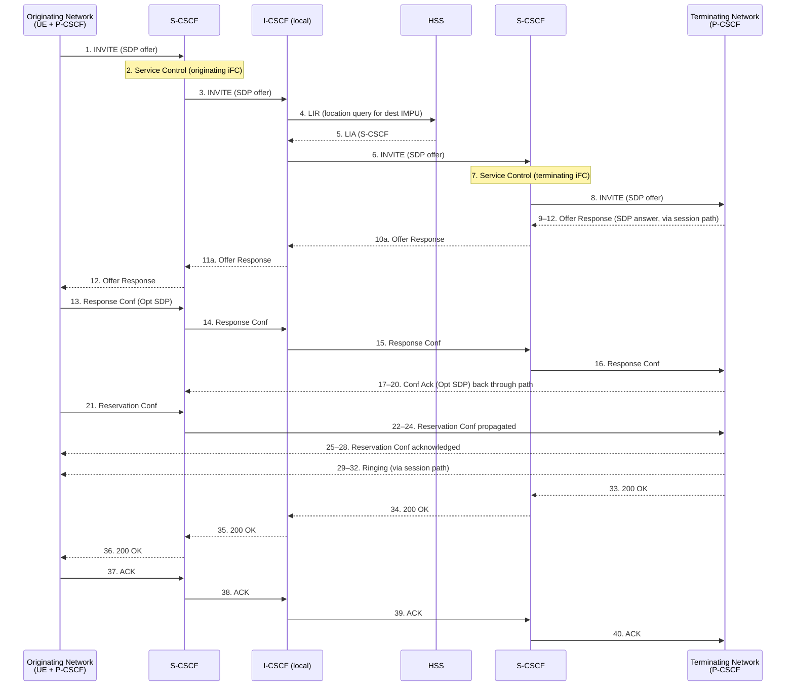
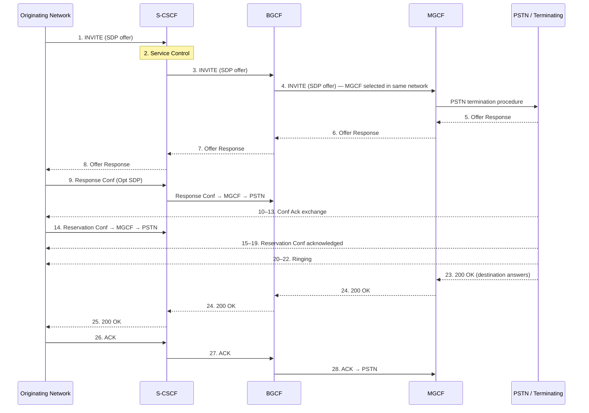
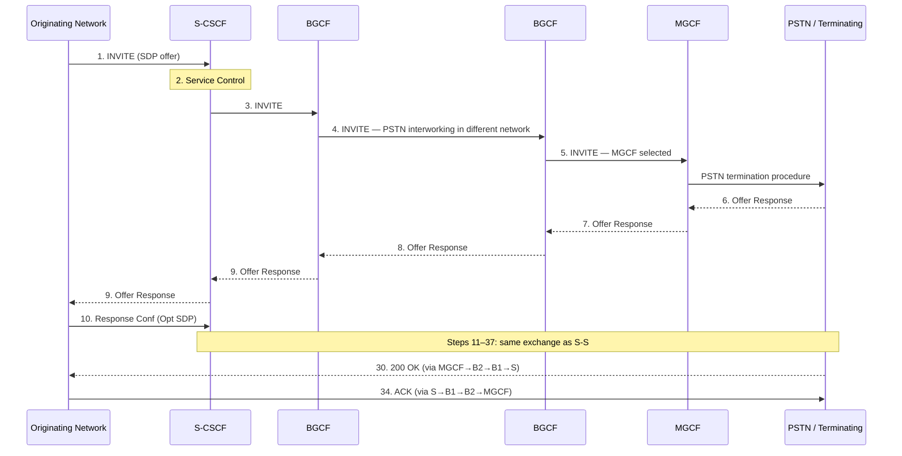
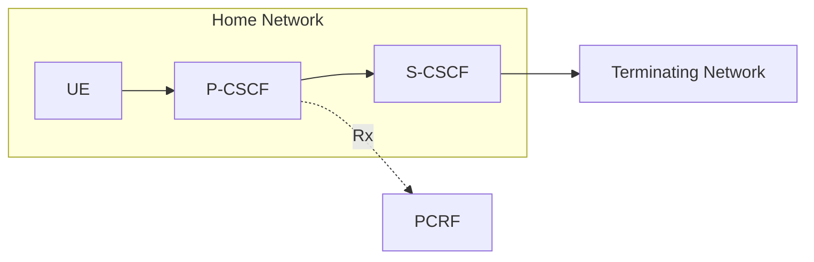
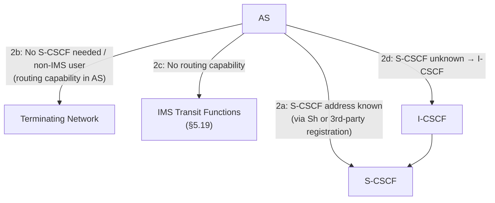
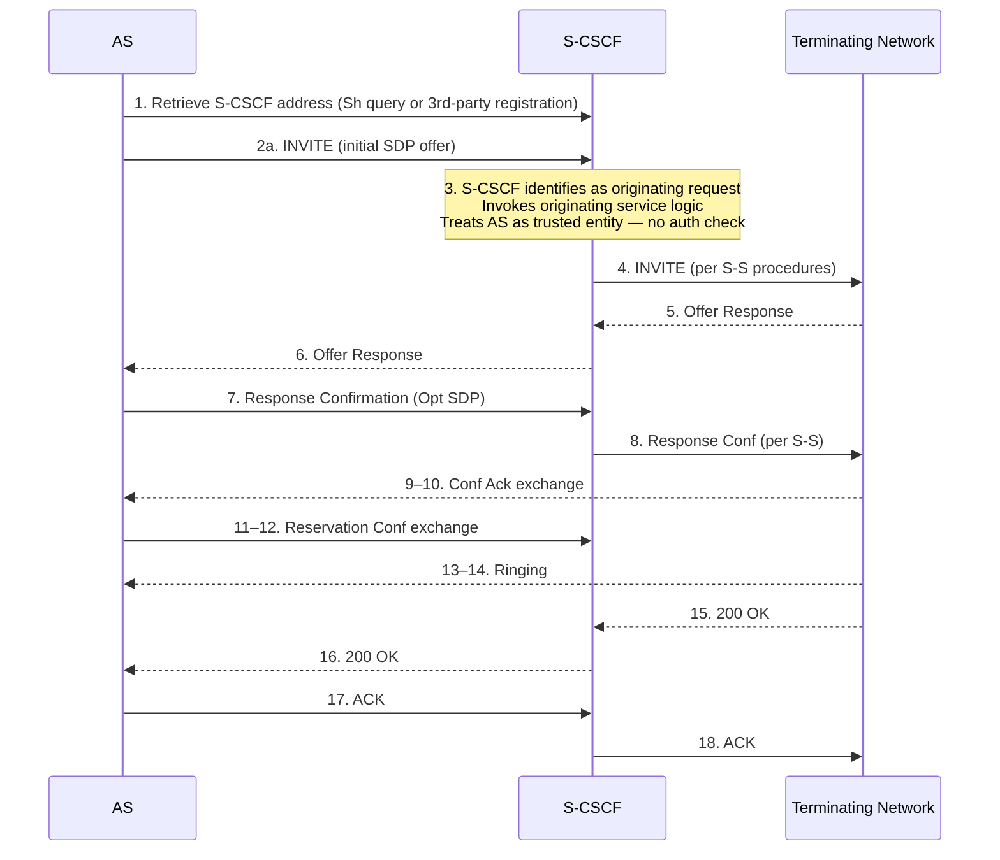

# VoLTE Mobile-Originated Call

Covers TS 23.228 §5.5–5.6: all Serving-to-Serving (S-S) routing variants and all Origination
procedure variants (MO#1, MO#2, PSTN-O, NI-O, AS-O) for IMS session establishment.

Related pages: [S-CSCF](../entities/S-CSCF.md) · [P-CSCF](../entities/P-CSCF.md) ·
[I-CSCF](../entities/I-CSCF.md) · [BGCF](../entities/BGCF.md) ·
[IMS QoS/Bearer](IMS-QoS-bearer.md) · [VoLTE MT Call](VoLTE-MT-call.md) ·
[IMS Registration](IMS-registration.md)

---

## 1. Origination Procedure General Rules (§5.6.0)

Four architectural constants apply to **all** origination procedures:

1. **Signalling path fixed at registration.** The P-CSCF → S-CSCF path is determined during
   IMS registration and remains fixed for the life of that registration. INVITE messages follow
   the same path as REGISTER.

2. **P-CSCF always present.** Every originating UE has an associated P-CSCF. The P-CSCF:
   - performs QoS resource authorization on Rx (AAR to PCRF)
   - may insert or replace a priority indication (MPS code) in the INVITE
   - enables media flows on 200 OK (gate open)

3. **Next hop from P-CSCF is the S-CSCF in the home network.** For roaming (MO#1), this
   means the visited P-CSCF has a registered path to the home S-CSCF. For home users (MO#2),
   P-CSCF and S-CSCF are both in the home network.

4. **PSTN origination (PSTN-O) is a special case.** The MGCF acts as a SIP endpoint that
   mimics an S-CSCF. It uses H.248 to control an MGW and SS7 to interface the PSTN. Subsequent
   IMS nodes treat MGCF signalling as if it came from an S-CSCF.

---

## 2. S-S Routing Matrix

The S-CSCF determines the correct S-S procedure from the destination address analysis:

| Procedure | Destination | Mechanism |
|---|---|---|
| **S-S#1** | Different operator's IMS subscriber | Forward to I-CSCF#2 (inter-operator) |
| **S-S#2** | Same operator's IMS subscriber | Forward to local I-CSCF |
| **S-S#3** | PSTN, MGCF in same network | Forward to local BGCF → MGCF |
| **S-S#4** | PSTN, MGCF in different network | Forward to local BGCF → remote BGCF → MGCF |

_(S-S#1 detailed flow is documented in [IMS QoS/Bearer](IMS-QoS-bearer.md) §16.)_

---

## 3. S-S#2: Same Operator, IMS Subscriber (§5.5.2)

The S-CSCF determines the destination is a subscriber of the **same operator** and passes
the request to a **local I-CSCF**.



**Applicable origination flows:** MO#1 (roaming), MO#2 (home), AS-O
**Applicable termination flows:** MT#1 (roaming), MT#2 (home), MT#3 (CS domain), AS-T#1–4

Key distinction from S-S#1: both S-CSCFs and the I-CSCF are in the **same operator's** network.
There is no inter-operator boundary; the I-CSCF performs an LIR to the local HSS.

---

## 4. S-S#3: PSTN Termination, Same Network (§5.5.3)

The S-CSCF determines the destination is in the **PSTN** and forwards to a local **BGCF**.
The BGCF determines the MGCF is in the **same network**.



**Applicable origination flows:** MO#1, MO#2, AS-O
**Applicable termination flow:** PSTN-T (MGCF in same network as S-CSCF)

---

## 5. S-S#4: PSTN Termination, Different Network (§5.5.4)

The BGCF determines PSTN interworking must occur in a **different network** and forwards to a
**remote BGCF#2**, which then selects the MGCF.



**Applicable origination flows:** MO#1, MO#2, AS-O
**Applicable termination flow:** PSTN-T (MGCF in different network from S-CSCF)

---

## 6. MO#1: Mobile Origination, Roaming (§5.6.1)

The UE is in a **visited network**. P-CSCF is in the visited network; S-CSCF is in the home
network. At registration, P-CSCF learned the S-CSCF address in the home network.

```mermaid
sequenceDiagram
    participant UE
    participant P as P-CSCF (visited)
    participant S as S-CSCF (home)
    participant Term as Terminating Network
    participant PCRF as PCRF/PCF

    UE->>P: 1. INVITE (initial SDP offer)
    Note over P: P-CSCF checks priority (MPS code / user profile).<br/>Inserts/replaces priority indication if needed.
    P->>S: 2. INVITE (+ priority indication if applicable)
    Note over S: 3. Validate service profile; GRUU check;<br/>invoke originating iFC chain; SDP authorization
    S->>Term: 4. INVITE (per S-S procedure; + priority level)
    Term-->>S: 5. Offer Response (SDP answer, media capabilities)
    S-->>P: 6. Offer Response
    P->>PCRF: 7. AAR (Authorize QoS Resources — SDP→IP flow descriptors)
    PCRF-->>P: AAA (PCC rules authorized)
    P-->>UE: 8. Offer Response

    UE->>P: 9. Response Confirmation (Opt SDP)
    Note over UE: 10. Resource Reservation<br/>(UE-initiated bearer request OR IP-CAN-initiated after step 7)
    P->>S: 11. Response Conf
    S->>Term: 12. Response Conf (per S-S procedure)
    Term-->>P: 13–15. Conf Ack (Opt SDP) via session path

    UE->>P: 16. Reservation Conf (resource reservation complete)
    P->>S: 17. Reservation Conf
    S->>Term: 18. Reservation Conf (per S-S procedure)
    Term-->>S: 19. Reservation Conf (terminating side)
    S-->>P: 20. Reservation Conf
    P-->>UE: 21. Reservation Conf

    Term-->>S: 22. Ringing (180)
    S-->>P: 23. Ringing
    P-->>UE: 24. Ringing
    UE->>UE: 25. Alert User (ring tone)

    Term-->>S: 26. 200 OK (destination answers)
    S-->>P: 27. 200 OK
    P->>PCRF: 28. Enable Media Flows (gate open — RAR/RAA)
    P-->>UE: 29. 200 OK
    UE->>UE: 30. Start Media
    UE->>P: 31. ACK
    P->>S: 32. ACK
    S->>Term: 33. ACK
```

### Step notes

| Step | Detail |
|---|---|
| 2 | P-CSCF priority: uses user profile stored at registration + MPS code in INVITE. If priority required, inserts/replaces `Resource-Priority` header. |
| 3 | S-CSCF: validates that the GRUU in Contact belongs to the same service profile as the calling IMPU; invokes originating iFC chain (which may fork to one or more ASes before the request reaches the terminating side). |
| 7 | P-CSCF sends `AAR` on Rx with media component descriptors derived from SDP. New SDP in step 9 triggers re-authorization at step 14. Each offer/answer exchange repeats step 7. |
| 9 | Response Confirmation may include SDP — if new media defined, P-CSCF re-authorizes (step 7 repeated after step 14). |
| 10 | Resource reservation: UE-initiated (UE sends Bearer Resource Allocation Request per TS 23.401 §5.4.5) or IP-CAN-initiated (PCRF pushes PCC rules to PCEF after step 7). |
| 28 | Gate open: P-CSCF instructs PCRF to enable media flows on the PCEF — media can flow only after this step. |

---

## 7. MO#2: Mobile Origination, Home (§5.6.2)

The UE is in the **home network**. Both P-CSCF and S-CSCF are in the home network. The
procedure is functionally identical to MO#1 with one routing difference:

- Step 2: P-CSCF forwards INVITE directly to the home S-CSCF (no visited-to-home path complexity)
- All 33 steps are identical in structure; the only difference is the UE and P-CSCF topology



> In MO#2, there is no cross-network hop between P-CSCF and S-CSCF. The P-CSCF knows the
> S-CSCF address from the registration procedure (both in home network).

---

## 8. PSTN-O: PSTN Origination (§5.6.3)

The MGCF is the SIP endpoint for calls originating from the PSTN. It acts as the functional
equivalent of an S-CSCF from the perspective of downstream IMS nodes.

```mermaid
sequenceDiagram
    participant PSTN
    participant MGW
    participant MGCF
    participant ICSCF as I-CSCF (configured)
    participant Term as Terminating IMS Network

    PSTN->>MGW: 1. Bearer path established (IAM signal to MGCF)
    MGCF->>MGW: 2. H.248 — seize trunk and IP port
    MGCF->>ICSCF: 3. INVITE (tel URI or SIP URI with E.164; initial SDP;<br/>attestation info from trunk identity)
    ICSCF->>Term: per S-S procedures
    Term-->>MGCF: 4. Offer Response (media capabilities, via session path)
    MGCF->>MGW: 5. H.248 — modify connection; reserve resources
    MGCF->>Term: 6. Response Confirmation (Opt SDP, per S-S)
    Term-->>MGCF: 7. Conf Ack (Opt SDP)
    MGW->>MGW: 8. Reserve resources
    MGCF->>Term: 9. Resource Reservation (successful)
    Term-->>MGCF: 10. Reservation Conf
    Term-->>MGCF: 11. Ringing (provisional response)
    MGCF-->>PSTN: 12. ACM (Address Complete Message — alerting)
    Term-->>MGCF: 13. 200 OK (destination answers)
    MGCF-->>PSTN: 14. ANM (Answer Message)
    MGCF->>MGW: 15. H.248 — make connection bi-directional
    MGCF->>Term: 16. ACK
```

Key properties:
- MGCF sends INVITE to a **configured I-CSCF** (not direct to S-CSCF) — I-CSCF performs LIR
- MGCF may add **attestation information** to INVITE based on trunk identity or local policy
- Media reservation uses H.248 commands to MGW (not UE-initiated bearer requests)
- PSTN signalling: IAM → ACM → ANM maps to INVITE → 180 → 200 OK

---

## 9. NI-O: Non-IMS Origination from External SIP Client (§5.6.4)

An external SIP client that **does not support IMS SIP extensions** (no `Require: precondition`)
initiates a session toward an IMS UE. This is a special case because the originator cannot
participate in the QoS precondition exchange.

```mermaid
sequenceDiagram
    participant Ext as External SIP Client
    participant S as S-CSCF (term network)
    participant P as P-CSCF
    participant UE

    Ext->>S: 1. INVITE (media info, no preconditions)
    S->>P: 2. INVITE (media info, no preconditions)
    Note over P: 3. Media Component Policy Check<br/>(P-CSCF validates against PCRF/PCF bandwidth limits;<br/>rejects if not allowed by policy)
    P->>UE: 4. INVITE
    Note over UE: 5. Resource Reservation<br/>(UE-initiated; no precondition signalling)
    UE-->>P: 6. 180 Ringing
    P-->>S: 7. 180 Ringing
    S-->>Ext: 8. 180 Ringing
    Note over UE,P: Steps 5–8 may proceed in parallel
    UE-->>P: 9. 200 OK (media active)
    Note over P: 10. Authorize QoS Resources (AAR on Rx, per operator policy)
    P-->>S: 11. 200 OK
    S-->>Ext: 12. 200 OK
    Ext->>S: 13. ACK
    S->>P: 14. ACK
    P->>UE: 15. ACK
```

Key properties:
- P-CSCF performs **media policy check** at step 3 — may reject if bandwidth exceeds PCRF limit
- Resource reservation happens **after** UE accepts (not before ringing as with preconditions)
- P-CSCF QoS authorization (step 10) is **operator-policy-controlled** — may be done or omitted
- This flow is a variant of MT#2 (non-roaming termination) from the IMS side

---

## 10. AS-O: Application Server Origination (§5.6.5)

The AS initiates a session on behalf of a user or PSI. The AS is trusted by the S-CSCF —
no authentication check is performed. The AS can reach the S-CSCF in four ways:



### Option 2a/2d: Session with S-CSCF (Figure 5.16b)



### §5.6.5.3: S-CSCF Selection by I-CSCF for AS Origination (Figure 5.16c)

When the AS does not know the S-CSCF (option 2d), the I-CSCF selects one:

```mermaid
sequenceDiagram
    participant AS
    participant I as I-CSCF
    participant HSS
    participant S as S-CSCF

    AS->>I: 1. INVITE (originating indication)
    I->>HSS: 2. Cx-LocQuery (calling party IMPU / PSI)
    HSS-->>I: 3. Cx-LocQueryResp<br/>(S-CSCF capabilities OR existing S-CSCF name)<br/>Note: HSS responds even if identity unregistered
    Note over I: 4. I-CSCF selects S-CSCF<br/>(if not already provided by HSS)
    I->>S: 5. INVITE (+ originating indication)
    S->>HSS: 6. Cx-Put/Cx-Pull (store S-CSCF name; retrieve user info)
    HSS-->>S: 7. Cx-Put Resp / Cx-Pull Resp<br/>(HSS stores S-CSCF name for this IMPU/PSI)
    Note over S: 8. Invoke service logic<br/>(originating iFC; unregistered-state logic if applicable)
    S->>AS: 9. Session setup continues
```

Key rules:
- HSS returns capabilities even if the identity has **no iFC for the unregistered state** — the
  S-CSCF just routes without invoking service logic in that case
- The S-CSCF stores its name in HSS for the IMPU/PSI: all subsequent sessions for this identity
  will be routed to this S-CSCF until registration expires or the UE attaches

---

## 11. Summary: Which S-S Procedure for Which Origination Flow?

| Origination | IMS→IMS same operator | IMS→IMS diff operator | IMS→PSTN same net | IMS→PSTN diff net |
|---|---|---|---|---|
| MO#1 (roaming) | S-S#2 | S-S#1 | S-S#3 | S-S#4 |
| MO#2 (home) | S-S#2 | S-S#1 | S-S#3 | S-S#4 |
| PSTN-O | — (MGCF is source) | — | — | — |
| NI-O | MT#2 termination side | — | — | — |
| AS-O | S-S#2 | S-S#1 | S-S#3 | S-S#4 |

---

## 12. Common Step Patterns Across All MO Flows

| Phase | SIP Exchange | Notes |
|---|---|---|
| Session initiation | INVITE (SDP offer) | UE → P-CSCF → S-CSCF → S-S |
| Media negotiation | Offer Response (SDP answer) | Returned along signalling path |
| QoS authorization | AAR/AAA on Rx | P-CSCF → PCRF after receiving SDP answer |
| Resource confirmation | Response Conf + Conf Ack | Offer selection confirmed by originating UE |
| Bearer establishment | Resource Reservation | UE-initiated or IP-CAN-initiated |
| Alerting | 180 Ringing | Propagated along session path |
| Answer | 200 OK | Propagated back to UE |
| Gate open | Enable Media Flows | P-CSCF → PCRF/PCEF on receiving 200 OK |
| Session established | ACK | UE → P-CSCF → S-CSCF → S-S |

---

## Cross-References

| Topic | Page |
|---|---|
| IMS QoS/PCC interactions (Rx, gate control, preconditions) | [IMS QoS/Bearer](IMS-QoS-bearer.md) |
| VoLTE Termination (MT#1, MT#2, MT#3) | [VoLTE MT Call](VoLTE-MT-call.md) |
| IMS Registration and P-CSCF discovery | [IMS Registration](IMS-registration.md) |
| BGCF: PSTN breakout routing | [BGCF](../entities/BGCF.md) |
| S-CSCF: service control, iFC chain | [S-CSCF](../entities/S-CSCF.md) |
| P-CSCF: Rx AF, priority, gate control | [P-CSCF](../entities/P-CSCF.md) |
| Dedicated bearer creation (UE-initiated resource reservation) | [Dedicated Bearer](dedicated-bearer.md) |
