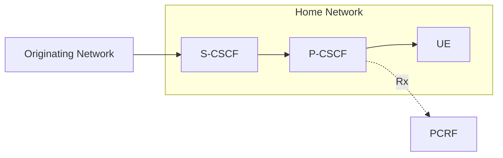
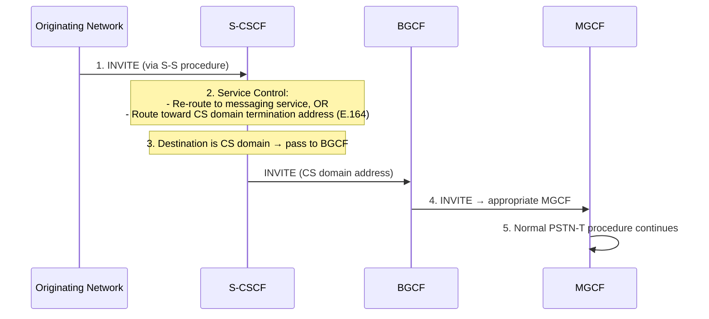
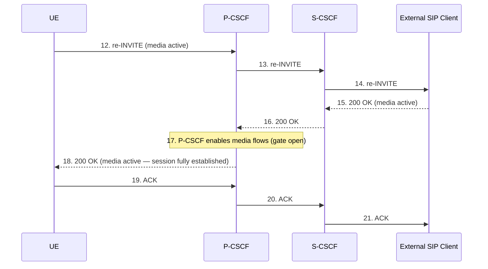
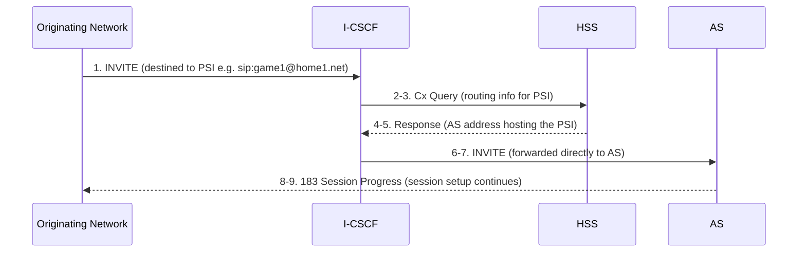
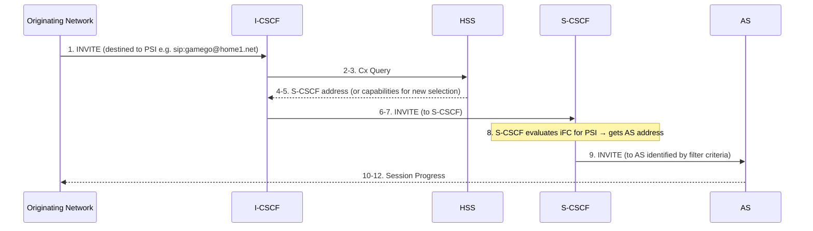
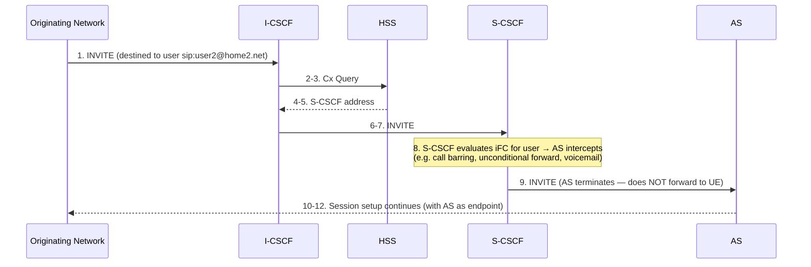
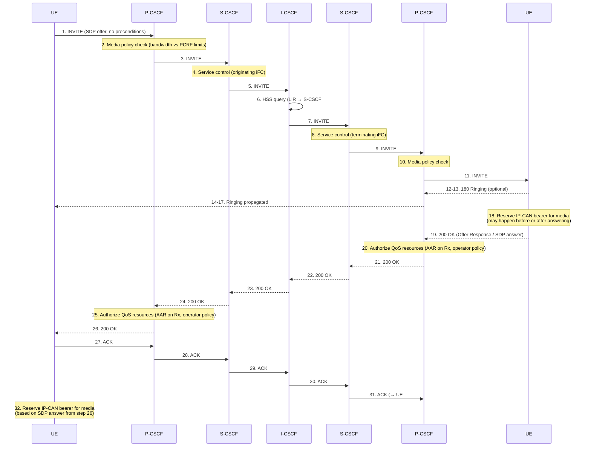
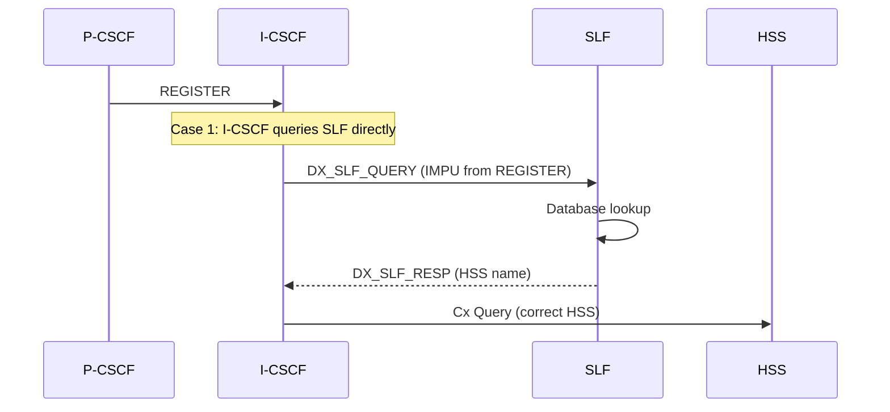
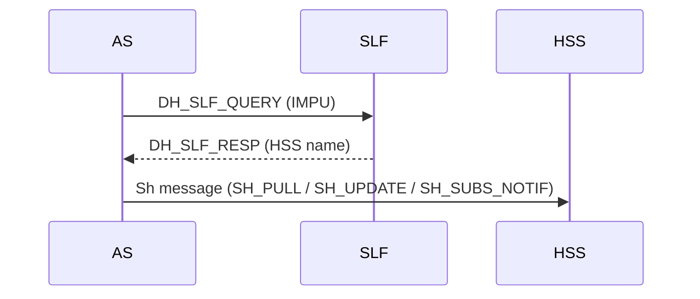

# VoLTE Mobile-Terminated Call

Covers TS 23.228 §5.7–5.8: all Termination procedure variants (MT#1, MT#2, MT#3, PSTN-T,
NI-T, AS-T#1–4), SLF-based HSS resolution (§5.8), mid-session signalling routing (§5.9),
and sessions without preconditions (§5.7a).

Related pages: [S-CSCF](../entities/S-CSCF.md) · [P-CSCF](../entities/P-CSCF.md) ·
[I-CSCF](../entities/I-CSCF.md) · [IMS QoS/Bearer](IMS-QoS-bearer.md) ·
[VoLTE MO Call](VoLTE-MO-call.md) · [Session Release](session-release.md) ·
[IMS Registration](IMS-registration.md)

---

## 1. Termination Procedure General Rules (§5.7.0)

Three architectural constants apply to **all** termination procedures:

1. **Signalling path fixed at registration.** S-CSCF knows the next hop P-CSCF address
   (from the registration procedure). P-CSCF knows the UE address. Both remain fixed for
   the life of the registration.

2. **P-CSCF always present.** Every terminating UE has an associated P-CSCF. The P-CSCF:
   - performs QoS resource authorization on Rx (AAR to PCRF)
   - handles MPS priority session detection and dynamic policy invocation
   - enables media flows on UE answer (gate open)
   - generates CDR for roaming case

3. **PSTN termination is a special case.** The MGCF acts as a SIP endpoint receiving
   sessions on behalf of the PSTN. It uses H.248 to control an MGW and sends IAM/ANM to
   the PSTN via SS7.

---

## 2. MT#1: Mobile Termination, Roaming (§5.7.1)

The UE is in a **visited network**. S-CSCF is in the home network; P-CSCF is in the
visited network. At registration, S-CSCF learned the P-CSCF address in the visited network.

```mermaid
sequenceDiagram
    participant Orig as Originating Network
    participant S as S-CSCF (home)
    participant P as P-CSCF (visited)
    participant UE
    participant PCRF as PCRF/PCF

    Orig->>S: 1. INVITE (initial SDP offer, via S-S procedure)
    Note over S: 2. Validate service profile;<br/>invoke terminating iFC chain
    Note over S: 3. Look up next hop = P-CSCF in visited (from registration)
    S->>P: 3. INVITE
    Note over P: 4. MPS check: if priority session,<br/>derive session info → dynamic policy → AAR to PCRF<br/>Recall UE address from registration
    P->>UE: 4. INVITE
    UE-->>P: 5. Offer Response (SDP answer — supported media subset)
    P->>PCRF: 6. AAR (Authorize QoS Resources — SDP→IP flows)
    PCRF-->>P: AAA (PCC rules authorized)
    P-->>S: 7. Offer Response
    S-->>Orig: 8. Offer Response (per S-S procedure)

    Orig->>S: 9. Response Confirmation (Opt SDP)
    Note over P: If new SDP in step 9 → re-authorize at step 12
    S->>P: 10. Response Conf (may route via I-CSCF per operator config)
    P->>UE: 11. Response Conf
    UE-->>P: 12. Conf Ack (Opt SDP); if SDP changed P-CSCF re-authorizes
    Note over UE: 13. Resource Reservation<br/>(UE-initiated or IP-CAN-initiated after step 6)
    P-->>S: 14-15. Conf Ack → originator (may route via I-CSCF)

    Orig->>S: 16. Reservation Conf (resource reservation complete)
    S->>P: 17. Reservation Conf
    P->>UE: 18. Reservation Conf
    UE->>UE: 19. Alert User (incoming call ring)
    UE-->>P: 20. Reservation Conf
    P-->>S: 21. Reservation Conf
    S-->>Orig: 22. Reservation Conf

    UE-->>P: 23. Ringing (180)
    P-->>S: 24. Ringing
    S-->>Orig: 25. Ringing

    UE-->>P: 26. 200 OK (destination answers)
    P->>PCRF: 27. Enable Media Flows (gate open)
    UE->>UE: 28. Start Media
    P-->>S: 29-30. 200 OK → originator

    Orig->>S: 31. ACK
    S->>P: 32. ACK
    P->>UE: 33. ACK
```

### Step notes

| Step | Detail |
|---|---|
| 2 | S-CSCF validates GRUU/IMPU mapping; invokes **terminating** iFC chain (may fork to TAS/voicemail AS etc.) |
| 4 | P-CSCF priority: if INVITE contains MPS indication, P-CSCF derives session info and invokes dynamic policy. P-CSCF may also authorize resources at step 4 if originating side already has resources (no SDP answer needed first). |
| 6 | P-CSCF sends AAR on Rx with media component descriptors from UE's SDP answer. |
| 10 | Routing of Response Conf may go through I-CSCF depending on operator configuration. |
| 13 | Resource reservation: UE-initiated (Bearer Resource Allocation Request per TS 23.401) or IP-CAN-initiated (PCRF pushes PCC rules to PCEF). |
| 27 | Gate open: P-CSCF instructs PCRF/PCF to enable media flows — media can only flow after UE answers. |

---

## 3. MT#2: Mobile Termination, Home (§5.7.2)

The UE is in the **home network**. Both S-CSCF and P-CSCF are in the home network.
Structurally identical to MT#1 with one routing difference:

- Step 3: S-CSCF forwards INVITE to the P-CSCF **in the home network** (no visited-to-home hop)



All 33 steps are identical to MT#1 in structure. The only difference is the topology:
P-CSCF and UE are in the same home network as the S-CSCF.

---

## 4. MT#3: Mobile Termination, CS Domain Roaming (§5.7.2a)

Applies when the user has **both IMS and CS subscriptions** but is **unregistered for IMS**
(e.g. the device is a UMTS phone currently attached to CS only).



Key notes:
- If no S-CSCF allocated for this user: route per §5.12.1 (unregistered IMS user handling)
- S-CSCF may invoke service logic that redirects the session (e.g. to voicemail) instead of
  routing to the CS domain
- Once the MGCF receives the INVITE, the flow continues as PSTN-T (§5.7.3)

---

## 5. PSTN-T: PSTN Termination (§5.7.3)

The MGCF receives the session from IMS and bridges to the PSTN via SS7 and H.248/MGW.

```mermaid
sequenceDiagram
    participant Orig as Originating Network
    participant MGCF
    participant MGW
    participant PSTN

    Orig->>MGCF: 1. INVITE (initial SDP offer, via S-S procedure)
    MGCF->>MGW: 2. H.248 — pick outgoing channel + determine MGW media capabilities
    MGCF-->>Orig: 3. Offer Response (supported media subset, per S-S)
    Orig->>MGCF: 4. Response Confirmation (Opt SDP)
    MGCF->>MGW: 5. H.248 — modify connection; reserve resources for media
    MGCF-->>Orig: 6. Conf Ack (Opt SDP)
    MGW->>MGW: 7. Reserve resources
    Orig->>MGCF: 8. Reservation Conf
    MGCF->>PSTN: 9. IAM (Initial Address Message — destination info)
    MGCF-->>Orig: 10. Reservation Conf (per S-S)
    PSTN-->>MGCF: 11. ACM (Address Complete — alerting, optional)
    MGCF-->>Orig: 12. Ringing (provisional 180, via S-S)
    PSTN-->>MGCF: 13. ANM (Answer Message — destination answered)
    MGCF->>MGW: 14. H.248 — make MGW connection bi-directional
    MGCF-->>Orig: 15. 200 OK (via S-S)
    Orig->>MGCF: 16. ACK
```

Key properties:
- MGCF has no P-CSCF role — it is the S-CSCF equivalent; no Rx/PCRF interaction
- IAM is sent only after resource reservation is complete (step 9 after step 8)
- RLC (Release Complete) in PSTN-O corresponds to ACM/ANM in PSTN-T

---

## 6. NI-T: Non-IMS Termination to External SIP Client (§5.7.4)

The originating UE has IMS precondition capability but the external destination **does not**.
The session is set up in two phases:

### Phase 1 — Session with Inactive Media (Figure 5.19b)

```mermaid
sequenceDiagram
    participant UE
    participant P as P-CSCF
    participant S as S-CSCF
    participant Ext as External SIP Client

    UE->>P: 1. INVITE (Supported: precondition; all media inactive)
    P->>S: 2. INVITE
    S->>Ext: 3. INVITE (precondition info forwarded but ignored by Ext)
    Ext-->>S: 4. 200 OK (media inactive — Ext ignores preconditions)
    S-->>P: 5. 200 OK
    Note over P: 6. P-CSCF may authorize QoS resources (operator policy)
    P-->>UE: 7. 200 OK (media inactive)
    UE->>P: 8. ACK
    P->>S: 9. ACK
    S->>Ext: 10. ACK
    Note over UE: 11. UE initiates resource reservation<br/>(session established but media not yet flowing)
```

### Phase 2 — Media Activation (Figure 5.19c)

After resource reservation, UE activates media via re-INVITE:



Key property: The two-phase approach ensures the IMS UE can establish and authorize its EPS
bearer before media flows, even though the external client cannot participate in preconditions.

---

## 7. AS-T#1: PSI Based AS Termination — Direct (§5.7.5)

Session destined to a PSI; HSS provides the AS address **directly** to the I-CSCF.



---

## 8. AS-T#2: PSI Based AS Termination — Indirect via S-CSCF (§5.7.6)

Session destined to a PSI; HSS provides S-CSCF address; S-CSCF evaluates iFC to find AS.



---

## 9. AS-T#3: PSI Based AS Termination — DNS Routing (§5.7.7)

Session from an external network to a PSI whose subdomain resolves via DNS to an AS.

```mermaid
sequenceDiagram
    participant Ext as External Network
    participant I as I-CSCF
    participant DNS
    participant AS

    Ext->>I: 1. INVITE (sip:fungame1@as1.home1.net)
    Note over I: 2. I-CSCF checks domain list; finds match for as1.home1.net<br/>3. Queries DNS for IP address of as1.home1.net
    I->>DNS: 4. DNS query
    DNS-->>I: 5. IP address of AS
    I->>AS: 6-7. INVITE (to DNS-resolved AS address)
    AS-->>Ext: 8-9. Session Progress
```

Key: I-CSCF uses its configured domain list and DNS to route without HSS interaction.
This allows external networks to reach PSIs via subdomain-based routing.

---

## 10. AS-T#4: AS Termination Based on Service Logic (§5.7.8)

Session destined to an IMS user but the S-CSCF's iFC diverts it to an AS, which
**terminates the session itself** rather than forwarding to the UE.



---

## 11. Sessions Without Preconditions (§5.7a)

**Use case:** Services without real-time QoS requirements before session activation —
instant messaging, presence, or calls where existing default bearers suffice.

**Key difference from §5.6/§5.7:** No dedicated IP-CAN bearer is required before
the session becomes active. Resource reservation can happen concurrently with or after
the session is answered.

### §5.7a.2: End-to-End Without Preconditions (Figure 5.19h)

Full cross-operator flow (UE#1 → P-CSCF#1 → S-CSCF#1 → I-CSCF#2 → S-CSCF#2 → P-CSCF#2 → UE#2):



**Comparison with precondition flows:**

| Feature | With preconditions (§5.6/5.7) | Without preconditions (§5.7a) |
|---|---|---|
| Bearer before ringing | Required | Not required |
| QoS authorization timing | Before Offer Response | After 200 OK (operator policy) |
| Ringing timing | After resource reservation confirmed | May happen immediately |
| Bearer reservation | Before 200 OK | Before or after 200 OK |
| Use case | VoLTE voice/video | IM, presence, best-effort calls |

---

## 12. SLF-Based HSS Resolution (§5.8)

When multiple independently addressable HSSs are deployed, the **SLF (Subscription Locator
Function)** resolves a user identity to the specific HSS holding that user's data.

### Interfaces

| Interface | Between | Operation |
|---|---|---|
| **Dx** | I-CSCF or S-CSCF ↔ SLF | `DX_SLF_QUERY` (identity) → `DX_SLF_RESP` (HSS name) |
| **Dh** | AS ↔ SLF | `DH_SLF_QUERY` (IMPU) → `DH_SLF_RESP` (HSS name) |

### SLF on REGISTER (§5.8.2)



Case 2 (Figure 5.20a): I-CSCF forwards REGISTER to S-CSCF; S-CSCF queries SLF
(`DX_SLF_QUERY`) and resolves the correct HSS itself.

### SLF on UE INVITE (§5.8.3)

```mermaid
sequenceDiagram
    participant xCSCF as x-CSCF
    participant I as I-CSCF
    participant SLF
    participant HSS

    xCSCF->>I: INVITE
    I->>SLF: DX_SLF_QUERY (IMPU; E.164 converted to Tel URI per RFC 3966)
    SLF-->>I: DX_SLF_RESP (HSS name)
    I->>HSS: Cx Query
```

**E.164 note:** If the called identity is an E.164 number in `sip:+12345@home.net;user=phone`
format, I-CSCF must convert it to `tel:+12345` before sending `DX_SLF_QUERY`.

### SLF on AS Access to HSS (§5.8.4)



AS may cache the HSS name for subsequent Sh operations.

---

## 13. Mid-Session Signalling Routing (§5.9)

Four nodes **must** remain on the signalling path for the life of an established session:

| Node | Why it must stay in path |
|---|---|
| **P-CSCF (originating)** | CDR generation (roaming); force resource release at session end |
| **S-CSCF (originating)** | Service logic at session completion; CDR at termination |
| **S-CSCF (terminating)** | Service logic at session completion; CDR at termination |
| **P-CSCF (terminating)** | CDR generation (roaming); force resource release |

Additional rules:
- I-CSCFs may optionally remain in path if performing mid-session or session-clearing functions
- **All UE signalling** (re-INVITE, BYE, REFER, etc.) must be sent to the P-CSCF
- Session path is recorded via `Record-Route` headers during INVITE/200 OK

---

## Cross-References

| Topic | Page |
|---|---|
| Session Release (BYE, network-initiated, PSTN release) | [Session Release](session-release.md) |
| Session Hold/Resume | [Session Release](session-release.md) |
| VoLTE MO Call (MO#1, MO#2, PSTN-O) | [VoLTE MO Call](VoLTE-MO-call.md) |
| IMS QoS/PCC interactions (Rx, gate control) | [IMS QoS/Bearer](IMS-QoS-bearer.md) |
| S-CSCF iFC evaluation | [S-CSCF](../entities/S-CSCF.md) |
| I-CSCF: THIG, HSS query, S-CSCF selection | [I-CSCF](../entities/I-CSCF.md) |
| HSS Cx/Sh subscriber data | [HSS](../entities/HSS.md) |
