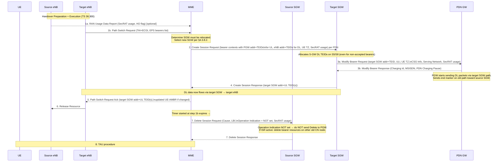

# X2-Based Intra-E-UTRAN Handover

TS 23.401 §5.5.1.1. Used to hand over a UE from a source eNodeB to a target eNodeB via the **X2 reference point**. The [MME](../entities/MME.md) is always unchanged. Two variants exist depending on whether the [Serving GW](../entities/SGW.md) can continue to serve the UE.

Preparation and execution phases are defined in TS 36.300. The core network is involved only in the **completion phase** (Path Switch).

---

## Two Variants at a Glance

| | Without SGW Relocation (§5.5.1.1.2) | With SGW Relocation (§5.5.1.1.3) |
|---|---|---|
| MME | Unchanged | Unchanged |
| SGW | Unchanged | New SGW selected |
| Core trigger | Path Switch Request | Path Switch Request |
| Core signalling | Modify Bearer Request/Response | Create Session Request at new SGW |
| Source SGW cleanup | None needed | Delete Session Request (Operation Indication not set) |

---

## §5.5.1.1.2 — X2-Based Handover without SGW Relocation

```mermaid
sequenceDiagram
    participant UE
    participant SRC as Source eNB
    participant TGT as Target eNB
    participant MME
    participant SGW as Serving GW
    participant PGW as PDN GW

    Note over SRC,TGT: Handover Preparation + Execution (TS 36.300)<br/>UE detaches from source, attaches to target cell

    SRC-->>MME: 1a. RAN Usage Data Report (SecRAT usage, HO flag) [optional]
    TGT->>MME: 1b. Path Switch Request (TAI+ECGI, EPS bearers list, CSG info)
    Note over MME: Determine SGW unchanged.<br/>Release non-accepted dedicated bearers (§5.4.4.2)

    MME->>SGW: 2. Modify Bearer Request (target eNB addr+TEIDs for DL,\nISR Activated, SecRAT usage) per PDN connection
    SGW->>PGW: 3a. Modify Bearer Request (SGW addr/TEID, ULI, UE TZ,\nCSG Info, Serving Network) [if ULI/TZ/CSG changed]
    PGW-->>SGW: 3b. Modify Bearer Response
    SGW-->>MME: 4. Modify Bearer Response

    Note over SGW,SRC: 5. SGW → source eNB: End marker packet(s) on old path
    Note over SGW,TGT: SGW starts sending DL packets to target eNB via new TEIDs

    MME-->>TGT: 6. Path Switch Request Ack (updated UE-AMBR if changed,\nfailed bearers list, CSG membership verified)
    TGT->>SRC: 7. Release Resource (handover success, source releases UE context)
    Note over UE,MME: 8. TAU procedure (if TAU triggers apply; light TAU — no context transfer)
```

### Step Details

| Step | Detail |
|---|---|
| 1a | Source eNB sends Secondary RAT usage data (handover flag set). MME buffers before forwarding to SGW |
| 1b | Path Switch Request carries: TAI+ECGI of target cell, list of EPS bearers that were accepted by target eNB, CSG ID (if CSG/hybrid cell), CSG Membership Status IE |
| 2 | One Modify Bearer Request per PDN connection where the default bearer was accepted. Carries new target eNB DL address(es) and TEID(s). MME may use Modify Access Bearers Request optimization if SGW supports it |
| 3a | SGW only forwards to PGW if ULI, UE TZ, Serving Network, or User CSG Info has changed |
| 5 | **End marker**: SGW sends end-marker packet(s) on the **old** path to source eNB immediately after switching the path. Assists target eNB PDCP reordering (TS 36.300 §10.1.2.2) |
| 6 | If UE-AMBR changed (e.g., all APN bearers rejected), MME includes updated UE-AMBR in Ack. Failed bearers listed for target eNB to clean up |
| 8 | TAU is a subset procedure: UE in ECM-CONNECTED, context already at MME, so context transfer steps skipped. If ISR was active, MME maintains ISR and indicates ISR Activated in TAU Accept |

### Bearer Failure Handling

| Failure condition | Action |
|---|---|
| Dedicated bearer not accepted by target eNB | MME releases that bearer via §5.4.4.2 |
| Default bearer of a PDN not accepted (other PDNs active) | MME releases all bearers of that PDN connection (PDN disconnection §5.10.3) |
| ALL default EPS bearers rejected **or** LIPA not released | MME sends Path Switch Request **Failure** → explicit MME-initiated detach (§5.3.8.3) |

---

## §5.5.1.1.3 — X2-Based Handover with SGW Relocation



### Critical: Operation Indication Flag

The Delete Session Request sent to the **source SGW** in step 7 has the **Operation Indication flag NOT set**. This signals to the source SGW:
> "Clean up your local bearer contexts, but do **not** initiate Delete Session Request toward the PDN GW."

The PDN GW path has already been switched to the target SGW (step 3a). If the source SGW also sent a Delete to the PGW, it would tear down the new session.

### ISR During SGW Relocation
If ISR was activated before this handover:
- The cause in Delete Session Request indicates to source SGW to delete bearer resources on the **other old CN node** (e.g., SGSN) via Delete Bearer Request.

---

## General Rules Applying to Both X2 Variants

### PDN GW Bearer Request Rejection During HO
If the MME receives a PDN GW initiated EPS bearer request (Create/Update/Delete Bearer) while X2 handover is in progress:
- MME **rejects** the request with indication "temporarily rejected due to handover procedure in progress"
- SGW forwards this rejection to PGW
- PGW starts a **locally configured guard timer** and re-attempts the procedure up to a pre-configured number of times after detecting handover completion/failure

### NAS Procedure Rejection During X2 HO
If MME receives a rejection to a NAS procedure from eNB with indication that X2 HO is in progress:
- MME re-attempts the NAS procedure after handover completes OR to source eNB if handover fails (if MME is still serving)
- Exception: Serving GW relocation case — resend to target eNB only on completion

### PLMN Change
If serving PLMN changes during X2 HO, source eNB indicates the new Serving PLMN to target eNB in the Handover Restriction List.

---

## Related Pages

- [S1-Handover](S1-handover.md) — used when X2 not available; may also relocate MME
- [SGW](../entities/SGW.md) — path switching, end-marker mechanism, ISR cleanup
- [MME](../entities/MME.md) — bearer failure handling, TAU after handover
- [TAU](TAU.md) — post-handover tracking area update
- [dedicated-bearer](dedicated-bearer.md) — §5.4.4.2 used to release non-accepted bearers
