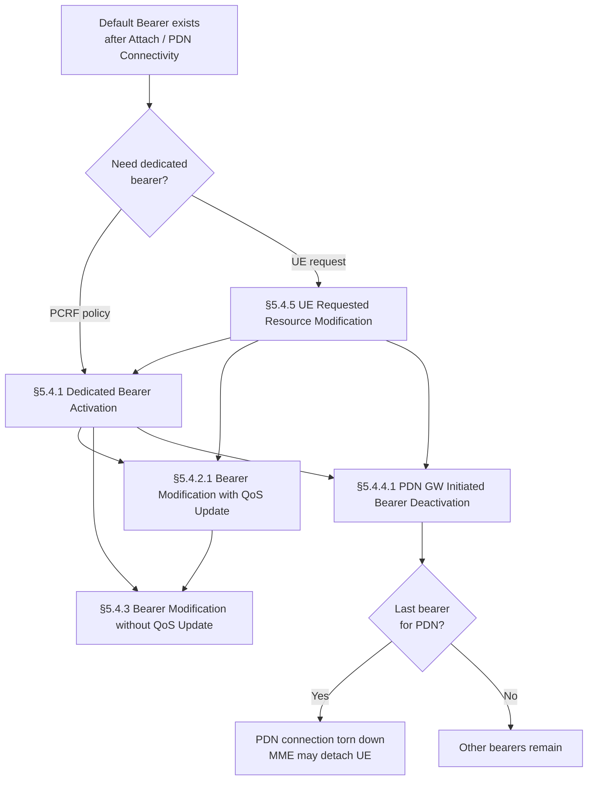
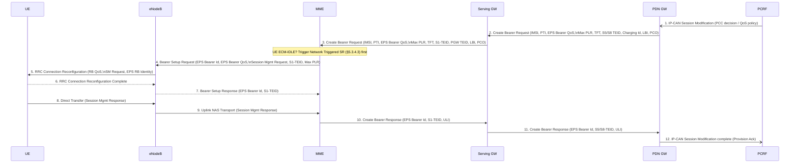
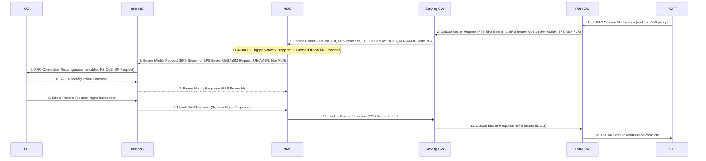
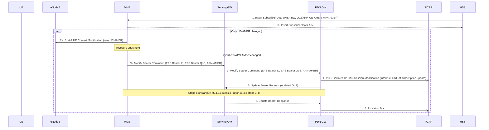
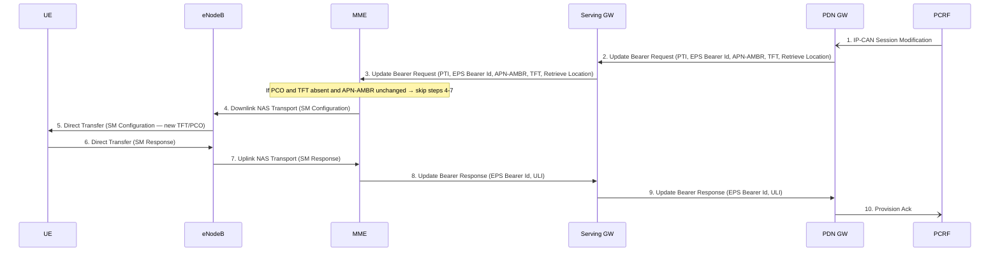
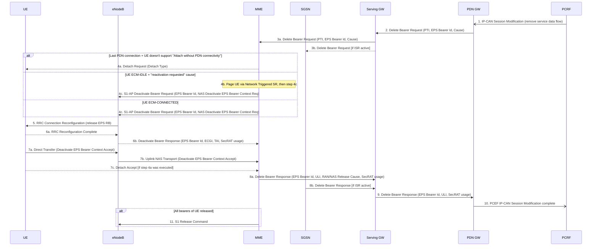
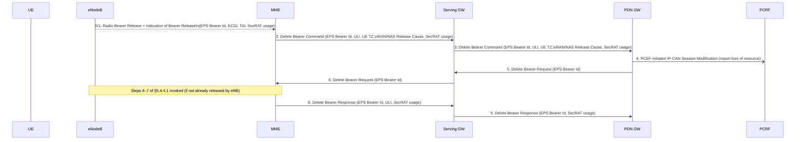
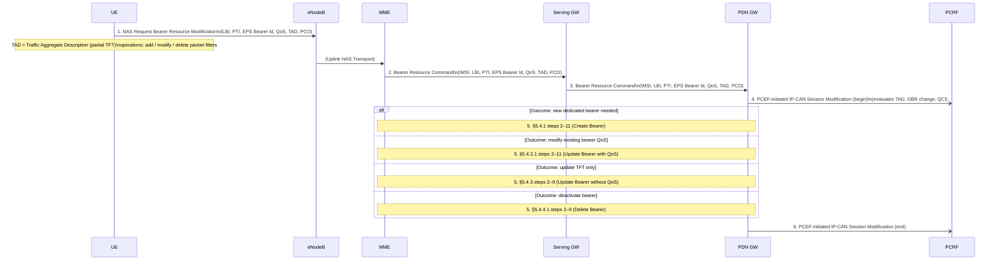

# EPS Bearer Management Procedures

TS 23.401 §5.4 defines how dedicated EPS bearers are created, modified, and deleted, and how UEs can request bearer resource changes. All procedures involve the GTP-based S5/S8 path (PMIP variants defer to TS 23.402).

---

## Bearer Lifecycle Overview

---

## §5.4.1 — Dedicated Bearer Activation

### Trigger
The [PCRF](../entities/PCRF.md) detects a new service data flow (e.g., VoLTE media stream) and sends a PCC decision provision to the [PGW](../entities/PGW.md), which initiates the Create Bearer procedure downward toward the UE.

### Procedure (12 steps)

### Key parameters

| Parameter | Meaning |
|---|---|
| **LBI** | Linked Bearer Identity — ties this dedicated bearer to its default bearer (same PDN) |
| **PTI** | Procedure Transaction Id — used when UE initiated via §5.4.5; correlates request end-to-end |
| **TFT** | Traffic Flow Template — packet filters for UL (at UE) and DL (at PGW) |
| **EPS Bearer QoS** | QCI, ARP, GBR (UL/DL), MBR (UL/DL) — assigned by PGW from PCC rule |
| **Max PLR** | Maximum Packet Loss Rate — provided by PGW for QCI=1 bearers |
| **Charging Id** | PGW-assigned per bearer, for offline/online charging correlation |

### ECM-IDLE handling
- Step 3 arrives at MME while UE is ECM-IDLE → MME triggers **Network Triggered Service Request** (§5.3.4.3) before steps 4–11
- Steps 4–7 may be combined with the Service Request procedure
- **Extended idle mode DRX**: MME starts timer < GTP re-tx timer. If UE doesn't respond, MME sends Create Bearer Response with "temporarily not reachable due to power saving"; PGW retries after next Modify Bearer Request

> **Note**: Steps 1 and 12 (PCRF↔PGW) are outside the scope of TS 23.401; defined in TS 23.203. The spec includes them for completeness.

---

## §5.4.2.1 — PDN GW Initiated Bearer Modification with QoS Update

Used when PCRF changes QCI, ARP, GBR, MBR, or APN-AMBR of an existing bearer. Structure mirrors §5.4.1 but uses **Update Bearer Request/Response**.

**APN-AMBR change**: if APN-AMBR changes, MME may update UE-AMBR via S1-AP UE Context Modification in step 4.

**QCI change restriction**: modification from GBR to non-GBR QCI type (or vice versa) is **not** supported by this procedure. A new bearer must be established.

**ECM-IDLE + ARP-only change**: MME skips Network Triggered SR and sends Update Bearer Response directly (steps 4–9 skipped).

---

## §5.4.2.2 — HSS Initiated Subscribed QoS Modification

**Key difference from §5.4.2.1**: The trigger is HSS subscription change (via S6a Insert Subscriber Data), not a PCRF policy push. The MME is the entry point, not the PGW.

---

## §5.4.3 — PDN GW Initiated Bearer Modification without QoS Update

Used to update **TFT only**, change **APN-AMBR**, retrieve **user location**, update **PCO**, or inform the MME to activate/deactivate location reporting. No RRC Connection Reconfiguration is required (radio bearer unchanged).

**No RRC Reconfiguration**: the UE only receives a NAS-level Session Management Configuration; radio bearers are not modified.

---

## §5.4.4.1 — PDN GW Initiated Bearer Deactivation

### ECM-IDLE skip rules
Steps 4–7 are **skipped** (bearer sync deferred to next Service Request or TAU) if ALL of:
- (i) UE is ECM-IDLE AND the last PDN is not being deleted AND Delete Bearer Request has no "reactivation requested" cause, OR
- (ii) UE ECM-IDLE AND last PDN deleted due to ISR deactivation, OR
- (iii) UE ECM-IDLE AND last PDN deleted due to handover from 3GPP to non-3GPP

### Deactivation of last PDN connection
- If last PDN and UE **does not** support "Attach without PDN connectivity": MME explicitly detaches the UE (sends Detach Request, step 4a)
- After bearer teardown if **all** bearers released: MME sets EMM state → EMM-DEREGISTERED, sends S1 Release Command

### APN Restriction tracking
After each default bearer deactivation, MME recomputes the Maximum APN Restriction across remaining PDN connections and stores the new value.

---

## §5.4.4.2 — MME Initiated Dedicated Bearer Deactivation

Triggered when the **eNodeB** releases radio bearers due to resource constraints (step 0). Only dedicated bearers are targeted; default bearers are not affected.

**Key distinction from §5.4.4.1**: The MME is the initiator (due to eNB radio release), so it uses **Delete Bearer Command** (MME→SGW→PGW) rather than the PGW-initiated Delete Bearer Request chain. The PCRF is still informed via PCEF IP-CAN Session Modification.

**Local deactivation**: if bearer deactivation was triggered by eNB (step 0/1), and the MME initiated the release due to a failed handover, the UE and MME deactivate the failed bearer locally without peer-to-peer ESM signalling.

---

## §5.4.5 — UE Requested Bearer Resource Modification

Allows a UE to **request** allocation, modification, or release of bearer resources for a traffic flow aggregate.

### TAD (Traffic Aggregate Description)

| TAD operation | Contents |
|---|---|
| Add packet filter(s) | Filter info (precedence, no identifier yet); UE also provides QCI and GBR if needed |
| Modify packet filter(s) | Existing filter identifiers + changed parameters |
| Delete packet filter(s) | Existing filter identifiers to remove; GBR requirement of resulting bearer |

**PTI lifecycle**: dynamically allocated by UE for this procedure; released when PGW returns the TFT corresponding to the current PTI. UE avoids immediate PTI reuse.

**Service Gap timer**: if a Service Gap timer is running in the MM context for the UE, MME rejects the Request with an appropriate cause and may provide a Mobility Management Back-off timer.

**3GPP PS Data Off**: if the PGW indicated support for this feature, the UE may include the 3GPP PS Data Off UE Status in PCO to signal activation/deactivation to the PGW.

---

## Summary Table: Bearer Procedures

| Procedure | Initiator | Uses RRC Reconfiguration | Creates New Bearer | Changes QoS |
|---|---|---|---|---|
| §5.4.1 Dedicated bearer activation | PGW (PCRF push) | Yes | Yes | Yes (new) |
| §5.4.2.1 QoS modification | PGW (PCRF push) | Yes | No | Yes |
| §5.4.2.2 HSS QoS modification | MME (HSS push) | Yes (or UE Context Mod) | No | Yes |
| §5.4.3 No-QoS modification | PGW (PCRF or UE-req) | No | No | No |
| §5.4.4.1 PDN GW bearer deactivation | PGW (PCRF push) | Yes (if ECM-CONNECTED) | No | N/A (release) |
| §5.4.4.2 MME bearer deactivation | MME (eNB radio release) | No (eNB already released) | No | N/A (release) |
| §5.4.5 UE requested modification | UE | Depends on outcome | Possible | Possible |

---

## Notable Design Points

1. **UE cannot directly create bearers** — it sends a resource request (§5.4.5) and the network evaluates it via PCRF before deciding to create/modify/delete.
2. **LBI is mandatory** on all dedicated bearer messages — it binds the dedicated bearer to its default bearer and PDN connection.
3. **TFT is bidirectional but asymmetric**: UL TFT lives at the UE (applied to uplink packets); DL TFT lives at the PGW (applied to downlink packets by the PCEF).
4. **ECM-IDLE paging is implicit** in all PGW-initiated bearer procedures — the SGW→MME Create/Update/Delete Bearer Request (step 3) triggers the Network Triggered Service Request if the UE is idle.
5. **GBR↔non-GBR QCI type switching is not supported** by bearer modification — requires deactivation of the old bearer and activation of a new one.
6. **Secondary RAT usage data** flows through every Delete Bearer Response chain when eNB has reported it (for NR secondary RATs in dual connectivity).

---

## Related Pages

- [EPS Bearer Concept](../concepts/EPS-bearer.md) — QCI, GBR, AMBR, TFT model
- [PCRF](../entities/PCRF.md) — Gx PCC decisions that drive bearer activation
- [PGW](../entities/PGW.md) — PCEF, bearer QoS enforcement
- [SGW](../entities/SGW.md) — bearer relay, ISR handling
- [MME](../entities/MME.md) — EPS Bearer Identity assignment, NAS ESM
- [Service Request](service-request.md) — triggered by PGW when UE is ECM-IDLE
- [EPS Attach](EPS-attach.md) — establishes the default bearer
