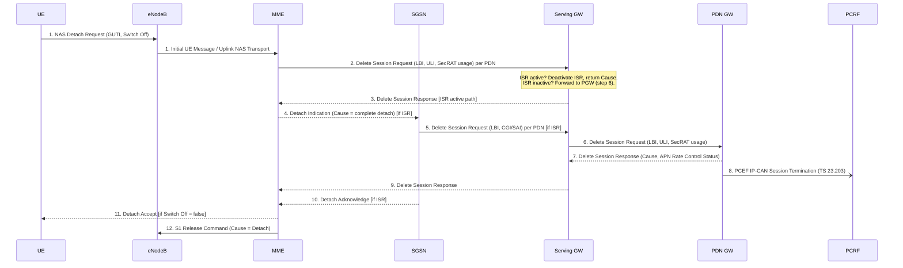
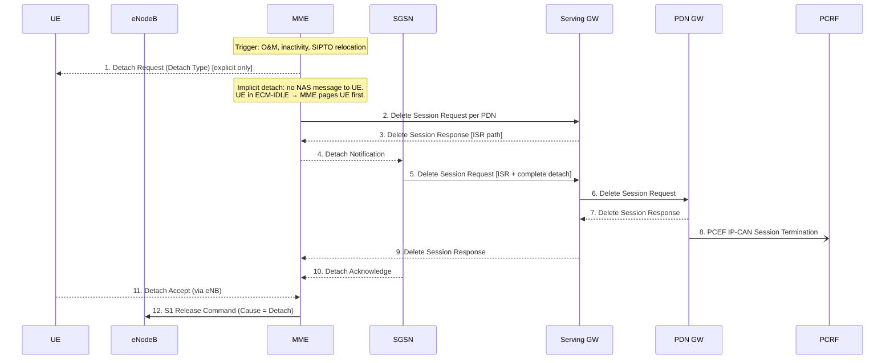
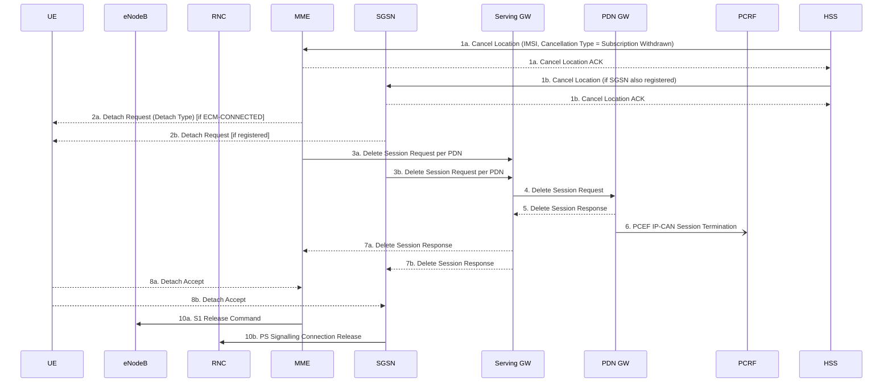

# EPS Detach Procedures

Detach removes a UE from EPS service: all EPS bearers are released, MM context deleted, and S1 signalling connection torn down. TS 23.401 §5.3.8 defines four initiator variants.

---

## Overview of Variants

| Clause | Initiator | Trigger |
|---|---|---|
| §5.3.8.2.1 | UE | UE powers off or explicitly detaches from E-UTRAN |
| §5.3.8.2.2 | UE (via SGSN) | UE detaches from GERAN/UTRAN with ISR active |
| §5.3.8.3 | MME | O&M, inactivity timeout, SIPTO GW relocation |
| §5.3.8.3A | SGSN | SGSN detach with ISR active |
| §5.3.8.4 | HSS | Subscription withdrawal, operator command |

---

## UE-Initiated Detach — E-UTRAN (§5.3.8.2.1)

### Step-by-step notes

| Step | Action | Key detail |
|---|---|---|
| 1 | UE→MME: NAS Detach Request | Switch Off = true → power-off (no step 11). If UE was ECM-IDLE, S1 connection is established to deliver the message |
| 2 | MME→SGW: Delete Session Request | One message per PDN connection. Carries LBI identifying the default bearer. UE Time Zone IE included if TZ changed. If ISR activated, MME waits to receive step 5 Delete Session Request before releasing CP-TEID |
| 3 | SGW ISR active path | S-GW deactivates ISR, releases EPS Bearer contexts, returns Delete Session Response with Cause. Does **not** forward to PGW yet |
| 4–5 | MME notifies SGSN | Detach Indication triggers SGSN to send Delete Session Request to SGW per PDN |
| 6 | SGW→PGW: Delete Session Request | Carries ULI, UE TZ, Secondary RAT usage (taking least-age data from MME and SGSN). Indicates all bearers of the PDN connection shall be released |
| 8 | PGW→PCRF: IP-CAN Session Termination | PCEF-initiated; not executed if no PCRF deployed |
| 11 | Detach Accept | Omitted when Switch Off = true (device is powering off) |
| 12 | S1 Release | Follows §5.3.5; Cause = Detach |

> **Note (PMIP S5/S8):** Steps 3, 4, 5 (GTP-based) are replaced by TS 23.402 procedures for PMIP-based S5/S8.

---

## MME-Initiated Detach (§5.3.8.3)

**Implicit vs explicit:**
- **Implicit**: MME removes the UE context locally (no Detach Request to UE). An SGSN registration is preserved.
- **Explicit**: MME sends Detach Request with optional `Detach Type = re-attach required` (SIPTO GW relocation). UE re-attaches after RRC release.

**SIPTO GW relocation**: MME sets Detach Type = "explicit detach with reattach required" when GW relocation is desirable for all SIPTO APNs. UE should re-establish those PDN connections immediately after reattach.

---

## HSS-Initiated Detach (§5.3.8.4)

**Triggers**: Operator command, subscription change (for subscription-change RAT restrictions use Insert Subscriber Data instead), subscription withdrawal.

**Emergency bearers**: MME/SGSN shall NOT initiate detach for emergency-attached UEs; only non-emergency PDN connections are deactivated.

---

## ISR Behaviour During Detach

| Scenario | SGW action |
|---|---|
| ISR active, receives **first** Delete Session Request (from MME or SGSN) | Deactivate ISR; release related EPS Bearer contexts; respond with Delete Session Response. Do **not** release CP-TEID until both nodes have sent their Delete Session Requests |
| ISR active, receives **second** Delete Session Request | Release remaining contexts; proceed with Delete Session Request to PGW |
| ISR **not** active | On receiving Delete Session Request, immediately send Delete Session Request to PGW |

---

## "Switch Off" Parameter

| Value | Meaning | Step 11 (Detach Accept) |
|---|---|---|
| true | UE is powering off | Omitted — UE cannot receive it |
| false | Explicit detach (e.g., airplane mode) | Sent to UE |

---

## Post-Detach State

- **MM context**: deleted from MME (may be retained briefly for optimisation)
- **EPS Bearer contexts**: all released in SGW and PGW
- **PDN address**: PGW may retain for implementation-defined period
- **PCRF**: IP-CAN session terminated via PCEF-initiated procedure (TS 23.203)
- **EMM state** → EMM-DEREGISTERED; **ECM state** → ECM-IDLE

---

## Related Pages

- [MME](../entities/MME.md) — initiates or processes all detach variants
- [SGW](../entities/SGW.md) — releases bearer contexts, ISR deactivation
- [PGW](../entities/PGW.md) — IP-CAN session termination with PCRF
- [EPS Attach](EPS-attach.md) — inverse procedure
- [Service Request](service-request.md) — ECM-IDLE paging used during MME-initiated explicit detach
- [EMM/ECM States](../concepts/EMM-ECM-states.md) — state transitions on detach
