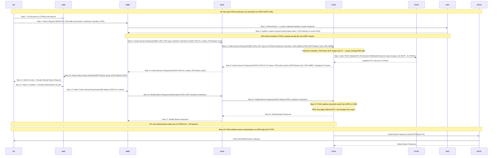
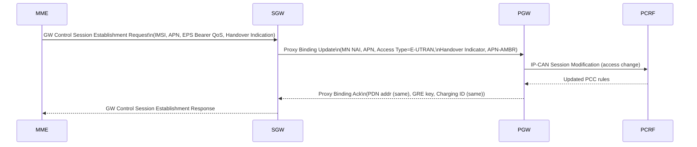
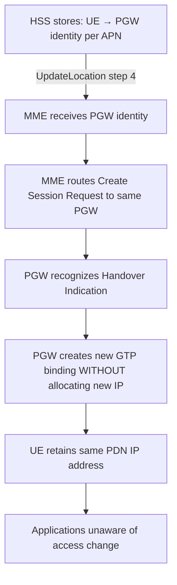

# Non-3GPP ↔ 3GPP Handover Without Optimization

**Spec reference:** 3GPP TS 23.402 §8 (v15.3.0)

Related pages: [ePDG](../entities/ePDG.md) · [PGW](../entities/PGW.md) · [SGW](../entities/SGW.md) ·
[MME](../entities/MME.md) · [HSS](../entities/HSS.md) ·
[Non-3GPP Access Architecture](../concepts/non-3GPP-access-architecture.md) ·
[S2b Attach/Detach](S2b-attach.md) · [EPS Attach](EPS-attach.md)

---

## Overview (§8.1)

"Handover without optimization" means the UE transfers from non-3GPP access (untrusted S2b or
trusted S2a via ePDG/TWAN) to 3GPP E-UTRAN (or UTRAN/GERAN) — or vice versa — without
using handover preparation signaling between the two access networks. The key goals are:

1. **IP address continuity** — UE retains same PDN IP address(es) by reusing the same PGW
2. **No simultaneous multi-access** — the UE transitions cleanly; both accesses are not active at
   the same time during the handover
3. **Charging continuity** — same Charging ID preserved across access change

### Multi-PDN Handover Rules

- A UE may have multiple PDN connections active over non-3GPP access
- When handing over to 3GPP E-UTRAN, **only one PDN connection per APN** can be handled by
  the Attach(Handover) procedure
- The UE must establish connectivity for remaining PDN connections after the Attach procedure
  using UE-requested PDN Connectivity (§5.10)
- For 3GPP → non-3GPP: the UE establishes non-3GPP connectivity per-PDN; HSS provides
  existing PGW identity to ensure the same PGW is reused

### Direction Asymmetry

| Direction | Mechanism |
|---|---|
| Non-3GPP → 3GPP E-UTRAN | Attach with "Handover" indication; MME coordinates PGW reuse via HSS |
| 3GPP → Non-3GPP | ePDG/TWAN establishes S2b/S2a bearing to existing PGW; HSS returns PGW identity |

---

## Non-3GPP → E-UTRAN Handover, GTP S5/S8 (§8.2.1.1)

### 18-Step Procedure

### Key Step Details

**Step 2 — Attach with Handover Indication:**
- UE indicates this is a handover (not fresh attach) via "active flag" and handover indication
- UE includes PDN address from current non-3GPP session (for verification)
- UE indicates the APN for which it wants to hand over

**Step 4 — HSS Returns Existing PGW Identity:**
- The HSS subscription context contains the PGW identity (FQDN or IP) of the PGW currently
  serving the UE via non-3GPP
- MME uses this to select the **same PGW** — the critical step for IP continuity
- If HSS has no PGW identity (e.g. UE had no non-3GPP session), normal attach proceeds

**Step 6 — Create Session Request with Handover Indication:**
- `Handover Indication` flag tells PGW: "do not allocate new IP address"
- PGW recognizes existing PDN context (same IMSI + APN) and creates a new GTP session reusing
  the existing PDN IP address and Charging ID
- `RAT Type = E-UTRAN` signals the access type change for charging/policy

**Step 7 — Optional PCEF-Initiated IP-CAN Session Modification:**
- PGW notifies PCRF of access type change (non-3GPP → E-UTRAN)
- PCRF may apply different QoS/PCC rules for LTE vs WLAN
- Any new PCC rules are "deferred" by PGW until step 15 (after tunnel switch)

**Step 15 — Tunnel Switch (Critical):**
- After receiving Modify Bearer Request with eNB address, PGW switches the **downlink data
  path** from ePDG tunnel (S2b) to SGW tunnel (S5)
- This is the moment the handover occurs — data starts flowing via 3GPP
- Deferred PCC rule changes (from step 7) are applied here

**Step 18 — Non-3GPP Resource Deactivation:**
- After tunnel switch, the ePDG-PGW S2b bearer is now redundant
- PGW initiates resource deactivation toward ePDG (§7.9, Delete Bearer or Binding Revocation)
- ePDG releases the IKEv2/IPsec tunnel with UE
- UE need not perform explicit ePDG detach — it is handled by PGW initiation

---

## PMIP S5/S8 Variant (§8.2.1.2)

When S5/S8 uses **PMIPv6** instead of GTP, steps 6–9 are replaced:

### Alternative A (Standard)

### Alternative B (Lower Jitter)

Alt B reorders steps to minimize the time between PBU and data switchover:
- SGW sends PBU immediately (before PCEF modification)
- PGW receives PBU → sends PBA (binding established, data can flow)
- PCEF IP-CAN Modification follows after the PBA

> **Why Alt B:** In high-speed mobility scenarios, the gap between PBU and PBA must be
> minimized. Alt B avoids waiting for PCRF round-trip before establishing the new binding,
> reducing packet loss during handover.

---

## UTRAN / GERAN Variant (§8.2.1.3)

When the 3GPP target is **UTRAN (3G)** or **GERAN (2G)** rather than E-UTRAN:

| E-UTRAN step | UTRAN/GERAN equivalent |
|---|---|
| MME | SGSN (3G/2G) |
| Attach Request (NAS) | Attach Request (GPRS) |
| Initial Context Setup (S1-AP) | Activate PDP Context (Iu/Gb) |
| S5 GTP session | Gn/S4 GTP session |

**Key difference:** PDP Context Activation replaces EPS Bearer setup. SGSN sends
`Create Session Request` (S4-SGSN) or `Create PDP Context Request` (Gn-SGSN) to SGW/PGW
with the same `Handover Indication` flag to trigger PGW reuse.

---

## Remaining PDN Connections After Handover

After the initial Attach(Handover) for one PDN connection, the UE must reconnect any
remaining PDN connections that were active on the non-3GPP side:

1. UE-requested PDN Connectivity (TS 23.401 §5.10) for each additional APN
2. Each PDN connectivity request also uses Handover Indication
3. MME/HSS coordinates to reuse the same PGW for each APN
4. PGW deactivates the corresponding non-3GPP (ePDG/S2b) session for each APN after the
   new 3GPP session is established

> **Constraint:** If UE had two PDN connections to the same APN (different PDN GWs), the
> 3GPP side can only accommodate one at a time. The second would require a fresh PDN
> connectivity without handover indication.

---

## IP Continuity Guarantee

The mechanism ensuring IP address continuity across non-3GPP → 3GPP handover:

The HSS is the authoritative record keeper of which PGW serves which APN for a given UE.
This record is written by the PGW (via AAA/HSS update) at initial attach and updated at
each handover, PDN connect/disconnect event.
