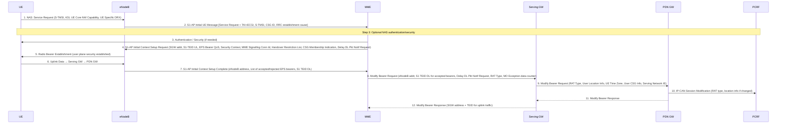
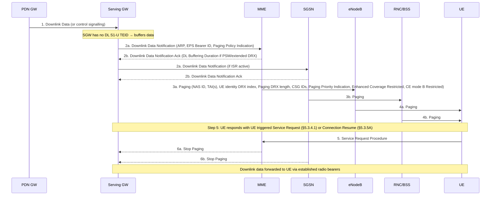
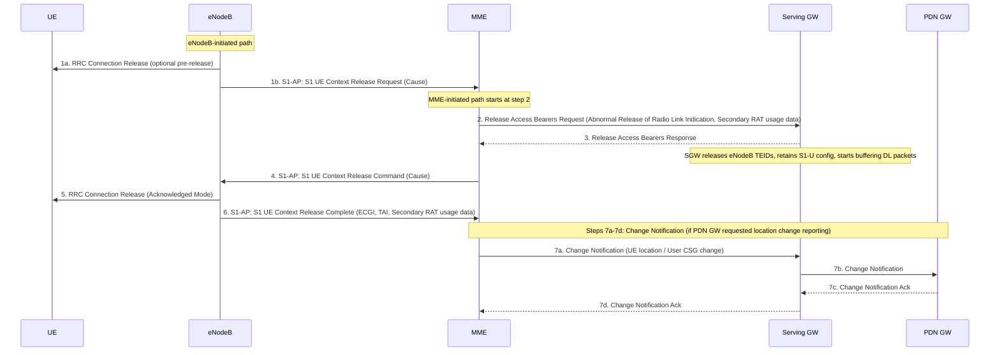

# Service Request and S1 Release Procedures

**Spec:** 3GPP TS 23.401 §5.3.4 (Service Request), §5.3.5 (S1 Release)  
**Purpose:**  
- **Service Request:** Re-establishes the ECM-CONNECTED state and user-plane radio bearers when a UE is in ECM-IDLE. Can be triggered by the UE (MO data/signalling) or by the network (MT data via paging).  
- **S1 Release:** Releases the S1-AP signalling connection and all S1-U radio bearers, returning the UE to ECM-IDLE. Bearers and GW context are preserved in the core network.

---

## UE Triggered Service Request (§5.3.4.1)

### Purpose
Triggered by a UE in ECM-IDLE to establish user-plane radio bearers for uplink data transmission. Also used when a UE in ECM-IDLE receives a paging indication and responds.

### Message Flow

### Step-by-Step Detail

**Step 1 — NAS Service Request**

UE sends **NAS Service Request** encapsulated in an RRC message to the eNodeB:
- S-TMSI (paging identity)
- KSI (key set identifier)
- UE Core Network Capability
- UE Specific DRX parameters

**Step 2 — eNodeB → MME**

eNodeB wraps the NAS message in an **S1-AP Initial UE Message** adding:
- TAI + ECGI of serving cell
- S-TMSI (from RRC parameters)
- CSG ID, CSG Access Mode (if CSG or hybrid cell)
- RRC Establishment Cause

**Step 3 — Authentication/Security**

Optional. NAS authentication/security may be performed per §5.3.10.

> If a Service Gap timer is running and MME is not waiting for a MT paging response, MME rejects the Service Request with appropriate cause and may provide a Mobility Management Back-off timer.

**Step 4 — S1-AP Initial Context Setup Request**

MME sends **S1-AP Initial Context Setup Request** to the eNodeB:

| Field | Notes |
|---|---|
| Serving GW address for user plane | S1-U uplink endpoint |
| S1-TEID(s) (UL) | Per accepted EPS bearer |
| EPS Bearer QoS | Per accepted bearer |
| Security Context (AS) | For RRC security |
| MME Signalling Connection Id | |
| Handover Restriction List | §4.3.5.7 |
| CSG Membership Indication | For hybrid cells |
| Delay Downlink Packet Notification Request | To suppress spurious DDN (see §5.3.4.2) |

> MME deletes S11-U related context (TEID DL for CP CIoT EPS Opt, ROHC context) before sending this message, but not the Header Compression Configuration.

**Step 5 — Radio Bearer Establishment**

eNodeB performs radio bearer establishment per TS 36.300. User plane security established. EPS bearer state synchronisation performed: UE locally removes any EPS bearer for which no radio bearer is set up; if radio bearer for a default EPS bearer is not established, UE locally deactivates all EPS bearers of that PDN connection.

**Step 6 — Uplink Data**

Uplink data from UE forwarded by eNodeB to Serving GW (using SGW address + S1-TEID UL from step 4) → PDN GW.

**Step 7 — Initial Context Setup Complete**

eNodeB → MME: **S1-AP Initial Context Setup Complete** (eNodeB address, list of accepted EPS bearers, list of rejected EPS bearers, S1 TEID(s) DL).

- If a default EPS bearer is rejected → all EPS bearers of that PDN connection treated as non-accepted; MME releases via bearer release procedure (§5.4.4.2).

**Steps 8–12 — Modify Bearer (Downlink Path Switch)**

MME sends **Modify Bearer Request** to Serving GW per PDN connection:
- eNodeB address + S1 TEID(s) DL for accepted bearers
- Delay Downlink Packet Notification Request (parameter D — see §5.3.4.2)
- RAT Type, MO Exception data counter (NB-IoT only)
- User Location Info, User CSG Info, UE Time Zone, Serving Network IE (if changed from last reported, ISR changes, or deferred via Change to Report flag)

If Serving GW supports **Modify Access Bearers Request** and no S5/S8 signalling to PGW is needed → MME may send Modify Access Bearers Request (per UE rather than per PDN connection) to optimise signalling.

SGW → PGW: **Modify Bearer Request** if RAT type, location, UE Time Zone, User CSG Info, or Serving Network changed.

If dynamic PCC deployed: PGW → PCRF: **IP-CAN Session Modification** (box A) for RAT type change.

SGW → MME: **Modify Bearer Response** (SGW address + TEID for uplink traffic). SGW is now able to transmit downlink data to the UE.

The MME and SGW clear the **DL Data Buffer Expiration Time** from their UE contexts (avoids unnecessary user plane setup in conjunction with a later TAU).

---

## Handling of Abnormal Conditions — "Delay DDN" Mechanism (§5.3.4.2)

**Problem:** When UE sends uplink data (step 6) and the response arrives at PDN GW before the Modify Bearer Request (step 8), the SGW cannot forward this downlink data yet → triggers a spurious Downlink Data Notification (DDN) to the MME.

**Solution:** MME includes **Delay Downlink Packet Notification Request** (parameter D) in step 4 or step 8:
- SGW buffers DL data for up to D milliseconds (integer multiple of 50 ms, or zero).
- If eNodeB TEID + address received before timer expires → timer cancelled; no DDN sent.
- Otherwise → DDN sent when timer expires.

MME adaptively controls D based on the rate of unnecessary DDN messages it observes.

---

## Network Triggered Service Request (§5.3.4.3)

### Purpose
Triggered by the network (SGW) when downlink data or control signalling arrives for a UE in ECM-IDLE.

### Message Flow

### DDN and Extended Buffering

**Downlink Data Notification (DDN):** Sent by SGW when it receives a DL data packet/control signalling for a UE with no established downlink S1-U TEID. Contains:
- ARP, EPS Bearer ID (always set)
- Paging Policy Indication (if APN/operator policy requires differentiated paging priority)

**Extended Buffering** (Power Saving Mode / extended idle DRX):

If UE is in PSM or extended DRX and cannot be paged immediately:
1. MME/SGSN derives expected time before radio bearers can be established.
2. MME/SGSN sends DDN Ack with **DL Buffering Requested + DL Buffering Duration** to SGW.
3. SGW stores new DL Data Buffer Expiration Time; does not send additional DDNs until expiry.
4. MME stores new DL Data Buffer Expiration Time in MM context ("Buffered DL data waiting" flag at TAU).

> Extended buffering not invoked if "Availability after DDN Failure" or "UE Reachability" monitoring events are configured.

**Paging strategies** (operator-configurable):
- Sub-area based paging (first page last known ECGI/TA, then broadcast to all registered TAs)
- Paging retransmission scheme (frequency, interval)
- High-load paging suppression
- Paging Priority per ARP level → MPS services get priority in congestion

**Paging failure:** If no UE response after repetition limit → MME sends **Downlink Data Notification Reject** to SGW:
- SGW deletes buffered packet(s).
- SGW may invoke PDN GW Pause of Charging (§5.3.6A) if UE in ECM-IDLE and PDN GW has charging pause feature enabled.

---

## S1 Release Procedure (§5.3.5)

### Purpose
Releases the logical S1-AP signalling connection (S1-MME) and all S1-U bearers for a UE. Transitions UE and MME from ECM-CONNECTED to ECM-IDLE. Radio context in eNodeB is deleted; GW user-plane context is preserved.

### Initiators

| Initiator | Example Causes |
|---|---|
| eNodeB | O&M intervention, unspecified failure, user inactivity, repeated RRC signalling integrity failure, release due to UE-generated signalling connection release, CS Fallback triggered, Inter-RAT Redirection |
| MME | Authentication failure, detach, not-allowed CSG cell (CSG ID expired/removed from subscription) |

### Message Flow

### Step-by-Step Detail

**Step 1a (eNodeB-initiated):** eNodeB may pre-release the RRC connection before or in parallel with requesting S1 context release (e.g. for CS Fallback by redirection).

**Step 1b (eNodeB-initiated):** eNodeB → MME: **S1 UE Context Release Request (Cause)** indicating the reason. Includes Secondary RAT usage data if configured and available.

**Step 2 (MME action):** MME → SGW: **Release Access Bearers Request**:
- Abnormal Release of Radio Link Indication (if S1 release is due to abnormal radio link loss)
- Secondary RAT usage data (if received at step 1b)
- In CP CIoT EPS Optimisation with buffering in MME: steps 2 and 3 are skipped.

**Step 3 (SGW action):** SGW releases all eNodeB-related information (address + downlink TEIDs) for the UE. Other elements of the UE's Serving GW context are NOT affected. SGW retains the S1-U configuration (allocated for the UE's bearers). SGW returns **Release Access Bearers Response** and **immediately begins buffering** any downlink packets for the UE and initiating the Network Triggered Service Request procedure (§5.3.4.3) if downlink packets arrive.

**Step 4:** MME → eNodeB: **S1 UE Context Release Command (Cause)**.

**Step 5:** eNodeB sends **RRC Connection Release** to UE in Acknowledged Mode. Once acknowledged by UE, eNodeB deletes the UE's context.

**Step 6:** eNodeB → MME: **S1 UE Context Release Complete** (ECGI, TAI, Secondary RAT usage data).

MME deletes eNodeB-related context ("eNodeB Address in Use for S1-MME", "MME UE S1 AP ID", "eNB UE S1AP ID") but retains the rest of the UE MM context including the S-GW's S1-U configuration (address + TEIDs).

**Steps 7a–7d (optional):** If PDN GW requested location and/or User CSG information change reporting (MS Info Change Reporting Action = Start), MME → SGW → PDN GW: **Change Notification**.

### Bearer Preservation Rules After S1 Release

| Cause | Non-GBR bearers | GBR bearers |
|---|---|---|
| User Inactivity | Preserved in MME + SGW | Preserved |
| Inter-RAT Redirection | Preserved | Preserved |
| Radio Connection Lost / eNodeB failure | Preserved | Deactivated by MME Initiated Dedicated Bearer Deactivation (after S1 release completes) |
| CS Fallback triggered | Preserved | See TS 23.272 |

> EPS does not support GPRS preservation feature (setting MBR to zero).  
> MME may defer GBR deactivation briefly (order of seconds) after receiving S1-AP UE Context Release Request due to radio reasons, to allow UE to re-establish radio and S1-U bearers.

### Service Gap Control
If Service Gap Control applies (§4.3.17.9) and Service Gap timer is not already running, the timer is started in both MME and UE upon entering ECM-IDLE, **unless**:
- Connection was initiated after a paging of a MT event, OR
- After a TAU without active flag or signalling active flag.

---

## Relationship Between These Procedures

```mermaid
stateDiagram-v2
    [*] --> ECM_IDLE : After Attach / S1 Release
    ECM_IDLE --> ECM_CONNECTED : Service Request (UE triggered or Network triggered)
    ECM_CONNECTED --> ECM_IDLE : S1 Release Procedure (§5.3.5)
    ECM_IDLE --> ECM_IDLE : TAU (no active flag; S1 release follows TAU Accept)
    ECM_CONNECTED --> ECM_CONNECTED : TAU (active flag set; user plane stays up)
```

---

## Cross-References

- [MME](../entities/MME.md) — controls Service Request; sends S1-AP Initial Context Setup Request; initiates S1 Release
- [SGW](../entities/SGW.md) — buffers DL packets in ECM-IDLE; triggers DDN on downlink arrival; releases eNodeB TEIDs on S1 Release while preserving GW context
- [PGW](../entities/PGW.md) — may trigger IP-CAN Session Modification for RAT type change (step 9)
- [PCRF](../entities/PCRF.md) — IP-CAN Session Modification in response to RAT type change (box A)
- [EMM/ECM states](../concepts/EMM-ECM-states.md) — ECM-IDLE ↔ ECM-CONNECTED transition is the core function of these procedures
- [EPS bearer model](../concepts/EPS-bearer.md) — bearer preservation rules after S1 Release
- [TAU procedure](TAU.md) — TAU may trigger or follow Service Request (active flag)
- [EPS Attach procedure](EPS-attach.md) — creates the bearers that Service Request re-establishes
