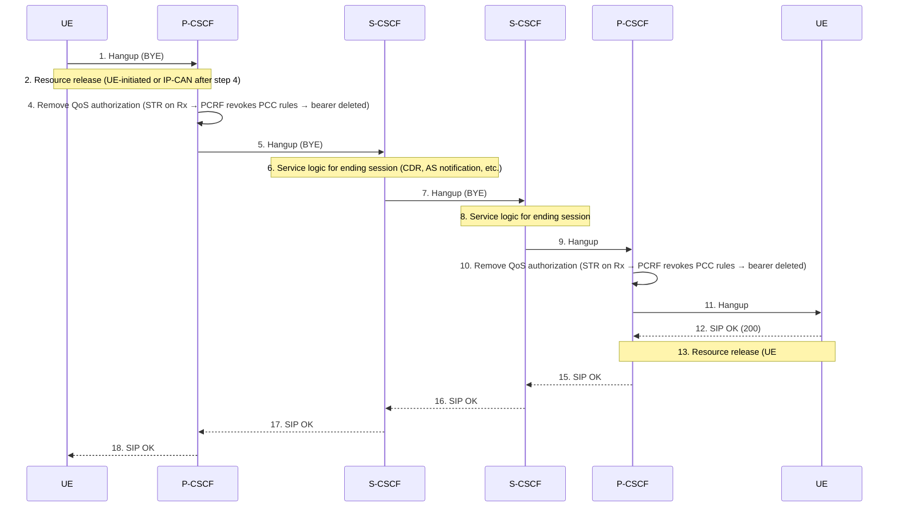
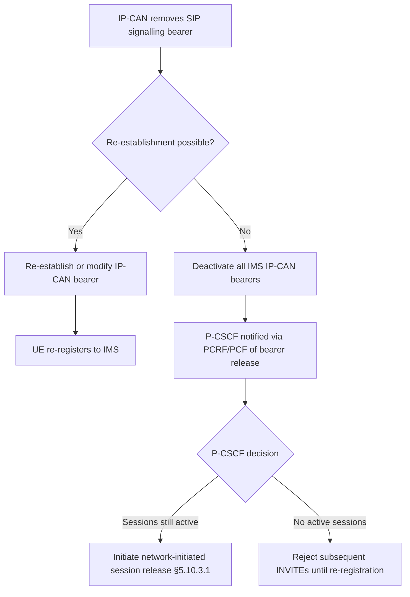
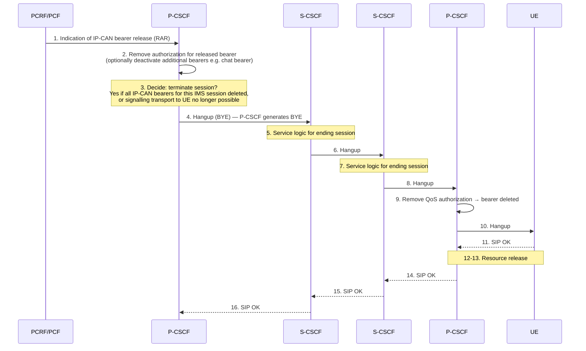

# IMS Session Release

Covers TS 23.228 §5.10–5.11: all session release variants (terminal-initiated, PSTN-initiated,
network-initiated P-CSCF and S-CSCF) and Session Hold/Resume procedures.

Related pages: [P-CSCF](../entities/P-CSCF.md) · [S-CSCF](../entities/S-CSCF.md) ·
[PCRF](../entities/PCRF.md) · [IMS QoS/Bearer](IMS-QoS-bearer.md) ·
[VoLTE MT Call](VoLTE-MT-call.md) · [VoLTE MO Call](VoLTE-MO-call.md)

---

## 1. Session Release General Rules (§5.10.0)

Session release procedures have two goals:

1. **Billing integrity:** SIP session control signalling and bearer deletion must be
   coordinated so that one cannot exist without the other (prevents theft-of-service).

2. **Commonality:** All four trigger scenarios share the same basic BYE flow to
   minimize implementation complexity.

### Four Release Scenarios

| Scenario | Trigger | Initiator |
|---|---|---|
| **§5.10.1** Terminal-initiated | End user hangs up | UE |
| **§5.10.2** PSTN-initiated | PSTN party hangs up | MGCF (from ISUP REL) |
| **§5.10.3.1** Network-initiated P-CSCF | IP-CAN bearer removed (PCRF notification) | P-CSCF |
| **§5.10.3.2** Network-initiated S-CSCF | Administrative / service expiry | S-CSCF |

---

## 2. Terminal Initiated Session Release (§5.10.1)

Both parties in visited networks; PCC in use. The BYE propagates outward from the
releasing UE through both S-CSCFs to the other party simultaneously.



### Key properties

- Steps 2 and 4 are separate: step 2 is UE-initiated bearer release (if that mode is
  selected); step 4 is the P-CSCF removing the Rx authorization regardless (instructs
  PCRF to delete the PCC rules and confirm bearer deletion to IP-CAN)
- Steps 6 and 8: S-CSCFs invoke **terminating/originating service logic** — ASes may be
  notified of session end, voicemail may be triggered, CDRs are generated
- Bearer deletion and SIP signalling proceed in parallel where possible

---

## 3. PSTN Initiated Session Release (§5.10.2)

The PSTN party hangs up, generating an ISUP REL message to the MGCF.

```mermaid
sequenceDiagram
    participant PSTN
    participant MGCF
    participant MGW
    participant S as S-CSCF
    participant P as P-CSCF/PCRF
    participant UE

    PSTN->>MGCF: 1. REL (ISUP Release)
    MGCF->>S: 2. Hangup (BYE — notifies IMS that far end disconnected)
    Note over MGCF,PSTN: 3. RLC (Release Complete) — parallel or after step 14<br/>depends on GSTN network type
    MGCF->>MGW: 4. H.248 — release vocoder + ISUP trunk;<br/>disconnect H.248 context; release IP resources
    MGW-->>MGCF: 5. H.248 acknowledgement
    Note over S: 6. S-CSCF service logic for ending session
    S->>P: 7. Hangup
    P->>P: 8. Remove QoS authorization → bearer deleted
    P->>UE: 9. Hangup
    UE-->>P: 10. SIP OK (200)
    Note over UE,P: 11-12. Resource release (UE-initiated or IP-CAN after step 10)
    P-->>S: 13. SIP OK
    S-->>MGCF: 14. SIP OK
```

### Key properties

- MGCF generates the BYE (step 2) — it acts as S-CSCF equivalent for the PSTN party
- RLC timing (step 3) depends on PSTN network type: some require RLC before step 14,
  others allow it in parallel with step 2
- H.248 tear-down (step 4) releases the MGW vocoder and ISUP trunk simultaneously with
  the SIP signalling, ensuring bearer/session coordination

---

## 4. Network Initiated Session Release (§5.10.3)

### §5.10.3.0: Signalling Bearer Loss

If the IP-CAN bearer carrying **IMS SIP signalling** is removed (e.g. radio overload):



**P-CSCF rules:**
- **SHALL NOT** assume SIP transport is lost unless notified by PCRF/PCF
- **SHALL NOT** reject subsequent INVITEs based on media bearer loss alone
- **SHALL** reject incoming INVITEs for this UE after signalling loss notification,
  until either: (a) registration timer expires, or (b) new REGISTER received

### §5.10.3.1: P-CSCF Initiated (Figure 5.26)

Triggered when PCRF/PCF notifies P-CSCF of IP-CAN bearer release.



**Decision logic at step 3:**
- If all IP-CAN bearers for this IMS session are deleted: terminate
- If signalling transport to UE is lost: terminate any ongoing session for that UE
- If only one bearer (e.g. media) is deleted but chat bearer still exists: optional,
  may keep session with reduced media

### §5.10.3.2: S-CSCF Initiated (Figure 5.27)

S-CSCF decides to terminate the session for administrative reasons or service expiry.
S-CSCF generates BYE toward **both parties simultaneously**:

```mermaid
sequenceDiagram
    participant UE1 as UE#1
    participant P1 as P-CSCF#1/PCRF
    participant S1 as S-CSCF#1
    participant S2 as S-CSCF#2
    participant P2 as P-CSCF#2/PCRF
    participant UE2 as UE#2

    Note over S1: 1. Service control decision: terminate session<br/>(administrative / service expiry / prepaid balance)
    S1->>P1: 2. Hangup (BYE → UE#1)
    P1->>P1: 3. Remove QoS authorization → bearer deleted
    P1->>UE1: 4. Hangup
    UE1->>UE1: 5. Stop media; release resources
    UE1-->>P1: 6. SIP OK
    P1-->>S1: 7. SIP OK

    S1->>S2: 8. Hangup (parallel with step 2)
    Note over S2: 9. Service logic for ending session
    S2->>P2: 10. Hangup
    P2->>P2: 11. Remove QoS authorization → bearer deleted
    P2->>UE2: 12. Hangup
    UE2->>UE2: 13. Stop media; release resources
    UE2-->>P2: 14. SIP OK
    P2-->>S2: 15. SIP OK
    S2-->>S1: 16. SIP OK
```

Key property: Steps 2 and 8 are parallel — S-CSCF#1 sends BYE to both P-CSCF#1 and
S-CSCF#2 simultaneously, minimizing post-termination media leakage.

---

## 5. Session Hold and Resume (§5.11.1)

### General Rules (§5.11.1.0)

- Hold: one party pauses media flow; **resources remain reserved** (bearer not deleted)
- Resume: same party that placed the hold unilaterally resumes (re-INVITE with `sendrecv`)
- Rule: **only the holding endpoint can initiate resume**
- Partial hold: a subset of media streams can be held while others continue
- I-CSCFs, if present at session setup, remain in path for subsequent flows

### Mobile-to-Mobile Hold and Resume (§5.11.1.1, Figure 5.28)

```mermaid
sequenceDiagram
    participant UE1 as UE#1
    participant P1 as P-CSCF#1
    participant S1 as S-CSCF#1
    participant S2 as S-CSCF#2
    participant P2 as P-CSCF#2
    participant UE2 as UE#2

    Note over UE1,UE2: ── HOLD PHASE ──
    UE1->>UE1: 1. User places hold; UE stops media flow; KEEPS bearer reserved
    UE1->>P1: 2. Hold (re-INVITE: a=inactive or a=sendonly)
    P1->>S1: 3. Hold
    S1->>S2: 4. Hold
    S2->>P2: 5. Hold
    P2->>UE2: 6. Hold
    UE2->>UE2: 7. Stop media flow; keep bearer reserved
    UE2-->>P2: 8. 200 OK (Hold confirmed)
    P2-->>S2: 9. 200 OK
    S2-->>S1: 10. 200 OK
    S1-->>P1: 11. 200 OK
    P1-->>UE1: 12. 200 OK

    Note over UE1,UE2: ── RESUME PHASE ──
    UE1->>P1: 13. Resume (re-INVITE: a=sendrecv)
    P1->>S1: 14. Resume
    S1->>S2: 15. Resume
    S2->>P2: 16. Resume
    P2->>UE2: 17. Resume
    UE2->>UE2: 18. Resume media flow
    UE2-->>P2: 19. 200 OK (Resume confirmed)
    P2-->>S2: 20. 200 OK
    S2-->>S1: 21. 200 OK
    S1-->>P1: 22. 200 OK
    P1-->>UE1: 23. 200 OK
    UE1->>UE1: 24. Resume media flow
```

### Hold vs Release: Resource Handling

| Action | SIP | Bearer | Gate |
|---|---|---|---|
| Hold | re-INVITE (`a=inactive`) | **Kept** (not deleted) | Closed by PCRF |
| Release | BYE | **Deleted** (PCRF/PCF removes auth) | N/A |
| Resume | re-INVITE (`a=sendrecv`) | Already exists | Re-opened by PCRF |

This is the resource-sharing mechanism described in §5.4.7.8: while a session is on hold,
the gate is closed (no media flows) but the bearer remains allocated.

---

## 6. Release Procedure Comparison

| Trigger | Who sends BYE | Bearer deletion timing | PCRF notification |
|---|---|---|---|
| UE hangs up | UE → P-CSCF → S-CSCF | P-CSCF removes auth (step 4) before BYE reaches other party | P-CSCF sends STR (Rx) |
| PSTN hangs up | MGCF sends BYE | H.248 tear-down (step 4) parallel with BYE | P-CSCF sends STR on receiving BYE |
| P-CSCF (bearer loss) | P-CSCF generates BYE | Bearer already deleted (was the trigger) | P-CSCF was notified by PCRF via RAR |
| S-CSCF (admin) | S-CSCF generates BYE to both parties | P-CSCF removes auth on receiving BYE | P-CSCF sends STR after receiving BYE |

---

## Cross-References

| Topic | Page |
|---|---|
| IP-CAN bearer release indication → P-CSCF | [IMS QoS/Bearer §8](IMS-QoS-bearer.md) |
| VoLTE MO call setup | [VoLTE MO Call](VoLTE-MO-call.md) |
| VoLTE MT call setup | [VoLTE MT Call](VoLTE-MT-call.md) |
| PCRF: gate control, Rx STR, CCR | [PCRF](../entities/PCRF.md) |
| EPS dedicated bearer deactivation | [Dedicated Bearer](dedicated-bearer.md) |
