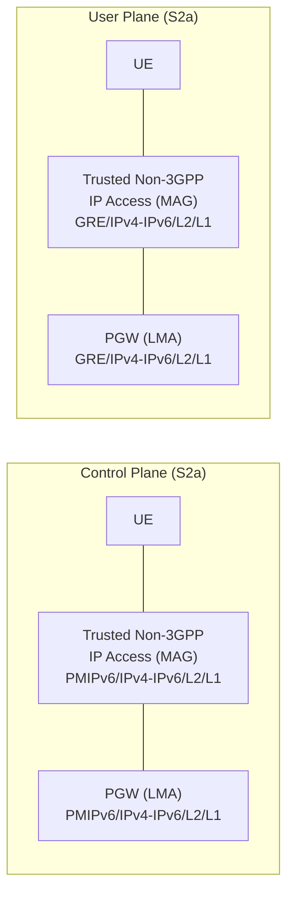
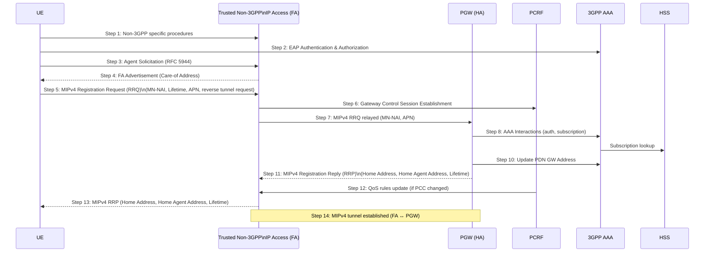
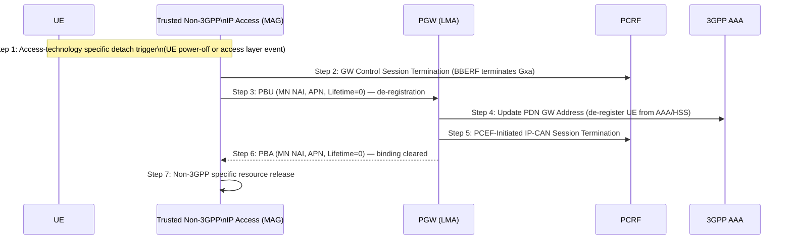
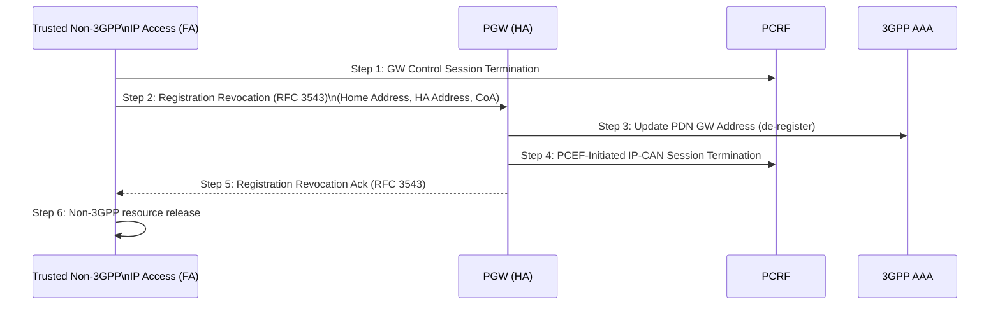
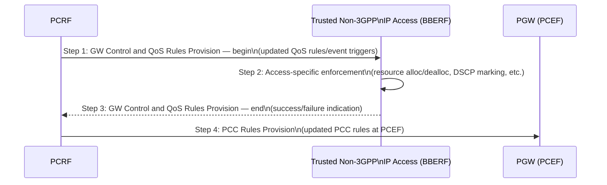

# Trusted Non-3GPP IP Access — Attach, Detach, and Bearer Procedures (S2a / S2c)

**Spec reference:** 3GPP TS 23.402 §6 (v15.3.0)

Related pages: [PGW](../entities/PGW.md) · [SGW](../entities/SGW.md) · [HSS](../entities/HSS.md) ·
[PCRF](../entities/PCRF.md) · [Non-3GPP Access Architecture](../concepts/non-3GPP-access-architecture.md) ·
[S2b Attach/Detach](S2b-attach.md) · [Non-3GPP Handover](non3GPP-handover.md)

---

## Overview

When a UE accesses EPC via a **trusted non-3GPP IP access** (e.g. a carrier-owned WLAN or a WiFi
hotspot classified as trusted by the HPLMN), it connects **directly to the PGW via S2a** — no
ePDG is involved. The trusted access network itself acts as the **MAG (Mobile Access Gateway)**
for PMIPv6 or as the **FA (Foreign Agent)** for MIPv4.

Three mobility protocol options exist on S2a:

| Protocol | Standard | Role | When used |
|---|---|---|---|
| **PMIPv6** | RFC 5213 | Trusted Non-3GPP IP Access = MAG; PGW = LMA | Default; most common |
| **MIPv4 FACoA** | RFC 5944 | Trusted Non-3GPP IP Access = FA; PGW = HA | Legacy IPv4-only deployments |
| **DSMIPv6 (S2c)** | RFC 5555 | UE = MN; PGW = HA; IPsec SA required | Host-based mobility; UE drives binding |

The S2a interface carries PMIPv6 or MIPv4 tunnels (no IKEv2/IPsec required unlike untrusted S2b).

---

## Protocol Stacks (§6.1)

### S2a — PMIPv6 Option (§6.1.1)



- Control plane: PMIPv6 (RFC 5213) over IPv4/IPv6
- User plane: GRE encapsulation on S2a (equivalent to S2b GRE)
- MAG collocated with the Trusted Non-3GPP IP Access gateway

### S2a — MIPv4 FACoA Option (§6.1.1)

- Control plane: MIPv4 (RFC 5944) over IPv4 via UDP
- User plane: MIPv4 tunnelling between FA and HA (PGW)
- FA collocated with Trusted Non-3GPP IP Access
- UE sends MIPv4 Registration Request (RRQ) to FA; FA forwards to PGW (HA)

### S2c — DSMIPv6 over Trusted Non-3GPP IP Access (§6.1.2)

- Control plane: DSMIPv6 (RFC 5555) over IPv4/IPv6; IKEv2 secures DSMIPv6 signaling
- User plane: IP tunnelling between UE and PGW (HA)
- UE manages mobility binding directly with PGW — the trusted access router merely forwards
- Trusted access provides UE with local IP (CoA) for use in Binding Update

---

## Initial Attach on S2a — PMIPv6 (§6.2.1)

### 11-Step Flow

```mermaid
sequenceDiagram
    participant UE
    participant TNAN as Trusted Non-3GPP\nIP Access (MAG)
    participant PGW as PGW (LMA)
    participant PCRF
    participant AAA as 3GPP AAA\nServer/Proxy
    participant HSS

    UE->>TNAN: Step 1: Non-3GPP specific L2 procedures\n(access-technology dependent)
    UE->>AAA: Step 2: EAP Authentication & Authorization\n(via Trusted Non-3GPP IP Access)
    AAA->>HSS: SWx: fetch auth vectors + subscription
    HSS-->>AAA: Auth vectors, PGW selection info, IPMS
    AAA-->>UE: Auth success + subscription data returned to TNAN
    Note over AAA,TNAN: 3GPP AAA also returns PGW FQDN/IP + APN + GW Control Session info

    UE->>TNAN: Step 3: L3 Attach Trigger\n(non-3GPP access specific)

    TNAN->>PCRF: Step 4: Gateway Control Session Establishment\n(UE ID, APN, APN-AMBR, Default Bearer QoS)
    Note over TNAN,PCRF: TNAN = BBERF; Gxa interface

    TNAN->>PGW: Step 5: Proxy Binding Update\n(MN-NAI, Lifetime, Access Technology Type,\nHandover Indicator, APN, GRE key (downlink),\nPDN GW address, Charging Characteristics,\nAdditional Parameters)
    PGW->>PCRF: Step 6: IP-CAN Session Establishment\n(UE identity, APN, APN-AMBR, Bearer QoS)
    PCRF-->>PGW: PCC rules + event triggers
    PGW->>AAA: Step 7: Update PDN GW Address\n(PGW identity + APN, for HSS registration)
    AAA->>HSS: Store PGW identity for UE + APN
    PGW-->>TNAN: Step 8: Proxy Binding Ack\n(MN NAI, Lifetime, UE Address Info (IPv4/v6),\nGRE key uplink, Charging ID, Additional Params)

    Note over TNAN,PGW: Step 9: PMIP Tunnel established (S2a)

    PCRF->>TNAN: Step 10: Gateway Control and QoS Rules Provision\n(updated QoS rules for non-3GPP access enforcement)
    TNAN-->>UE: Step 11: L3 Attach Completion\n(IP address delivered to UE via access-specific mechanism)
```

### Key Step Details

**Step 2 — EAP Authentication:**
- EAP-AKA/AKA' between UE and 3GPP AAA Server via Trusted Non-3GPP IP Access (STa interface)
- HSS provides subscription data including IPMS policy and authorized APNs
- If Attach Type indicates "Handover", TNAN notifies via Handover Indicator in PBU (step 5)

**Step 5 — Proxy Binding Update:**
- TNAN (as MAG) sends PBU to PGW (as LMA) on S2a
- Access Technology Type identifies the non-3GPP access type (WLAN, WiMAX, etc.)
- If multiple PDN connections to same APN supported: PDN Connection Identity included

**Step 7 — Update PDN GW Address:**
- PGW registers its identity with HSS (via 3GPP AAA) per-APN
- This is the record used by MME during non-3GPP → E-UTRAN handover to reuse same PGW

**Step 10 — GW Control and QoS Rules Provision:**
- After PGW IP-CAN session establishment, PCRF sends updated QoS rules to TNAN (BBERF)
- TNAN enforces these rules on the access (e.g. DSCP marking, traffic shaping)

### Roaming and Chained PMIP S8-S2a (§6.2.4)

For roaming scenarios where VPLMN SGW acts as non-3GPP anchor (PMIP S8-S2a chaining):

```mermaid
sequenceDiagram
    participant UE
    participant TNAN as Trusted Non-3GPP\nAccess/ePDG (MAG)
    participant SGW as S-GW (VPLMN)
    participant PGW as PGW (HPLMN)
    participant AAA as 3GPP AAA Proxy
    participant HSS

    Note over UE,HSS: Step 1: Attach Initiation (EAP auth via STa; 3GPP AAA provides SGW+PGW selection)
    TNAN->>SGW: Step 2: PBU (MN-NAI, Lifetime, AT-Type, HO-Indicator, APN, GRE key)
    SGW->>PGW: Step 3: PBU (forwarded from SGW to PGW)
    PGW->>PGW: Step 4: PCEF-Initiated IP-CAN Session Establishment
    PGW->>AAA: Step 5: Update PDN GW Address
    PGW-->>SGW: Step 6: PBA (UE Address Info, GRE key uplink, Charging ID)
    Note over SGW: SGW creates internal forwarding state for two chained PMIP tunnels
    SGW-->>TNAN: Step 7: PBA (UE Address Info, GRE key uplink, Charging ID)
    Note over TNAN,PGW: Step 8: Complete Attach — two PMIP tunnels: TNAN→SGW and SGW→PGW
```

**Two chained tunnels:** TNAN–SGW (S2a) and SGW–PGW (PMIP-S8). SGW acts as intermediate
anchor, concatenating both tunnels for user plane forwarding.

---

## Initial Attach on S2a — MIPv4 FACoA (§6.2.3)

For trusted non-3GPP access using **MIPv4 with Foreign Agent Care-of Address**:



- UE receives a CoA from the FA (step 4) — this is the FA's address
- Reverse tunnelling requested (step 5) — UE's traffic goes through FA to PGW (HA)
- Home Address allocated by PGW (step 11) and delivered to UE (step 13)
- MIPv4 registration uses same PCRF anchor pattern as PMIPv6 (GW Control Session on Gxa)

---

## Initial Attach on S2c via Trusted Non-3GPP (§6.3)

For **host-based mobility** (DSMIPv6) from a trusted access network:

```mermaid
sequenceDiagram
    participant UE
    participant TNAN as Trusted Non-3GPP\nIP Access
    participant PGW as PGW (HA)
    participant PCRF
    participant AAA as 3GPP AAA

    Note over UE,TNAN: Module A: Local IP Connectivity Setup
    UE->>AAA: Step 1: Access Authentication & Authorization (EAP via STa)
    UE->>TNAN: Step 2: L3 Attach (local IP address assigned to UE = CoA)
    TNAN->>PCRF: Step 3: Gateway Control Session Establishment\n(UE local IP, IP-CAN type)

    Note over UE,PGW: Module B: PDN GW/HA Discovery + Security Association
    UE->>PGW: Step 4: MIPv6 SA Setup via IKEv2\n(EAP auth with 3GPP AAA; APN in IDr; APN-AMBR returned)
    Note over PGW: PGW allocates IPv6 HNP; UE autoconfigures HoA from HNP

    Note over UE,PGW: Module C: Binding Update
    UE->>PGW: Step 5: DSMIPv6 Binding Update (HoA, CoA, Lifetime)
    PGW->>PCRF: Step 6: IP-CAN Session Establishment (HoA, CoA, APN)
    PCRF-->>PGW: PCC rules + event triggers
    PGW-->>UE: Step 7: DSMIPv6 Binding Acknowledgement\n(Lifetime, HoA, optional IPv4 HoA)
    PCRF->>TNAN: Step 8: GW Control and QoS Rules Provision\n(updated rules including tunnelling header info)
```

**Module A:** UE obtains local IP from trusted access (this becomes the CoA)
**Module B:** PGW selected as HA; IKEv2 + EAP establishes security association; IPv6 HNP assigned
**Module C:** UE sends Binding Update with HoA (autoconfigured from HNP) and CoA (from access)

---

## Detach and PDN Disconnection for S2a (§6.4)

### UE/Trusted Access-Initiated — PMIPv6 (§6.4.1.1)



> For multiple PDN connections: steps 2–6 repeat per PDN.

### Chained PMIP S8-S2a Detach (§6.4.1.2)

Two PBUs (TNAN→SGW, SGW→PGW) and two PBAs in reverse. Steps 2–7 of §6.4.1.1 plus
SGW intermediate steps. SGW releases GRE tunnel (S2a side) and PMIP-S8 tunnel simultaneously.

### HSS/AAA-Initiated Detach — PMIPv6 (§6.4.2.1)

1. HSS/AAA → TNAN (MAG): UE De-registration Request
2. TNAN follows §6.4.1.1 from step 2 onward
3. TNAN → HSS/AAA: UE De-registration Ack

> PDN GW receives a detach indication from HSS/AAA but does **not** remove PMIP tunnels
> itself — the MAG (TNAN) is responsible for tunnel teardown.

### UE-Initiated Detach — MIPv4 FACoA (§6.4.3)

1. UE → FA: MIPv4 Registration Request (RRQ) with Lifetime=0 — de-registration
2. FA → PCRF: GW Control Session Termination
3. FA → PGW: MIPv4 RRQ relayed (Lifetime=0)
4. PGW ↔ AAA: AAA Interactions + Update PDN GW Address
5. PGW → PCRF: PCEF-Initiated IP-CAN Session Termination
6. PGW → FA: MIPv4 Registration Reply (RRP), Lifetime=0
7. FA → UE: MIPv4 RRP (Lifetime=0)
8. Non-3GPP specific resource release

### Network-Initiated Detach — MIPv4 FACoA (§6.4.4)



---

## Detach and PDN Disconnection for S2c — Trusted Non-3GPP (§6.5)

### UE-Initiated (§6.5.2)

1. UE → PGW: DSMIPv6 Binding Update (HoA, CoA, Lifetime=0) — de-registers home address
2. PGW → 3GPP AAA: Update PDN GW Address (notify HSS if last context)
3. PGW → PCRF: PCEF-Initiated IP-CAN Session Termination
4. PGW → UE: DSMIPv6 Binding Acknowledgement
5. PCRF → TNAN: PCRF-Initiated GW Control Session Termination (remove QoS rules)
6. UE terminates IKEv2 SA for this PDN (RFC 5996)
7. Non-3GPP specific resource release

### HSS/AAA-Initiated (§6.5.3)

1. HSS/AAA → PGW: Session Termination
2. PGW → UE: Detach Request
3. UE → PGW: Detach Ack (explicit) — or omitted in implicit disconnect
4. PGW → PCRF: PCEF-Initiated IP-CAN Session Termination
5. PGW → AAA: Session Termination Ack
6. PCRF → TNAN: PCRF-Initiated GW Control Session Termination
7. PGW or UE terminates IKEv2 SA (RFC 5996)
8. Non-3GPP resource release

### PDN GW-Initiated (§6.5.4)

Same as §6.5.3 but triggered by PGW (e.g. APN congestion, PCC rule removal). If implicit
disconnect (binding lifetime expiry), steps 1–2 omitted — PGW cleans up silently.

---

## Network-Initiated Dynamic PCC (§6.6)

The PCRF can provision or modify QoS/PCC rules in trusted non-3GPP access via the Gxa interface:



- Applies to both PMIPv6 S2a (§6.6.1) and DSMIPv6 S2c (§6.6.2)
- TNAN enforces QoS policy via access-specific mechanisms (outside 3GPP scope)
- Step 4 may be performed before or in parallel with steps 1-3 if resource ack not required

---

## UE-Initiated Resource Request/Release (§6.7)

The UE may request or release bearer resources via IP-CAN specific mechanisms on S2a/S2c:

1. UE sends an IP-CAN specific resource request/release to the TNAN
2. TNAN reports this to PCRF via GW Control and QoS Policy Rules Request (Gxa)
3. PCRF makes a PCC decision and provides updated QoS rules to TNAN
4. TNAN enforces the QoS policy (access-specific mechanism)
5. PCRF sends updated PCC rules to PGW (PCEF) via Gx

This procedure applies to both S2a (PMIPv6) and S2c (DSMIPv6) traffic flow aggregates.

---

## Additional PDN Connectivity via Trusted Access (§6.8)

A UE connected via trusted non-3GPP may establish **additional PDN connections**:

### PMIPv6 S2a (§6.8.1)

- Procedure is identical to the initial attach (§6.2.1) but for a new APN
- MAG creates and includes a **PDN Connection Identity** in PBU if multiple PDN connections
  to the same APN are supported (disambiguates per-PDN binding at PGW)
- Same PGW must be used for the same APN (per §4.12 constraint)
- This procedure is also used for **PDN connectivity re-establishment after handover from
  3GPP access** (UE includes Handover Indicator in PBU)

### PDN Connection Identity

When multiple PDN connections to the same APN are supported:
- MAG assigns a unique PDN Connection Identity (MN-ID + APN + PDN Connection ID)
- Identity carried in all subsequent PBUs/PBAs for that specific PDN connection
- PDN GW stores the identity in its binding cache for per-PDN tracking

---

## Trusted vs Untrusted Non-3GPP: Key Differences

| Aspect | Trusted (S2a) | Untrusted (S2b) |
|---|---|---|
| Gateway node | Trusted Non-3GPP IP Access itself | ePDG (separate) |
| Interface to PGW | S2a (direct) | S2b (via ePDG) |
| UE security | None (access is trusted) | IKEv2/IPsec on SWu |
| Mobility protocol (NW) | PMIPv6 (MAG at access) or MIPv4 FA | PMIPv6 (MAG at ePDG) or GTP |
| Mobility protocol (UE) | Optional DSMIPv6 S2c | Optional DSMIPv6 S2c |
| PCRF anchor at access | Gxa (BBERF at TNAN) | Gxb at ePDG (not fully specified R15) |
| Roaming chaining | Chained PMIP S8-S2a via SGW | Chained PMIP S8-S2b via SGW |
| IMS Emergency | §6.2.1a (Emergency Config Data at TNAN) | §7.2.5 (Emergency Config Data at ePDG) |
