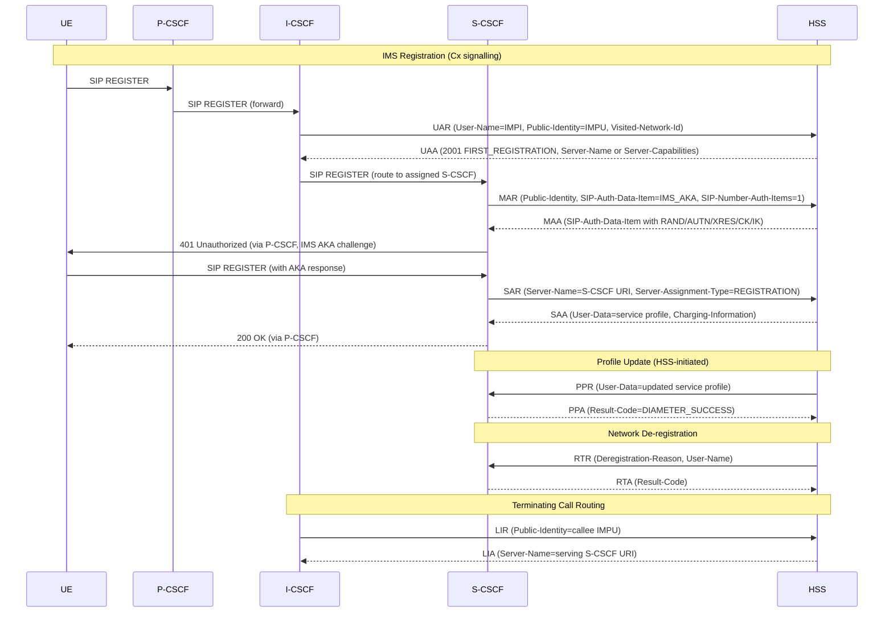
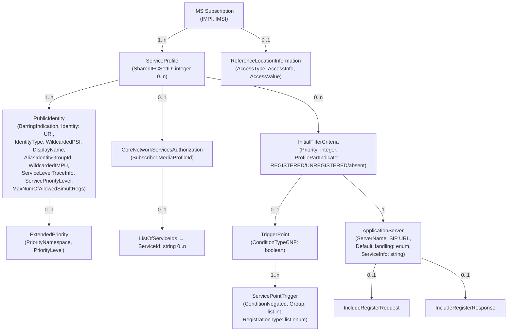

# Cx and Dx Interfaces — Diameter Protocol

The Cx interface carries Diameter signalling between the [I-CSCF](../entities/I-CSCF.md) / [S-CSCF](../entities/S-CSCF.md) and the [HSS](../entities/HSS.md). The Dx interface carries the same application between the I-CSCF/S-CSCF and the [SLF](../entities/HSS.md) (Subscriber Locator Function) for multi-HSS deployments. Defined by 3GPP TS 29.229 (protocol details) and TS 29.228 (signalling flows).

---

## Application Identity

| Parameter | Value |
|---|---|
| Application-ID | **16777216** (IANA allocated, "Diameter Multimedia Application") |
| Vendor-ID (3GPP) | 10415 |
| Vendor-ID (ETSI) | 13019 |
| Transport | SCTP (IETF RFC 4960) |
| Session mode | Implicitly terminated (`Auth-Session-State = NO_STATE_MAINTAINED`) |

Both vendor IDs (10415 and 13019) shall be present in `Supported-Vendor-Id` AVP of Capabilities-Exchange messages, and the Application-ID shall appear in `Auth-Application-Id` within the `Vendor-Specific-Application-Id` grouped AVP.

---

## Diameter Base Protocol Usage (§5)

- **Security (§5.1):** Diameter messages secured per 3GPP TS 33.210 (Network Domain Security).
- **Accounting (§5.2):** Accounting functionality is **not used** on Cx. No Accounting Session State Machine.
- **Sessions (§5.3):** All Cx sessions are **implicitly terminated**. Clients (I-CSCF, S-CSCF) include `Auth-Session-State = NO_STATE_MAINTAINED (1)` in every request; servers mirror it in responses. Neither Authorization-Lifetime nor Session-Timeout AVPs are present.
- **Transport (§5.4):** SCTP.
- **Routing (§5.5):**
  - If the I-CSCF/S-CSCF knows the HSS address (from prior exchange): include both `Destination-Realm` and `Destination-Host`.
  - If HSS address unknown: include only `Destination-Realm`; route via SLF (Dx) or Diameter Proxy Agent which adds Destination-Host after resolving the HSS.
  - The S-CSCF **shall store** the HSS realm and address per Public Identity after the first Cx exchange, and use them for subsequent requests to the same HSS.
  - `Destination-Host` is **optional** in ABNF for I-CSCF/S-CSCF initiated commands (the HSS cannot be known a priori).
  - For HSS-initiated commands (RTR, PPR): `Destination-Host` is **mandatory** (HSS obtained the S-CSCF address from the Origin-Host of prior SAR/MAR).
  - `Destination-Realm` is mandatory in all requests.

---

## Command Code Summary (§6.1)

Application-ID = 16777216 for all commands. All result codes defined in §6.2 are carried inside `Experimental-Result` AVP; `Result-Code` AVP shall be absent when an Experimental-Result is included.

| Command | Abbr | Code | Direction | Purpose |
|---|---|---|---|---|
| User-Authorization-Request | UAR | 300 | I-CSCF → HSS | Authorize registration; get S-CSCF name or capabilities |
| User-Authorization-Answer | UAA | 300 | HSS → I-CSCF | Return Server-Name or Server-Capabilities |
| Server-Assignment-Request | SAR | 301 | S-CSCF → HSS | Register S-CSCF name in HSS; download user data |
| Server-Assignment-Answer | SAA | 301 | HSS → S-CSCF | Return service profile (User-Data), charging info |
| Location-Info-Request | LIR | 302 | I-CSCF → HSS | Find S-CSCF serving a user (for terminating routing) |
| Location-Info-Answer | LIA | 302 | HSS → I-CSCF | Return serving S-CSCF name / capabilities |
| Multimedia-Auth-Request | MAR | 303 | S-CSCF → HSS | Request authentication vectors for IMS AKA |
| Multimedia-Auth-Answer | MAA | 303 | HSS → S-CSCF | Return SIP-Auth-Data-Item(s) with AV material |
| Registration-Termination-Request | RTR | 304 | **HSS → S-CSCF** | Network-initiated de-registration |
| Registration-Termination-Answer | RTA | 304 | S-CSCF → HSS | Acknowledge de-registration |
| Push-Profile-Request | PPR | 305 | **HSS → S-CSCF** | Push updated user data or SIP Digest credentials |
| Push-Profile-Answer | PPA | 305 | S-CSCF → HSS | Acknowledge profile push |

RTR and PPR are **server-initiated** (HSS→S-CSCF). All others are client-initiated (I-CSCF or S-CSCF → HSS).

---

## Message Formats (ABNF) (§6.1)

ABNF notation: `{ }` = mandatory, `[ ]` = optional, `*[ ]` = zero-or-more, `< >` = fixed.

### 6.1.1 User-Authorization-Request (UAR) — Code 300

Sent by I-CSCF to authorize a UE registration and obtain the S-CSCF to route the REGISTER to.

```
< User-Authorization-Request > ::= < Diameter Header: 300, REQ, PXY, 16777216 >
    < Session-Id >
    [ DRMP ]
    { Vendor-Specific-Application-Id }
        { Auth-Session-State }
        { Origin-Host }
        { Origin-Realm }
        [ Destination-Host ]
    { Destination-Realm }
        { User-Name }           -- IMPI (SIP Authorization username)
        [ OC-Supported-Features ]
       *[ Supported-Features ]
        { Public-Identity }     -- IMPU being registered
        { Visited-Network-Identifier }
        [ User-Authorization-Type ]   -- default: REGISTRATION
        [ UAR-Flags ]
   *[ AVP ]
   *[ Proxy-Info ]
   *[ Route-Record ]
```

### 6.1.2 User-Authorization-Answer (UAA) — Code 300

```
< User-Authorization-Answer > ::= < Diameter Header: 300, PXY, 16777216 >
    < Session-Id >
    [ DRMP ]
    { Vendor-Specific-Application-Id }
    [ Result-Code ]
    [ Experimental-Result ]
        { Auth-Session-State }
        { Origin-Host }
        { Origin-Realm }
        [ OC-Supported-Features ]
        [ OC-OLR ]
       *[ Load ]
       *[ Supported-Features ]
    [ Server-Name ]             -- assigned S-CSCF SIP URI (if known)
        [ Server-Capabilities ] -- S-CSCF selection hints (if no Server-Name)
   *[ AVP ]
    [ Failed-AVP ]
   *[ Proxy-Info ]
   *[ Route-Record ]
```

### 6.1.3 Server-Assignment-Request (SAR) — Code 301

Sent by S-CSCF to register itself in the HSS and download the user's service profile.

```
< Server-Assignment-Request > ::= < Diameter Header: 301, REQ, PXY, 16777216 >
    < Session-Id >
    [ DRMP ]
    { Vendor-Specific-Application-Id }
        { Auth-Session-State }
        { Origin-Host }
        { Origin-Realm }
        [ Destination-Host ]
    { Destination-Realm }
        [ User-Name ]                        -- IMPI
        [ OC-Supported-Features ]
       *[ Supported-Features ]
       *[ Public-Identity ]                  -- IMPU(s)
        [ Wildcarded-Public-Identity ]
        { Server-Name }                      -- this S-CSCF's SIP URI
        { Server-Assignment-Type }           -- e.g. REGISTRATION, DE-REGISTRATION
        { User-Data-Already-Available }
        [ SCSCF-Restoration-Info ]
        [ Multiple-Registration-Indication ]
        [ Session-Priority ]
        [ SAR-Flags ]
   *[ AVP ]
   *[ Proxy-Info ]
   *[ Route-Record ]
```

### 6.1.4 Server-Assignment-Answer (SAA) — Code 301

Returns the user's service profile (iFC, PSI lists, etc.) and charging addresses.

```
< Server-Assignment-Answer > ::= < Diameter Header: 301, PXY, 16777216 >
    < Session-Id >
    [ DRMP ]
    { Vendor-Specific-Application-Id }
    [ Result-Code ]
    [ Experimental-Result ]
        { Auth-Session-State }
        { Origin-Host }
        { Origin-Realm }
        [ User-Name ]
        [ OC-Supported-Features ]
        [ OC-OLR ]
       *[ Load ]
       *[ Supported-Features ]
        [ User-Data ]                        -- XML service profile (iFC + public identities)
        [ Charging-Information ]             -- P-CSCF/S-CSCF charging addresses
        [ Associated-Identities ]            -- all IMPIs sharing this S-CSCF
        [ Loose-Route-Indication ]
       *[ SCSCF-Restoration-Info ]
        [ Associated-Registered-Identities ] -- all registered IMPUs for this user
        [ Server-Name ]
        [ Wildcarded-Public-Identity ]
        [ Priviledged-Sender-Indication ]
        [ Allowed-WAF-WWSF-Identities ]      -- WebRTC WAF/WWSF identities
   *[ AVP ]
    [ Failed-AVP ]
   *[ Proxy-Info ]
   *[ Route-Record ]
```

### 6.1.5 Location-Info-Request (LIR) — Code 302

Sent by I-CSCF to find the S-CSCF currently serving a user (for terminating call routing).

```
< Location-Info-Request > ::= < Diameter Header: 302, REQ, PXY, 16777216 >
    < Session-Id >
    [ DRMP ]
    { Vendor-Specific-Application-Id }
        { Auth-Session-State }
        { Origin-Host }
        { Origin-Realm }
        [ Destination-Host ]
    { Destination-Realm }
        [ Originating-Request ]
        [ OC-Supported-Features ]
       *[ Supported-Features ]
        { Public-Identity }
        [ User-Authorization-Type ]
        [ Session-Priority ]
   *[ AVP ]
   *[ Proxy-Info ]
   *[ Route-Record ]
```

### 6.1.6 Location-Info-Answer (LIA) — Code 302

```
< Location-Info-Answer > ::= < Diameter Header: 302, PXY, 16777216 >
    < Session-Id >
    [ DRMP ]
    { Vendor-Specific-Application-Id }
    [ Result-Code ]
    [ Experimental-Result ]
        { Auth-Session-State }
        { Origin-Host }
        { Origin-Realm }
        [ OC-Supported-Features ]
        [ OC-OLR ]
       *[ Load ]
       *[ Supported-Features ]
        [ Server-Name ]
        [ Server-Capabilities ]
        [ Wildcarded-Public-Identity ]
        [ LIA-Flags ]
   *[ AVP ]
    [ Failed-AVP ]
   *[ Proxy-Info ]
   *[ Route-Record ]
```

### 6.1.7 Multimedia-Auth-Request (MAR) — Code 303

Sent by S-CSCF to request IMS AKA authentication vectors from the HSS.

```
< Multimedia-Auth-Request > ::= < Diameter Header: 303, REQ, PXY, 16777216 >
    < Session-Id >
    [ DRMP ]
    { Vendor-Specific-Application-Id }
        { Auth-Session-State }
        { Origin-Host }
        { Origin-Realm }
        { Destination-Realm }
        [ Destination-Host ]
        { User-Name }
        [ OC-Supported-Features ]
       *[ Supported-Features ]
        { Public-Identity }
        { SIP-Auth-Data-Item }       -- requested auth scheme + SIP-Authorization
        { SIP-Number-Auth-Items }    -- number of AVs requested
        { Server-Name }
   *[ AVP ]
   *[ Proxy-Info ]
   *[ Route-Record ]
```

### 6.1.8 Multimedia-Auth-Answer (MAA) — Code 303

```
< Multimedia-Auth-Answer > ::= < Diameter Header: 303, PXY, 16777216 >
    < Session-Id >
    [ DRMP ]
    { Vendor-Specific-Application-Id }
    [ Result-Code ]
    [ Experimental-Result ]
        { Auth-Session-State }
        { Origin-Host }
        { Origin-Realm }
        [ User-Name ]
        [ OC-Supported-Features ]
        [ OC-OLR ]
       *[ Load ]
       *[ Supported-Features ]
        [ Public-Identity ]
        [ SIP-Number-Auth-Items ]
       *[ SIP-Auth-Data-Item ]       -- AV(s): RAND, AUTN, XRES, CK, IK
   *[ AVP ]
    [ Failed-AVP ]
   *[ Proxy-Info ]
   *[ Route-Record ]
```

### 6.1.9 Registration-Termination-Request (RTR) — Code 304 (HSS-initiated)

Sent by HSS to S-CSCF to initiate network-driven de-registration.

```
< Registration-Termination-Request > ::= < Diameter Header: 304, REQ, PXY, 16777216 >
    < Session-Id >
    [ DRMP ]
    { Vendor-Specific-Application-Id }
        { Auth-Session-State }
        { Origin-Host }
        { Origin-Realm }
        { Destination-Realm }
        { User-Name }
        [ Associated-Identities ]
       *[ Supported-Features ]
       *[ Public-Identity ]
        { Deregistration-Reason }    -- reason code + optional explanation
        RTR-Flags
   *[ AVP ]
   *[ Proxy-Info ]
   *[ Route-Record ]
```

### 6.1.10 Registration-Termination-Answer (RTA) — Code 304

```
< Registration-Termination-Answer > ::= < Diameter Header: 304, PXY, 16777216 >
    < Session-Id >
    [ DRMP ]
    { Vendor-Specific-Application-Id }
    [ Result-Code ]
    [ Experimental-Result ]
        { Auth-Session-State }
        { Origin-Host }
        { Origin-Realm }
        [ Associated-Identities ]
       *[ Supported-Features ]
       *[ Identity-with-Emergency-Registration ]
   *[ AVP ]
    [ Failed-AVP ]
   *[ Proxy-Info ]
   *[ Route-Record ]
```

### 6.1.11 Push-Profile-Request (PPR) — Code 305 (HSS-initiated)

Sent by HSS to push updated subscription data or SIP Digest credentials to the S-CSCF.

```
< Push-Profile-Request > ::= < Diameter Header: 305, REQ, PXY, 16777216 >
    < Session-Id >
    [ DRMP ]
    { Vendor-Specific-Application-Id }
        { Auth-Session-State }
        { Origin-Host }
        { Origin-Realm }
        { Destination-Host }      -- mandatory: HSS knows S-CSCF address
        { Destination-Realm }
        { User-Name }
       *[ Supported-Features ]
        [ User-Data ]
        [ Charging-Information ]
        [ SIP-Auth-Data-Item ]
        [ Allowed-WAF-WWSF-Identities ]
   *[ AVP ]
   *[ Proxy-Info ]
   *[ Route-Record ]
```

### 6.1.12 Push-Profile-Answer (PPA) — Code 305

```
< Push-Profile-Answer > ::= < Diameter Header: 305, PXY, 16777216 >
    < Session-Id >
    [ DRMP ]
    { Vendor-Specific-Application-Id }
    [ Result-Code ]
    [ Experimental-Result ]
        { Auth-Session-State }
        { Origin-Host }
        { Origin-Realm }
       *[ Supported-Features ]
   *[ AVP ]
    [ Failed-AVP ]
   *[ Proxy-Info ]
   *[ Route-Record ]
```

---

## Result-Code AVP Values (§6.2)

All Cx-specific result codes are carried in `Experimental-Result` AVP (Vendor-ID = 10415). When an Experimental-Result is included, `Result-Code` AVP shall be absent.

### Success Codes (2xxx)

| Code | Name | Meaning |
|---|---|---|
| 2001 | DIAMETER_FIRST_REGISTRATION | UAA: user authorized; S-CSCF **shall** be assigned (first registration) |
| 2002 | DIAMETER_SUBSEQUENT_REGISTRATION | UAA: user authorized; S-CSCF **already assigned**, no new selection needed |
| 2003 | DIAMETER_UNREGISTERED_SERVICE | UAA: identity not registered but has unregistered-state services; S-CSCF shall be assigned |
| 2004 | DIAMETER_SUCCESS_SERVER_NAME_NOT_STORED | SAA: de-registration complete; S-CSCF name not retained in HSS |

### Permanent Failure Codes (5xxx)

| Code | Name | Meaning |
|---|---|---|
| 5001 | DIAMETER_ERROR_USER_UNKNOWN | Received identity (IMPI/IMPU) is unknown in HSS |
| 5002 | DIAMETER_ERROR_IDENTITIES_DONT_MATCH | Public identity does not correspond to the private identity presented |
| 5003 | DIAMETER_ERROR_IDENTITY_NOT_REGISTERED | LIR: queried IMPU not registered; user cannot be given service |
| 5004 | DIAMETER_ERROR_ROAMING_NOT_ALLOWED | User not permitted to roam in the visited network |
| 5005 | DIAMETER_ERROR_IDENTITY_ALREADY_REGISTERED | Identity already has a server assigned; registration status prevents overwrite |
| 5006 | DIAMETER_ERROR_AUTH_SCHEME_NOT_SUPPORTED | Requested authentication scheme not supported by HSS |
| 5007 | DIAMETER_ERROR_IN_ASSIGNMENT_TYPE | Identity already has same server; status or Public-Identity type incompatible with assignment type |
| 5008 | DIAMETER_ERROR_TOO_MUCH_DATA | Pushed data volume exceeds receiving entity capacity (also used in TS 29.329) |
| 5009 | DIAMETER_ERROR_NOT_SUPPORTED_USER_DATA | S-CSCF cannot handle received subscription data format |
| 5011 | DIAMETER_ERROR_FEATURE_UNSUPPORTED | Origin requests a feature not supported by the destination |
| 5012 | DIAMETER_ERROR_SERVING_NODE_FEATURE_UNSUPPORTED | HSS supports P-CSCF-Restoration but no serving node supports it (TS 23.380 §5.4) |

---

## Procedure Flow Overview



---

## AVP Reference (§6.3)

All Cx AVPs use Vendor-ID = 10415 (3GPP) unless noted. Flags: **M** = mandatory, **V** = vendor-specific bit set. "May Encr" = No for all Cx AVPs.

### Table 6.3.1: Diameter Multimedia Application AVPs

| AVP Name | Code | Type | Must | May | Notes |
|---|---|---|---|---|---|
| Visited-Network-Identifier | 600 | OctetString | M, V | | H-PLMN domain name; operator-specific coding |
| Public-Identity | 601 | UTF8String | M, V | | SIP-URI or TEL-URI (canonical form, TS 23.003) |
| Server-Name | 602 | UTF8String | M, V | | SIP-URI of S-CSCF |
| Server-Capabilities | 603 | Grouped | M, V | | S-CSCF selection hints for I-CSCF |
| Mandatory-Capability | 604 | Unsigned32 | M, V | | Single mandatory capability value (TS 29.228 §6.7) |
| Optional-Capability | 605 | Unsigned32 | M, V | | Single optional capability value (TS 29.228 §6.7) |
| User-Data | 606 | OctetString | M, V | | XML service profile (iFC + identities); format in TS 29.228 |
| SIP-Number-Auth-Items | 607 | Unsigned32 | M, V | | Req: AVs requested; Ans: AVs returned |
| SIP-Authentication-Scheme | 608 | UTF8String | M, V | | "Digest-AKAv1-MD5" / "SIP Digest" / "NASS-Bundled" / "Early-IMS-Security" / "Unknown" |
| SIP-Authenticate | 609 | OctetString | M, V | | RAND (16 oct) \|\| AUTN (16 oct) — 32 octets total |
| SIP-Authorization | 610 | OctetString | M, V | | In MAR: RAND (16) \|\| AUTS (14); in MAA: XRES |
| SIP-Authentication-Context | 611 | OctetString | M, V | | Additional auth context (optional) |
| SIP-Auth-Data-Item | 612 | Grouped | M, V | | Container for one AV; see §6.3.13 |
| SIP-Item-Number | 613 | Unsigned32 | M, V | | Sequence number within SIP-Auth-Data-Item list |
| Server-Assignment-Type | 614 | Enumerated | M, V | | SAR operation type; 15 values; see §6.3.15 table |
| Deregistration-Reason | 615 | Grouped | M, V | | RTR reason; contains Reason-Code + Reason-Info |
| Reason-Code | 616 | Enumerated | M, V | | De-registration reason; 4 values; see §6.3.17 |
| Reason-Info | 617 | UTF8String | M, V | | Human-readable de-registration reason text |
| Charging-Information | 618 | Grouped | M, V | | Charging addresses pushed to S-CSCF |
| Primary-Event-Charging-Function-Name | 619 | DiameterURI | M, V | | Address of primary OCF; Dest-Host/Realm extractable from FQDN |
| Secondary-Event-Charging-Function-Name | 620 | DiameterURI | M, V | | Backup OCF address |
| Primary-Charging-Collection-Function-Name | 621 | DiameterURI | M, V | | Address of primary CDF (offline) |
| Secondary-Charging-Collection-Function-Name | 622 | DiameterURI | M, V | | Backup CDF address |
| User-Authorization-Type | 623 | Enumerated | M, V | | UAR operation: REGISTRATION(0) / DE_REGISTRATION(1) / REGISTRATION_AND_CAPABILITIES(2) |
| _(Void)_ | 624 | — | — | — | §6.3.25 reserved |
| User-Data-Already-Available | 624 | Enumerated | V | | USER_DATA_NOT_AVAILABLE(0) / USER_DATA_ALREADY_AVAILABLE(1) |
| Confidentiality-Key | 625 | OctetString | M, V | | CK from IMS AKA |
| Integrity-Key | 626 | OctetString | M, V | | IK from IMS AKA |
| Supported-Features | 628 | Grouped | V | M | Feature negotiation; see §6.3.29 and §7 |
| Feature-List-ID | 629 | Unsigned32 | V | M | Identifies the feature list (= 1 for Cx Feature-List-ID 1) |
| Feature-List | 630 | Unsigned32 | V | M | Bitmask of supported features; bit definitions in Table 7.1.1 |
| Supported-Applications | 631 | Grouped | V | M | Application IDs supported by a Diameter node (§7.3.1) |
| Associated-Identities | 632 | Grouped | M, V | | All IMPIs sharing the same S-CSCF |
| Originating-Request | 633 | Enumerated | M, V | | ORIGINATING(0) — used in LIR when AS originates request |
| Wildcarded-Public-Identity | 634 | UTF8String | M, V | | Wildcarded PSI or wildcarded IMPU (TS 23.003) |
| SIP-Digest-Authenticate | 635 | Grouped | M, V | | SIP Digest auth: Digest-Realm + Digest-Algorithm + Digest-QoP + Digest-HA1 |
| Digest-Realm | 104 | UTF8String | M | | IETF RFC 4590 [15] |
| Digest-Algorithm | 111 | UTF8String | — | M | IETF RFC 4590 [15] |
| Digest-QoP | 110 | UTF8String | M | | IETF RFC 4590 [15] |
| Digest-HA1 | 121 | UTF8String | M | | IETF RFC 4590 [15] |
| Line-Identifier | 500 | OctetString | M | | **Vendor-ID 13019 (ETSI)**; broadband access line identifier |
| Wildcarded-IMPU | 636 | UTF8String | M, V | | Wildcarded IMPU; also used in Sh (TS 29.328/29.329) |
| UAR-Flags | 637 | Unsigned32 | V | M | Bit 0: IMS Emergency Registration |
| Loose-Route-Indication | 638 | Enumerated | V | M | LOOSE_ROUTE_NOT_REQUIRED(0) / LOOSE_ROUTE_REQUIRED(1) |
| SCSCF-Restoration-Info | 639 | Grouped | V | M | P-CSCF Restoration data: User-Name + Restoration-Info(1+) + Registration-Time-Out + SIP-Authentication-Scheme |
| Path | 640 | OctetString | V | M | Comma-separated SIP proxies from Path header (RFC 3327) |
| Contact | 641 | OctetString | V | M | SIP Contact header address and parameters |
| Subscription-Info | 642 | Grouped | V | M | UE subscription info: Call-ID + From + To + Record-Route + Contact |
| Call-ID-SIP-Header | 643 | OctetString | V | M | SIP Call-ID header content |
| From-SIP-Header | 644 | OctetString | V | M | SIP From header content |
| To-SIP-Header | 645 | OctetString | V | M | SIP To header content |
| Record-Route | 646 | OctetString | V | M | Comma-separated Record-Route headers |
| Associated-Registered-Identities | 647 | Grouped | V | M | IMPIs registered with the IMPU in the request |
| Multiple-Registration-Indication | 648 | Enumerated | V | M | NOT_MULTIPLE_REGISTRATION(0) / MULTIPLE_REGISTRATION(1) |
| Restoration-Info | 649 | Grouped | V | M | Per-contact restoration: Path + Contact + Initial-CSeq + Call-ID + Subscription-Info + P-CSCF-Subscription-Info |
| Session-Priority | 650 | Enumerated | V | M | PRIORITY-0 (highest) through PRIORITY-4; mapped per TS 24.229 Table A.162 |
| Identity-with-Emergency-Registration | 651 | Grouped | V | M | IMPI + IMPU pair with active emergency registration |
| Priviledged-Sender-Indication | 652 | Enumerated | V | M | NOT_PRIVILEDGED_SENDER(0) / PRIVILEDGED_SENDER(1) |
| LIA-Flags | 653 | Unsigned32 | V | M | Bit 0: PSI Direct Routing Indication |
| OC-Supported-Features | 621 | Grouped | M, V | | IETF RFC 7683 — Diameter overload control |
| OC-OLR | 623 | Grouped | M, V | | IETF RFC 7683 — Overload report |
| Initial-CSeq-Sequence-Number | 654 | Unsigned32 | V | M | CSeq number from initial successful REGISTER |
| SAR-Flags | 655 | Unsigned32 | V | M | Bit 0: P-CSCF-Restoration-Indication (with ADMINISTRATIVE_DEREGISTRATION or UNREGISTERED_USER) |
| Allowed-WAF-WWSF-Identities | 656 | Grouped | V | M | Allowed WebRTC WAF and WWSF addresses for this subscription |
| WebRTC-Authentication-Function-Name | 657 | UTF8String | V | M | WAF address string (format per IETF draft-holmberg-sipcore-auth-id-01) |
| WebRTC-Web-Server-Function-Name | 658 | UTF8String | V | M | WWSF address string |
| DRMP | 301 | Enumerated | M, V | | IETF RFC 7944 — Diameter Routing Message Priority; may set DSCP marking |
| Load | — | Grouped | M, V | | IETF RFC 8583 — passive load advertisement |
| RTR-Flags | 659 | Unsigned32 | V | M | Bit 0: Reference Location Information change |
| P-CSCF-Subscription-Info | 660 | Grouped | V | M | P-CSCF subscription: Call-ID + From + To + Contact |
| Registration-Time-Out | 661 | Time | V | M | Point in time when UE registration expires |

### Key Grouped AVP Formats

```
Server-Capabilities ::= < AVP header: 603, 10415 >
    *[ Mandatory-Capability ]
    *[ Optional-Capability ]
    *[ Server-Name ]
    *[ AVP ]

SIP-Auth-Data-Item ::= < AVP header: 612, 10415 >
    [ SIP-Item-Number ]
    [ SIP-Authentication-Scheme ]
    [ SIP-Authenticate ]           -- RAND || AUTN (IMS AKA) or challenge (SIP Digest)
    [ SIP-Authorization ]          -- RAND || AUTS in req; XRES in ans
    [ SIP-Authentication-Context ]
    [ Confidentiality-Key ]        -- CK
    [ Integrity-Key ]              -- IK
    [ SIP-Digest-Authenticate ]    -- for SIP Digest scheme
    [ Framed-IP-Address ]
    [ Framed-IPv6-Prefix ]
    [ Framed-Interface-Id ]
   *[ Line-Identifier ]
   *[ AVP ]

Deregistration-Reason ::= < AVP header: 615, 10415 >
    { Reason-Code }
    [ Reason-Info ]
    *[ AVP ]

Charging-Information ::= < AVP header: 618, 10415 >
    [ Primary-Event-Charging-Function-Name ]
    [ Secondary-Event-Charging-Function-Name ]
    [ Primary-Charging-Collection-Function-Name ]
    [ Secondary-Charging-Collection-Function-Name ]
    *[ AVP ]

Supported-Features ::= < AVP header: 628, 10415 >
    { Vendor-Id }
    { Feature-List-ID }
    { Feature-List }
    *[ AVP ]

SCSCF-Restoration-Info ::= < AVP header: 639, 10415 >
    { User-Name }
    1*{ Restoration-Info }
    [ Registration-Time-Out ]
    [ SIP-Authentication-Scheme ]
    *[ AVP ]

Restoration-Info ::= < AVP header: 649, 10415 >
    { Path }
    { Contact }
    [ Initial-CSeq-Sequence-Number ]
    [ Call-ID-SIP-Header ]
    [ Subscription-Info ]
    [ P-CSCF-Subscription-Info ]
    *[ AVP ]
```

---

## Server-Assignment-Type Values (§6.3.15)

Used in SAR to tell HSS what operation the S-CSCF is performing.

| Value | Name | Trigger |
|---|---|---|
| 0 | NO_ASSIGNMENT | Fetch user profile + restoration info without changing registration state |
| 1 | REGISTRATION | First registration of an identity |
| 2 | RE_REGISTRATION | Re-registration or update of S-CSCF Restoration Information |
| 3 | UNREGISTERED_USER | S-CSCF received request for unregistered IMPU; or AS originating on behalf of unregistered user; or P-CSCF failure (single IMPI) with P-CSCF-Restoration-Indication |
| 4 | TIMEOUT_DEREGISTRATION | Registration timer expired |
| 5 | USER_DEREGISTRATION | User-initiated de-registration |
| 6 | TIMEOUT_DEREGISTRATION_STORE_SERVER_NAME | Timer expired; S-CSCF retains data and asks HSS to retain S-CSCF name; also used for PCRF-based P-CSCF Restoration with single IMPI |
| 7 | USER_DEREGISTRATION_STORE_SERVER_NAME | User de-registered; S-CSCF retains data; HSS retains S-CSCF name |
| 8 | ADMINISTRATIVE_DEREGISTRATION | Admin/network issue; or P-CSCF failure (multiple IMPIs) with IMS-Restoration or PCRF-based P-CSCF Restoration |
| 9 | AUTHENTICATION_FAILURE | Authentication failure |
| 10 | AUTHENTICATION_TIMEOUT | Authentication timeout |
| 11 | DEREGISTRATION_TOO_MUCH_DATA | Profile data volume exceeds S-CSCF capacity |
| 12 | AAA_USER_DATA_REQUEST | SWx only (TS 29.273) — not used in Cx |
| 13 | PGW_UPDATE | SWx only — not used in Cx |
| 14 | RESTORATION | SWx only — not used in Cx |

---

## Reason-Code Values (§6.3.17)

Used in Deregistration-Reason AVP within RTR.

| Value | Name | Meaning |
|---|---|---|
| 0 | PERMANENT_TERMINATION | HSS permanently terminating the subscription/service |
| 1 | NEW_SERVER_ASSIGNED | HSS has assigned a different S-CSCF |
| 2 | SERVER_CHANGE | S-CSCF change is required by network |
| 3 | REMOVE_S-CSCF | Remove stored S-CSCF name without de-registration (behaviour defined in TS 29.228) |

---

## Feature List (§7 — Special Requirements)

### Feature-List-ID 1 Bits (Table 7.1.1)

Negotiated via Supported-Features AVP (code 628) with Feature-List-ID = 1, Vendor-Id = 10415. M = mandatory support required; O = optional.

| Bit | Feature Name | M/O | Applicable Commands | Description |
|---|---|---|---|---|
| 0 | SiFC | O | SAR/SAA, PPR/PPA | **Shared iFC sets:** HSS downloads unique identifiers of shared iFC sets; S-CSCF maps locally using its database. When DSAI masking applies: HSS may download remaining non-masked iFCs or identifiers of other shared sets covering them. If HSS does not support: downloads iFCs of shared set explicitly (no identifier). |
| 1 | AliasInd | M | SAR/SAA, PPR/PPA | **Alias Indication:** Different alias groups sent in separate service profiles with alias group ID. If S-CSCF unsupported: HSS sends only alias-identity IMPUs per service profile without alias grouping. Backwards-compatible: pre-feature behaviour is subset. |
| 2 | IMSRestorationInd | O | UAR/UAA, LIR/LIA, SAR/SAA | **IMS Restoration Indication:** If I-CSCF detects assigned S-CSCF unreachable → triggers new S-CSCF assignment. S-CSCF sends restoration info to HSS in SAA. HSS sends restoration info in SAA when required. |
| 3 | P-CSCF-Restoration-mechanism | O | SAR/SAA | **HSS-based P-CSCF Restoration:** S-CSCF sets P-CSCF-Restoration-Indication bit in SAR-Flags. HSS sends SCSCF-Restoration-Indication in SAA when required (per TS 23.380 §5.4). |

### Supported Features Protocol Rules (§7.2)

- **Requests:** Supported-Features AVP with **M-bit set** indicates features required to process the request.
- **Answers:** Supported-Features AVP with **M-bit cleared** indicates the responder's supported feature set.
- **No Supported-Features in request:** Sender uses no post-Rel-5 extensions; answer need not include Supported-Features.
- **Feature negotiation on failure:**
  - Destination does not support all M-bit features → return `DIAMETER_ERROR_FEATURE_UNSUPPORTED` + supported features list.
  - Destination does not understand Supported-Features AVP → return `DIAMETER_AVP_UNSUPPORTED` + Failed-AVP.
  - On error receipt: sender may re-send using only commonly supported features.
- **Answer rule:** Answer always lists the **complete** set of features the responder supports, not just the intersected ones.

---

## Namespace Summary (§6.4)

| Namespace | Value | Authority |
|---|---|---|
| Application-ID | 16777216 | IANA |
| Command Codes | 300–305 | IANA (allocated in RFC 3589 to 3GPP) |
| Experimental-Result-Code values | 2001–2004, 5001–5012 | 3GPP TS 29.229 |
| AVP codes (3GPP) | 600–661 (Cx range) | 3GPP (Vendor-ID 10415) |
| AVP code (ETSI) | 500 (Line-Identifier) | ETSI (Vendor-ID 13019) |
| AVP codes (IETF RFC 4590) | 104, 110, 111, 121 | IETF |
| AVP code (DRMP) | 301 | IETF RFC 7944 |

---

## Interface Versioning (§7.3)

- **Version discovery:** via CER/CEA capabilities exchange and error messages.
- **Latest common version:** sender stores all versions destination supports; uses the latest common version when sending.
- **Unknown destination version:** sender uses its own latest supported version.
- **Agent version resolution:** If Diameter agent returns `DIAMETER_UNABLE_TO_DELIVER` with Supported-Applications AVP → receiver selects latest common App-ID version and re-sends.
- **Current Cx Application-ID:** 16777216, first applied in 3GPP Rel-5; unchanged through Rel-16 (no incompatible interface changes requiring a new identifier).

---

## Key Design Properties

- **Stateless server model:** All sessions implicitly terminated. HSS never needs to time out Cx sessions — each message stands alone.
- **S-CSCF caches HSS address:** After first SAR/MAR, S-CSCF stores HSS realm+host per Public Identity. Subsequent Cx messages bypass SLF/proxy resolution.
- **HSS-initiated commands require Destination-Host:** HSS extracts S-CSCF address from Origin-Host of prior client request — so PPR/RTR always carry Destination-Host; UAR/SAR/LIR/MAR may omit it.
- **SLF as Dx proxy:** When I-CSCF/S-CSCF sends only Destination-Realm (no Destination-Host), Diameter routing hits the SLF, which resolves the correct HSS and redirects/proxies accordingly.
- **Accounting not used:** Cx is purely for IMS registration/auth/location/profile management. No ACR/ACA message exchange.

---

## Cx Operation → Diameter Command Mapping (Annex A.2, TS 29.228)

| Cx Message (Stage 2) | Source | Destination | Diameter Command | Abbr |
|---|---|---|---|---|
| Cx-Query + Cx-Select-Pull | I-CSCF | HSS | User-Authorization-Request | UAR |
| Cx-Query Resp + Cx-Select-Pull Resp | HSS | I-CSCF | User-Authorization-Answer | UAA |
| Cx-Put + Cx-Pull | S-CSCF | HSS | Server-Assignment-Request | SAR |
| Cx-Put Resp + Cx-Pull Resp | HSS | S-CSCF | Server-Assignment-Answer | SAA |
| Cx-Location-Query | I-CSCF | HSS | Location-Info-Request | LIR |
| Cx-Location-Query Resp | HSS | I-CSCF | Location-Info-Answer | LIA |
| Cx-AuthDataReq | S-CSCF | HSS | Multimedia-Authentication-Request | MAR |
| Cx-AuthDataResp | HSS | S-CSCF | Multimedia-Authentication-Answer | MAA |
| Cx-Deregister | HSS | S-CSCF | Registration-Termination-Request | RTR |
| Cx-Deregister Resp | S-CSCF | HSS | Registration-Termination-Answer | RTA |
| Cx-Update_Subscr_Data | HSS | S-CSCF | Push-Profile-Request | PPR |
| Cx-Update_Subscr_Data Resp | S-CSCF | HSS | Push-Profile-Answer | PPA |

## Cx Parameter → Diameter AVP Mapping (Annex A.3, TS 29.228)

| Cx Parameter | Diameter AVP |
|---|---|
| Visited Network Identifier | Visited-Network-Identifier |
| Public Identity | Public-Identity |
| Private Identity | User-Name |
| S-CSCF Name / AS Name | Server-Name |
| S-CSCF Capabilities | Server-Capabilities |
| Result | Result-Code / Experimental-Result-Code |
| User Profile | User-Data |
| Server Assignment Type | Server-Assignment-Type |
| Authentication Data | SIP-Auth-Data-Item |
| Item Number | SIP-Item-Number |
| Authentication Scheme | SIP-Authentication-Scheme |
| Authentication Information | SIP-Authenticate |
| Authorization Information | SIP-Authorization |
| Confidentiality Key | Confidentiality-Key |
| Integrity Key | Integrity-Key |
| Number Authentication Items | SIP-Number-Auth-Items |
| Reason for de-registration | Deregistration-Reason |
| Charging Information | Charging-Information |
| Routing Information | Destination-Host |
| Type of Authorization | User-Authorization-Type |
| Associated Private Identities | Associated-Identities |
| Digest Authenticate | SIP-Digest-Authenticate |
| Digest Realm | Digest-Realm |
| Digest Algorithm | Digest-Algorithm |
| Digest QoP | Digest-QoP |
| Digest HA1 | Digest-HA1 |
| Alternate Digest Algorithm | Alternate-Digest-Algorithm |
| Alternate Digest HA1 | Alternate-Digest-HA1 |
| Line Identifier | Line-Identifier |
| Wildcarded Public Identity | Wildcarded-Public-Identity |
| Loose-Route Indication | Loose-Route-Indication |
| S-CSCF Restoration Information | SCSCF-Restoration-Info |
| Multiple Registration Indication | Multiple-Registration-Indication |
| Priviledged-Sender Indication | Priviledged-Sender-Indication |
| LIA Flags | LIA-Flags |
| Allowed WAF and/or WWSF Identities | Allowed-WAF-WWSF-Identities |

---

## User Profile Data Model — Cx User-Data AVP (Annex B, TS 29.228)

The `User-Data` AVP (code 606) carries the IMS subscription data in XML format. The XML structure is described by the UML model in Annex B and the normative XML schema in Annex E (see [Cx-signalling-flows](../procedures/Cx-signalling-flows.md) for schema detail).



### Key model rules

**IMS Subscription** — root element carries Private User Identity (NAI format) and IMSI. Contains 1..n ServiceProfiles and 0..1 ReferenceLocationInformation.

**ReferenceLocationInformation** — fixed broadband access reference location: AccessType (e.g. "ADSL"), AccessInfo (e.g. "dsl-location"), AccessValue (line identifier).

**ServiceProfile** — groups one or more PublicIdentities sharing the same iFC set. SharedIFCSetID attributes point to locally-stored shared iFC sets in S-CSCF (SiFC feature).

**PublicIdentity** attributes:
- `BarringIndication`: TRUE → S-CSCF blocks all IMS communication for this identity except REGISTER/re-REGISTER
- `IdentityType`: distinct PUI | distinct PSI | Wildcarded PSI | non-distinct PUI | Wildcarded PUI (absent = distinct PUI)
- `WildcardedPSI` / `WildcardedIMPU`: present for wildcard types, includes delimiter per TS 23.003
- `AliasIdentityGroupId`: alias group membership (AliasInd feature); PUIs with same ID are aliases, share same service profile and service data
- `ServiceLevelTraceInfo`: if present → enable service level tracing for this PUI in S-CSCF
- `ServicePriorityLevel`: Priority Service level
- `MaxNumOfAllowedSimultRegs`: maximum simultaneous registrations per UE
- `ExtendedPriority` (0..n): PriorityNamespace (RFC 4412) + PriorityLevel — Extended Priority Service

**CoreNetworkServicesAuthorization** — absent = no media filtering, no ICS restriction:
- `SubscribedMediaProfileId` (Integer): media authorization profile ID in S-CSCF
- `ListOfServiceIds` → `ServiceId` (string 0..n): authorized IMS Communication Service Identifiers (ICSIs)

**InitialFilterCriteria** — one iFC entry:
- `Priority` (integer): lower number = higher priority; unique per service profile
- `ProfilePartIndicator`: REGISTERED (evaluated for registered PUIs only) | UNREGISTERED (unregistered only) | absent (Common Part — evaluated for both)
- `TriggerPoint` (0..1): absent = unconditional trigger to AS. `ConditionTypeCNF=TRUE` → CNF expression; `FALSE` → DNF expression
- `ApplicationServer`: `ServerName` (SIP URL), `DefaultHandling` = SESSION_CONTINUED | SESSION_TERMINATED, `ServiceInfo` (opaque string passed to AS), `IncludeRegisterRequest` (0..1), `IncludeRegisterResponse` (0..1)

**ServicePointTrigger (SPT)** — one boolean condition atom:
- `ConditionNegated`: TRUE → negate this SPT's match result
- `Group` (list of int): groups SPTs into sub-expressions for CNF/DNF evaluation (§TS 29.228 Annex C)
- `RegistrationType` (list of enum): filter on SIP registration event type
- Subtypes (exactly one): `Request-URI` (RequestURI: anyURI), `SIP-Method` (Method: string), `SIP-Header` (Header: string + Content: string), `Session-Case` (SessionCase: enum), `Session-Description` (Line: string + Content: string)

---

## Diameter Overload Control (Annex H, normative — RFC 7683)

Cx applies the IETF Diameter Overload Indication Conveyance (DOIC) mechanism defined in RFC 7683 (3GPP TS 29.228 Annex H is normative for Cx).

### Roles

| Node | DOIC Role | Description |
|---|---|---|
| HSS | **Reporting node** | Sends OC-OLR (Overload-Control-Report) AVP in any Cx answer (UAA, SAA, LIA, MAA, RTA, PPA) when it is overloaded |
| I-CSCF, S-CSCF | **Reacting node** | Reads OC-OLR from HSS responses; throttles or rejects Cx requests accordingly |

### OC-OLR Reduction Algorithms

| Algorithm | Behaviour |
|---|---|
| **Loss** (RFC 7683 §7.3.1) | Reacting node drops a percentage of requests at random; applies to new requests only |
| **Rate** (RFC 7683 §7.3.2) | Reacting node limits the request rate to a specified number per time window |

The HSS indicates which algorithm to use and the reduction level in the OC-OLR AVP.

### Priority Exemptions

Throttling shall be applied last to:
1. **MPS (Multimedia Priority Service)** requests — shall be the last category throttled
2. **Emergency** requests — shall be the last category throttled (along with MPS)

Ordinary session requests are throttled before MPS/emergency traffic.

### Protocol: OC-Supported-Features and OC-OLR

- Reacting node (I-CSCF/S-CSCF) advertises `OC-Supported-Features` AVP in every Cx request
- Reporting node (HSS) includes `OC-OLR` AVP in answers when overloaded, containing: `OC-Sequence-Number`, `OC-Validity-Duration`, `OC-Report-Type`, `OC-Reduction-Percentage`
- Reacting node clears its OLR state when `OC-Validity-Duration` expires or a new OC-OLR is received with `OC-Sequence-Number` greater than the current stored value

---

## Diameter Message Priority (Annex J, normative — RFC 7944)

Cx uses the IETF Diameter Routing Message Priority (DRMP) mechanism defined in RFC 7944.

### DRMP AVP (Code 301, IETF)

- Carried in any Cx request or answer
- Integer value from 0 (highest priority) to 15 (lowest priority) _(RFC 7944 §4.1.2)_
- When present, Diameter routing agents and nodes use DRMP to prioritise message handling and queuing

### Precedence Rule (§J.2.4)

> **DRMP takes precedence over Session-Priority** when both AVPs are present in the same message.

| AVP | Usage |
|---|---|
| `DRMP` (code 301) | Diameter-layer routing priority — applies to Cx message scheduling |
| `Session-Priority` (code 650) | Application-layer session priority (e.g. MPS level) |

If both are present: routing agents use DRMP value for queuing/scheduling decisions; Session-Priority retains its meaning for application-layer processing (IMS service priority level).

### Typical Cx Priority Assignments

| Scenario | Suggested DRMP Value |
|---|---|
| Emergency registration (MAR/SAR) | 0–3 (high priority) |
| MPS session (MAR/SAR for priority user) | 4–7 |
| Normal registration | 8–11 |
| Background profile refresh (SAR/SAA) | 12–15 |

_(Values are operator-configured; the above are illustrative.)_

---

## Diameter Load Control (Annex K, normative — RFC 8583)

Cx applies the IETF Diameter Load Indication mechanism defined in RFC 8583.

### Purpose

Load control is a **passive** advertisement mechanism: the HSS includes a `Load` AVP in Cx answers to inform sending I-CSCF/S-CSCF nodes of its current load level. This allows routing agents and senders to make **proactive routing decisions** (e.g. prefer a less-loaded HSS in a pool) before a node reaches overload.

> **Distinction from overload control (Annex H):** Overload control (RFC 7683) is a **reactive** throttling mechanism — HSS signals it is already overloaded and demands reduction. Load control (RFC 8583) is **proactive** — HSS shares its load level to inform routing, even when not yet overloaded.

### Load AVP (RFC 8583)

| Sub-AVP | Description |
|---|---|
| `Load-Type` | Scope of the load report: WEIGHT (0) = routing weight for load balancing; HOST (1) = per-host load percentage |
| `Load-Value` | Unsigned integer 0–65535; for HOST type: 0 = no load, 65535 = fully loaded |
| `SourceID` | Identifies the origin of the load report (FQDN or Diameter identity) |

### HSS Behaviour

- HSS includes `Load` AVP in any Cx answer (UAA, SAA, LIA, MAA, RTA, PPA)
- Load value is updated continuously based on HSS resource utilisation
- If multiple HSS nodes are in a pool, each independently reports its load

### I-CSCF / S-CSCF Behaviour

- Read `Load` AVP from each HSS answer and pass to local routing logic or Diameter proxy
- Routing agents use load values to distribute Cx traffic across HSS pool members
- No throttling action is taken based on Load AVP alone (that is Annex H's role)
