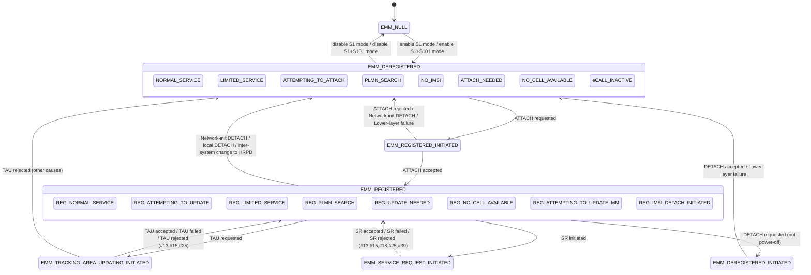
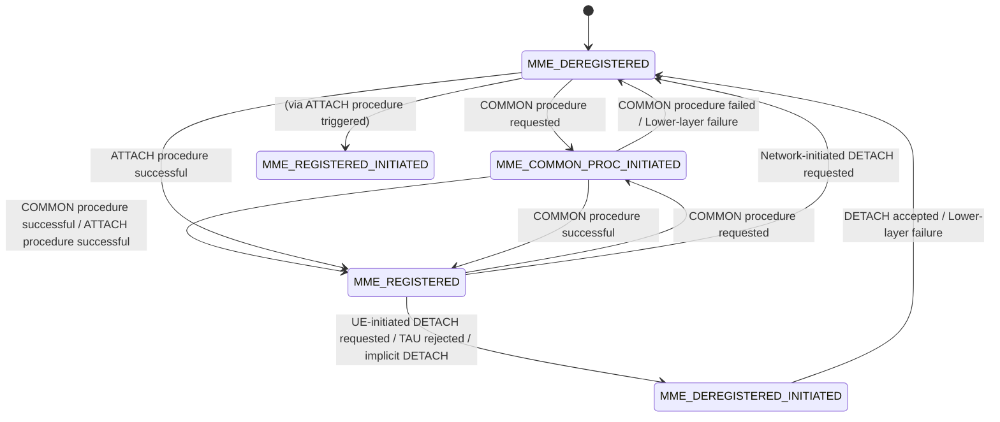

# NAS EMM Protocol — General, State Machines, and Common Procedures

Source: 3GPP TS 24.301 v17.6.0 §4–§5.4

---

## 1. NAS Protocol Architecture (§4.1–4.2)

The NAS protocol between UE and MME comprises two sublayers:

| Sublayer | Abbrev | Purpose |
|---|---|---|
| EPS Mobility Management | EMM | Attach/detach, TAU, service request, security, identity |
| EPS Session Management | ESM | Bearer activation/modification/deactivation, PDN connectivity |

**Interaction rules:**
- During EMM procedures (except Attach and Service Request), the MME **shall suspend** transmission of ESM messages.
- During Attach and Service Request, the MME **may** suspend ESM.
- During EMM procedures, the UE **shall suspend** ESM messages (except Attach and Service Request).
- A UE in EMM-IDLE can initiate Service Request and include ESM DATA TRANSPORT in a CONTROL PLANE SERVICE REQUEST (CIoT optimisation only).

---

## 2. UE Mode of Operation (§4.3)

A UE attached for EPS operates in one of four modes:

| Mode | Registration | Usage setting |
|---|---|---|
| PS mode 1 | EPS only | Voice centric |
| PS mode 2 | EPS only | Data centric |
| CS/PS mode 1 | EPS + non-EPS (CS) | Voice centric |
| CS/PS mode 2 | EPS + non-EPS (CS) | Data centric |

CS/PS modes use **combined attach/TAU** (EPS + IMSI registration in MSC/VLR simultaneously).

### Mode transitions

The UE transitions between modes based on:
1. **Usage setting change** (voice ↔ data centric) — tables 4.3.2.2.1 and 4.3.2.2.2
2. **Voice domain preference for E-UTRAN change** — tables 4.3.2.3.1 and 4.3.2.3.2
3. **IMS registration status change** — tables 4.3.2.4.1–4.3.2.4.3
4. **SMS configuration change** — tables 4.3.2.5.1 and 4.3.2.5.2

Key transitions (PS mode 1/2 → CS/PS mode 1/2): triggered when CS voice or SMS-over-IP fallback is needed and IMS is unavailable. Mechanism is a **combined TAU with IMSI attach**.

Key transitions (CS/PS mode → PS mode): triggered when IMS is registered and voice-domain-preference is "IMS PS voice only".

### "IMS voice not available" definition (§4.3.2)

The UE considers IMS voice unavailable if any of:
- The UE is not configured to use IMS.
- Voice domain preference for E-UTRAN indicates CS-only voice.
- Network indicated in ATTACH ACCEPT or TAU ACCEPT that IMS voice over PS is not supported.
- Network indicated support but upper layers show UE unavailable for IMS voice calls.

---

## 3. NAS Signalling Low Priority (§4.2A)

A UE configured for NAS signalling low priority sets the **Device properties IE** low-priority indicator to "MS is configured for NAS signalling low priority" unless:
- Performing emergency attach or PDN connection for emergency bearers
- UE is configured for dual priority and establishes a low-priority PDN connection
- Performing Service Request for CS fallback emergency call
- UE uses access class AC11–15

The NAS low-priority flag is used for NAS-level MM congestion control and APN-based congestion control. When present in PDN CONNECTIVITY REQUEST, the MME stores it in the EPS bearer context.

---

## 4. NAS Security (§4.4)

### 4.1 EPS Security Context

An **EPS security context** contains:
- K_ASME (key set agreed with HSS/AuC)
- NAS integrity and ciphering keys (K'_NASint, K'_NASenc) derived from K_ASME
- NAS algorithms selected: integrity (EIA0–3) and ciphering (EEA0–3)
- **eKSI** (key set identifier for E-UTRAN) — 3-bit value assigned by MME

Two types of EPS security contexts:
- **Native EPS security context**: created during EPS AKA (type = KSI_ASME)
- **Mapped EPS security context**: derived during inter-system handover from A/Gb or Iu to S1 (type = KSI_SGSN)

The UE and MME may simultaneously hold a **current** and a **non-current** EPS security context (to handle re-authentication or inter-system handover scenarios).

Context lifecycle rules:
- After successful re-authentication: new partial native context created; old non-current native context deleted.
- When partial native context taken into use by SMC: previously current context deleted.
- When entering EMM-DEREGISTERED (non-emergency): if current context is mapped and non-current full native exists, swap them.
- UE marks EPS security context on USIM as invalid when initiating Attach or leaving EMM-DEREGISTERED (except EMM-NULL).

### 4.2 NAS COUNT (§4.4.3)

Each EPS security context has two 24-bit NAS COUNT values:

```
NAS COUNT [23:0] = NAS overflow counter [23:8] || NAS sequence number [7:0]
```

When used as input to algorithms, NAS COUNT is padded to 32 bits (8 leading zero bits).

- **Uplink NAS COUNT** (UE maintains): incremented by UE for each sent security-protected NAS message.
- **Downlink NAS COUNT** (MME maintains): incremented by MME for each sent security-protected NAS message.
- Initial NAS messages may use only 5 of 8 SN bits — receiver estimates the 3 MSBs.
- After intersystem change A/Gb→S1 in idle mode: UE increments uplink NAS COUNT by 1.

**COUNT wrap-around** (§4.4.3.5): When COUNT nears 2²⁴, if EIA0 is NOT in use:
- If no non-current native context with low COUNT exists → MME initiates new AKA.
- Otherwise → MME can activate non-current native context via new SMC.
- If EIA0 IS in use: UE and MME allow wrap-around (no refresh needed).

### 4.3 Integrity Protection (§4.4.4)

Mandatory on all NAS messages once a valid security context exists and secure exchange established.

**Exceptions — messages accepted without integrity protection in UE:**

| Message | Condition |
|---|---|
| IDENTITY REQUEST | Requested parameter is IMSI |
| AUTHENTICATION REQUEST | — |
| AUTHENTICATION REJECT | — |
| ATTACH REJECT | EMM cause ≠ #25 |
| DETACH ACCEPT | Non-switch-off |
| TAU REJECT | EMM cause ≠ #25 |
| SERVICE REJECT | EMM cause ≠ #25 |

**Exceptions — messages accepted without integrity check in MME:**
ATTACH REQUEST, IDENTITY RESPONSE (IMSI), AUTHENTICATION RESPONSE, AUTHENTICATION FAILURE, SECURITY MODE REJECT, DETACH REQUEST, DETACH ACCEPT, TAU REQUEST.

All ESM messages are integrity protected. Exception: PDN CONNECTIVITY REQUEST piggybacked in ATTACH REQUEST when NAS security is not yet activated.

### 4.4 Ciphering (§4.4.5)

- **ATTACH REQUEST**: always sent unciphered.
- **TAU REQUEST**: always sent unciphered.
- **CONTROL PLANE SERVICE REQUEST** including ESM container or NAS message container: partially ciphered (only the container IE value is ciphered).
- All other messages: ciphered after SMC establishes ciphering.
- Null ciphering algorithm EEA0 is an operator option; when selected, all messages are "regarded as ciphered."

---

## 5. EMM Procedure Types (§5.1.2)

Three categories:

### 5.1 EMM Common Procedures (network-initiated only)
Can run at any time while a NAS signalling connection exists:
- GUTI reallocation
- Authentication
- Security mode control
- Identification
- EMM information

### 5.2 EMM Specific Procedures (at most one UE-initiated at a time)
- **Attach** / Combined attach
- **Detach** / Combined detach
- **TAU** (normal, periodic, combined) — S1 mode only
- eCall inactivity procedure

### 5.3 EMM Connection Management Procedures (S1 mode only)
- **Service request** — UE initiated; cannot run concurrently with a UE-initiated EMM specific procedure
- **Paging** — network initiated
- **Transport of NAS messages** (specific + generic)

---

## 6. EMM State Machine — UE (§5.1.3.2)

### 6.1 Main States



### 6.2 Substates of EMM-DEREGISTERED

| Substate | Entry condition |
|---|---|
| NORMAL-SERVICE | Suitable cell found; PLMN/TA not forbidden |
| LIMITED-SERVICE | Selected cell cannot provide normal service (forbidden PLMN, CSG mismatch) |
| ATTEMPTING-TO-ATTACH | Attach failed (no response or specific failure conditions §5.5.1.2.5/5.5.1.3.5/5.5.2.3.4) |
| PLMN-SEARCH | Searching for PLMNs |
| NO-IMSI | No valid subscriber data (no SIM/USIM or USIM invalid) |
| ATTACH-NEEDED | Valid subscriber data present; attach must happen ASAP (access class barred or NAS connection rejected) |
| NO-CELL-AVAILABLE | No E-UTRAN cell selectable (first intensive search failed) |
| eCALL-INACTIVE | UE in eCall-only mode; T3444 and T3445 expired; PLMN selected; no eCall or non-emergency call needed |

### 6.3 Substates of EMM-REGISTERED

| Substate | Entry condition |
|---|---|
| NORMAL-SERVICE | Primary substate when entering EMM-REGISTERED |
| ATTEMPTING-TO-UPDATE | TAU/Combined TAU failed (no response or specific failure §5.5.3.x) — no data allowed |
| LIMITED-SERVICE | Selected cell cannot provide normal service |
| PLMN-SEARCH | Searching for PLMNs (auto mode, max unsuccessful TAU reached) |
| UPDATE-NEEDED | TAU needed but current cell access class is barred / NAS connection rejected |
| NO-CELL-AVAILABLE | E-UTRAN coverage lost or PSM active |
| ATTEMPTING-TO-UPDATE-MM | Combined attach/TAU successful for EPS only (not non-EPS); data and signalling allowed |
| IMSI-DETACH-INITIATED | Combined detach for non-EPS only in progress; data and signalling allowed |

### 6.4 EPS Update Status

Stored on USIM (or NV memory):

| Value | Meaning | Set when |
|---|---|---|
| EU1: UPDATED | Last attach/TAU succeeded | — |
| EU2: NOT UPDATED | Last attach/service request/TAU failed procedurally (no response or reject) | — |
| EU3: ROAMING NOT ALLOWED | Last attempt completed but rejected (roaming/subscription restriction) | — |

---

## 7. EMM State Machine — MME (§5.1.3.4)



| MME State | Meaning |
|---|---|
| EMM-DEREGISTERED | No EMM context or context marked as detached |
| EMM-COMMON-PROCEDURE-INITIATED | Common EMM procedure started, awaiting UE response |
| EMM-REGISTERED | EMM context established; default EPS bearer active |
| EMM-DEREGISTERED-INITIATED | Detach started, awaiting UE DETACH ACCEPT |

---

## 8. EMM–GMM Coordination (§5.1.4)

When both GMM (GPRS mobility management, A/Gb/Iu) and EMM are enabled:
- UE maintains **one combined registration** covering both PS and non-PS services.
- Successful S1 attach → UE enters `GMM-REGISTERED.NO-CELL-AVAILABLE` + `EMM-REGISTERED.NORMAL-SERVICE`.
- Successful GPRS attach on A/Gb → UE enters `GMM-REGISTERED.NORMAL-SERVICE` + `EMM-REGISTERED.NO-CELL-AVAILABLE`.
- ISR (Idle-mode Signalling Reduction): if network activates ISR, UE maintains registration and periodic update timers in **both** GMM and EMM.

---

## 9. UE Behaviour in EMM-DEREGISTERED Substates (§5.2.2)

**Entry conditions** for EMM-DEREGISTERED:
- Detach performed (UE or MME initiated)
- Attach rejected by network
- TAU rejected
- Service request rejected by MME
- UE deactivates all EPS bearer contexts locally
- UE switched on
- Inter-system change to non-3GPP completing (non-3GPP provides PDN connectivity)
- Emergency UE in EMM-IDLE with periodic TAU timer expired

**Substate behaviour:**

| Substate | Action |
|---|---|
| NORMAL-SERVICE | Initiate attach (if T3346 not running); initiate emergency attach at any time |
| LIMITED-SERVICE | Initiate attach when cell providing normal service entered; may initiate emergency attach |
| ATTEMPTING-TO-ATTACH | Initiate attach on T3411/T3402/T3346 expiry; react to new PLMN selection |
| PLMN-SEARCH | Perform PLMN selection; reset attach attempt counter on new PLMN |
| ATTACH-NEEDED | Initiate attach as soon as access class allowed in selected cell |
| NO-CELL-AVAILABLE | Perform cell selection; choose appropriate substate when cell found |
| eCALL-INACTIVE | No signalling; may only originate eCall or non-emergency MSISDN call to HPLMN |

---

## 10. UE Behaviour in EMM-REGISTERED Substates (§5.2.3)

**Entry condition**: attach or combined attach successfully completed.

| Substate | Action |
|---|---|
| NORMAL-SERVICE | Initiate TAU per §5.5.3 conditions; respond to paging; periodic TAU |
| ATTEMPTING-TO-UPDATE | No user data; initiate TAU on T3411/T3402/T3346 expiry; limited MMTEL capability |
| LIMITED-SERVICE | Cell selection/reselection; may respond to paging (IMSI); local detach for emergency |
| PLMN-SEARCH | PLMN selection; reset TAU attempt counter on new PLMN |
| UPDATE-NEEDED | No user data; TAU, combined TAU, or service request (paging response) only |
| NO-CELL-AVAILABLE | Cell selection/reselection only (unless PSM active) |
| ATTEMPTING-TO-UPDATE-MM | Full data; combined TAU on T3411/T3402 expiry or new TA |
| IMSI-DETACH-INITIATED | Full data; combined TAU per §5.5.3.3 or §5.5.2.2.4 |

---

## 11. NAS Signalling Connection (§5.3.1)

When in EMM-IDLE (no RRC connection) and a NAS message must be sent, the UE requests RRC connection establishment, providing:
- RRC establishment cause (per Annex D of TS 24.301)
- Call type
- Initial NAS message (for CP-CIoT only)

**Initial NAS messages** (trigger RRC establishment):
- ATTACH REQUEST
- DETACH REQUEST
- TAU REQUEST
- SERVICE REQUEST
- EXTENDED SERVICE REQUEST
- CONTROL PLANE SERVICE REQUEST (CIoT)

---

## 12. Elementary EMM Procedures (§5.3)

### 12.1 NAS Connection Release (§5.3.1.2)

Timer **T3440** governs UE-side NAS connection release. On T3440 expiry, the UE locally releases the NAS connection (or initiates attach). 11 trigger cases include: lower layer connection failure, service reject, attach reject, detach, TAU reject without re-attach-required, S1 release, etc.

For CIoT UP optimization, the UE may:
- **Suspend**: enter EMM-IDLE with a suspend indication to lower layers
- **Resume**: request lower layers to resume RRC connection

### 12.2 Forbidden Tracking Area Management (§5.3.1.3)

Two forbidden TA lists are maintained at the UE:
- **"Forbidden TAs for roaming"**: cause #13 / TAU/Attach REJECT
- **"Forbidden TAs for regional provision of service"**: cause #12 / TAU/Attach REJECT

Each list must be able to store at least 40 TAIs. Stored TAs remain valid until:
- New PLMN selected
- TAI list received in ATTACH ACCEPT / TAU ACCEPT (which may implicitly clear entries)
- USIM removed / power-off

### 12.3 Periodic TAU Timer (T3412) Management (§5.3.5)

T3412 value is received in ATTACH ACCEPT or TAU ACCEPT. If the T3412 extended value IE is present, it takes precedence over the T3412 value IE.

| Event | T3412 Behaviour |
|---|---|
| UE enters EMM-IDLE | T3412 reset and started |
| UE enters EMM-CONNECTED | T3412 stopped |
| UE enters EMM-IDLE again | T3412 restarted |
| T3412 expires (in NORMAL-SERVICE) | Trigger periodic TAU |

Mobile Reachability Timer at MME ≈ T3412 + 4 minutes (to allow for delay in TAU initiation).

ISR: UE maintains both T3412 (EPS) and T3312 (GERAN/UTRAN routing area timer) when ISR is active.

### 12.4 Backoff and Congestion Timers (§5.3.3, §5.3.4)

**T3402** (attach/TAU backoff):
- Started when attach attempt counter reaches 5 (if T3346 not running)
- Network may provide a specific value in ATTACH REJECT; otherwise UE uses default
- On expiry in ATTEMPTING-TO-ATTACH: initiate attach

**T3346** (MM congestion control):
- Started on ATTACH REJECT / TAU REJECT / SERVICE REJECT with cause #22 (congestion)
- If reject is integrity-protected: use timer value from reject message; else: use random value from default range
- While running, UE shall NOT initiate attach/TAU/Service Request **unless**:
  - UE configured to use AC11–15 in selected PLMN
  - Emergency bearer services needed
  - UE detaching
  - Paging-triggered request
  - Exception data (NB-S1)
  - Message not carrying low-priority indicator (certain exemptions)

**T3448** (CP data congestion, NB-IoT):
- Used for CIoT control-plane data transport congestion
- Started when T3448 value IE present in ATTACH ACCEPT / TAU ACCEPT

### 12.5 Power Saving Mode (PSM) (§5.3.9)

Timer **T3324** (Active Timer) governs PSM:
- UE requests PSM by including T3324 value in ATTACH REQUEST / TAU REQUEST
- Network responds with T3324 value in ATTACH ACCEPT / TAU ACCEPT (may adjust from requested value)
- When T3324 expires in EMM-IDLE.NORMAL-SERVICE: UE deactivates AS layer (enters PSM)
- In PSM: most NAS timers stopped; UE unreachable for paging
- UE exits PSM to initiate service (data, signalling)

### 12.6 Extended DRX (eDRX) (§5.3.10)

- UE requests eDRX by including Extended DRX Parameters IE in ATTACH REQUEST / TAU REQUEST
- Network negotiates eDRX in ATTACH ACCEPT / TAU ACCEPT (may include different cycle length)
- While eDRX active: UE only monitors paging channel during negotiated paging time window

### 12.7 Service Gap Control (T3447) (§5.3.17)

Limits frequency of UE transitions from EMM-IDLE to EMM-CONNECTED:
- T3447 value included in ATTACH ACCEPT / TAU ACCEPT (if UE indicated support)
- While T3447 running: UE shall not start attach/TAU/Service Request (exceptions: AC11–15, emergency, paging, IMSI offset)

---

## 13. EMM Common Procedures (§5.4)

### 13.1 GUTI Reallocation (§5.4.1)

```mermaid
sequenceDiagram
    participant MME
    participant UE
    MME->>UE: GUTI REALLOCATION COMMAND [start T3450]
    Note over MME: includes new GUTI + TAI list
    UE->>MME: GUTI REALLOCATION COMPLETE [stop T3450]
    Note over UE: store new GUTI + TAI list; old GUTI valid until COMPLETE sent
```

- T3450 supervision: max 5 retransmissions; on 5th expiry → abort
- UE enters EMM-COMMON-PROCEDURE-INITIATED while reallocation pending
- **Collision rules:** TAU or ATTACH in progress → abort reallocation; EXTENDED SERVICE REQUEST (CS fallback) → progress both

### 13.2 Authentication (EPS AKA) (§5.4.2)

```mermaid
sequenceDiagram
    participant MME
    participant UE
    MME->>UE: AUTHENTICATION REQUEST [start T3460, contains RAND + AUTN + eKSI]
    Note over UE: compute RES; verify AUTN; store RAND+RES (T3416)
    UE->>MME: AUTHENTICATION RESPONSE [RES]
    Note over MME: stop T3460
```

**Authentication failure types:**

| Cause | Failure message | UE Timer | MME Action |
|---|---|---|---|
| MAC failure (#20) | AUTHENTICATION FAILURE [cause #20] | Start T3418 | MME may initiate identification to request IMSI |
| Synch failure (#21) | AUTHENTICATION FAILURE [cause #21 + AUTS] | Start T3420 | MME re-syncs with HSS using AUTS; re-runs AKA |
| Non-EPS auth unacceptable (#26) | AUTHENTICATION FAILURE [cause #26] | Start T3418 | — |

**AUTHENTICATION REJECT (network → UE):**
- UE: set EU3, delete GUTI/TAI list/eKSI, mark USIM invalid for EPS + non-EPS → EMM-DEREGISTERED.NO-IMSI

T3460 retransmission: max 5 times before aborting authentication.

T3416: Stores RAND + computed RES for resynchronization detection. Running while waiting for AUTH REQUEST retransmit.

### 13.3 Security Mode Control (§5.4.3)

```mermaid
sequenceDiagram
    participant MME
    participant UE
    MME->>UE: SECURITY MODE COMMAND [start T3460; unciphered, integrity-protected]
    Note over UE: validate replayed UE security capabilities; validate nonce_UE (mapped context)
    Note over UE: if accepted: reset uplink NAS COUNT (new native context from AKA)
    UE->>MME: SECURITY MODE COMPLETE [integrity-protected + ciphered with NEW context]
    Note over MME: stop T3460
```

Key rules:
- SECURITY MODE COMMAND is sent **unciphered + integrity-protected** using the existing security context
- MME **resets downlink NAS COUNT** before sending SECURITY MODE COMMAND
- UE **resets uplink NAS COUNT** before sending SECURITY MODE COMPLETE (for new native EPS security context derived from AKA)
- SECURITY MODE COMPLETE is **ciphered and integrity-protected** using the **new** security context
- HASH_MME may be included to allow UE to verify integrity of the ATTACH REQUEST or TAU REQUEST that triggered the SMC
- SECURITY MODE REJECT causes:
  - #23: UE security capabilities mismatch
  - #24: Unspecified

T3460 retransmission: max 5 times before aborting.

**Mapped EPS security context** (inter-system from UTRAN/GERAN):
- UE validates replayed security capabilities and nonce_UE in SECURITY MODE COMMAND
- SECURITY MODE COMPLETE sent with KSI_ASME from mapped context; uplink COUNT not reset

### 13.4 Identification (§5.4.4)

```mermaid
sequenceDiagram
    participant MME
    participant UE
    MME->>UE: IDENTITY REQUEST [T3470 starts; type: IMSI or IMEI]
    UE->>MME: IDENTITY RESPONSE [stop T3470]
```

- UE always responds when in EMM-CONNECTED state
- If USIM unavailable → respond with "no identity available"
- T3470 retransmission: max 5 times before aborting

**Typical trigger:** ATTACH REQUEST carried GUTI from another MME (cannot be resolved); or emergency attach with no IMSI; or post-SRVCC inter-system change to verify IMEI.

### 13.5 EMM Information (§5.4.5)

- Network→UE only; no response required
- Optional message; UE may display/use network name/UTC offset/daylight saving time
- If UE does not support, returns EMM STATUS with cause #97 (message type not implemented)

---

## Cross-references

- [EMM/ECM states](../concepts/EMM-ECM-states.md) — overview-level EMM/ECM state model
- [NAS Attach (stage-3)](../procedures/NAS-attach.md) — stage-3 attach procedure (initiation, accept, reject, abnormal cases)
- [NAS Detach (stage-3)](../procedures/NAS-detach.md) — stage-3 detach procedure (UE-initiated and network-initiated)
- [NAS TAU (stage-3)](../procedures/NAS-TAU.md) — stage-3 TAU procedure (normal, periodic, combined)
- [EPS Attach procedure](../procedures/EPS-attach.md) — stage-2 attach flow (TS 23.401)
- [TAU procedure](../procedures/TAU.md) — stage-2 TAU flow (TS 23.401)
- [Service Request](../procedures/service-request.md) — EMM-IDLE to CONNECTED
- [EMM/ECM States](../concepts/EMM-ECM-states.md) — state overview
- [MME entity](../entities/MME.md) — NAS endpoint at core network
