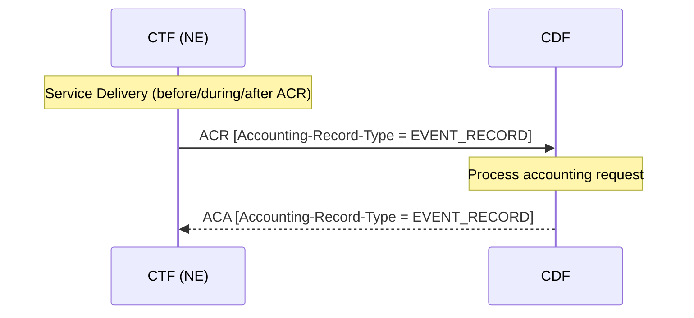
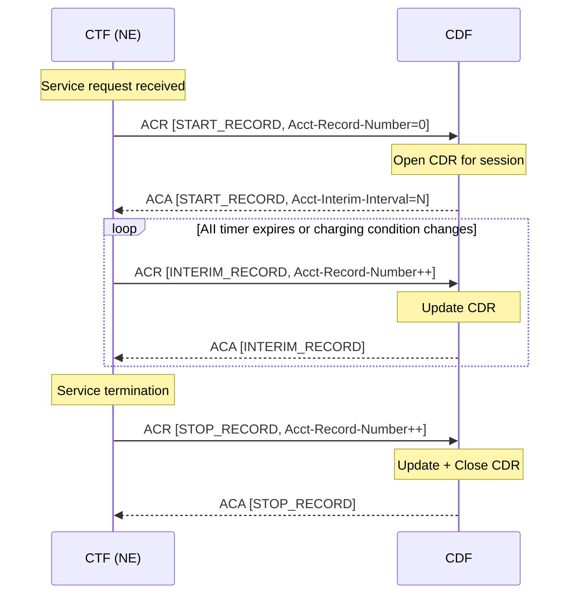
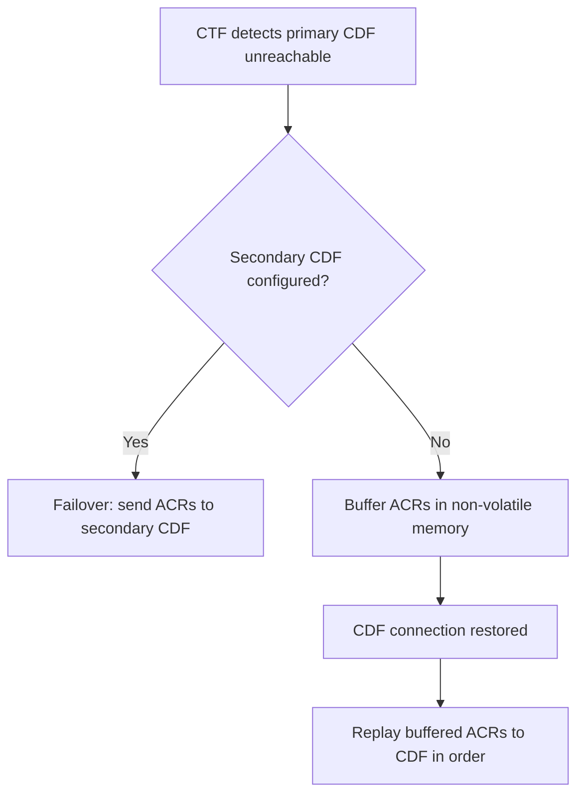
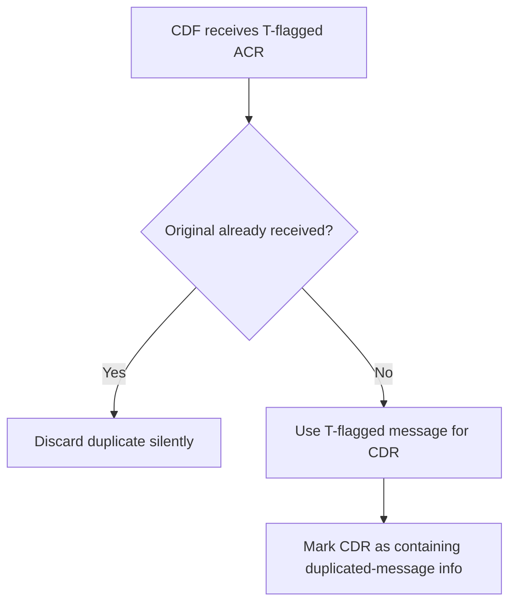

# Rf Interface — Diameter Offline Charging

Source: 3GPP TS 32.299 v16.2.0, §6.1–§6.2

---

## 1. Overview

The **Rf reference point** carries offline charging data from the [CTF](../concepts/charging-architecture.md) (Charging Trigger Function, i.e. the NE) to the [CDF](../concepts/charging-architecture.md) (Charging Data Function). It is based on the **Diameter Base Protocol Accounting Application** (RFC 6733).

| Role | Diameter Role | Function |
|---|---|---|
| CTF (Network Element) | Client | Sends ACR messages; implements RFC 6733 CLIENT accounting state machine |
| CDF | Server | Receives ACR; constructs CDRs; implements RFC 6733 SERVER STATELESS ACCOUNTING |

**Key property:** The CDF uses SERVER STATELESS ACCOUNTING — it places no requirement on the order in which ACRs arrive. This means ACR[INTERIM] can arrive before ACR[START] without causing an error; the CDF handles sequencing internally.

**Command code:** 271 (shared by ACR and ACA)

---

## 2. Charging Flows

### 2.1 Event-Based Offline Charging

Used for discrete one-shot events (SMS, MMS, registration, etc.). A single ACR[EVENT_RECORD] is sent after service delivery.



### 2.2 Session-Based Offline Charging

Used for ongoing sessions (data bearers, IMS calls, etc.). Uses START/INTERIM/STOP sequence.



**Acct-Interim-Interval (AII):** The CDF sets this in the ACA[START_RECORD] to instruct the CTF on the desired interval between INTERIM records. If AII is non-zero, the CTF sends periodic INTERIM records even if no charging condition changes.

---

## 3. ACR Message Format (§6.2.2)

Command-Code: **271**, Flags: REQ, PXY

```
<ACR> ::= < Diameter Header: 271, REQ, PXY >
          < Session-Id >
          { Origin-Host }
          { Origin-Realm }
          { Destination-Realm }
          { Accounting-Record-Type }
          { Accounting-Record-Number }
          [ Acct-Application-Id ]
          [ User-Name ]
          [ Destination-Host ]
          [ Acct-Interim-Interval ]
          [ Origin-State-Id ]
          [ Event-Timestamp ]
        * [ Proxy-Info ]
        * [ Route-Record ]
          [ Service-Context-Id ]
          [ Service-Information ]
        * [ AVP ]
```

> AVPs with strikethrough in the spec (Vendor-Specific-Application-Id, Accounting-Sub-Session-Id, Acct-Session-Id, Acct-Multi-Session-Id, Accounting-Realtime-Required) are **not used in 3GPP**.

### ACR AVP Table (Table 6.2.2.1)

| AVP | Category | Description |
|---|---|---|
| Session-Id | M | Identifies the accounting session (Diameter session) |
| Origin-Host | M | Source NE FQDN + realm |
| Origin-Realm | M | Realm of the NE |
| Destination-Realm | M | CDF realm (operator domain's public URI domain) |
| Accounting-Record-Type | M | EVENT_RECORD / START_RECORD / INTERIM_RECORD / STOP_RECORD |
| Accounting-Record-Number | M | Monotonically increasing sequence number per session |
| Acct-Application-Id | Om | Diameter Accounting Application ID = **3** |
| User-Name | Oc | User identity (bearer/subsystem/service per middle-tier TS) |
| Destination-Host | Oc | Specific CDF host address (optional) |
| Acct-Interim-Interval | Oc | Proposed interval for INTERIM records (CTF proposal to CDF) |
| Origin-State-Id | Oc | CTF state identifier |
| Event-Timestamp | Oc | Exact time accounting is requested |
| Proxy-Info | Oc | Proxy host + state (if message traverses proxy) |
| Route-Record | Oc | Relaying/proxying node identifier |
| Service-Context-Id | Om | Identifies service and corresponding middle-tier TS |
| Service-Information | Om | Per-service charging data (defined in middle-tier TS, e.g. IMS-Information for TS 32.260) |
| AVP | Oc | Extended / vendor-specific information |

---

## 4. ACA Message Format (§6.2.3)

Command-Code: **271**, Flags: PXY (no REQ flag)

```
<ACA> ::= < Diameter Header: 271, PXY >
          < Session-Id >
          { Result-Code }
          [ Experimental-Result ]
          { Origin-Host }
          { Origin-Realm }
          { Accounting-Record-Type }
          { Accounting-Record-Number }
          [ Acct-Application-Id ]
          [ User-Name ]
          [ Error-Message ]
          [ Error-Reporting-Host ]
          [ Acct-Interim-Interval ]
          [ Failed-AVP ]
          [ Origin-State-Id ]
          [ Event-Timestamp ]
        * [ Proxy-Info ]
        * [ AVP ]
```

### ACA AVP Table (Table 6.2.3.1)

| AVP | Category | Description |
|---|---|---|
| Session-Id | M | Identifies the accounting session |
| Result-Code | M | 2001 (SUCCESS) or error code |
| Experimental-Result | Oc | Vendor-specific result code |
| Origin-Host | M | CDF FQDN + realm |
| Origin-Realm | M | CDF realm |
| Accounting-Record-Type | M | Echoes the ACR record type |
| Accounting-Record-Number | M | Echoes the ACR sequence number |
| Acct-Application-Id | Om | = 3 |
| User-Name | Oc | Echoed from ACR |
| Error-Message | Oc | Human-readable error description |
| Error-Reporting-Host | Oc | Host that generated the non-2001 Result-Code (if different from Origin-Host, i.e. a proxy reported the error) |
| Acct-Interim-Interval | Oc | CDF-dictated interval for INTERIM records during session |
| Failed-AVP | Oc | AVP that could not be processed (once only) |
| Origin-State-Id | Oc | CDF state |
| Event-Timestamp | Oc | Time of operation |
| Proxy-Info | Oc | Proxy host + state |
| AVP | Oc | Extended information |

---

## 5. Additional Diameter Messages

Per RFC 6733, the following are also used on Rf (but not detailed in TS 32.299):

| Message | Abbreviation | Purpose |
|---|---|---|
| Capabilities-Exchange-Request/Answer | CER/CEA | Diameter peer capability negotiation (CTF→CDF / CDF→CTF) |
| Device-Watchdog-Request/Answer | DWR/DWA | Keep-alive between CTF and CDF |
| Disconnect-Peer-Request/Answer | DPR/DPA | Graceful Diameter connection teardown |

---

## 6. Error Handling (§6.1.3)

### 6.1 CDF Connection Failure



- CTF has a priority-ordered list of CDF addresses (configured by operator)
- Buffering is in **non-volatile memory** to survive NE restart
- On CDF reconnect, all buffered messages are replayed **in order**

### 6.2 No Reply from CDF (ACR Retransmission)

- CTF may retransmit unacknowledged ACRs
- Retry timer and maximum retransmission count are **operator-configurable**
- After max retransmissions without ACA: CTF executes **CDF connection failure** procedure (failover/buffer)
- All retransmitted ACRs **MUST** set the **T-flag** in the Diameter header (RFC 6733 §3.12)

### 6.3 Duplicate Detection at CDF



- T-flag = retransmission indicator
- If original ACR was already processed: discard the duplicate
- If original never arrived: use the retransmitted copy as the source of truth, but **mark the CDR** to indicate the data originated from a retransmission

### 6.4 CDF-Detected Session Failure (Timer Expiry)

- CDF maintains a **configurable supervision timer** per accounting session
- Timer starts at ACR[START], resets on ACR[INTERIM], stops on ACR[STOP]
- If timer expires (no ACR received within timeout): CDF **closes the CDR** with an appropriate error indication
- Exact behavior is operator-configurable

---

## 7. CDF State Machine Summary

The CDF implements **SERVER STATELESS ACCOUNTING** (RFC 6733): no ordering constraint on received ACRs. Key implications:

| Behaviour | Detail |
|---|---|
| Session lifecycle | Tracked by Session-Id + Accounting-Record-Number |
| CDR open | On first ACR[START] for a Session-Id |
| CDR update | On each ACR[INTERIM] |
| CDR close | On ACR[STOP] or supervision timer expiry |
| Duplicate handling | T-flag detection (see §6.3 above) |
| AII instruction | CDF sets Acct-Interim-Interval in ACA[START] to control interim frequency |

---

## 8. Relationship to Middle-Tier Specs

TS 32.299 defines the **bottom-tier** protocol. Service-specific charging data is carried in the `Service-Information` AVP, defined by per-domain middle-tier specs:

| Domain | Middle-tier TS | Service-Information content |
|---|---|---|
| PS (EPS bearer) | TS 32.251 | PS-Information (APN, QoS, volume, SGSN/PGW addresses) |
| IMS | TS 32.260 | IMS-Information (SIP method, called party, media components) |
| SMS | TS 32.274 | SMS-Information |
| MMS | TS 32.270 | MMS-Information |
| PoC | TS 32.272 | PoC-Information |

The `Service-Context-Id` AVP identifies which middle-tier TS applies.

---

## Related Pages

- [concepts/charging-architecture.md](../concepts/charging-architecture.md) — CTF/CDF/OCF architecture and offline vs. online comparison
- [protocols/Ro-online-charging.md](Ro-online-charging.md) — Online charging counterpart (CCR/CCA)
- [entities/PGW.md](../entities/PGW.md) — PGW as CTF for EPS bearer charging (Rf)
- [entities/P-CSCF.md](../entities/P-CSCF.md) — P-CSCF as CTF for IMS charging (Rf)
- [entities/S-CSCF.md](../entities/S-CSCF.md) — S-CSCF as CTF for IMS charging (Rf)
