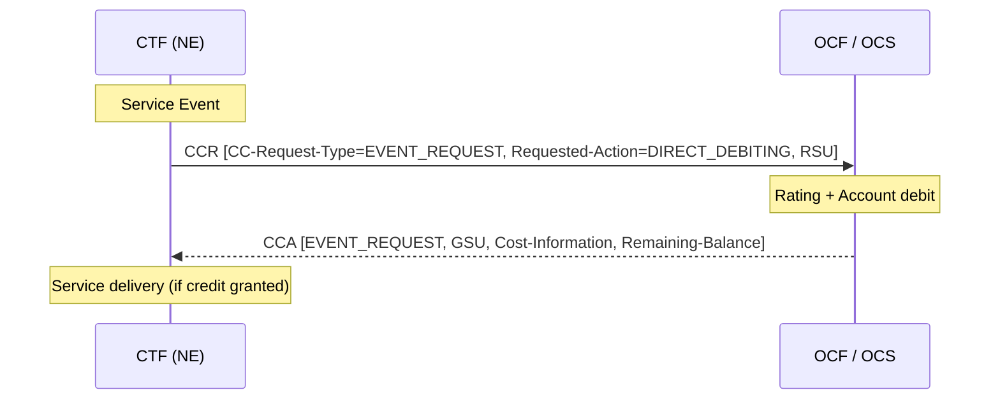
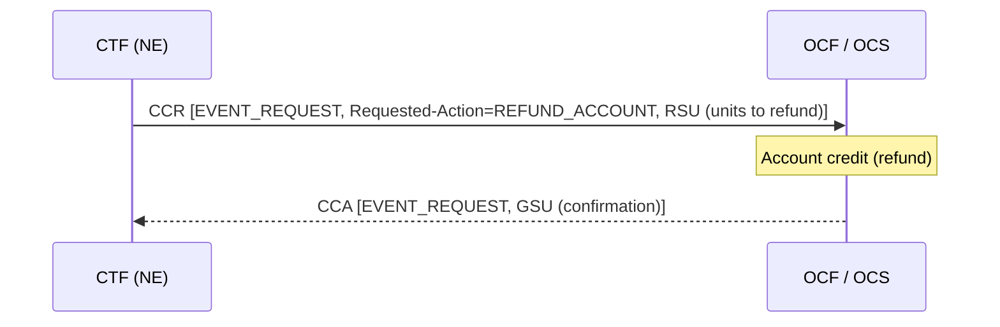
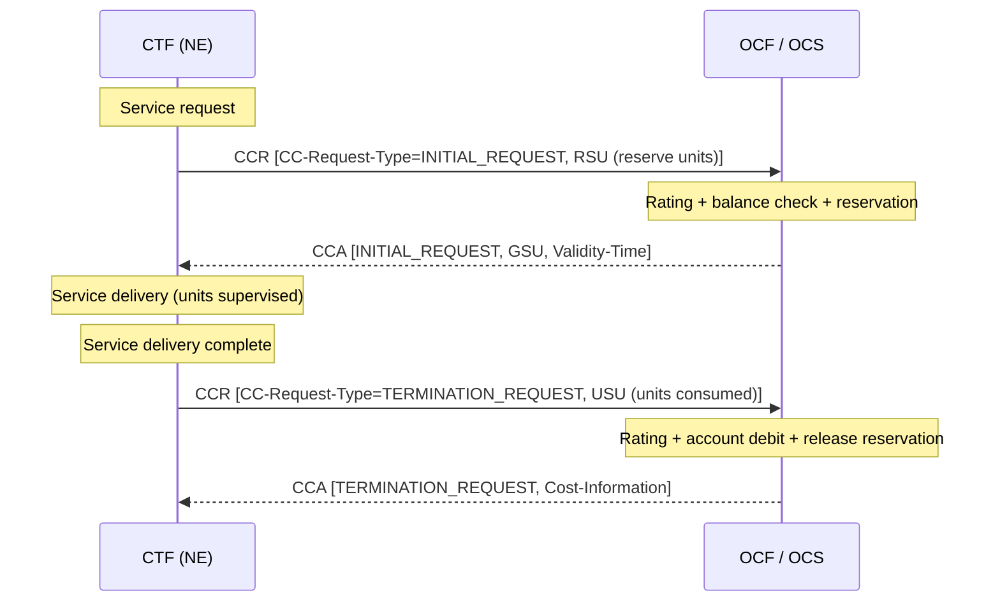
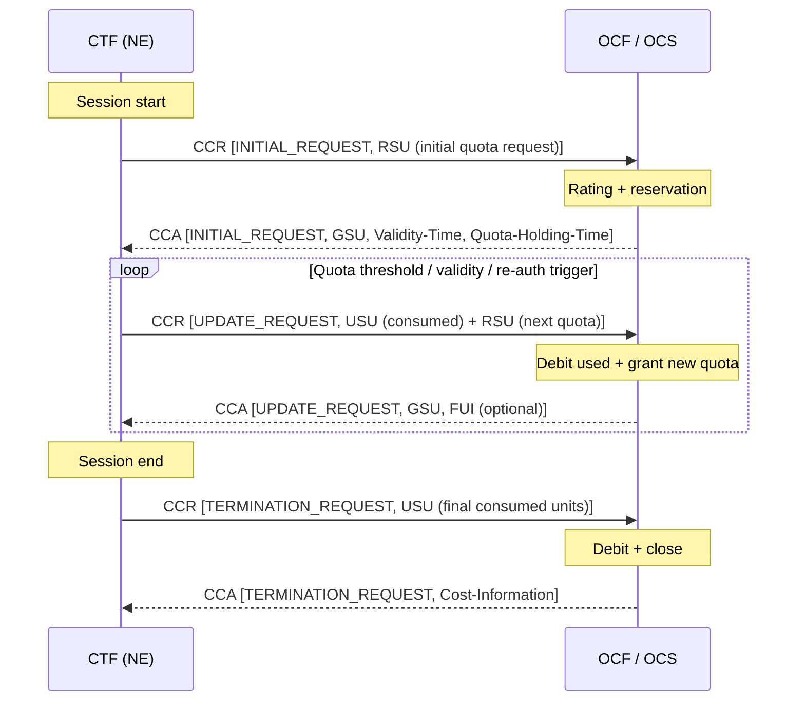
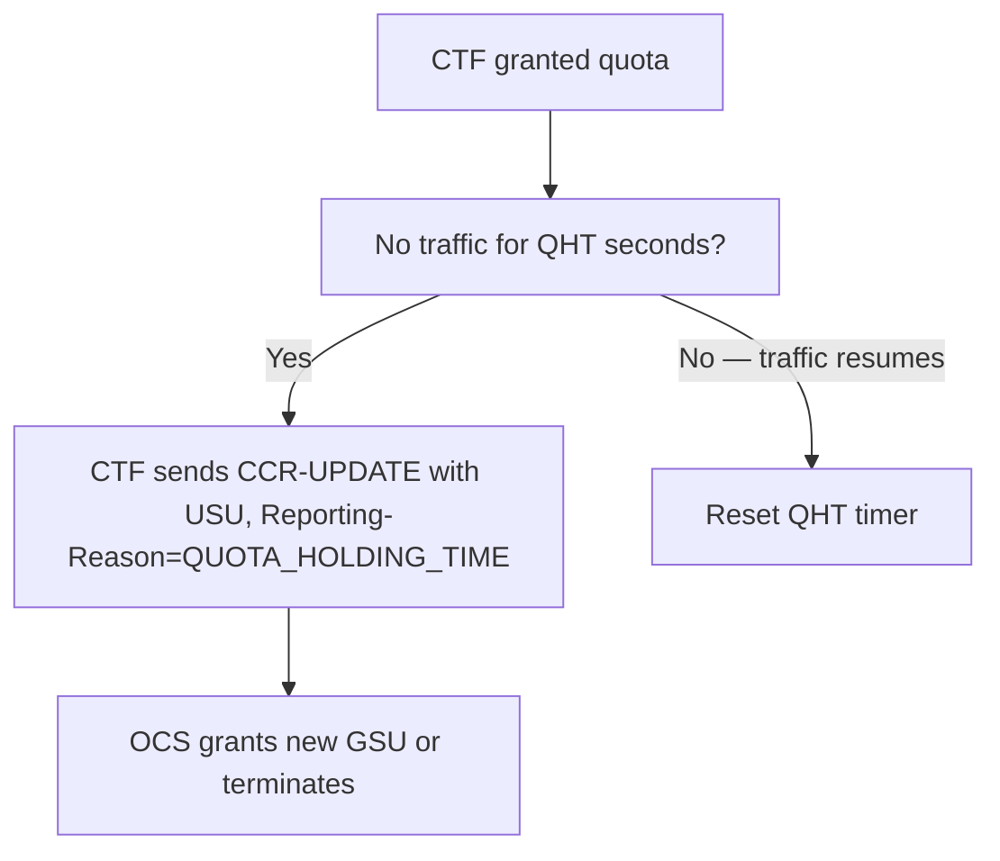
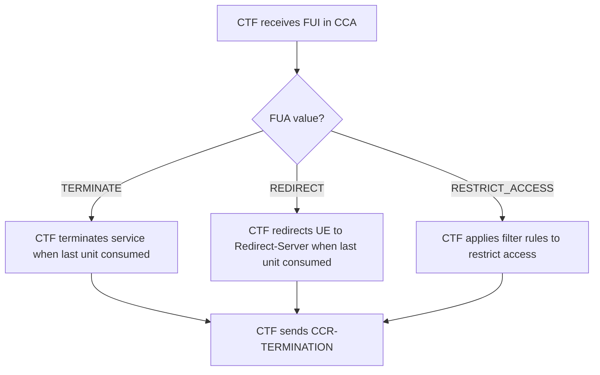
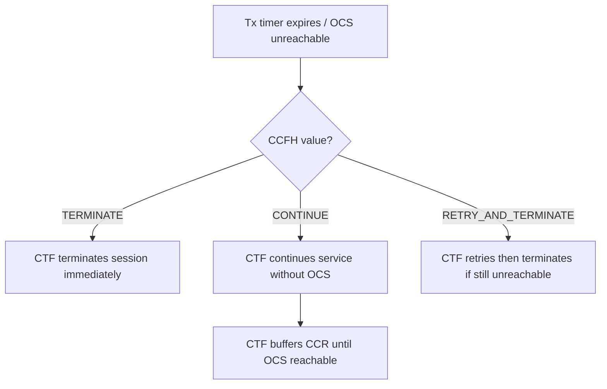
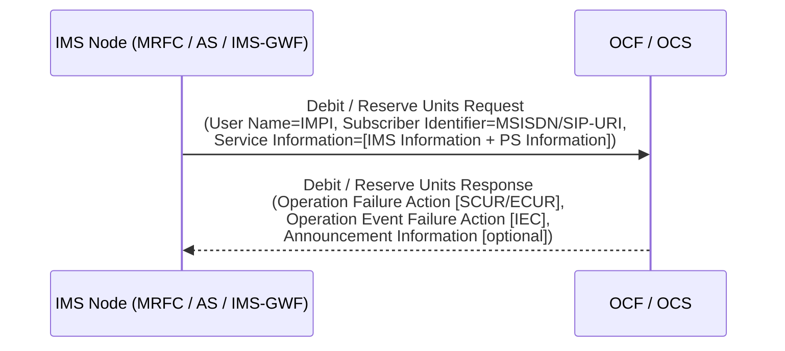

# Ro Interface — Diameter Online Charging

Source: 3GPP TS 32.299 v16.2.0, §6.3–§6.5

---

## 1. Overview

The **Ro reference point** carries online (real-time) charging data from the [CTF](../concepts/charging-architecture.md) (Charging Trigger Function) to the [OCF](../concepts/charging-architecture.md) (Online Charging Function / OCS). It is based on **RFC 4006 Diameter Credit-Control Application (DCCA)**.

| Role | Diameter Role | Function |
|---|---|---|
| CTF (Network Element) | Credit-Control Client | Sends CCR; requests/debits quota; enforces credit-control decisions |
| OCF / OCS | Credit-Control Server | Grants quota (GSU), performs rating, manages account balance |

**Command code:** 272 (shared by CCR and CCA)  
**Auth-Application-Id:** 4 (Diameter Credit-Control)

Unlike offline charging, the OCF **controls service delivery** — if credit is insufficient or the OCF is unreachable, service may be terminated or redirected.

---

## 2. Charging Flows

### 2.1 IEC — Immediate Event Charging (§6.3.2)

A single request-response pair. No reservation. Debit happens at request time (before, during, or after service depending on configuration).



**IEC Refund variant** — return units to account:



### 2.2 ECUR — Event Charging with Unit Reservation (§6.3.3)

Reserve before service delivery, debit after.



### 2.3 SCUR — Session Charging with Unit Reservation (§6.3.4)

Ongoing session with maintenance of reservation. Multiple UPDATE cycles are possible. Debit and reserve are **combined in a single UPDATE CCR**.



**Key SCUR properties:**
- Debit + Reserve combined in one CCR[UPDATE] — single round-trip
- CTF returns unused reserved units in the TERMINATION CCR via USU
- `Final-Unit-Indication` (FUI) in CCA signals the last granted quota (CTF must act on last-unit expiry)

---

## 3. CCR Message Format (§6.4.2)

Command-Code: **272**, Flags: REQ, PXY

```
<CCR> ::= < Diameter Header: 272, REQ, PXY >
          < Session-Id >
          { Origin-Host }
          { Origin-Realm }
          { Destination-Realm }
          { Auth-Application-Id }          ; = 4
          { Service-Context-Id }
          { CC-Request-Type }
          { CC-Request-Number }
          [ Destination-Host ]
          [ User-Name ]
          [ CC-Sub-Session-Id ]
          [ Acct-Multi-Session-Id ]
          [ Origin-State-Id ]
          [ Event-Timestamp ]
        * [ Subscription-Id ]
          [ Service-Identifier ]
          [ Termination-Cause ]
          [ Requested-Service-Unit ]
          [ Requested-Action ]
        * [ Used-Service-Unit ]
          [ Multiple-Services-Indicator ]
        * [ Multiple-Services-Credit-Control ]
        * [ Service-Parameter-Info ]
          [ CC-Correlation-Id ]
          [ User-Equipment-Info ]
        * [ Proxy-Info ]
        * [ Route-Record ]
          [ OC-Supported-Features ]
          [ QoS-Information ]
          [ Service-Information ]          ; per-service data (middle-tier TS)
        * [ AVP ]
```

### CCR AVP Table (Table 6.4.2.1 — key AVPs)

| AVP | Category | Description |
|---|---|---|
| Session-Id | M | Unique Diameter session; same value across all CCRs for one charging session |
| Origin-Host | M | CTF (NE) FQDN |
| Origin-Realm | M | CTF realm |
| Destination-Realm | M | OCF/OCS realm |
| Auth-Application-Id | M | = 4 (Diameter Credit-Control Application) |
| Service-Context-Id | M | Identifies service + middle-tier TS (e.g. `32.251@3gpp.org`) |
| CC-Request-Type | M | INITIAL_REQUEST (1) / UPDATE_REQUEST (2) / TERMINATION_REQUEST (3) / EVENT_REQUEST (4) |
| CC-Request-Number | M | Monotonically increasing counter per CCR within a session |
| Subscription-Id | Om | Subscriber identity — contains Subscription-Id-Type (IMSI=1, MSISDN=0) + Subscription-Id-Data |
| Multiple-Services-Indicator | Om | MSI=MULTIPLE_SERVICES_SUPPORTED → MSCC containers used |
| Multiple-Services-Credit-Control | Oc | Per-service-unit quota container (see MSCC detail below) |
| Requested-Service-Unit | Oc | RSU — quota requested from OCF (CC-Time, CC-Total-Octets, CC-Input/Output-Octets, CC-Service-Specific-Units) |
| Used-Service-Unit | Oc | USU — quota consumed since last CCR (same sub-AVPs as RSU) |
| Requested-Action | Oc | DIRECT_DEBITING (0) / REFUND_ACCOUNT (1) / CHECK_BALANCE (2) / PRICE_ENQUIRY (3) — IEC only |
| Termination-Cause | Oc | Why session/event ended (DIAMETER_LOGOUT, DIAMETER_SERVICE_NOT_PROVIDED, etc.) |
| User-Equipment-Info | Oc | UE identity (IMEI-SV) |
| CC-Correlation-Id | Oc | Correlate CCRs across multiple services |
| QoS-Information | Oc | Bearer QoS parameters |
| Service-Information | Om | Per-service charging data (IMS-Information for TS 32.260, PS-Information for TS 32.251) |
| OC-Supported-Features | Oc | DOIC overload indication support |

#### MSCC (Multiple-Services-Credit-Control) Container

The MSCC grouped AVP carries quota control per Rating-Group or Service-Identifier:

| Sub-AVP | Description |
|---|---|
| Granted-Service-Unit (GSU) | Quota granted by OCS (in CCR direction: not present; in CCA: present) |
| Requested-Service-Unit (RSU) | Units requested for this service (in CCR) |
| Used-Service-Unit (USU) | Units consumed (in CCR UPDATE/TERMINATION) |
| Service-Identifier | Identifies a specific service within the session |
| Rating-Group | Groups services for unified rating/quota |
| G-S-U-Pool-Reference | Links to shared quota pool |
| Validity-Time | Quota validity period (seconds); CTF must re-request on expiry |
| Result-Code | Per-MSCC result (e.g. 4012 = Credit-Limit-Reached) |
| Final-Unit-Indication (FUI) | Signals last quota granted; contains Final-Unit-Action and optionally Filter-Id/Redirect-Server |
| Quota-Holding-Time (QHT) | Idle timeout — if no traffic for QHT seconds, CTF shall close credit-control |
| Quota-Consumption-Time (QCT) | Volume quota consumes time (combinational CTP mode) |
| Reporting-Reason | Why USU is being reported (THRESHOLD, VALIDITY_TIME, FINAL, QUOTA_EXHAUSTED, etc.) |
| Trigger | List of Trigger-Type events that cause re-auth |
| Time-Quota-Threshold | Re-auth threshold for time quota |
| Volume-Quota-Threshold | Re-auth threshold for volume quota |
| Unit-Quota-Threshold | Re-auth threshold for service-specific-unit quota |

---

## 4. CCA Message Format (§6.4.3)

Command-Code: **272**, Flags: PXY (no REQ flag)

```
<CCA> ::= < Diameter Header: 272, PXY >
          < Session-Id >
          { Result-Code }
          [ Experimental-Result ]
          { Origin-Host }
          { Origin-Realm }
          { Auth-Application-Id }          ; = 4
          { CC-Request-Type }
          { CC-Request-Number }
          [ User-Name ]
          [ CC-Session-Failover ]
          [ CC-Sub-Session-Id ]
          [ Acct-Multi-Session-Id ]
          [ Origin-State-Id ]
          [ Event-Timestamp ]
          [ Granted-Service-Unit ]
          [ Requested-Service-Unit ]
        * [ Used-Service-Unit ]
          [ Multiple-Services-Indicator ]
        * [ Multiple-Services-Credit-Control ]
        * [ Cost-Information ]
          [ Final-Unit-Indication ]
          [ Credit-Control-Failure-Handling ]
          [ Direct-Debiting-Failure-Handling ]
          [ Validity-Time ]
          [ Redirect-Host ]
          [ Low-Balance-Indication ]
          [ Remaining-Balance ]
          [ OC-Supported-Features ]
          [ OC-OLR ]
          [ Service-Information ]
        * [ AVP ]
```

### CCA AVP Table (Table 6.4.3.1 — key AVPs)

| AVP | Category | Description |
|---|---|---|
| Session-Id | M | Echoes CCR session identifier |
| Result-Code | M | 2001=SUCCESS; 4010=End-User-Service-Denied; 4011=Credit-Control-Not-Applicable; 4012=Credit-Limit-Reached; 5030=User-Unknown; 5031=Rating-Failed |
| Experimental-Result | Oc | 3GPP-vendor result codes |
| Origin-Host | M | OCS/OCF FQDN |
| Origin-Realm | M | OCS realm |
| Auth-Application-Id | M | = 4 |
| CC-Request-Type | M | Echoes the CCR type |
| CC-Request-Number | M | Echoes the CCR number |
| Multiple-Services-Credit-Control | Oc | Per-service quota grants (see MSCC sub-AVPs above) |
| Cost-Information | Oc | Current cost information (monetary) |
| Low-Balance-Indication | Oc | Account balance fell below operator-configured threshold |
| Remaining-Balance | Oc | Current account balance |
| Final-Unit-Indication | Oc | Last quota signal — FUA: TERMINATE / REDIRECT / RESTRICT_ACCESS |
| Credit-Control-Failure-Handling | Oc | CTF behavior if OCS unreachable: TERMINATE (0) / CONTINUE (1) / RETRY_AND_TERMINATE (2) |
| Direct-Debiting-Failure-Handling | Oc | CTF behavior for IEC failure: TERMINATE_OR_BUFFER (0) / CONTINUE (1) |
| CC-Session-Failover | Oc | FAILOVER_SUPPORTED / NOT_SUPPORTED — whether OCS supports session failover |
| Redirect-Host | Oc | Redirect destination when FUA=REDIRECT |
| OC-OLR | Oc | Overload report (DOIC) |
| Service-Information | Oc | Per-service data (echoed or supplemented) |

---

## 5. Additional Diameter Messages

Per RFC 4006 and RFC 6733, the following are also used on Ro:

| Message | Purpose |
|---|---|
| CER/CEA | Diameter peer capability negotiation |
| DWR/DWA | Keep-alive (Device-Watchdog) |
| DPR/DPA | Graceful connection teardown |
| RAR/RAA | Re-Auth-Request/Answer — OCS-initiated re-authorization (e.g. account change) |
| ASR/ASA | Abort-Session-Request/Answer — OCS-initiated session termination (e.g. account depleted mid-session) |

---

## 6. Quota Management Procedures (§6.5)

### 6.1 Idle Timeout (Quota-Holding-Time)



QHT is set by OCS in MSCC.Quota-Holding-Time. If 0 → idle timeout not used for that service.

### 6.2 Validity-Time Expiry

- OCS sets `Validity-Time` (seconds) in MSCC; CTF must send CCR-UPDATE or CCR-TERMINATION before expiry
- On expiry with no report: CTF sends CCR-UPDATE with Reporting-Reason=VALIDITY_TIME

### 6.3 Re-Authorization Triggers

OCS includes `Trigger` AVP (list of `Trigger-Type` values) in MSCC. CTF must send CCR-UPDATE immediately on any listed event:

| Trigger-Type | Event |
|---|---|
| CHANGE_IN_SGSN_IP_ADDRESS (1) | Change of SGSN |
| CHANGE_IN_QOS (2) | Bearer QoS change |
| CHANGE_IN_LOCATION (3) | Location change (cell/RAT) |
| CHANGE_IN_RAT (4) | RAT change |
| CHANGEINQOS_TRAFFIC_CLASS (10) | QoS traffic class change |
| ... | (additional trigger types defined in TS 32.299 §7) |

### 6.4 Quota Reporting (Reporting-Reason)

CTF includes `Reporting-Reason` in USU to indicate why it is reporting:

| Value | Meaning |
|---|---|
| THRESHOLD | Volume/time/unit threshold reached |
| QHT | Quota-Holding-Time expired |
| FINAL | Last CCR for this session/event |
| QUOTA_EXHAUSTED | Quota consumed before threshold/validity |
| VALIDITY_TIME | Validity-Time expired |
| OTHER_QUOTA_TYPE | Different quota type consumed |
| RATING_CONDITION_CHANGE | Trigger event fired |
| FORCED_REAUTHORISATION | OCS-initiated RAR |
| POOL_EXHAUSTED | Shared G-S-U pool exhausted |

### 6.5 Threshold-Based Re-Authorization

OCS sets in MSCC:
- `Time-Quota-Threshold` — re-auth when remaining time quota ≤ threshold (seconds)
- `Volume-Quota-Threshold` — re-auth when remaining volume quota ≤ threshold (octets)
- `Unit-Quota-Threshold` — re-auth when remaining service-specific-unit quota ≤ threshold

CTF must send CCR-UPDATE when the threshold is crossed, before the quota is exhausted, to ensure continuous service.

### 6.6 Final-Unit Handling

When OCS sends `Final-Unit-Indication` in MSCC:



### 6.7 Quota-Consumption-Time (QCT) — Combinational Quota

QCT enables combinational time+data quota (CTP/DTP modes):

- **CTP (Continuous Time Period):** A "unit" of time quota is consumed continuously while a session is active, regardless of traffic. After each QCT period, one unit is debited.
- **DTP (Discrete Time Period):** Similar to CTP but time is measured only while data is flowing.

QCT is set by OCS in MSCC.Quota-Consumption-Time (seconds). If combined with CC-Total-Octets, both quota types run in parallel; whichever is exhausted first triggers re-auth.

### 6.8 Envelope Reporting

When OCS sets envelope reporting triggers:
- CTF reports a "service envelope" (start timestamp + duration/volume) in each CCR-UPDATE
- Envelope reporting can be requested for both online and offline charging simultaneously
- Online envelopes: carried in CCR via USU with envelope container
- Offline envelopes: triggered via `Offline-Charging` AVP instructions from OCS

### 6.9 OCS-Initiated Actions

| Action | Mechanism | Use case |
|---|---|---|
| **Re-authorization** | OCS sends RAR → CTF sends CCR-UPDATE | Account change, policy update |
| **Session abort** | OCS sends ASR → CTF sends CCR-TERMINATION | Account depleted, fraud detection |

### 6.10 Credit-Control Failure Handling

When CTF cannot reach OCS:



`CC-Session-Failover` in CCA: if FAILOVER_SUPPORTED, CTF may failover session to alternative OCS.

---

## 7. Multiple Services per Context (§6.5.x)

When `Multiple-Services-Indicator` = MULTIPLE_SERVICES_SUPPORTED in CCR:
- One CCR can carry several MSCC containers, one per Rating-Group or Service-Identifier
- Independent quota per MSCC (different volumes, validity times, thresholds)
- OCS grants, denies, or terminates each MSCC independently

---

## 8. Online vs. Offline Control Integration

The `Offline-Charging` AVP in CCA allows OCS to **instruct the CTF on offline charging parameters** for the same session:
- Whether offline charging is active
- Which CDR fields to include
- Envelope reporting parameters for the offline record

This links the online and offline paths for sessions that use both.

---

## 9. AVP Bindings (§6.6)

### 9.1 Offline: Logical → Diameter ACR/ACA Mapping (Table 6.6.1.1)

| Logical Field | Diameter AVP |
|---|---|
| Session Identifier | Session-Id |
| Originator Host | Origin-Host |
| Originator Domain | Origin-Realm |
| Destination Domain | Destination-Realm |
| Operation Type | Accounting-Record-Type |
| Operation Number | Accounting-Record-Number |
| Operation Identifier | _(no standard mapping; vendor-specific)_ |
| User Name | User-Name |
| Service Information | Service-Information |
| Error Reporting Host | Error-Reporting-Host |

### 9.2 Online: Logical → Diameter CCR/CCA Mapping (Table 6.6.2.1)

| Logical Field | Diameter AVP |
|---|---|
| Session Identifier | Session-Id |
| Originator Host | Origin-Host |
| Originator Domain | Origin-Realm |
| Destination Domain | Destination-Realm |
| Operation Identifier | CC-Correlation-Id |
| Operation Token | Service-Context-Id |
| Operation Type | CC-Request-Type |
| Operation Number | CC-Request-Number |
| Subscriber Identifier | Subscription-Id |
| Multiple Unit Operation | Multiple-Services-Credit-Control (MSCC) |
| Service Information | Service-Information |
| Low Balance Indication | Low-Balance-Indication |
| Remaining Balance | Remaining-Balance |
| Operation Failure Action | Credit-Control-Failure-Handling |
| Operation Event Failure Action | Direct-Debiting-Failure-Handling |

---

---

## 10. IMS-Specific Ro Message Content (TS 32.260 §6.2)

When IMS nodes (IMS-GWF, AS, MRFC) use Ro for online charging, the generic Diameter CCR/CCA message maps to an IMS-level "Debit / Reserve Units" abstraction. The IMS-specific IEs supplement the base TS 32.299 content.

### 10.1 Debit / Reserve Units Request Message (Table 6.2.1.1.1)

IMS-specific additions to the base TS 32.299 CCR:

| IE | Category | Description |
|---|---|---|
| User Name | Oc | **Private User Identity** (IMPI) as defined in TS 23.003 — identifies the IMS subscriber at the SIP level |
| Subscriber Identifier | Om | **MSISDN or SIP-URI** identifying the mobile subscriber that uses the requested service |
| Service Information | Om | Contains **IMS Information** + **PS Information** (see [IMS charging information](../concepts/IMS-charging-information.md)) |

All other IEs (Session Identifier, Originator Host/Domain, Destination Domain, Operation Token, Operation Type, Operation Number, Destination Host, Origination State, Origination Timestamp, Multiple Operation, Subscriber Equipment Number, Proxy Information, Route Information) follow TS 32.299.

**Sources:** MRFC, AS, IMS-GWF → **Destination:** OCS

### 10.2 Debit / Reserve Units Response Message (Table 6.2.1.2.1)

IMS-specific additions to the base TS 32.299 CCA:

| IE | Category | Description |
|---|---|---|
| Operation Failure Action | Oc | Defines the CTF action if a failure occurs at the OCS — applicable for **SCUR and ECUR** |
| Operation Event Failure Action | Oc | Defines the CTF action if a failure occurs at the OCS — applicable for **IEC** |
| Announcement Information | Oc | Announcement to be played to the UE (TS 32.281) |
| Service Information | Oc | IMS Information + PS Information (may be returned by OCS) |

**Note:** Redirection Host, Redirection Host Usage, Redirection Cache Time, Proxy Information, Route Information, and Failed Parameter are present in the generic TS 32.299 CCA but are **not used** by IMS nodes (table entries are all "-" for IMS-GWF, MRFC, and AS in Table 6.3.3.2).

**Source:** OCS → **Destinations:** MRFC, AS, IMS-GWF

### 10.3 Message Flow Reference (Table 6.2.1.0)



---

## Related Pages

- [concepts/charging-architecture.md](../concepts/charging-architecture.md) — Full offline/online architecture, IEC/ECUR/SCUR flows, CTF/OCF/CDF roles
- [concepts/IMS-charging-information.md](../concepts/IMS-charging-information.md) — IMS Information parameter reference (§6.3), per-node matrices
- [protocols/Rf-offline-charging.md](Rf-offline-charging.md) — Rf offline charging (ACR/ACA)
- [procedures/IMS-online-charging-flows.md](../procedures/IMS-online-charging-flows.md) — IMS Ro procedure flows (§5.3) and OCS service termination scenarios (Annex B)
- [entities/PGW.md](../entities/PGW.md) — PCEF in PGW uses Gy (Ro-based) for PS domain online charging
- [entities/P-CSCF.md](../entities/P-CSCF.md) — IMS CTF; Ro for IMS online charging
- [entities/S-CSCF.md](../entities/S-CSCF.md) — IMS CTF; Ro for IMS online charging
