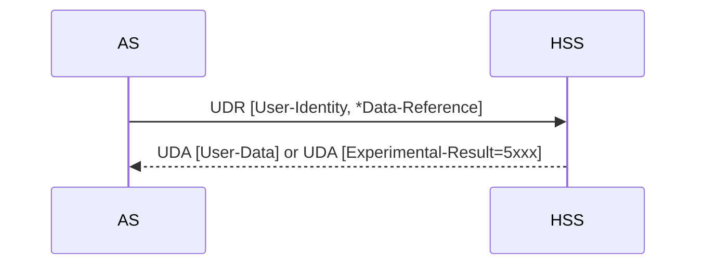
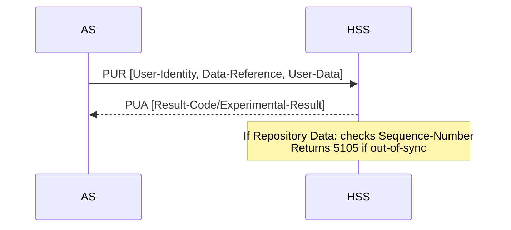
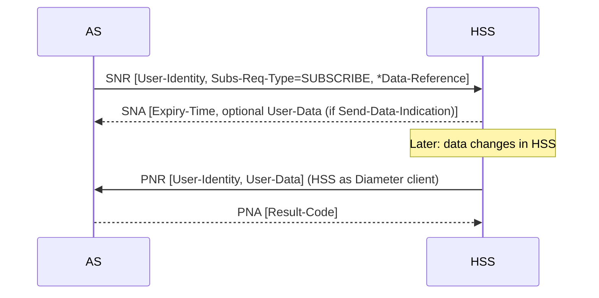

# Sh Interface — Diameter Protocol

The Sh interface connects IMS **Application Servers (AS)** and **Subscription Correlated Servers (SCS)** to the **[HSS](../entities/HSS.md)** for user profile data retrieval, update, and change notification. It is defined as a vendor-specific Diameter application (3GPP vendor, Application-ID 16777217) layered on IETF RFC 6733.

> Companion spec: **3GPP TS 29.328** defines the signalling flows and message contents (the "what to exchange"); **TS 29.329** (this spec) defines the Diameter wire protocol (the "how to encode").
> **Signalling flows and IE tables:** See [procedures/Sh-signalling-flows.md](../procedures/Sh-signalling-flows.md) for the full HSS processing logic, per-procedure IE tables (Sh-Pull/Update/Subs-Notif/Notif), AS Permissions List mechanics, and SLF/Dh identity resolution (TS 29.328 §4–§6).

## Application Identity

| Parameter | Value |
|---|---|
| Diameter Vendor-ID | 10415 (3GPP, IANA-assigned) |
| Application-ID | 16777217 (Sh application, IANA-assigned) |
| Base protocol | IETF RFC 6733; TS 29.229 §5 clarifications apply |
| Transport | SCTP (preferred) or TCP per NDS/IP (TS 33.210) |

## Command-Code Summary

| Command-Name | Abbrev | Code | Direction | Purpose |
|---|---|---|---|---|
| User-Data-Request | UDR | 306 | AS → HSS | Download user profile data |
| User-Data-Answer | UDA | 306 | HSS → AS | Return requested data |
| Profile-Update-Request | PUR | 307 | AS → HSS | Update transparent/non-transparent user data |
| Profile-Update-Answer | PUA | 307 | HSS → AS | Confirm update |
| Subscribe-Notifications-Request | SNR | 308 | AS → HSS | Subscribe to data-change notifications |
| Subscribe-Notifications-Answer | SNA | 308 | HSS → AS | Confirm subscription |
| Push-Notification-Request | PNR | 309 | HSS → AS | Push data-change notification |
| Push-Notifications-Answer | PNA | 309 | AS → HSS | Acknowledge push |

> **Role reversal for PNR/PNA:** For push notifications the **HSS is the Diameter client** (sends PNR) and the **AS is the Diameter server** (sends PNA). This is the opposite of UDR/PUR/SNR flows.

---

## 6.1 Command Formats

### UDR — User-Data-Request (Code 306, REQ, PXY)

AS or SCS → HSS. Requests one or more data references for a subscriber.

```
<User-Data-Request> ::= <Diameter Header: 306, REQ, PXY, 16777217>
    <Session-Id>
    [DRMP]
    {Vendor-Specific-Application-Id}
    {Auth-Session-State}
    {Origin-Host}
    {Origin-Realm}
    [Destination-Host]
    {Destination-Realm}
    *[Supported-Features]
    {User-Identity}
    [Wildcarded-Public-Identity]
    [Wildcarded-IMPU]
    [Server-Name]
    *[Service-Indication]
    *{Data-Reference}
    *[Identity-Set]
    [Requested-Domain]
    [Current-Location]
    *[DSAI-Tag]
    [Session-Priority]
    [User-Name]
    [Requested-Nodes]
    [Serving-Node-Indication]
    [Pre-paging-Supported]
    [Local-Time-Zone-Indication]
    [UDR-Flags]
    [Call-Reference-Info]
    [OC-Supported-Features]
    *[AVP]
    *[Proxy-Info]
    *[Route-Record]
```

**Key mandatory fields:** Session-Id, Auth-Session-State, Origin-Host/Realm, Destination-Realm, User-Identity, *Data-Reference (one or more data types being requested).

---

### UDA — User-Data-Answer (Code 306, PXY)

HSS → AS. Returns requested data or error.

```
<User-Data-Answer> ::= <Diameter Header: 306, PXY, 16777217>
    <Session-Id>
    [DRMP]
    {Vendor-Specific-Application-Id}
    [Result-Code]
    [Experimental-Result]
    {Auth-Session-State}
    {Origin-Host}
    {Origin-Realm}
    *[Supported-Features]
    [Wildcarded-Public-Identity]
    [Wildcarded-IMPU]
    [User-Data]
    [OC-Supported-Features]
    [OC-OLR]
    *[Load]
    *[AVP]
    [Failed-AVP]
    *[Proxy-Info]
    *[Route-Record]
```

---

### PUR — Profile-Update-Request (Code 307, REQ, PXY)

AS → HSS. Updates transparent or non-transparent user data in HSS.

```
<Profile-Update-Request> ::= <Diameter Header: 307, REQ, PXY, 16777217>
    <Session-Id>
    [DRMP]
    {Vendor-Specific-Application-Id}
    {Auth-Session-State}
    {Origin-Host}
    {Origin-Realm}
    [Destination-Host]
    {Destination-Realm}
    *[Supported-Features]
    {User-Identity}
    [Wildcarded-Public-Identity]
    [Wildcarded-IMPU]
    [User-Name]
    *{Data-Reference}
    {User-Data}
    [OC-Supported-Features]
    *[AVP]
    *[Proxy-Info]
    *[Route-Record]
```

> **NOTE:** Multiple Data-Reference AVPs are permitted only when both AS and HSS support the **Update-Eff-Enhance** feature (feature negotiated via Supported-Features).

---

### PUA — Profile-Update-Answer (Code 307, PXY)

HSS → AS. Confirms update.

```
<Profile-Update-Answer> ::= <Diameter Header: 307, PXY, 16777217>
    <Session-Id>
    [DRMP]
    {Vendor-Specific-Application-Id}
    [Result-Code]
    [Experimental-Result]
    {Auth-Session-State}
    {Origin-Host}
    {Origin-Realm}
    [Wildcarded-Public-Identity]
    [Wildcarded-IMPU]
    [Repository-Data-ID]
    [Data-Reference]
    *[Supported-Features]
    [OC-Supported-Features]
    [OC-OLR]
    *[Load]
    *[AVP]
    [Failed-AVP]
    *[Proxy-Info]
    *[Route-Record]
```

> **NOTE:** Data-Reference in PUA is only present when both AS and HSS support Update-Eff-Enhance.

---

### SNR — Subscribe-Notifications-Request (Code 308, REQ, PXY)

AS → HSS. Subscribes to or unsubscribes from data-change notifications.

```
<Subscribe-Notifications-Request> ::= <Diameter Header: 308, REQ, PXY, 16777217>
    <Session-Id>
    [DRMP]
    {Vendor-Specific-Application-Id}
    {Auth-Session-State}
    {Origin-Host}
    {Origin-Realm}
    [Destination-Host]
    {Destination-Realm}
    *[Supported-Features]
    {User-Identity}
    [Wildcarded-Public-Identity]
    [Wildcarded-IMPU]
    *[Service-Indication]
    [Send-Data-Indication]
    [Server-Name]
    {Subs-Req-Type}
    *{Data-Reference}
    *[Identity-Set]
    [Expiry-Time]
    *[DSAI-Tag]
    [One-Time-Notification]
    [User-Name]
    [OC-Supported-Features]
    *[AVP]
    *[Proxy-Info]
    *[Route-Record]
```

**Subs-Req-Type** distinguishes Subscribe (0) from Unsubscribe (1).

---

### SNA — Subscribe-Notifications-Answer (Code 308, PXY)

HSS → AS. Confirms subscription.

```
<Subscribe-Notifications-Answer> ::= <Diameter Header: 308, PXY, 16777217>
    <Session-Id>
    [DRMP]
    {Vendor-Specific-Application-Id}
    {Auth-Session-State}
    [Result-Code]
    [Experimental-Result]
    {Origin-Host}
    {Origin-Realm}
    [Wildcarded-Public-Identity]
    [Wildcarded-IMPU]
    *[Supported-Features]
    [User-Data]
    [Expiry-Time]
    [OC-Supported-Features]
    [OC-OLR]
    *[Load]
    *[AVP]
    [Failed-AVP]
    *[Proxy-Info]
    *[Route-Record]
```

---

### PNR — Push-Notification-Request (Code 309, REQ, PXY)

**HSS → AS** (HSS is Diameter client). Pushes data-change notification to subscribed AS.

```
<Push-Notification-Request> ::= <Diameter Header: 309, REQ, PXY, 16777217>
    <Session-Id>
    [DRMP]
    {Vendor-Specific-Application-Id}
    {Auth-Session-State}
    {Origin-Host}
    {Origin-Realm}
    {Destination-Host}
    {Destination-Realm}
    *[Supported-Features]
    {User-Identity}
    [Wildcarded-Public-Identity]
    [Wildcarded-IMPU]
    [User-Name]
    {User-Data}
    *[AVP]
    *[Proxy-Info]
    *[Route-Record]
```

**Key difference from other requests:** Destination-Host is **mandatory** (unicast to specific AS), and User-Data is **mandatory** (the changed data is always included in the push).

---

### PNA — Push-Notifications-Answer (Code 309, PXY)

AS → HSS. Acknowledges the push.

```
<Push-Notifications-Answer> ::= <Diameter Header: 309, PXY, 16777217>
    <Session-Id>
    [DRMP]
    {Vendor-Specific-Application-Id}
    [Result-Code]
    [Experimental-Result]
    {Auth-Session-State}
    {Origin-Host}
    {Origin-Realm}
    *[Supported-Features]
    *[AVP]
    [Failed-AVP]
    *[Proxy-Info]
    *[Route-Record]
```

---

## 6.2 Result-Code AVP Values

### 6.2.1 Success
No Sh-specific success codes defined. Standard DIAMETER_SUCCESS (2001) applies.

### 6.2.2 Permanent Failures
All Sh-specific codes are placed in **Experimental-Result** AVP; Result-Code AVP shall be absent.

| Code | Name | Meaning |
|---|---|---|
| 5100 | DIAMETER_ERROR_USER_DATA_NOT_RECOGNIZED | AS does not support/recognize the received data |
| 5101 | DIAMETER_ERROR_OPERATION_NOT_ALLOWED | Operation not permitted for this user |
| 5102 | DIAMETER_ERROR_USER_DATA_CANNOT_BE_READ | Data not allowed to be read |
| 5103 | DIAMETER_ERROR_USER_DATA_CANNOT_BE_MODIFIED | Data not allowed to be modified |
| 5104 | DIAMETER_ERROR_USER_DATA_CANNOT_BE_NOTIFIED | Data not allowed for change notification |
| 5008 | DIAMETER_ERROR_TOO_MUCH_DATA | Data size exceeds receiver capacity _(from TS 29.229)_ |
| 5105 | DIAMETER_ERROR_TRANSPARENT_DATA_OUT_OF_SYNC | PUR sequence number mismatch (stale version), or attempt to create already-existing repository data |
| 5011 | DIAMETER_ERROR_FEATURE_UNSUPPORTED | _(from TS 29.229 §6.2.11)_ |
| 5106 | DIAMETER_ERROR_SUBS_DATA_ABSENT | SNR targeted Repository Data not present in HSS |
| 5107 | DIAMETER_ERROR_NO_SUBSCRIPTION_TO_DATA | PNR: AS received notification for data it did not subscribe to |
| 5108 | DIAMETER_ERROR_DSAI_NOT_AVAILABLE | DSAI-Tag in UDR/SNR references a DSAI not configured in HSS |
| 5002 | DIAMETER_ERROR_IDENTITIES_DONT_MATCH | _(from TS 29.229)_ |

### 6.2.3 Transient Failures

| Code | Name | Meaning |
|---|---|---|
| 4100 | DIAMETER_USER_DATA_NOT_AVAILABLE | Requested data temporarily unavailable |
| 4101 | DIAMETER_PRIOR_UPDATE_IN_PROGRESS | Repository Data is being updated by another entity (concurrent write conflict) |

> **TRANSPARENT_DATA_OUT_OF_SYNC (5105)** is architecturally significant: it enforces **optimistic concurrency control** on Repository Data. The AS must include the current Sequence-Number in the PUR. If the HSS has a newer version, it rejects the update. The AS must re-read (UDR) to get the current version before retrying.

> **PRIOR_UPDATE_IN_PROGRESS (4101)** is a transient failure — the AS should retry. This distinguishes a concurrent-write conflict (transient) from a stale-version conflict (permanent 5105).

---

## Sh Data Model Overview

The Sh interface operates on **Data References** — typed pointers into the HSS subscriber store. Each UDR/PUR/SNR specifies one or more Data-Reference values identifying *which* data to read/write/watch. The complete Data-Reference enumeration and the associated transparent/non-transparent data encoding are defined in **3GPP TS 29.328**.

Key categories of data accessible via Sh:
- **IMS Public User Identity** (IMPU) and associated service profile
- **IMS Subscribed Media Profile Parameters**
- **Initial Filter Criteria (iFC)** — AS can read (not write) its own iFC
- **Repository Data** — transparent, AS-defined blobs stored at HSS; versioned via Sequence-Number
- **PSI Activation** state (DSAI — Dynamic Service Activation Information)
- **UE reachability** and location information (for paging optimization)
- **Charging information** (P-CSCF/S-CSCF addresses)
- **MSISDN** associated with IMPU

---

## Operational Flows

### UDR/UDA — Data Download



### PUR/PUA — Profile Update



### SNR/SNA + PNR/PNA — Subscribe + Push



---

## 6.3 AVP Reference

### 6.3.1 Master AVP Table (Table 6.3.1)

All Sh-native AVPs use **Vendor-ID 10415** (3GPP). M/V flag rules: M=Must set, V=Vendor-ID present. AVPs marked "Must not" in the M-bit column shall not set the M-bit; receivers shall ignore an unexpected M-bit per NOTE 2.

| AVP Name | Code | Type | M-bit | Notes |
|---|---|---|---|---|
| User-Identity | 700 | Grouped | M, V | Identifies subscriber (Public-Identity \| MSISDN \| External-Identifier) |
| MSISDN | 701 | OctetString | M, V | TBCD-encoded per ITU-T E.164 |
| User-Data | 702 | OctetString | M, V | Sh-Data blob; format defined in TS 29.328 Annex C |
| Data-Reference | 703 | Enumerated | M, V | Which data type to read/subscribe (see §6.3.4 table) |
| Service-Indication | 704 | OctetString | M, V | Identifies AS service + repository data; standardized values in TS 29.364 |
| Subs-Req-Type | 705 | Enumerated | M, V | Subscribe(0) / Unsubscribe(1) |
| Requested-Domain | 706 | Enumerated | M, V | CS-Domain(0) / PS-Domain(1) |
| Current-Location | 707 | Enumerated | M, V | DoNotNeedInitiateActive…(0) / InitiateActive…(1) |
| Identity-Set | 708 | Enumerated | V | Must not M | ALL(0) / REGISTERED(1) / IMPLICIT(2) / ALIAS(3) |
| Expiry-Time | 709 | Time | V | Must not M | Subscription TTL in HSS |
| Send-Data-Indication | 710 | Enumerated | V | Must not M | NOT_REQUESTED(0) / REQUESTED(1) — causes SNA to return current data |
| Server-Name | 602 | UTF8String | M, V | SIP-URI of AS; see TS 29.229 |
| Supported-Features | 628 | Grouped | V | Must not M | See TS 29.229 §6.3.29 |
| Feature-List-ID | 629 | Unsigned32 | V | Must not M | See TS 29.229 §6.3.30 |
| Feature-List | 630 | Unsigned32 | V | Must not M | See TS 29.229 §6.3.31 |
| Supported-Applications | 631 | Grouped | V | Must not M | See TS 29.229 §6.3.32 |
| Public-Identity | 601 | UTF8String | M, V | IMS Public User Identity; see TS 29.229 |
| Wildcarded-Public-Identity | 634 | UTF8String | V | Must not M | Wildcarded PSI over Sh; see TS 29.229 §6.3.35 |
| Wildcarded-IMPU | 636 | UTF8String | V | Must not M | See TS 29.229 §6.3.43 |
| Session-Priority | 650 | Enumerated | V | Must not M | See TS 29.229 §6.3.56 |
| One-Time-Notification | 712 | Enumerated | V | Must not M | Only for Data-Reference=UEReachabilityForIP(25); ONE_TIME_NOTIFICATION_REQUESTED(0) |
| Requested-Nodes | 713 | Unsigned32 | V | Must not M | Bitmask: bit0=MME, bit1=SGSN, bit2=3GPP-AAA-SERVER-TWAN, bit3=AMF |
| Serving-Node-Indication | 714 | Enumerated | V | Must not M | ONLY_SERVING_NODES_REQUIRED(0) — suppresses detailed location info |
| Repository-Data-ID | 715 | Grouped | V | Must not M | {Service-Indication} + {Sequence-Number} — unique version identifier for repository data |
| Sequence-Number | 716 | Unsigned32 | V | Must not M | Repository data version; used for optimistic concurrency in PUR |
| Pre-paging-Supported | 717 | Enumerated | V | Must not M | PREPAGING_NOT_SUPPORTED(0, default) / PREPAGING_SUPPORTED(1) |
| Local-Time-Zone-Indication | 718 | Enumerated | V | Must not M | ONLY_LOCAL_TIME_ZONE_REQUESTED(0) / LOCAL_TIME_ZONE_WITH_LOCATION_INFO_REQUESTED(1) |
| UDR-Flags | 719 | Unsigned32 | V | Must not M | Bitmask: bit0=Location-Information-EPS-Supported, bit1=RAT-Type-Requested (meaning per TS 29.328) |
| Call-Reference-Info | 720 | Grouped | V | Must not M | {Call-Reference-Number} + {AS-Number} — for CAMEL/MSRN correlation |
| Call-Reference-Number | 721 | OctetString | V | Must not M | Per TS 29.002 (MAP) |
| AS-Number | 722 | OctetString | V | Must not M | gmsc-address per TS 29.002 |
| OC-Supported-Features | 621 | Grouped | M, V | IETF RFC 7683 — Diameter overload control |
| OC-OLR | 623 | Grouped | M, V | IETF RFC 7683 — Diameter overload load report |
| DRMP | 301 | Enumerated | M, V | IETF RFC 7944 — Diameter Routing Message Priority; sets DSCP marking |
| Load | — | Grouped | M, V | IETF RFC 8583 — Diameter Load Information Conveyance |

**Re-used AVP from other specs:**

| AVP Name | Reference | M-bit |
|---|---|---|
| External-Identifier | 3GPP TS 29.336 | Must set |

---

### 6.3.4 Data-Reference Enumeration (complete)

These values are used in the Data-Reference AVP in UDR and SNR to select which subscriber data slice to retrieve or watch.

| Value | Name | Description |
|---|---|---|
| 0 | RepositoryData | Transparent blob stored by AS; identified by Service-Indication; versioned by Sequence-Number |
| 10 | IMSPublicIdentity | IMS Public User Identity (IMPU) list |
| 11 | IMSUserState | IMS registration state of public identity |
| 12 | S-CSCFName | Current S-CSCF serving the subscriber |
| 13 | InitialFilterCriteria | iFC relevant to the requesting AS (read-only for AS) |
| 14 | LocationInformation | UE location (cell/TAI); may trigger active retrieval via Current-Location AVP |
| 15 | UserState | Reachability in CS/PS domains (see Requested-Domain AVP) |
| 16 | ChargingInformation | P-CSCF and S-CSCF addresses used for charging |
| 17 | MSISDN | MSISDN associated with the IMPU |
| 18 | PSIActivation | Public Service Identity activation state |
| 19 | DSAI | Dynamic Service Activation Information boolean for the DSAI-Tag |
| ~~20~~ | _(reserved)_ | — |
| 21 | ServiceLevelTraceInfo | IMS-level trace configuration |
| 22 | IPAddressSecureBindingInformation | IP address – security association binding |
| 23 | ServicePriorityLevel | Priority level for service |
| 24 | SMSRegistrationInfo | SMS over IP registration info |
| 25 | UEReachabilityForIP | UE reachability for IP sessions (supports One-Time-Notification) |
| 26 | TADSinformation | IMS/CS/SMS domain selection information |
| 27 | STN-SR | Session Transfer Number for SRVCC |
| 28 | UE-SRVCC-Capability | UE SRVCC support capability |
| 29 | ExtendedPriority | Extended priority for emergency/priority services |
| 30 | CSRN | CS Routing Number |
| 31 | ReferenceLocationInformation | Reference location for IMS emergency |
| 32 | IMSI | International Mobile Subscriber Identity |
| 33 | IMSPrivateUserIdentity | IMPI associated with IMPU |
| 34 | IMEISV | IMEI Software Version |
| 35 | UE-5G-SRVCC-Capability | UE 5G SRVCC support capability |

---

### 6.3.24 Repository-Data-ID (Grouped)

```
Repository-Data-ID ::= <AVP header: 715 10415>
    {Service-Indication}
    {Sequence-Number}
    *[AVP]
```

Uniquely identifies a versioned repository data instance. Returned in PUA on successful update, allowing the AS to record the new Sequence-Number.

---

### 6.3.1 User-Identity (Grouped)

```
User-Identity ::= <AVP header: 700 10415>
    [Public-Identity]
    [MSISDN]
    [External-Identifier]
    *[AVP]
```

Exactly one of Public-Identity, MSISDN, or External-Identifier should be present to identify the subscriber.

---

### 6.3.29 Call-Reference-Info (Grouped)

```
Call-Reference-Info ::= <AVP header: 720 10415>
    {Call-Reference-Number}
    {AS-Number}
    *[AVP]
```

Used in UDR to correlate a Sh query with a CAMEL/MSRN call reference at the gsmSCF/AS.

---

## 6.4 Namespace Assignments

| Namespace | Values Assigned |
|---|---|
| AVP codes | 3GPP vendor namespace; see Table 6.3.1 (codes 600–722 range) |
| Experimental-Result-Code | 4100–4101 (transient) and 5100–5105 (permanent) |
| Command Code | 306–309 (IANA, allocated per IETF RFC 3589) |
| Application-ID | 16777217 (IANA-allocated for 3GPP Sh application) |

---

## §7 Version Control

UDR/PUR/SNR shall be retransmitted using the **same Session-Id** when no response is received within the timer defined in TS 29.229. Repository data version control uses the Sequence-Number mechanism (§6.3.25): each successful PUR increments the Sequence-Number; the AS must include the current value or receive 5105.

---

---

## Diameter Resilience Mechanisms (Annexes F, G, I, J)

Three optional but recommended resilience mechanisms apply to the Sh interface. All are defined in TS 29.328 but reference IETF standards.

### Annex F — Overload Control (RFC 7683)

_(normative)_ When the HSS is overloaded it uses IETF RFC 7683 to signal the AS to reduce traffic.

| Role | Node | Behaviour |
|---|---|---|
| Reporting node | HSS | Includes `OC-OLR` AVP in UDA/PUA/SNA answer messages to request traffic reduction from AS |
| Reacting node | AS | Applies requested traffic reduction to subsequent Sh requests |

**HSS behaviour:**
- Detects overload by implementation-specific means: traffic on Sh and other interfaces, CPU/memory usage, access to external resources
- Determines OC-OLR content (reduction percentage, validity time) by implementation-specific means
- Exempts priority/emergency traffic from throttling up to the point where requested reduction cannot otherwise be achieved

**AS behaviour:**
- Applies traffic reduction via message throttling with prioritization or by deferring operations that can be postponed
- Diameter requests carrying priority traffic (MPS identified by SIP `Resource-Priority` header, emergency) have highest priority and are **last to be throttled**
- Relative priority between MPS and emergency traffic is subject to regional/operator policy

### Annex G — Overload Node Behaviour / Message Prioritization

_(informative)_ Guidance for the AS throttling decisions:

- **Defer deferrable procedures first:** Sh-Subs-Notif subscriptions can be deferred; Sh-Pull serving a live call cannot
- **Higher priority for in-service users:** Commands relating to a user who is already registered and actively using a service should be prioritized over commands triggered by provisioning bulk-updates
- **Lower priority for mass provisioning:** Large-scale subscription data updates (e.g., operator-wide policy push) should be deprioritized
- **MPS user priority:** Honor priority-user (e.g., MPS subscriber) indicators when ranking requests

### Annex I — Message Priority Mechanism / DRMP (RFC 7944)

_(normative)_ The Diameter Routing Message Priority (DRMP) AVP (code 301, IETF RFC 7944) allows Diameter nodes to signal the relative priority of individual messages. It is recommended for use on Sh when Annex F overload control is also applied.

**AS/OSA SCS behaviour:**
1. Determine required priority per local policies; include `DRMP` AVP in requests when priority is needed
2. When receiving a response: use DRMP priority in response if present, otherwise use the request's priority level
3. Set transport DSCP marking based on DRMP priority level (if transport supports per-message DSCP marking)
4. **MPS/emergency requests** (detected via SIP `Resource-Priority` header or emergency indicator) **shall** include `DRMP` AVP with a high priority value (exact level is operator-defined)

**HSS/SLF behaviour:** Symmetric to AS behaviour — same rules for setting and respecting DRMP.

**Interactions:** If a request contains both `Session-Priority` AVP and `DRMP` AVP, the HSS/SLF shall prioritize according to the **DRMP AVP** (DRMP takes precedence over Session-Priority).

### Annex J — Load Control (RFC 8583)

_(normative)_ The HSS may report its current load via IETF RFC 8583 `Load` AVP of type HOST in answer messages (UDA, PUA, SNA). This is distinct from overload signalling:

| Mechanism | Annex | IETF RFC | Purpose | HSS role |
|---|---|---|---|---|
| Overload control | F | RFC 7683 | Active reduction request when overloaded | Reporting node |
| Load control | J | RFC 8583 | Passive load advertisement; informs routing decisions | Reporting node |

**HSS behaviour:** Calculates current load by implementation-specific means (traffic, CPU/memory); includes `Load` AVP of type HOST in answer commands when applicable.

**AS behaviour:** When performing next-hop Diameter Agent selection for realm-based routing, the AS **may** consider `Load` AVP values of type PEER received from candidate Diameter Agents to select a less-loaded path.

> **Distinction from OC-OLR:** The OC-OLR AVP (Annex F) actively commands the AS to reduce request rate. The Load AVP (Annex J) passively informs of current load level for routing decisions. Both may appear in the same answer message.

---

## Cross-References

- **[HSS](../entities/HSS.md)** — HSS is the Diameter server for UDR/PUR/SNR and client for PNR; reporting node for overload/load
- **[TAS](../entities/TAS.md)** — TAS uses Sh to read iFC, DSAI state, MSISDN, and store Repository Data; reacting node for overload
- **[S-CSCF](../entities/S-CSCF.md)** — S-CSCF may use Sh (via ISC delegation to AS) to retrieve user data
- **[IMS reference points](../interfaces/IMS-reference-points.md)** — Sh listed as HSS↔AS interface
- **[concepts/IMS-identity-model.md](../concepts/IMS-identity-model.md)** — IMPU, service profile, iFC context for UDR data references
- **[concepts/AS-interaction-modes.md](../concepts/AS-interaction-modes.md)** — AS interaction patterns that trigger Sh queries
- **[concepts/Sh-user-profile-data.md](../concepts/Sh-user-profile-data.md)** — Full IE definitions, UML class model, XML schema types, T-ADS algorithm
